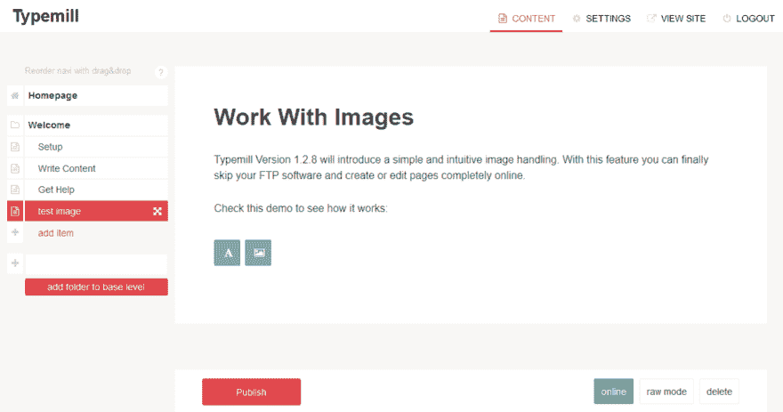

# 使用 Markdown 和 Vue.js 创建块编辑器

> 原文：<https://dev.to/trendschau/creating-a-block-editor-with-markdown-and-vuejs-o14>

如今，编辑内容块非常流行。WordPress 是这个街区最后的孩子之一，其他内容管理系统如 AEM 或 Magnolia 从十多年前就开始遵循内容组件的概念。因此，当我把名为[Typmill.net](https://typemill.net)的小型平面文件 cms 作为一个附带项目进行编码时，我想知道某种类型的块编辑是否也可以在 markdown 和不太懂技术的主流编辑器之间架起一座桥梁。

如果你想构建一个新的编辑器体验，那么你可以使用一个新的编辑器框架，比如 prosemirror 或者 slate，它们也为 markdown 提供了一个实时的 wysiwyg 模式。然而，我不是专业的软件开发人员，这些框架从一开始就很复杂。但是几个月前我开始使用 Vue.js，所以我决定从头开始用 Vue.sj 编写我自己的块编辑经验。不要期望这里有一个超高水平的前端编辑器，它更像是一个实验性的黑客，它与 Typemill 紧密耦合，但结果可能仍然很有趣:

[](https://res.cloudinary.com/practicaldev/image/fetch/s--lRNi6AZ1--/c_limit%2Cf_auto%2Cfl_progressive%2Cq_66%2Cw_880/https://typemill.net/media/demo-2.gif)
*typemill block 编辑截止 2018 年 11 月*

这是一个相当大的项目，所以我不能在这里展示太多的代码，但也许有一些关于 markdown 的块编辑的基本思想。

## 根据定义降价是区块

我不确定你是否知道 markdown 按照定义是与块一起工作的，因为 markdown 使用两个换行符来分隔每个块(段落)。因此，只需一行 PHP 代码就可以将一个有效的规范化 markdown 文件转换成一个简单的内容块数组:

```
 $markdownArray = explode("\n\n", $markdown); 
```

你必须处理一些边缘情况，比如代码块，但基本上就是这么简单。

## 一种后端方法

使用 Vue.js，你可以用 JSON 格式的 API 获取 markdown-array，然后在前端创建你的网站。我决定不采用这种标准方式，原因有二:

*   我已经使用了一个用 vue 构建的高度互动的导航，所以如果你在上面添加内容部分的话，页面会呈现得非常慢。
*   如果我在前端将 markdown 转换成 html，那么我必须维护和扩展两个库:一个在后端的 markdown 解析器(我使用带有几个扩展的 parsedown)和一个在前端的(例如 vue markdown 解析器)。

所以我决定采用一种不寻常的方式，使用后端来完成大部分任务。有了像 parsedown 这样的 php 库，将 markdown 块转换成 html 块相当容易，如下所示:

```
$parsedown  = new Parsedown();
$htmlArray = [];

foreach($markdownArray as $markdownBlock)
{
    $htmlArray[] = $parsedown->text($markdownBlock);    
} 
```

在前端，我可以用一个简单的循环打印出每个 html 块。在后端呈现页面使得初始页面加载非常快。同时 Vue.js 进入舞台是因为我可以把每个块打印出来变成 Vue 组件这样:

```
<?php foreach($htmlArray as $key => $htmlBlock): ?>

   <content-block>
    <div class="blox" @click.prevent="setData( $event )" data-id="<?php echo $key; ?>"><?php echo $htmlBlock; ?></div>
   </content-block>

<?php endforeach; ?> 
```

## Vue-Part

vue 部分相当复杂(而且混乱，很抱歉)，所以我不能展示代码示例，只能解释基本思想。所以基本上我用三个部分:

*   一个 vue 应用，有一些常规任务。
*   作为每个内容块的框架或包装的内容组件。
*   每种内容类型的动态组件(如段落、图像等)。

在页面加载后， **vue app** 通过 API 调用加载 JSON 格式的 markdown-array。我现在可以用 ID 连接页面上的 html 和 vue-data 中的 markdown 了。我用 setData 方法做这个:

```
@click.prevent="setData( $event )" 
```

有了 data-id，我可以获得相应的 markdown 部分，并在我的内容组件中使用它。你可能会认为这有点不合理，但是我之前解释过原因...

**content-component** 是完成所有常规工作的框架:它从 vue-app 获取每个区块的 markdown-data，它在 html-preview-mode 和 markdown-edit-mode 之间切换，每个内容组件都有一个保存、取消和删除区块的按钮。当我保存这个数据块时，我会将 markdown 数据发送到后端。在后端，我将块存储在文件中(再次使用 ID 获得适当的块)，再次将 markdown 块转换为 html，并在响应中将其发送回前端。

最激动人心的部分是**动态组件**。这是 vue 的概念，可以动态切换一个组件:

```
<!-- Component changes when currentTabComponent changes -->
<component v-bind:is="currentTabComponent"></component> 
```

Vue 在这里解释了概念[，并且还提供了一些](https://vuejs.org/v2/guide/components.html#Dynamic-Components)[小提琴](https://jsfiddle.net/chrisvfritz/o3nycadu/)来玩。

我使用这个概念为不同的内容类型打开不同的组件。基本的内容类型是文本段落，它在标准的 textarea 组件中打开。但是我刚刚添加了另一个处理图像的组件，接下来会有更多的组件。在一些内容管理系统中，处理图像会变得非常痛苦，所以我想我找到了一种非常用户友好的方法:

[](https://res.cloudinary.com/practicaldev/image/fetch/s--ljdP5yO0--/c_limit%2Cf_auto%2Cfl_progressive%2Cq_66%2Cw_880/https://typemill.net/media/live/5c0a48b44a765-live.gif)

如果你想看看(在 [typemill](https://typemill.net) 或 [github](https://github.com/trendschau/typemill) 上)，那么不要期待高级代码，因为我说过我是一个爱好开发者，而不是专业人士。