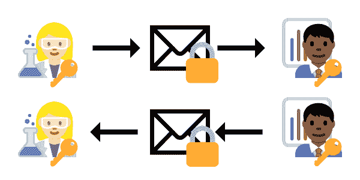
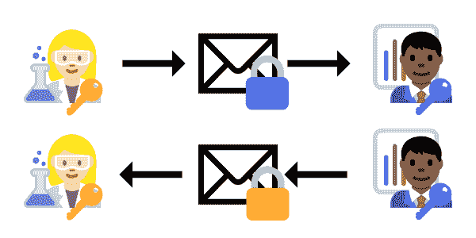

# 如何在 Java 中安全地存储密码

> 原文：<https://dev.to/awwsmm/how-to-encrypt-a-password-in-java-42dh>

本文的前一个版本混淆了“哈希”过程和“加密”过程。值得注意的是，虽然相似，哈希和加密是两个不同的过程。

* * *

**散列**涉及多对一转换，其中给定的输入被映射到一个(通常固定大小，通常更短)的输出，该输出对于该特定的输入不是唯一的。换句话说，当在大范围的输入值上运行哈希算法时(不同的输入映射到相同的输出)，很可能会出现*冲突*。由于哈希算法的性质，哈希是一个不可逆的过程。[这个 SO 答案](https://stackoverflow.com/a/4948393/2925434)很好地概括了哈希和加密之间的区别，并提供了一个很好的例子来说明为什么哈希算法实际上是不可逆的。

作为一个数学例子，考虑模(又名。模数 aka。mod)函数([此处由 Donald Knuth](https://en.wikipedia.org/wiki/Modulo_operation) 定义):

```
a % n = mod(a, n) = a - n * floor(a/n) 
```

Enter fullscreen mode Exit fullscreen mode

mod 函数的简单解释是它是整数除法的余数:

```
7 % 2 = 1
4 % 3 = 1
33 % 16 = 1 
```

Enter fullscreen mode Exit fullscreen mode

注意上面的三个例子是如何给出相同的输出的，即使它们有不同的输入。模函数*是不可逆的*，因为当我们应用它的时候*会丢失信息*。即使给定*一个*的输入连同输出，也没有办法*计算出*另一个输入值。你只需要猜测，直到你猜对为止。

哈希算法利用了像这样的不可逆函数(以及位移等)。)，并且经常重复很多次，这极大地增加了所需猜测的次数。哈希的目标是使解码原始信息的计算成本变得极其昂贵。通常，*强行*一个散列算法(尽可能快地尝试许多可能的输入)比试图“逆转”散列算法来解码散列信息更容易。

阻止这些暴力攻击的一个常用方法是添加第二条随机信息作为“盐”。这可以防止黑客执行*字典攻击*，在这种攻击中，一系列常用密码被映射到它们的哈希输出中——如果黑客知道所使用的哈希算法，并且可以访问存储哈希的数据库，他们就可以使用他们的“字典”映射回原始密码，并获得对这些帐户的访问权。对数据加盐意味着黑客不仅必须通过哈希算法运行特定的密码并验证它与哈希输出相匹配，而且还必须对盐的每个可能值(通常是几十到几百字节的字符串)重新运行该过程。一个随机的 100 字节的 salt 意味着(100*2^8 or) 256，000 个密码-salt 组合必须被尝试用于每个*可能的密码。*

阻止暴力攻击的另一种方法是简单地要求你的算法运行很长时间。如果您的算法只需要 2 秒钟就可以运行，并且使用了上面提到的 100 字节的 salt，那么尝试一个潜在密码的所有可能的 salt 字符串将需要将近 6 天的时间。这也是为什么哈希算法经常被迭代数千次的部分原因。为了产生一个安全的散列，请确保每次迭代时都重新引入 salt，否则您将面临更多不必要的散列冲突(参见上面的 SO 链接)。

* * *

**加密**，与哈希相反，总是一对一且可逆的(通过解密)。所以一个特定的输入总是会产生一个特定的输出，而*只有那个特定的输入才会产生那个特定的输出。与产生固定长度散列的散列算法不同，加密算法将产生可变长度的输出。一个好的加密算法应该产生与随机噪声无法区分的输出，这样输出中的模式就不能被用来解码。*

当需要在某个时候提取存储的数据时，应该使用加密。例如，消息应用程序可能会在传输数据之前对其进行加密，但一旦接收到数据，就需要将其解密成明文，以便接收方可以阅读。注意，密码不是这样:如果您的密码和存储的 salt 生成了存储在数据库中的 hashcode，那么您输入的密码很可能是正确的。散列密码，然后重新计算散列码，比存储可能被解密的加密密码更安全。

但是如果加密的信息可以被解密，又怎么可能是安全的呢？嗯，有两种标准的加密和解密方法，*对称密钥*加密和*非对称密钥*加密。

**对称密钥加密**是指使用同一个密钥对数据进行加密和解密。用来解释加密的一个常见类比是通过邮件发送加锁的包裹。如果你在一个盒子上放一把挂锁，然后寄给我，而我有一把打开挂锁的钥匙，那么我就可以很容易地打开它，阅读里面的信息。我可以给你回信息，你可以用同样的钥匙打开另一边的盒子。

[](https://res.cloudinary.com/practicaldev/image/fetch/s--Ig0OCTGM--/c_limit%2Cf_auto%2Cfl_progressive%2Cq_auto%2Cw_880/https://thepracticaldev.s3.amazonaws.com/i/sq02l7o5q8f6adf87ate.png)

当盒子在运输过程中，没有人能打开盒子阅读消息，除非他们有和我们一样的对称密钥。因此，这个想法就是要将密钥保密，除了消息的预定接收者之外，不要与任何人共享。因为有两个对称的私钥，但是，如果任何人设法窃取(或创建)任何一个私钥的副本，你我之间的所有未来消息都将受到损害。换句话说，我们信任彼此来保证密钥的安全。

**非对称密钥加密**略有不同，因为你和我都有挂锁和钥匙，但我们在邮件中发送给对方的第一个包裹应该是我们未上锁的挂锁:

[](https://res.cloudinary.com/practicaldev/image/fetch/s--JJ0iUxNz--/c_limit%2Cf_auto%2Cfl_progressive%2Cq_auto%2Cw_880/https://thepracticaldev.s3.amazonaws.com/i/eaxc0cfbfu7kh0xpbtr0.png)

然后，你可以写一封短信，用 *my* 挂锁把短信锁在一个盒子里。从那时起，*唯一能打开盒子的人就是我，用我的私人钥匙。当我收到你的信息时，我会用你的*挂锁把它锁在*的盒子里，然后寄给你。从那时起，唯一能打开盒子的人就是你，用你的私人钥匙。*

[](https://res.cloudinary.com/practicaldev/image/fetch/s--pUAQKXHO--/c_limit%2Cf_auto%2Cfl_progressive%2Cq_auto%2Cw_880/https://thepracticaldev.s3.amazonaws.com/i/f7dvv93tx3t39nlwu1kj.png)

这种方法也被称为**公钥加密**，因为这种情况下的“挂锁”经常被广泛使用。任何想要对给特定接收者的信息进行 T2 加密的人都可以这样做。[建议使用公钥加密代替明文密码](https://security.stackexchange.com/questions/3887/is-using-a-public-key-for-logging-in-to-ssh-any-better-than-saving-a-password)，因为它有效地[使密码更长，更难猜测，减少了有人“越过你的肩膀”窃取你的密码的机会，并且通常比一次又一次地重新键入密码要容易得多](https://unix.stackexchange.com/questions/16559/is-it-safe-to-give-out-my-ssh-public-key-for-work)。

显然，这仅仅触及了散列和加密的表面，但我希望它能让您更好地理解两者之间的区别。现在，回到我们定期安排的节目...

* * *

原始文章(为清晰起见进行了更新):

* * *

起初，在 Java 中散列密码的过程可能很难理解，但实际上你只需要三样东西:

1.  一个密码
2.  哈希算法
3.  一些好吃的`salt`

*(注意[加密解密](https://stackoverflow.com/questions/10303767/encrypt-and-decrypt-in-java)在 Java 中也是可以的，但是一般不用于密码，因为密码本身不需要恢复。我们只需要检查用户输入的密码是否重新创建了我们保存在数据库中的散列。)*

* * *

[基于密码的加密](http://www.crypto-it.net/eng/theory/pbe.html)以用户密码为起点生成密钥。我们使用单向哈希函数将密码不可逆地转换为固定长度的哈希代码，添加第二个随机字符串作为“salt”，以防止黑客执行*字典攻击*，其中一系列常见密码被映射到他们的哈希输出——如果黑客知道所使用的哈希算法并可以访问存储哈希代码的数据库，他们可以使用他们的“字典”映射回原始密码并获得对这些帐户的访问权限。

我们可以简单地使用 Java 的 [SecureRandom](https://docs.oracle.com/javase/9/docs/api/java/security/SecureRandom.html) 类:
来生成 salt

```
 import java.security.SecureRandom;
import java.util.Base64;
import java.util.Optional;

  private static final SecureRandom RAND = new SecureRandom();

  public static Optional<String> generateSalt (final int length) {

    if (length < 1) {
      System.err.println("error in generateSalt: length must be > 0");
      return Optional.empty();
    }

    byte[] salt = new byte[length];
    RAND.nextBytes(salt);

    return Optional.of(Base64.getEncoder().encodeToString(salt));
  } 
```

Enter fullscreen mode Exit fullscreen mode

*(注意:你也可以用[securerandom . getinstance strong()](https://docs.oracle.com/javase/9/docs/api/java/security/SecureRandom.html#getInstanceStrong--)得到一个`SecureRandom`实例，尽管这会抛出一个`NoSuchAlgorithmException`，因此需要用`try{} catch(){}`块包装。)*

接下来，我们需要散列码本身:

```
import java.security.NoSuchAlgorithmException;
import java.security.spec.InvalidKeySpecException;
import java.util.Arrays;
import javax.crypto.SecretKeyFactory;
import javax.crypto.spec.PBEKeySpec;

  private static final int ITERATIONS = 65536;
  private static final int KEY_LENGTH = 512;
  private static final String ALGORITHM = "PBKDF2WithHmacSHA512";

  public static Optional<String> hashPassword (String password, String salt) {

    char[] chars = password.toCharArray();
    byte[] bytes = salt.getBytes();

    PBEKeySpec spec = new PBEKeySpec(chars, bytes, ITERATIONS, KEY_LENGTH);

    Arrays.fill(chars, Character.MIN_VALUE);

    try {
      SecretKeyFactory fac = SecretKeyFactory.getInstance(ALGORITHM);
      byte[] securePassword = fac.generateSecret(spec).getEncoded();
      return Optional.of(Base64.getEncoder().encodeToString(securePassword));

    } catch (NoSuchAlgorithmException | InvalidKeySpecException ex) {
      System.err.println("Exception encountered in hashPassword()");
      return Optional.empty();

    } finally {
      spec.clearPassword();
    }
  } 
```

Enter fullscreen mode Exit fullscreen mode

...这里发生了很多事情，所以让我一步一步地解释:

```
 public static Optional<String> hashPassword (String password, String salt) {

    char[] chars = password.toCharArray();
    byte[] bytes = salt.getBytes(); 
```

Enter fullscreen mode Exit fullscreen mode

首先，我们最终需要密码作为一个`char[]`，但是我们让用户把它作为一个`String` -(否则我们如何从用户那里得到密码？)——所以我们必须在一开始就把它转换成`char[]`。盐也作为一个`String`被传入，并且必须被转换成一个`byte[]`。这里的假设是散列密码和 salt 将作为字符串写入数据库，所以我们希望在这个算法之外生成 salt 作为一个`String`，并将其作为一个`String`传入。

将用户的密码保存在一个`String`中是危险的，因为 Java `String`是不可变的——一旦生成，就不能被覆盖来隐藏用户的密码。所以最好收集密码，做我们需要做的事情，并立即丢弃对原始密码`String`的引用，这样它就可以被垃圾收集了。(您可以*建议*用`System.gc()`让 JVM 垃圾收集一个死引用，但是[垃圾收集以不可预测的间隔](https://stackoverflow.com/questions/1481178/how-to-force-garbage-collection-in-java)发生，并且不能强制发生。)类似地，如果我们将密码`String`转换成一个`char[]`，当我们使用完它时，我们应该清空这个数组(稍后会详细介绍)。

```
 PBEKeySpec spec = new PBEKeySpec(chars, bytes, ITERATIONS, KEY_LENGTH); 
```

Enter fullscreen mode Exit fullscreen mode

这里，我们指定如何生成散列密码。`chars`是作为`char[]`的明文密码，`bytes`是转换为`byte[]`的盐`String`，`ITERATIONS`是我们应该执行哈希算法的次数，`KEY_LENGTH`是得到的密钥的期望长度，以位为单位。

当我们执行哈希算法时，我们获取明文密码和 salt，并生成一些伪随机输出字符串。迭代散列算法将重复该过程若干次，使用第一个散列的输出作为第二个散列的输入。这也被称为**键拉伸**，它大大增加了执行暴力攻击所需的时间(拥有一个大的 salt 字符串也会使这种攻击更加困难)。请注意，虽然增加迭代次数会增加散列密码所需的时间，并使您的数据库不那么容易受到暴力攻击，[但它也会使您*更容易受到 DoS 攻击*](https://security.stackexchange.com/questions/3959/recommended-of-iterations-when-using-pkbdf2-sha256)，因为需要额外的处理时间。

最终哈希密码的长度受所用算法的限制。例如，“pbk df 2 with macsha 1”允许最多 160 位的哈希，而“pbk df 2 with macsha 512”的哈希可以长达 512 位。指定一个比你选择的算法的最大密钥长度更长的`KEY_LENGTH`将不会延长密钥超过它指定的最大值，并且[实际上会降低算法](https://stackoverflow.com/questions/6126061/pbekeyspec-what-do-the-iterationcount-and-keylength-parameters-influence)的速度。

最后，注意`spec`保存了*关于算法的所有信息*，原始的明文密码，等等。我们真的想在结束后把这些都删掉。

```
 Arrays.fill(chars, Character.MIN_VALUE); 
```

Enter fullscreen mode Exit fullscreen mode

我们现在已经完成了对`chars`数组的处理，所以我们可以清除它了。这里，我们将数组的所有元素设置为`\000`(空字符)。

```
 try {
      SecretKeyFactory fac = SecretKeyFactory.getInstance(ALGORITHM);
      byte[] securePassword = fac.generateSecret(spec).getEncoded();
      return Optional.of(Base64.getEncoder().encodeToString(securePassword));

    } catch (NoSuchAlgorithmException | InvalidKeySpecException ex) {
      System.err.println("Exception encountered in hashPassword()");
      return Optional.empty();

    } finally {
      spec.clearPassword();
    } 
```

Enter fullscreen mode Exit fullscreen mode

我们的`hashPassword()`方法在这个`try{} catch(){}`块上结束。在这里，我们首先得到我们之前定义的算法(“pbk df 2 with macsha 512”)，并根据`spec`中的规范，使用该算法对明文密码进行哈希运算。`generateSecret()`返回一个 [SecretKey](https://docs.oracle.com/javase/8/docs/api/javax/crypto/SecretKey.html) 对象，它是“加密密钥的不透明表示”，这意味着它只包含哈希密码，不包含其他识别信息。我们使用`getEncoded()`获得散列密码作为`byte[]`，并将其保存为`securePassword`。

如果一切顺利，我们用 base-64 编码这个`byte[]`(所以它只由可打印的 ASCII 字符组成)并作为一个`String`返回。我们这样做是为了使哈希密码可以作为字符串保存在数据库中，而没有任何编码问题。

如果在加密过程中有任何的`Exceptions`，我们返回一个空的`Optional`。否则，我们通过清除`spec`的密码来完成该方法。现在，在这个方法中没有留下对原始明文密码的引用。(注意，无论是否有`Exception`，在从任何前面的`try`或`catch`程序块`return`执行任何操作之前，都会执行`finally`程序块，所以像这样把它放在末尾是安全的——密码将从`spec`清除。)

最后要做的是编写一个小方法，当使用相同的 salt 时，该方法确定给定的明文密码是否生成散列密码。换句话说，我们想要一个告诉我们输入的密码是否正确的函数:

```
 public static boolean verifyPassword (String password, String key, String salt) {
    Optional<String> optEncrypted = hashPassword(password, salt);
    if (!optEncrypted.isPresent()) return false;
    return optEncrypted.get().equals(key);
  } 
```

Enter fullscreen mode Exit fullscreen mode

上面使用原始的`salt`字符串和一个有问题的明文`password`来生成一个哈希密码，并与之前生成的哈希`key`进行比较。只有当`password`正确并且重新散列明文密码没有错误时，该方法才返回`true`。

好了，现在我们有了所有这些，让我们测试它！*(注意:我在一个名为`PasswordUtils`的实用程序类中定义了这些方法，在一个名为`watson`的包中。)*

```
jshell> import watson.*

jshell> String salt = PasswordUtils.generateSalt(512).get()
salt ==> "DARMFcJcJDeNMmNMLkZN4rSnHV2OQPDd27yi5fYQ77r2vKTa ... Wt9QZog0wtkx8DQYEAOOwQVs="

jshell> String password = "Of Salesmen!"
password ==> "Of Salesmen!"

jshell> String key = PasswordUtils.hashPassword(password, salt).get()
key ==> "djaaKTM/+X14XZ6rxjN68l3Zx4+5WGkJo3nAs7KzjISiT6aa ... sN5DcmOeMfhqMGCNxq6TIhg=="

jshell> PasswordUtils.verifyPassword("Of Salesmen!", key, salt)
$5 ==> true

jshell> PasswordUtils.verifyPassword("By-Tor! And the Snow Dog!", key, salt)
$6 ==> false 
```

Enter fullscreen mode Exit fullscreen mode

非常管用！往前走，哈希！