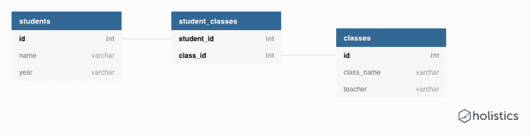

# 有效的数据库设计:第 4 部分

> 原文：<https://dev.to/adammc331/effective-database-design-part-4-jbj>

这是关于数据库设计和规范化系列文章的第四篇，也可能是最后一篇。在我们的[上一篇文章](https://dev.to/adammc331/effective-database-design-part-3-1113)中，我们学习了第二范式。到目前为止，我们在设计数据库时要记住四件事:

*   每个表都有一个主标识符。
*   每一列只有原子值。
*   没有表格有重复组。
*   没有部分依赖关系。

概括地说，我们目前有一个如下所示的数据库:

让我们继续增加这个数据库。和前几篇文章一样，我将解释第三范式(3NF)，展示一个打破它的设计，并告诉你如何纠正它。

# 第三范式

如果一个表在 2NF 中，那么它在 3NF 中，并且没有传递依赖。

可传递依赖是指发生以下情况时:

1.  坚定的 b
2.  b 不决定 A
3.  b 确定 c

如果这不成立，让我们展示一个例子。在这里，我们将重新访问我们的班级表，并添加教师办公室:

| 身份证明（identification） | 类别名称 | 教师 | 办公室 |
| --- | --- | --- | --- |
| one | 数学 | 史密斯（姓氏） | A107 |
| Two | 编程；编排 | 杰克逊 | B205 |
| three | 历史 | 詹姆斯 | A100 |

我们可以认为我们的键是(id，class_name ),因为它们的组合总是唯一的。这里的可传递依赖关系如下:

1.  (id，class_name)确定老师。
2.  教师不确定(id，class_name)。这是因为一个老师可以教多个班级。
3.  老师决定办公室。

因此，我们有一个从(id，class_name)到 office 的可传递依赖关系。

# 问题

传递依赖为什么不好？嗯，我提到过老师可以教多门课。让我们看看发生这种情况时我们的桌子是什么样子:

| 身份证明（identification） | 类别名称 | 教师 | 办公室 |
| --- | --- | --- | --- |
| one | 数学 | 史密斯（姓氏） | A107 |
| Two | 编程；编排 | 杰克逊 | B205 |
| three | 历史 | 詹姆斯 | A100 |
| four | 科学 | 杰克逊 | B205 |

如果你关注了其他帖子，你会再次发现同样的问题*。我们有数据冗余，这可能会导致数据异常，从而导致缺乏完整性。我可以修改这个表，这样杰克逊女士有两个不同的办公室，我不知道哪个是准确的。*

 *# 解

一旦发现类似这样的依赖关系，就应该隔离那些相关的列(教师、办公室),并将它们移到一个单独的表中。很可能他们代表了一个不同的实体，无论如何——在这里，我们将教师和班级混为一谈。让我们把他们分开。

我们可以有一个`teachers`表:

| 身份证明（identification） | 教师姓名 | 办公室 |
| --- | --- | --- |
| one | 史密斯（姓氏） | A107 |
| Two | 杰克逊 | B205 |
| three | 詹姆斯 | A100 |

我们更新的`classes`表:

| 身份证明（identification） | 类别名称 | 教师 id |
| --- | --- | --- |
| one | 数学 | one |
| Two | 编程；编排 | Two |
| three | 历史 | three |
| four | 科学 | Two |

现在，经过所有这些努力，我们有了一个符合 3NF:

恭喜你。这是贯穿所有四篇文章的一大内容，但是您学到了设计良好的数据库的几个基本标准:

*   每个表都有一个主标识符。
*   每一列只有原子值。
*   没有表格有重复组。
*   没有部分依赖关系。
*   没有可传递的依赖关系。

还有更多的普通表单，提供随着数据库变大而需要关注的东西，但是上面的五个要点是一个很好的起点，也是我现在要介绍的。

我希望你喜欢这个系列，请在评论中给我留下任何问题，我会尽最大努力回答并在必要时更新帖子。如果你发现这些标准化的例子很容易理解，请告诉我，我会继续跟进。:)*