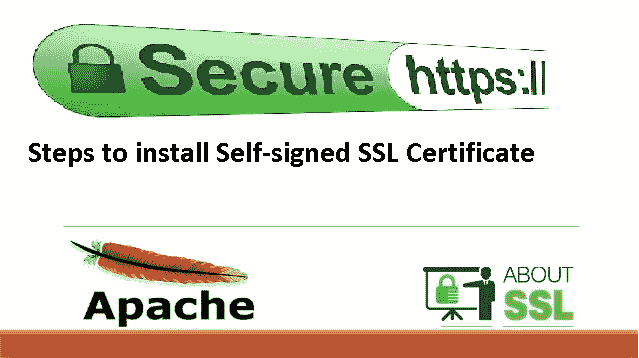

# 如何在 Windows 上创建自签名 SSL 证书？

> 原文：<https://dev.to/swapankumarg/how-to-create-self-signed-ssl-certificate-on-windows-1hk8>

# **在 Windows 上创建自签名 SSL 证书**

现在作为 web 应用程序经理，我们每天都需要 SSL 证书来做一些测试。有时你想运行内部网应用程序，你也需要 SSL 认证。因此，当您的 IT 预算较低时，购买新证书的成本会很高。因此，在 windows 系统上生成[自签名 SSL 证书也是如此。有几种方法可以做到这一点，但是创建 SSL 证书最简单的方法是使用 OpenSSL。OpenSSL 是开源软件，所以你也不需要任何额外的成本。你只需要做下面的步骤。
首先创建一个根 ca 证书。然后创建您自己的服务器证书。最后，您使用根 ca 证书签署了个人服务器证书。现在你有了自己的自签](https://www.seoexpertstuff.com/create-self-signed-ssl-certificate-windows-openssl/) [](https://res.cloudinary.com/practicaldev/image/fetch/s--xJzOO0A9--/c_limit%2Cf_auto%2Cfl_progressive%2Cq_auto%2Cw_880/https://www.seoexpertstuff.com/wp-content/uploads/2018/12/SSL-certificate.jpg)

### **什么是开放 SSL？**

OpenSSL 是 SSL 和 TLS 协议的开源实现。它在普通通信层之上提供了一个加密传输层。允许它与许多网络应用和服务交织在一起。云管理控制台中的默认 SSL 配置文件有一个通用名称。将 SSL 配置文件关联到网关集群时？如果使用默认的 SSL 配置文件，您的应用程序进行 API 调用时可能无法验证主机名。它正在根据提供的证书连接到。在这种情况下，您可以生成一个新的自签名证书，该证书表示应用程序可以验证的通用名称。本主题告诉您如何使用 OpenSSL 工具包生成自签名 SSL 证书请求，以启用 HTTPS 连接。

OpenSSL 通常用于加密邮件客户端的身份验证，并保护基于 web 的交易，如信用卡支付。一些端口，如 www/apache24 和 databases/postgresql91-server。包括一个编译选项，用于使用 OpenSSL 进行构建。

OpenSSL 是用于传输层安全(TLS)和安全套接字层(SSL)协议的健壮的、商业级的、全功能的工具包。它也是一个通用的加密库。

OpenSSL 是在 Apache 风格的许可下许可的。这基本上意味着您可以自由地获取和使用它用于商业和非商业目的，只需遵守一些简单的许可条件。按照以下步骤，使用 OpenSSL 在 Windows 系统上创建自签名 SSL 证书。
首先安装 OpenSSL

1.  要创建自签名 SSL 证书，首先必须在 windows 系统中安装 OpenSSL 应用程序。您可以从这里下载该应用程序。OpenSSL-安装

将软件安装在“C:\Program Files\OpenSSL-Win64”位置。然后单击下一步，完成安装。

1.  完成安装后，打开命令提示符

创建一个临时目录“演示”

> md 演示
> 
> cd 演示
> 
> set RANDFILE=c:\demo.rnd

```
set OPENSSL_CONF=C:\Program Files\OpenSSL-Win64\bin\openssl.cfg 
```

1.  现在，通过运行下面的命令来午餐 openssl.exe

> " C:\ Program Files \ OpenSSL-win 64 \ bin \ OpenSSL . exe "

使用“”运行命令

1.  现在您必须为您的 CA 证书创建密钥文件

> genrsa -out can.key 2048

1.  现在使用密钥文件创建根 CA 证书

> req-new-x509-days 1826-key can . key-out canew . CRT

它会要求一些细节，如国家名称，州，城市，组织名称 FQDN 名称。FQDN 名称应该是你的域名谁有你的域的证书机构。

1.  现在为您的应用程序 SSL 证书生成公钥。

> genrsa -out ianew.key 2048

1.  现在用新创建的公钥“ianew.key”创建一个 CSR

> req-new-key ianew . key-out ianew . CSR

它将要求一些细节，如国家名称，州，城市，组织名称和 FQDN 名称。FQDN 名称应该是您的主机/计算机 FQDN 名称您的 web 服务器或应用程序服务器。

1.  现在用您在步骤 2 中创建的根 CA 证书签署 csr 证书。

> x509-req-days 1826-in ianew . CSR-CA canew . CRT-CAkey can . key-set _ serial 01-out ianew . CRT

现在您的自签名证书已经准备好了，您必须在您的客户端系统上安装根 ca 证书以避免证书错误。

证书

现在，您可以将自签名 SSL 证书部署到托管在 Windows 或 Linux 中的 web 服务器上。这是一种简单的方法，您可以使用 OpenSSL 在 Windows 上创建自签名 SSL 证书。