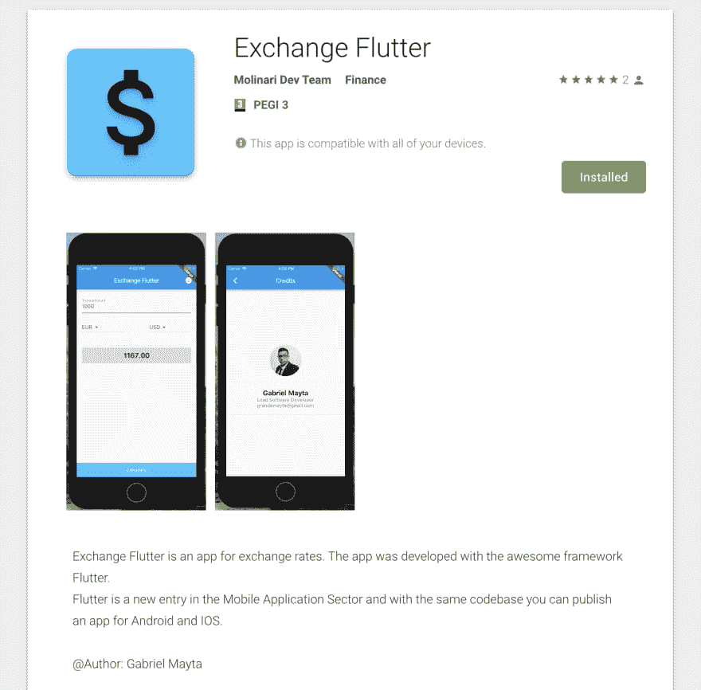
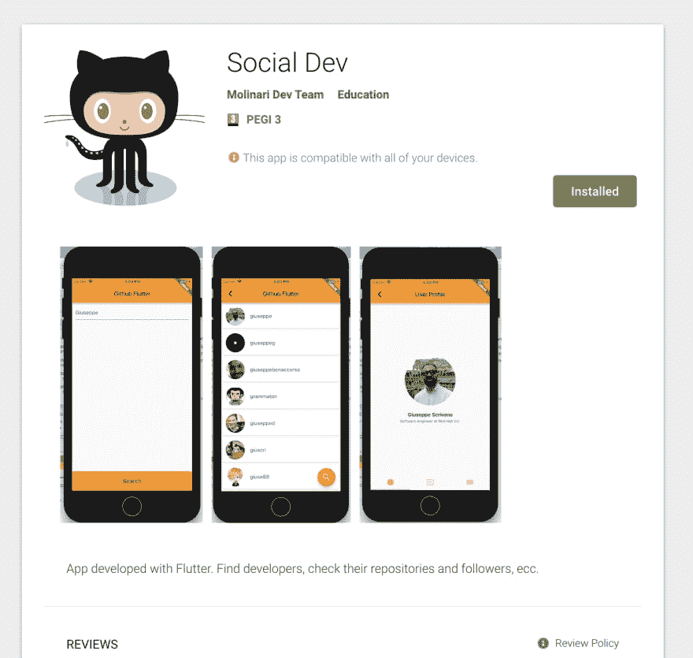

# 我对颤动的体验

> 原文：<https://dev.to/grandemayta/my-experience-with-flutter-1bof>

谷歌[刚刚发布了名为](https://www.theverge.com/2018/12/4/18125053/google-flutter-1-0-skia-mobile-app-cross-platform-developers) [Flutter](https://flutter.io/) 的原生应用开发框架 1.0 版本。

我一直是移动应用的粉丝，在我的职业生涯中，我参与了许多项目，从零开始为不同的公司开发应用。

在大多数情况下，我总是使用像 Angular / React、Css 和 Html 这样的网络技术，然后在像 [Apache Cordova](https://cordova.apache.org/) 或 [Phonegap](https://phonegap.com/) 这样的框架的帮助下，你可以制作一个[混合应用](https://developer.telerik.com/featured/what-is-a-hybrid-mobile-app/)。这种方法的问题是外观和可用性经常受到严重影响，特别是对于功能不太强大的设备。

然后脸书带来了 React Native T1，微软带来了 Xamarin T3。
双方承诺，允许开发者在 Android、IOS 和 Windows Phone 上使用相同的代码。

2018 年，React Native [的主要支持者 AirBnb 宣布告别脸书 home 框架](https://medium.com/airbnb-engineering/sunsetting-react-native-1868ba28e30a)，原因包括漏洞和各种问题。

同样在 2018 年[谷歌宣布发布第一版 Flutter 测试版](https://proandroiddev.com/google-i-o-2018-flutter-recap-6f06545efd74)。阿里巴巴立即看到了新框架的潜力，并采用它[来开发一个拥有 5000 万用户的应用](https://www.youtube.com/watch?v=jtYk3gWRSw0&vl=en)。

我个人使用 Flutter 创建了 2 个应用程序，目前它们在 Android 商店中。学习曲线很快，因为它总是采用组件逻辑，就像 React 或 Angular 一样，即使他们称之为 Widget

它使用的编程语言是 [Dart](https://www.dartlang.org/) ，面向对象，所以对于那些来自 Java 或 C#的人来说，它更简单。他们还推出了现成的 UI 组件，集成了材料设计和 Cupertino 的准则，从而加快了开发速度。文档仍有待改进，但他们已经走上正轨。

为了让你了解最新情况，我建议你关注他们在 Youtube 上的官方频道，在那里他们发布了名为“T2 无聊颤振开发展”的视频。

下面是我在 Github 上分享的两个项目的链接:

*   [【储存库】交易所扑](https://github.com/grandemayta/exchange-flutter)
*   [【知识库】社会发展](https://github.com/grandemayta/github-flutter)
*   [【玩店】兑换飘起](https://play.google.com/store/apps/details?id=com.grandemayta.exchangeflutter)
*   [【Play Store】社交开发](https://play.google.com/store/apps/details?id=com.grandemayta.socialdev)

保持冷静，编码！