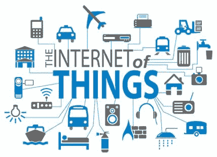

# 可以集成到物联网应用中的 12 种传感器类型

> 原文：<https://dev.to/hamashassan7/12-sensor-types-that-can-be-integrated-into-iot-apps-21j4>

物联网无疑是应用程序和数字行业的下一件大事。它利用传感器使电子设备智能工作，并有助于使事情比以往任何时候都更简单。它们用来收集信息，推动信息，并将其传递给整个相关设备系统。这些收集到的信息使得设备能够自给自足地工作。通过加入传感器的排列，设备共享数据并增强它们的充分性和有用性。让我们了解与物联网技术支持的应用程序兼容的各种类型的传感器。

## 温度传感器

这些传感器已经在与众不同的设备中使用了相当长一段时间，随着物联网的兴起，温度传感器已经变得很大。现在，这些传感器被用于装配程序、园艺和健康产业。在装配过程中，许多机器需要特定的条件温度和设备温度。此外，在耕作中，土壤的温度是收获发展所急需的。这有助于创造植物和扩大产量。

## 近程传感器

压力传感器是一种能够识别附近物体是否靠近的设备，主要用于零售业，因为它们可以识别运动以及顾客和他们可能感兴趣的物品之间的关系。顾客很快被告知附近物品的限制和独特优惠。

## 化学传感器

化学传感器应用于各种不同的领域。它们显示液体的变化或发现空气的化学变化。他们在大城市地区承担着至关重要的工作，在那里跟踪变化和确保民众是很重要的。化学传感器的主要用途可以发现在工业生态观察和过程控制，有意或无意地释放有害的合成识别，敏感和放射性的发现，重复使用的形式在空间站，制药企业和研究中心等。

## 压力传感器

这个传感器检测压力并将其转换成电信号。这里，总和取决于所施加的力的大小。许多设备依赖于流体或不同类型的压力。这些传感器使物联网工作成为可能。如果与标准压力有任何偏差，该装置会向职能经理建议任何需要解决的问题。这些传感器的组织不仅在组装过程中很重要，而且在整个水系统和加热系统的维护中也很重要，因为识别任何摇摆或重量下降都不会令人困惑。

## 气敏元件

气体传感器类似于合成传感器，但主要用于检测空气质量的变化和区分不同气体的接近程度。像合成传感器一样，它们被用于各种企业，例如装配、农业综合企业和福利，用于空气质量检查、危险或可燃气体检测、煤矿中的有害气体观察、石油和天然气企业、复合实验室研究、制造-油漆、塑料、弹性材料、制药和石化等。

## 烟雾传感器

烟雾传感器是一种检测烟雾(空气中的微粒和气体)及其尺寸的设备。尽管如此，随着物联网的进步，它们目前明显更加成功，因为它们被应用于一个系统，该系统可以及时告诉客户各种业务中发生的任何问题。烟雾传感器被装配工业、HVAC、结构和便利设施广泛用于识别火灾和气体比率。这有助于保护在危险情况下工作的个人，因为整个系统与更有经验的系统相比要有效得多。

## 运动检测传感器

运动检测器是一种电子设备，用于区分给定区域内的物理运动(动作)，并将动作转换为电信号；任何问题的运动或人的运动。运动识别在安全行业中有着至关重要的作用。组织在不应该持续识别发展的区域中使用这些传感器。这些传感器主要用于中断发现系统、自动入口通道控制、吊杆护栏、智能摄像机(即基于运动的捕捉/视频记录)、收费站、自动停车系统、自动水槽/冲桶机、干手器、能源管理系统(即机械化照明、空调、风扇、电器控制)等。

## 红外传感器

这些传感器通过释放或识别红外辐射来检测周围环境的某些质量。此外，它还配备了估算物品辐射热量的功能。它们目前用于物联网企业，特别是医疗保健领域，因为它们使血液和循环紧张的检查成为基本。它们甚至被用于一系列传统的智能设备，例如智能手表和手机。其他用途包括家用机器和远程控制、呼吸调查、红外视觉(即，设想设备中的虫洞、屏幕血流、工艺历史专家查看油漆层下)、可穿戴硬件、光学通信、基于非接触的温度估计、汽车视觉障碍边缘发现。

## 图像传感器

图像传感器是用于将光学图像转换成电子信号的仪器，用于以电子方式显示或存放文件。图像传感器实际应用是在数码相机和模块、治疗和夜视设备、热成像设备、雷达、声纳、媒体室、生物测定和虹膜设备中。

## 加速度计传感器

加速度计是一种传感器，用于测量物体因惯性功率和机械运动转化为电能而经历的物理或可量化加速。它们广泛应用于智能手机、媒体设备、振动估计、汽车控制和识别、自由落体识别、飞艇和飞行企业、开发场所、体育基金会/竞争对手行为检查、客户硬件、新场所和建筑场所等。

## 光学传感器

估计光束的真实量并将其转换为客户或电子仪器或设备可以轻松理解的电信号的传感器称为光学传感器。光学传感器受到物联网专家的喜爱，因为它们脚踏实地，同时可以评估独特的事物。这种传感器背后的创新使其能够筛选电磁活力，包括电力、光等。由于电气分离最适合石油和天然气应用、公共和运输领域、高速排列系统、电梯入口通道控制、机械生产系统零件计数器和福利系统，它们的主要用途可以在环境光发现、高级光学开关、光学细丝通信中找到。

## 湿度传感器

湿度是空气或不同气体环境中水蒸气的量度。最常用的术语是“相对湿度(RH )”,它们的应用和用户可以在工业和私人空间中找到，用于加热、通风和冷却系统控制。它们的用途包括汽车、画廊、现代区域和托儿所、气象站、油漆和涂料企业、医疗设施和制药企业，以确保药物治疗。

### *最初发表于-【topappfirms.com】*