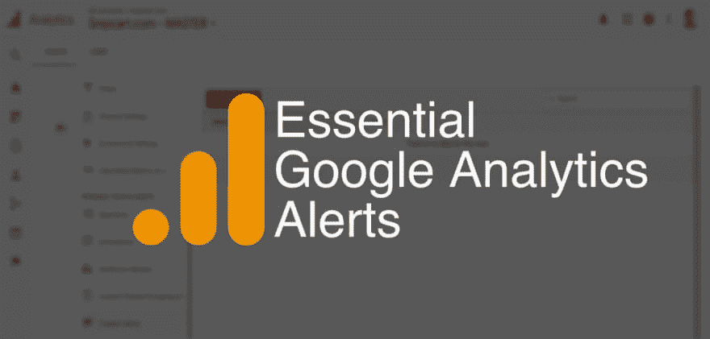

# 基本的谷歌分析提醒&如何设置它们

> 原文：<https://dev.to/couellet/essential-google-analytics-alerts--how-to-set-them-up-526b>

想象一下这个噩梦般的场景:

您团队中的一名开发人员刚刚对您的网站进行了修改…并破坏了您的电子商务集成。

人家买不到。

你离开去吃午饭，甚至在你意识到发生了什么之前工作几个小时。

与此同时，巨额资金正在流失。

开发团队的恐慌随之而来:“天哪，这怎么会发生在我们身上？我们进行单元测试，见鬼，我们甚至有一些集成测试——它们都通过了！”

您有一个监控工具告诉您您的服务器已经启动。 [PagerDuty](https://www.pagerduty.com/) 没有给你打电话:*站点*没有关闭，所以你的典型监控系统没有被触发。

你很快修好了一切，但伤害已经造成了。灾难性的工作日。

吞下几片安眠药后，是时候进行尸检了。

“我们将来如何避免这种情况？我们怎么知道我们的在线赚钱机器什么时候出现了问题？”

这就是谷歌分析提醒的作用。

怎么会？通过监测这种故障的症状，例如转化率和销售额的下降。

我见过现实生活中的恐怖故事，就像上面的故事一样。人们甚至在发现有问题之前就损失了数千美元！今天我要确保这不会发生在你身上。为此，我将列出基本的谷歌分析提醒，并向你展示如何设置它们。

## 为什么要使用谷歌分析定制提醒？

我不会花太多时间来介绍这个特性，因为它的名字本身就很容易理解。简而言之，GA 自定义警报是在触发选定指标的阈值时，通过电子邮件或短信向您发送的通知。我将进一步解释如何在 GA 中设置它们。

在我之前的例子中，我知道一些开发人员可能会争辩说他们已经做了单元和集成测试，知道一切正常就足够了。可悲的是，这不是真的。你绝对应该尽可能多地做这些事情。毫无疑问。但他们不会向你保证任何东西都不会坏掉。

如果有一天真的出了问题，分析警报可能会成为灾难发生前的最后一道屏障。至少，你会很快知道哪里不对劲。

**了解重大收入来源问题的最佳方式是尽可能密切地监控资金。**

→点击阅读全文