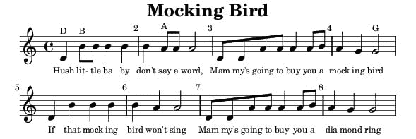
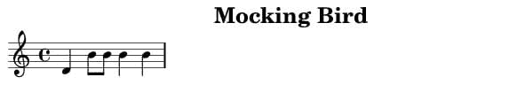

# 使用代码排版乐谱

> 原文：<https://dev.to/nhsdeveloper/typesetting-musical-scores-using-code-23bi>

使用 LilyPond 排版乐谱的入门指南。在本指南中，我们将学习如何为摇篮曲“嘘，小宝贝”排版音乐。除了添加音符，我们还将包括添加歌词。

* * *

## 简介

在过去的几年里，我一直在我所在地区的几所学校教授课后编程俱乐部。每年有一个学期，我们专注于使用优秀的可编程合成器 [Sonic Pi](https://sonic-pi.net) 编码音乐。

音乐是学习计算机编程概念的一种有趣方式，因为儿童学习的许多歌曲都使用计算机编程中常用的结构。音符长度可以使用变量定义，歌曲通常有重复的部分或节奏，可以使用简单的循环和函数轻松编码。

为了创建孩子们在课堂上使用的工作表，我需要排版乐谱的一部分，以展示一个关键的概念或学习目标。

在下面的照片中，我们正在对《星球大战》主题曲进行对等编程:-)

[](https://res.cloudinary.com/practicaldev/image/fetch/s--E4cU0wHE--/c_limit%2Cf_auto%2Cfl_progressive%2Cq_auto%2Cw_880/https://thepracticaldev.s3.amazonaws.com/i/uciazy9au1sh3g391bcf.jpg)

## 百合果

当我开始寻找一个合适的程序来创建乐谱时，我想要的是免费的，最好是可以从命令行运行的。我是文档准备系统 [LaTeX](https://www.latex-project.org) 的忠实粉丝，所以我在为音乐寻找类似的东西。

然后，我找到了最适合我需求的产品，LillyPond。LilyPond 是一个音乐雕刻程序，致力于制作尽可能高质量的乐谱。它将传统雕刻音乐的美学带到了电脑打印输出中。

LilyPond 类似于一种编程语言，你不会通过从图形工具栏中拖动音符并将其放置在动态刷新的乐谱上来编写音乐；你通过输入文本来创作音乐。

是的，没错，你在一个简单的文本文件中输入 LilyPond 命令，然后这个文本被 LilyPond 解释，产生精美的雕刻乐谱。一旦您对各种 LilyPond 命令有了基本的了解，制作您需要的音乐就相当容易了。

## 入门

在本教程中，我们将创建如下所示的乐谱。首先从项目[下载页面](http://lilypond.org/download.html)获取 LilyPond 的副本。为您的操作系统选择适当的链接。

[](https://res.cloudinary.com/practicaldev/image/fetch/s--xuVk51IF--/c_limit%2Cf_auto%2Cfl_progressive%2Cq_auto%2Cw_880/https://nhs.io/img/mocking-bird.jpg)

首先在你最喜欢的文本编辑程序中创建一个名为`mocking.ly`的文本文件。首先，在文本编辑器中输入如下所示的命令。

```
\version "2.14.2"
\header  {title = "Mocking Bird"}

{
    \time 4/4
    \clef treble

    \relative c' {
        d4 b'8 b8 b4 b4
    }
} 
```

Enter fullscreen mode Exit fullscreen mode

每个 LilyPond 文件都应该以一个`version`语句开始。version 语句是一行代码，它描述了源文件用于哪个版本的 LilyPond。第二个命令为乐谱设置一个标题。

`time`语句设置乐曲的[拍号](https://en.wikipedia.org/wiki/Time_signature)。在本例中，我们使用的是通用时间或四四时间。其他拍号可能是华尔兹的 3/4 拍或进行曲的 2/2 拍。

`clef`语句指示 LilyPond 在乐谱开始时输出高音谱号。其他风格也有，男低音、男中音、男高音、女高音。

`relative c'`语句指示 LilyPond 根据钢琴键盘上的中间 C 音符来排版花括号内的所有音符。花括号中的字母和数字代表音乐第一小节的音符。那是一个 d 后面跟着四个 b 音符。

字母后面的数字描述了要排版的笔记的持续时间。因为我们已经将拍号设置为 4/4(或公共时间)，所以为了描述一个钩针，我们使用数字 4，因为在公共时间每个小节有四个钩针。

所以为了描述一个极小值，我们会在字母后面加上数字 2。为了描述一个八分音符，我们用数字 8，因此，一个半八分音符用数字 16 来表示。Lilypond 足够聪明，可以将多个八分音符的音干连接在一起。

## 生成分数

当你输入完代码后，保存文本文件`mocking.ly`并根据你使用的操作系统选择命令行或终端会话。然后对文本文件运行 LilyPond 程序，生成包含乐谱的图像。命令语法是:

```
lilypond --png mocking.ly

GNU LilyPond 2.14.2
Processing `mocking.ly'
Preprocessing graphical objects...
Layout output to `mocking.ps'...
Converting to PNG...
success: Compilation successfully completed 
```

Enter fullscreen mode Exit fullscreen mode

假设您的`mocking.ly`文件中没有错误，您应该在您的文件夹中找到一个名为`mocking.png`的新图像文件。如果您查看该文件，您应该会看到如下内容:

[](https://res.cloudinary.com/practicaldev/image/fetch/s--jbMJD29N--/c_limit%2Cf_auto%2Cfl_progressive%2Cq_auto%2Cw_880/https://nhs.io/img/mocking-bird-01.jpg)

耶！我们已经排版了我们的第一份乐谱。现在我们只需要继续剩下的音乐小节。我建议将每个后续的音乐小节放在文本文件中的单独一行，这样可以更容易地跟踪你在乐谱中的位置。

```
\version "2.14.2"
\header  {title = "Mocking Bird"}

{
    \time 4/4
    \clef treble

    \relative c' {
        d4 b'8 b8 b4 b4
        b4 a8 a8 a2
        d,8 d8 a'8 a8 a4 a8 b8
        a4 g4 g2
        d4 b'4 b4 b4
        b4 a4 a2
        d,8 d8 a'8 a8 a4 a8 b8
        a4 g4 g2
    }
} 
```

Enter fullscreen mode Exit fullscreen mode

## 去除第一个板条上的凹痕

当您通过 LilyPond 重新运行文本文件时，您应该会得到一个 png 文件，其中显示了两个五线谱。请注意每个小节线是如何自动编号的。当你试图向孩子们解释一些事情时，这是一个很大的帮助，因为你可以参考这些数字。

注意第一个五线谱是如何轻微缩进的。这是 LilyPond 的默认行为，但是，通过在源文件中插入一个布局语句并指定缩进值为零，可以很容易地改变这种行为。参见下面添加了`layout`语句的代码。

```
\version "2.14.2"
\header  {title  = "Mocking Bird"}
\layout  {indent = 0}

{
    \time 4/4
    \clef treble

    \relative c' {
        d4 b'8 b8 b4 b4
        b4 a8 a8 a2
        d,8 d8 a'8 a8 a4 a8 b8
        a4 g4 g2
        d4 b'4 b4 b4
        b4 a4 a2
        d,8 d8 a'8 a8 a4 a8 b8
        a4 g4 g2
    }
} 
```

Enter fullscreen mode Exit fullscreen mode

## 添加歌词

下一步是添加歌词，以便它们出现在正确的音符下。我们通过包含一个带有左花括号和右花括号的`addlyrics`语句来做到这一点。同样，花括号中包含的所有内容都应用于歌词命令。默认情况下，我发现文本大小对于歌词来说太大了，所以我使用`set`语句将默认字体大小减小三点。

键入歌词时，最好让每一小节占一行，以便于阅读。让歌词与正确的音符对齐的关键是在单词或部分单词后添加正确的持续时间数字。

```
\version "2.14.2"
\header  {title  = "Mocking Bird"}
\layout  {indent = 0}

{
    \time 4/4
    \clef treble

    \relative c' {
        d4 b'8 b8 b4 b4
        b4 a8 a8 a2
        d,8 d8 a'8 a8 a4 a8 b8
        a4 g4 g2
        d4 b'4 b4 b4
        b4 a4 a2
        d,8 d8 a'8 a8 a4 a8 b8
        a4 g4 g2
    }

    \addlyrics {
        \set fontSize = #-3

        Hush4 lit-8 tle8 ba4 by4
        don't4 say8 a8 word,2
        Mam8 my's8 going8 to8 buy4 you8 a8
        mock4 ing4 bird2

        If4 that4 mock4 ing4
        bird4 won't4 sing2
        Mam8 my's8 going8 to8 buy4 you8 a8
        dia mond4 ring2
    }
} 
```

Enter fullscreen mode Exit fullscreen mode

## 添加注释

如果你重新看我完成的乐谱，你会注意到在第一个五线谱上面，前两个音符的值在上面，例如，D 和 b。每次音符在音乐中第一次出现时，我都想在五线谱上面添加它的符号，以帮助那些对阅读音乐没有信心的孩子。

[](https://res.cloudinary.com/practicaldev/image/fetch/s--xuVk51IF--/c_limit%2Cf_auto%2Cfl_progressive%2Cq_auto%2Cw_880/https://nhs.io/img/mocking-bird.jpg)

要做到这一点，你可以使用`markup`语句将你想显示在五线谱上方的文本括在花括号内。`tiny`语句将字体大小设置为较小的字体，这样文本看起来不会太大和不合适。

```
\version "2.14.2"
\header  {title  = "Mocking Bird"}
\layout  {indent = 0}

{
    \time 4/4
    \clef treble

    \relative c' {
        d^\markup{\tiny D} b'8^\markup{\tiny B} b8 b4 b4
        b4 a8^\markup{\tiny A} a8 a2
        d,8 d8 a'8 a8 a4 a8 b8
        a4 g4 g2^\markup{\tiny G}
        d4 b'4 b4 b4
        b4 a4 a2
        d,8 d8 a'8 a8 a4 a8 b8
        a4 g4 g2
    }

    \addlyrics {
        \set fontSize = #-3

        Hush4 lit-8 tle8 ba4 by4
        don't4 say8 a8 word,2
        Mam8 my's8 going8 to8 buy4 you8 a8
        mock4 ing4 bird2

        If4 that4 mock4 ing4
        bird4 won't4 sing2
        Mam8 my's8 going8 to8 buy4 you8 a8
        dia mond4 ring2
    }
} 
```

Enter fullscreen mode Exit fullscreen mode

我希望这篇 Lilypond 的介绍对您有用。请查看 LilyPond 的官方[手册](http://lilypond.org/manuals.html)，因为有很多命令和语句可以用来调整和配置乐谱的输出。

如果你不需要排版音乐，至少试试 Sonic Pi 吧，这真的很有趣。