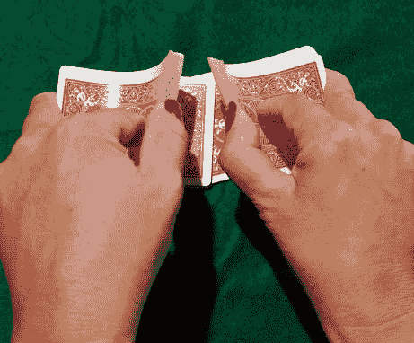

# 编写更好的代码:第 2 天-单次重复洗牌

> 原文：<https://dev.to/arjunrajkumar/write-better-code-dec-6--single-riffle-shuffle-3k9f>

这篇文章最初出现在 Arjun Rajkumar 的博客上。Arjun 是印度班加罗尔的一名 web 开发人员。

-

这是我今天解决的前一个问题。

### 第二天:问题 2

写一个方法来告诉我们一副洗牌后的牌是否是另外两副牌 half1 和 half2 的组合。

我们将把一叠卡片表示为范围为 1 的整数数组..52(因为一副牌中有 52 张不同的牌)。

单杠:t0[T3](https://res.cloudinary.com/practicaldev/image/fetch/s--98PwysvW--/c_limit%2Cf_auto%2Cfl_progressive%2Cq_auto%2Cw_880/https://thepracticaldev.s3.amazonaws.com/i/bupkw9f5c1f1ixmmvuhz.png)

[来自面试官的问题蛋糕](https://www.interviewcake.com/question/ruby/single-riffle-check?section=greedy&course=fc1)

如果你想继续下去，请在评论中发表你的答案。我的答案在评论里。