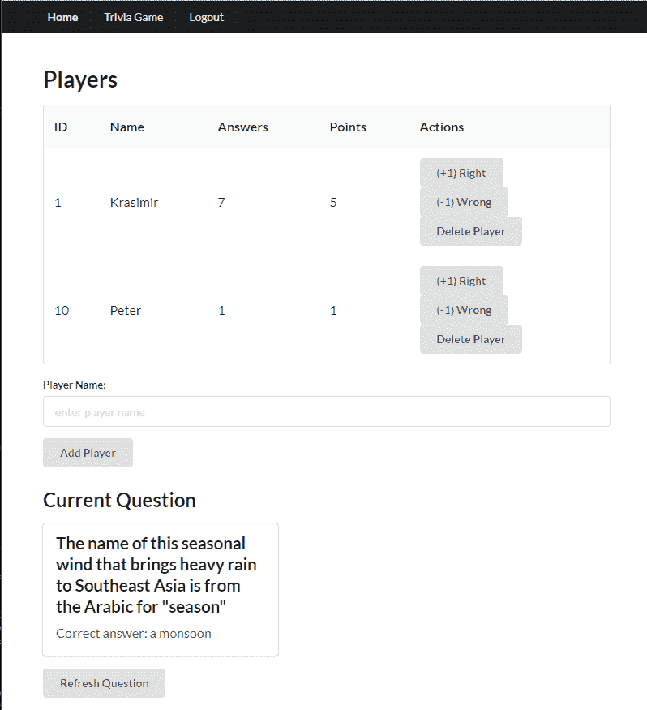
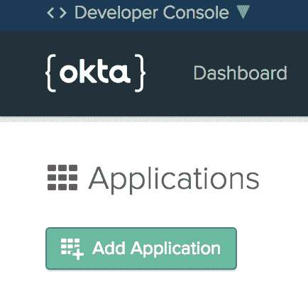
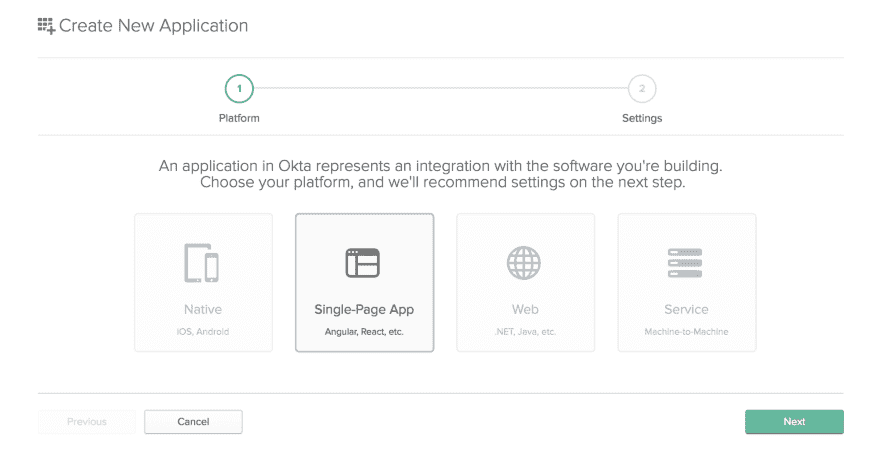

# 用 Laravel 和 React 构建一个基本的 CRUD 应用程序

> 原文：<https://dev.to/oktadev/build-a-basic-crud-app-with-laravel-and-react-1fp9>

Laravel 是一个令人惊叹的 web 应用程序框架，它经常高居当今最佳 PHP 开发框架的榜首。这部分是因为它是基于 PHP 的，目前 80%的网站都使用 PHP，学习曲线相对较短(尽管它有很多高级特性，但你可以很容易地理解基本概念)。然而，它受欢迎的真正原因是它强大的生态系统和大量免费的高质量学习资源(比如这篇博文！).

Laravel 配置了 Vue 和构建工具(基于 webpack ),因此您可以设置一个开发环境来轻松构建动态的单页面应用程序。不过，您并不局限于 Vue 您也可以使用 Laravel 作为后端，为构建在您首选框架中的前端提供支持。今天我将向您展示如何构建一个 Laravel API 并将其连接到 React 前端。我们将使用 Okta 进行用户认证和授权，这将使我们能够(几乎)立即实现顶级的安全系统。

在开始之前，您需要用 PHP 7 和 Node.js 8+/npm 设置一个开发环境。你还需要一个 [Okta 开发者账户](https://developer.okta.com/)。

## 添加 Okta 进行认证

嗯，我们可能有偏见，但我们认为 Okta 使身份管理变得比你习惯的更容易、更安全、更可伸缩。Okta 是一个 API 服务，允许您创建、编辑和安全地存储用户帐户和用户帐户数据，并将它们与一个或多个应用程序连接。

要完成这个教程，你需要[注册一个永远免费的开发者账户](https://developer.okta.com/signup/)。完成后，请回来了解更多关于使用 Laravel 和 React 构建安全 CRUD 应用程序的信息。

## 启动 Laravel + React CRUD 应用程序

我们要构建的应用程序是一个简单的问答游戏界面。它允许你注册玩家，从一个免费的 API 生成新的问题，并标记玩家的答案是对还是错。

这是完成后的应用程序的外观:

[](https://res.cloudinary.com/practicaldev/image/fetch/s--MlrqsFtk--/c_limit%2Cf_auto%2Cfl_progressive%2Cq_auto%2Cw_880/https://developer.okta.com/assets-jekyll/blog/php-laravel-react-app/game-c762a76b47003a2ace02a24af9dee673971395005d6fdee29740442134e7402e.png)

以下是玩法:

*   其中一个玩家扮演主持人的角色，不参与排名
*   主持人给玩家读问题
*   玩家“比赛”回答问题
*   如果答案正确，玩家获得+1 点。如果答案是错误的，玩家得到-1 分
*   当问题回答正确时，主持人可以点击“刷新问题”来加载下一个问题

## 设置您的 Okta 开发账户

让我们来设置您的 Okta 帐户，以便在您需要时随时可用。

在您继续之前，您需要登录您的 Okta 帐户(或[免费创建一个新帐户](https://developer.okta.com/signup/))并设置一个新的 OIDC 应用程序。您将主要使用默认设置。请务必记下您的 Okta 域和为应用程序生成的客户端 ID。

以下是逐步说明:

转到“应用程序”菜单项，单击“添加应用程序”按钮:

[](https://res.cloudinary.com/practicaldev/image/fetch/s--vU4h-AmR--/c_limit%2Cf_auto%2Cfl_progressive%2Cq_auto%2Cw_880/https://developer.okta.com/assets-jekyll/blog/php-laravel-react-app/add-application-ec29d9f298f8a4213f5bcea00798fdeeddc844cba2f4d9a5e838270120099912.png)

选择“单页应用程序”，然后单击“下一步”。

[](https://res.cloudinary.com/practicaldev/image/fetch/s--UmPsfwqu--/c_limit%2Cf_auto%2Cfl_progressive%2Cq_auto%2Cw_880/https://developer.okta.com/assets-jekyll/blog/php-laravel-react-app/select-app-type-75b98937bbff7d0fc186c6b7554d66c05f79d9a5369446f5cdbaa9512107f997.png)

设置一个描述性的应用程序名称，添加`http://localhost:3000/`作为基本 URI，添加`http://localhost:3000/implicit/callback`作为登录重定向 URI，然后单击 Done。您可以保留其余的设置。

## 设置 Laravel

通过 composer 在您的系统上全局安装`laravel`命令。然后创建一个新的 Laravel 项目，导航到它并启动开发 PHP 服务器:

```
composer global require laravel/installer
laravel new trivia-web-service
cd trivia-web-service
php artisan serve 
```

现在为您的应用程序创建一个 MySQL 数据库和用户(当然，如果您喜欢 PostgreSQL 这样的不同数据库引擎，您可以使用它):

```
mysql -uroot -p
CREATE DATABASE trivia CHARACTER SET utf8mb4 COLLATE utf8mb4_unicode_ci;
CREATE USER 'trivia'@'localhost' identified by 'trivia';
GRANT ALL on trivia.* to 'trivia'@'localhost';
quit 
```

配置变量存储在主项目目录的`.env`文件中。让我们将您的数据库凭证放在这里:

`.env`

```
DB_DATABASE=trivia
DB_USERNAME=trivia
DB_PASSWORD=trivia 
```

注意:在对`.env`文件进行修改后，您需要重新启动`php artisan serve`命令。

## 创建一个 Laravel API

我们的项目将有一个单独的实体(`Player`)。让我们为它创建一个模型和一个迁移:

```
php artisan make:model Player -m
Model created successfully.
Created Migration: 2018_11_28_094351_create_players_table 
```

(`-m`选项是`--migration`的简称)

编辑迁移，并将创建数据库表的代码放在`up()`方法中:

`database/migrations/2018_11_28_094351_create_players_table.php`

```
public function up()
{
    Schema::create('players', function (Blueprint $table) {
        $table->increments('id');
        $table->string('name');
        $table->integer('answers')->default(0);
        $table->integer('points')->default(0);
        $table->timestamps();
    });
} 
```

运行迁移以将更改应用到我们的数据库:

```
php artisan migrate 
```

我们需要定义模型的`$fillable`属性，这样我们就可以告诉 Laravel 哪些字段可以在模型的`create()`和`update()`操作中进行批量赋值:

`app/Player.php`

```
class Player extends Model
{
    protected $fillable = ['name', 'answers', 'points'];
} 
```

我们还需要创建两个 API 资源(这是 Laravel 中相对较新的特性，在 5.6 中引入，允许我们更有效地处理对象的 JSON 表示)。我们需要的资源有:`Player`(处理单个玩家)和`PlayerCollection`(处理玩家集合)。

```
php artisan make:resource Player
php artisan make:resource PlayerCollection 
```

修改资源的`toArray()`功能:

`app/Http/Resources/Player.php`

```
public function toArray($request)
{
    return [
        'id' => $this->id,
        'name' => $this->name,
        'answers' => (int) $this->answers,
        'points' => (int) $this->points,
        'created_at' => $this->created_at,
        'updated_at' => $this->updated_at,
    ];
} 
```

`app/Http/Resources/PlayerCollection.php`

```
public function toArray($request)
{
    return [
        'data' => $this->collection
    ];
} 
```

我们现在可以为 REST API 创建路由和控制器了。

```
php artisan make:controller PlayerController 
```

`routes/api.php`

```
Route::get('/players', 'PlayerController@index');
Route::get('/players/{id}', 'PlayerController@show');
Route::post('/players', 'PlayerController@store');
Route::post('/players/{id}/answers', 'PlayerController@answer');
Route::delete('/players/{id}', 'PlayerController@delete');
Route::delete('/players/{id}/answers', 'PlayerController@resetAnswers'); 
```

`app/Http/Controllers/PlayerController.php`

```
...
use App\Player;
use App\Http\Resources\Player as PlayerResource;
use App\Http\Resources\PlayerCollection;
...

class PlayerController extends Controller
{
    public function index()
    {
        return new PlayerCollection(Player::all());
    }

    public function show($id)
    {
        return new PlayerResource(Player::findOrFail($id));
    }

    public function store(Request $request)
    {
        $request->validate([
            'name' => 'required|max:255',
        ]);

        $player = Player::create($request->all());

        return (new PlayerResource($player))
                ->response()
                ->setStatusCode(201);
    }

    public function answer($id, Request $request)
    {
        $request->merge(['correct' => (bool) json_decode($request->get('correct'))]);
        $request->validate([
            'correct' => 'required|boolean'
        ]);

        $player = Player::findOrFail($id);
        $player->answers++;
        $player->points = ($request->get('correct')
                           ? $player->points + 1
                           : $player->points - 1);
        $player->save();

        return new PlayerResource($player);
    }

    public function delete($id)
    {
        $player = Player::findOrFail($id);
        $player->delete();

        return response()->json(null, 204);
    }

    public function resetAnswers($id)
    {
        $player = Player::findOrFail($id);
        $player->answers = 0;
        $player->points = 0;

        return new PlayerResource($player);
    }
} 
```

该 API 支持检索所有玩家或特定玩家、添加/删除玩家、将答案标记为正确/错误以及重置玩家分数的方法。对请求进行验证，代码生成带有适当状态代码的 JSON 响应，代码量相当少。

我们还需要启用 CORS，这样我们就可以从前端应用程序访问我们的 API:

```
composer require barryvdh/laravel-cors 
```

`app/Http/Kernel.php`

```
protected $middlewareGroups = [
    'web' => [
        ...
        \Barryvdh\Cors\HandleCors::class,
    ],

    'api' => [
        ...
        \Barryvdh\Cors\HandleCors::class,
    ],
]; 
```

您可以向数据库中添加一些虚拟数据，或者使用 Faker 库来自动化生成测试数据的过程。一旦有了一些数据，您就可以访问这些 URL:

*   [http://127 . 0 . 0 . 1:8000/API/players](http://127.0.0.1:8000/api/players)
*   [http://127 . 0 . 0 . 1:8000/API/players/1](http://127.0.0.1:8000/api/players/1)

如果您还想测试 POST/PUT/DELETE 请求(例如用 Postman)，请确保在每个请求上设置以下标题，这样验证错误将以 JSON 格式返回。

```
Accept: "application/json" 
```

## 安装 React 并设置 React 前端

我们将使用`react-create-app`(全球安装)来创建我们的应用程序。我们还将提前安装我们将需要的所有依赖项(React 路由器、语义 UI React、Okta React)并运行开发服务器:

```
npm install --global create-react-app
npx create-react-app trivia-web-client-react
cd trivia-web-client-react
yarn add react-router-dom semantic-ui-react
yarn add @okta/okta-react --save
yarn start 
```

默认的 React 应用程序现在应该在`http://localhost:3000`加载。

## 添加认证和基本路由反应

我们将从最基本的 React 应用程序开始。让我们从`/src`文件夹中删除除了`index.js`和`App.js`文件之外的所有文件，并将它们的内容更改如下:

`src/index.js`

```
import React from 'react';
import ReactDOM from 'react-dom';
import App from './App';

ReactDOM.render(<App />, document.getElementById('root')); 
```

`src/App.js`

```
import React, { Component } from 'react';

class App extends Component {
  render() {
    return (
      <div>
        App
      </div>
    );
  }
}

export default App; 
```

我们将创建一个语义 UI 导航条和一个路由器，有两个基本路由:Home(不安全)和 Trivia Game(安全)。然后我们将集成 Okta 认证并实现登录/注销按钮。我们将遵循 React 的 [Okta 认证快速入门指南。](https://developer.okta.com/quickstart/#/react/nodejs/generic)

`public/index.html`

添加:

```
<link rel="stylesheet" href="//cdnjs.cloudflare.com/ajax/libs/semantic-ui/2.3.3/semantic.min.css"></link> 
```

`src/Home.js`

```
import React, { Component } from 'react';

class Home extends Component {
    render() {
        return <div>Home page</div>
    }
}

export default Home 
```

`src/Trivia.js`

```
import React, { Component } from 'react';

class Trivia extends Component {
  render() {
    return <div>Trivia Game page</div>
  }
}

export default Trivia 
```

`src/Navbar.js`

```
import React, { Component } from 'react';
import { withAuth } from '@okta/okta-react';

import { Container, Menu } from 'semantic-ui-react';

export default withAuth(class Navbar extends Component {
  constructor(props) {
    super(props);
    this.state = { authenticated: null };
    this.checkAuthentication = this.checkAuthentication.bind(this);
    this.login = this.login.bind(this);
    this.logout = this.logout.bind(this);
  }

  async componentDidMount() {
    this.checkAuthentication();
  }

  async componentDidUpdate() {
    this.checkAuthentication();
  }

  async login() {
    this.props.auth.login('/');
  }

  async logout() {
    this.props.auth.logout('/');
  }

  async checkAuthentication() {
    const authenticated = await this.props.auth.isAuthenticated();
    if (authenticated !== this.state.authenticated) {
      this.setState({ authenticated });
    }
  }

  render() {
    return (
      <div>
        <Menu fixed="top" inverted>
          <Container>
            <Menu.Item as="a" header href="/">
              Home
            </Menu.Item>
            {this.state.authenticated === true && <Menu.Item id="trivia-button" as="a" href="/trivia">Trivia Game</Menu.Item>}
            {this.state.authenticated === true && <Menu.Item id="logout-button" as="a" onClick={this.logout}>Logout</Menu.Item>}
            {this.state.authenticated === false && <Menu.Item as="a" onClick={this.login}>Login</Menu.Item>}
          </Container>
        </Menu>
      </div>
    );
  }
}); 
```

`src/App.js`

```
import React, { Component } from 'react';
import { BrowserRouter as Router, Route } from 'react-router-dom';
import { Container } from 'semantic-ui-react';

import { Security, SecureRoute, ImplicitCallback } from '@okta/okta-react';

import Navbar from './Navbar';
import Home from './Home'
import Trivia from './Trivia'

const config = {
  issuer: 'https://{yourOktaDomain}/oauth2/default',
  redirect_uri: window.location.origin + '/implicit/callback',
  client_id: '{yourClientId}'
}

class App extends Component {
  render() {
    return (
        <Router>
            <Security issuer={config.issuer}
                   client_id={config.client_id}
                redirect_uri={config.redirect_uri}
            >
            <Navbar />
            <Container text style={{ marginTop: '7em' }}>
                <Route path="/" exact component={Home} />
                <Route path="/implicit/callback" component={ImplicitCallback} />
                <SecureRoute path="/trivia" component={Trivia} />
            </Container>
        </Security>
      </Router>
    );
  }
}

export default App 
```

不要忘记用自己的值替换`issuer`和`client_id`的配置值！

该应用程序现在包含一个导航栏，带有主页、琐事(仅在登录时可用)、登录或注销按钮(取决于登录状态)的占位符页面，登录/注销操作通过 Okta 工作。我们准备添加应用程序的业务逻辑，并将其连接到后端 API。

## 使用 React 显示你的玩家名单

我们将在琐事页面的表格中显示玩家的名单。我们将从 API 获取列表，并添加一条“正在加载…”消息，直到 API 请求完成。

我们将创建一个新的`config.js`文件，并在那里定义我们的基本 API URL:

`src/config.js`

```
export const API_BASE_URL = 'http://localhost:8000/api'; 
```

我们现在可以修改我们的`Trivia.js`组件，使它看起来像下面这样:

```
import React, { Component } from 'react';
import { Header, Message, Table } from 'semantic-ui-react';
import { withAuth } from '@okta/okta-react';

import { API_BASE_URL } from './config'

export default withAuth(class Trivia extends Component {

    constructor(props) {
        super(props);
        this.state = {
            players: null,
            isLoading: null
        };
    }

    componentDidMount() {
        this.getPlayers();
    }

    async getPlayers() {
        if (! this.state.players) {
            try {
                this.setState({ isLoading: true });
                const accessToken = await this.props.auth.getAccessToken();
                const response = await fetch(API_BASE_URL + '/players', {
                    headers: {
                        Authorization: `Bearer ${accessToken}`,
                    },
                });
                const playersList = await response.json();
                this.setState({ players: playersList.data, isLoading: false});
            } catch (err) {
                this.setState({ isLoading: false });
                console.error(err);
            }
        }
    }

    render() {
        return (
            <div>
                <Header as="h1">Players</Header>
                {this.state.isLoading && <Message info header="Loading players..." />}
                {this.state.players &&
                    <div>
                        <Table>
                            <thead>
                                <tr>
                                    <th>ID</th>
                                    <th>Name</th>
                                    <th>Answers</th>
                                    <th>Points</th>
                                    <th>Actions</th>
                                </tr>
                            </thead>
                            <tbody>
                            {this.state.players.map(
                                    player =>
                                        <tr id={player.id} key={player.id}>
                                            <td>{player.id}</td>
                                            <td>{player.name}</td>
                                            <td>{player.answers}</td>
                                            <td>{player.points}</td>
                                            <td>
                                                Action buttons placeholder
                                            </td>
                                        </tr>
                            )}
                            </tbody>
                        </Table>
                    </div>
                }
            </div>
        );
    }

}); 
```

## 向您的 Laravel API 添加认证

我们需要保护我们的后端 API，以便它使用 Okta 令牌只允许授权的请求。我们需要安装 JWT 验证器包，并为 API 认证添加一个自定义中间件:

```
composer require okta/jwt-verifier spomky-labs/jose guzzlehttp/psr7
php artisan make:middleware AuthenticateWithOkta 
```

`app/Http/Middleware/AuthenticateWithOkta.php`

```
<?php
namespace App\Http\Middleware;

use Closure;

class AuthenticateWithOkta
{
    /**
     * Handle an incoming request.
     *
     * @param \Illuminate\Http\Request $request
     * @param \Closure $next
     * @return mixed
     */
    public function handle($request, Closure $next)
    {
        if ($this->isAuthorized($request)) {
            return $next($request);
        } else {
            return response('Unauthorized.', 401);
        }
    }

    public function isAuthorized($request)
    {
        if (! $request->header('Authorization')) {
            return false;
        }

        $authType = null;
        $authData = null;

        // Extract the auth type and the data from the Authorization header.
        @list($authType, $authData) = explode(" ", $request->header('Authorization'), 2);

        // If the Authorization Header is not a bearer type, return a 401.
        if ($authType != 'Bearer') {
            return false;
        }

        // Attempt authorization with the provided token
        try {

            // Setup the JWT Verifier
            $jwtVerifier = (new \Okta\JwtVerifier\JwtVerifierBuilder())
                            ->setAdaptor(new \Okta\JwtVerifier\Adaptors\SpomkyLabsJose())
                            ->setAudience('api://default')
                            ->setClientId('{YOUR_CLIENT_ID}')
                            ->setIssuer('{YOUR_ISSUER_URL}')
                            ->build();

            // Verify the JWT from the Authorization Header.
            $jwt = $jwtVerifier->verify($authData);
        } catch (\Exception $e) {

            // We encountered an error, return a 401.
            return false;
        }

        return true;
    }

} 
```

`app/Http/Kernel.php`

```
 protected $middlewareGroups = [
        'web' => [
            ...
        ],

        'api' => [
            ...
            \App\Http\Middleware\AuthenticateWithOkta::class,
        ],
    ]; 
```

不要忘记用你自己的替换客户 ID 和发行者 URL！我还建议将这些变量提取到`.env`文件中(它们不是秘密，它们在前端应用程序中是可见的，所以将它们保存在 repo 中没有安全问题，但是如果您有多个环境，这就不方便了)。

如果你做的一切都是正确的，`http://localhost:8000/api/players`现在应该显示一个“未授权”消息，但在 React 前端加载球员名单应该工作正常(当你登录时)。

## 在 React 中创建新的玩家组件

我们需要一个新的 React 组件，用于添加玩家表单，我们将在琐事页面的表格下方添加该组件。首先，我们将修改`Trivia.js`来包含表单，并且我们将添加一个新方法来在添加新玩家时更新玩家列表:

`src/Trivia.js`

```
import PlayerForm from './PlayerForm';

(replace the constructor method)
    constructor(props) {
        super(props);
        this.state = {
            players: null,
            isLoading: null
        };
        this.onAddition = this.onAddition.bind(this);
    }

(add a new method)
    onAddition(player) {
        this.setState({
            players: [...this.state.players, player]
        })
    }

(below the closing </Table> tag in the render() method):
                        <PlayerForm onAddition={this.onAddition} /> 
```

我们还需要创建一个新的`PlayerForm`组件:

`src/PlayerForm.js`

```
import React, { Component } from 'react';
import { Button, Form, Message } from 'semantic-ui-react'
import { withAuth } from '@okta/okta-react';

import { API_BASE_URL } from './config'

export default withAuth(class PlayerForm extends Component {

    constructor (props) {
        super(props);
        this.state = {
            name: '',
            errorMessage: '',
            error: false,
            isLoading: false
        }
        this.handleChange = this.handleChange.bind(this);
        this.onSubmit = this.onSubmit.bind(this);
    }

    handleChange(e) {
        this.setState({
            name: e.target.value
        })
    }

    async onSubmit(e) {
        e.preventDefault();
        this.setState({
            isLoading: true,
            error: false,
            errorMessage: ''
        });

        const accessToken = await this.props.auth.getAccessToken();
        const response = await fetch(API_BASE_URL + '/players', {
            method: 'POST',
            headers: {
                'Content-Type':'application/json',
                Authorization: `Bearer ${accessToken}`,
                Accept: 'application/json'
            },
            body: JSON.stringify({
                "name": this.state.name
            })
        });
        const player = await response.json();

        if (player.errors) {
            this.setState({
                isLoading: false,
                error: true,
                errorMessage: player.errors
            });
        } else {
            this.setState({
                name: '',
                isLoading: false,
                error: false,
                errorMessage: ''
            });
            this.props.onAddition(player.data);
        }
    }

    render() {
        return (
            <Form error={this.state.error} onSubmit={this.onSubmit}>
                <Form.Field error={this.state.error}>
                    <label>Player Name:</label>
                    <input placeholder='enter player name' value={this.state.name} onChange={this.handleChange}/>
                { this.state.error &&
                <Message
                    error
                    header='Error creating player'
                    content={this.state.errorMessage}
                />
                }
                </Form.Field>
                <Button type='submit' loading={this.state.isLoading}>Add Player</Button>
            </Form>
        )
    }
}); 
```

现在，我们可以使用刚刚创建的表单向游戏中添加更多的玩家。

## 添加一个删除玩家按钮来反应

下一步是实现“删除球员”按钮。我们将为按钮创建一个新组件，并将玩家 ID 作为属性传递。

`src/Trivia.js`

```
import DeletePlayerButton from './DeletePlayerButton';

    constructor(props) {
        super(props);
        this.state = {
            players: null,
            isLoading: null
        };
        this.onAddition = this.onAddition.bind(this);
        this.onDelete = this.onDelete.bind(this);
    }

   onDelete(id) {
        let players = this.state.players;
        let index = players.findIndex(player => player.id === id)
        players.splice(index, 1)       
        this.setState({
            players: players
        })
    } 
```

在`render()`方法:
中替换表格中的动作按钮占位符文本

```
<DeletePlayerButton onDelete={this.onDelete} playerId={player.id} /> 
```

`src/DeletePlayerButton.js`

```
import React, { Component } from 'react';
import { Form, Button } from 'semantic-ui-react'
import { withAuth } from '@okta/okta-react';

import { API_BASE_URL } from './config'

export default withAuth(class DeletePlayerButton extends Component {

    constructor (props) {
        super(props);
        this.state = {
            id: props.playerId,
            isUpdating: false
        }
        this.onSubmit = this.onSubmit.bind(this);
    }

    async onSubmit(e) {
        e.preventDefault();
        this.setState({
            isUpdating: true
        });

        const accessToken = await this.props.auth.getAccessToken();
        const response = await fetch(API_BASE_URL + '/players/' + this.state.id, {
            method: 'DELETE',
            headers: {
                'Content-Type':'application/json',
                Authorization: `Bearer ${accessToken}`,
                Accept: 'application/json'
            }
        });

        await response;
        await this.setState({
            isUpdating: false
        });
        this.props.onDelete(this.state.id);
    }

    render() {
        return (
            <Form onSubmit={this.onSubmit}>
                <Button type='submit' loading={this.state.isUpdating}>Delete Player</Button>
            </Form>
        )
    }
}); 
```

## 添加琐事服务反应过来

我们将使用一个公共 API 来回答一些小问题。这是一项免费服务，提供各种主题的随机测验问题。我们将在`config.js`文件中定义 URL，并在加载琐事页面时得到一个初始问题。我们还将修改 Trivia 组件的`render()`方法，以便 html 包含一个带有问题和答案的卡片，以及为每个玩家指示正确和错误答案的按钮:

`src/config.js`

```
export const TRIVIA_ENDPOINT = 'http://jservice.io/api/random?count=1'; 
```

`src/Trivia.js`

```
Changes:

    import { Header, Message, Table, Card, Button } from 'semantic-ui-react';
    import { API_BASE_URL, TRIVIA_ENDPOINT } from './config'

    constructor(props) {
        super(props);
        this.state = {
           players: null,
            isLoading: null,
            question: null,
            isQuestionLoading: null
        };
        this.onAddition = this.onAddition.bind(this);
        this.onDelete = this.onDelete.bind(this);
        this.getQuestion = this.getQuestion.bind(this);
    }

    componentDidMount() {
        this.getPlayers()
        this.getQuestion()
    }

    async getQuestion() {
        try {
            this.setState({ isQuestionLoading: true });
            const response = await fetch(TRIVIA_ENDPOINT);
            const questions = await response.json();
            this.setState({ question: questions[0], isQuestionLoading: false });
        } catch (err) {
            this.setState({ isQuestionLoading: false });
            console.error(err);
        }
    }

    render() {
        return (
            <div>
                <Header as="h1">Players</Header>
                {this.state.isLoading && <Message info header="Loading players..." />}
                {this.state.players &&
                    <div>
                        <Table>
                            <thead>
                                <tr>
                                    <th>ID</th>
                                    <th>Name</th>
                                    <th>Answers</th>
                                    <th>Points</th>
                                    <th>Actions</th>
                                </tr>
                            </thead>
                            <tbody>
                            {this.state.players.map(
                                    player =>
                                        <tr id={player.id} key={player.id}>
                                            <td>{player.id}</td>
                                            <td>{player.name}</td>
                                            <td>{player.answers}</td>
                                            <td>{player.points}</td>
                                            <td>
                                                <DeletePlayerButton onDelete={this.onDelete} playerId={player.id} />
                                            </td>
                                        </tr>
                            )}
                            </tbody>
                        </Table>
                        <PlayerForm onAddition={this.onAddition} />
                    </div>
                }
                <Header as="h2">Current Question</Header>
                {this.state.isQuestionLoading && <Message info header="Loading question..." />}
                {this.state.question &&
                    <div>
                        <Card>
                            <Card.Content>
                              <Card.Header>{this.state.question.question}</Card.Header>
                              <Card.Description> Correct answer: {this.state.question.answer}</Card.Description>
                            </Card.Content>
                        </Card>
                        <Button type='button' onClick={this.getQuestion}>Refresh Question</Button>
                    </div>
                }
            </div>
        );
    } 
```

当你加载琐事页面时，现在会自动显示一个问题。单击“刷新问题”以显示新问题。

## 添加按钮表示正确和错误的答案

我们将添加按钮来指示玩家的正确和错误答案，类似于我们已经添加的“删除玩家”按钮。

`src/Trivia.js`

```
import RightAnswerButton from './RightAnswerButton';
import WrongAnswerButton from './WrongAnswerButton';

   constructor(props) {
        super(props);
        this.state = {
            players: null,
            isLoading: null,
            question: null,
            isQuestionLoading: null
        };
        this.onAddition = this.onAddition.bind(this);
        this.onDelete = this.onDelete.bind(this);
        this.getQuestion = this.getQuestion.bind(this);
        this.onAnswer = this.onAnswer.bind(this);
    }

    onAnswer(id, data) {
        let players = this.state.players
        let player = players.findIndex(player => player.id === id)
        players[player] = data
        this.setState({
            players: players
        })
    }

(add the following before `DeletePlayerButton` inside the `render()` method):

<RightAnswerButton onRightAnswer={this.onAnswer} playerId={player.id} /> <WrongAnswerButton onWrongAnswer={this.onAnswer} playerId={player.id} /> 
```

`src/RightAnswerButton.js`

```
import React, { Component } from 'react';
import { Form, Button } from 'semantic-ui-react'
import { withAuth } from '@okta/okta-react';

import { API_BASE_URL } from './config'

export default withAuth(class RightAnswerButton extends Component {

    constructor (props) {
        super(props);
        this.state = {
            id: props.playerId,
            isUpdating: false
        }
        this.onSubmit = this.onSubmit.bind(this);
    }

    async onSubmit(e) {
        e.preventDefault();
        this.setState({
            isUpdating: true
        });

        const accessToken = await this.props.auth.getAccessToken();
        const response = await fetch(API_BASE_URL + '/players/' + this.state.id + '/answers', {
            method: 'POST',
            headers: {
                'Content-Type':'application/json',
                Authorization: `Bearer ${accessToken}`,
                Accept: 'application/json'
            },
            body: JSON.stringify({
                "correct": true
            })
        });

        const player = await response.json();
        await this.setState({
            isUpdating: false
        });
        this.props.onRightAnswer(this.state.id, player.data);
    }

    render() {
        return (
            <Form onSubmit={this.onSubmit}>
                <Button type='submit' loading={this.state.isUpdating}>(+1) Right</Button>
            </Form>
        )
    }
}); 
```

`src/WrongAnswerButton.js`

```
import React, { Component } from 'react';
import { Form, Button } from 'semantic-ui-react'
import { withAuth } from '@okta/okta-react';

import { API_BASE_URL } from './config'

export default withAuth(class WrongAnswerButton extends Component {

    constructor (props) {
        super(props);
        this.state = {
            id: props.playerId,
            isUpdating: false
        }
        this.onSubmit = this.onSubmit.bind(this);
    }

    async onSubmit(e) {
        e.preventDefault();
        this.setState({
            isUpdating: true
        });

        const accessToken = await this.props.auth.getAccessToken();
        const response = await fetch(API_BASE_URL + '/players/' + this.state.id + '/answers', {
            method: 'POST',
            headers: {
                'Content-Type':'application/json',
                Authorization: `Bearer ${accessToken}`,
                Accept: 'application/json'
            },
            body: JSON.stringify({
                "correct": false
            })
        });

        const player = await response.json();
        await this.setState({
            isUpdating: false
        });
        this.props.onWrongAnswer(this.state.id, player.data);
    }

    render() {
        return (
            <Form onSubmit={this.onSubmit}>
                <Button type='submit' loading={this.state.isUpdating}>(-1) Wrong</Button>
            </Form>
        )
    }
}); 
```

作为练习，您可以重构`RightAnswerButton`和`WrongAnswerButton`来移除代码重复。应用程序至此完成！你可以注册玩家，问他们问题，并记录他们的答案是对还是错。

## 了解更多关于 Laravel、React 和 Okta 的信息

您可以通过将 API 样板代码(检索 auth 令牌、发送授权头、发送请求和接收响应)提取到服务类中来进一步改进代码。React 不提供现成的依赖注入(例如 Angular ),但是您可以使用更高阶的组件函数来包装您的组件，并用 API 相关的功能来修饰它们(该方法类似于应用于`Trivia.js`、`PlayerForm.js`和`DeletePlayerButton.js`的`withAuth()`修饰)。

你可以在这里找到完整的代码:[https://github.com/oktadeveloper/okta-php-trivia-react/](https://github.com/oktadeveloper/okta-php-trivia-react/)

如果您想更深入地了解本文涉及的主题，以下资源是一个很好的起点:

*   [我们的 React/PHP 快速入门指南](https://developer.okta.com/quickstart/#/react/php/generic)
*   [Symfony/React 示例应用](https://dev.to/blog/2018/08/23/symfony-react-php-crud-app)
*   [将身份管理添加到您的 React 应用中](https://developer.okta.com/code/react/)

一如既往，我们希望收到您的来信。欢迎在评论中或 Twitter 上提出问题或反馈给我们！