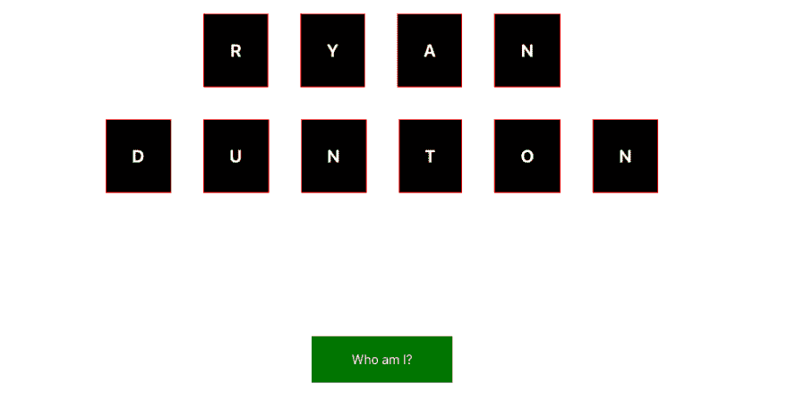

# 重现司法调查动画

> 原文：<https://dev.to/ryan_dunton/recreating-the-stateofjs-survey-animation-5ca9>

## 任务

如果你关注 Javascript 的世界，你很有可能会遇到令人惊叹的“2018 年 Javascript 现状”调查。如果没有，可以在这里查看[。我喜欢它开始时的动画，并开始尝试重新制作它。现在我将回顾一下我所做的事情。](https://2018.stateofjs.com/)

我的最终产品可以在这里查看。尚未准备好在手机上观看。

### 告诫

我以前从未在 React 内部使用过 Greensock，所以我确信这是一种非常草率和粗暴的解决问题的方式。我鼓励其他人尝试一下:)

### 项目概述

我们试图模拟的示例使用块来拼出“Javascript 2018 的状态”，并带有一个按钮来查看调查。我决定拼出我的名字，“瑞安邓顿”，并有一个按钮，悬停时，允许用户查看我的实际姓名拼出块。

我首先设置了一个`App`组件来保存我的动画块。我给了`App`两个状态属性“home 和 margin”。home 属性将监视元素是否应该在它们的起始位置，margin 属性将允许我将 margin 属性作为道具传递，并使计算动画容器变得更容易。

```
class App extends Component {
  constructor(props) {
    super(props);
    this.state = {
      home: false,
      margin: 20
    };
  } 
```

然后我给了`App`一些`Letter`组件和道具来设置初始动画

```
 <Letter
            data="R"
            borderColor="red"
            isHome={this.state.home}
            animationType={"y"}
            currentLeftOrRight={"left"}
            currentTopOrBottom={"top"}
            margin={this.state.margin}
          /> 
```

我还添加了一个`Button`组件，并传递给它一个函数，在悬停时将`App`的`this.state.home`更改为`true`。

(我使用了风格化的组件，所以如果这看起来很时髦，你可以忽略它)

```
 <ButtonWrapper>
          <EnterButton
            buttonText="Who am I?"
            checkForHover={this.checkForHover}
            removeHover={this.removeHover}
          />
        </ButtonWrapper> 
```

进入我的信件组件，我需要找到 store MaxX、MaxY、MinX 和 MinY 值，因为我要将每个元素发送到其中一个轴的 Max 或 Min，并在另一个轴的范围内生成一个随机数。我决定将这些数据存储在 Letter 组件的状态中。我还想监控正在使用的“animationType ”,基本上是看它是否移动到 X 或 Y 最大值/最小值，以及它与当前边对齐。我还需要监控动画是否结束以及动画的时间/长度。所以字母组件的初始状态是这样的:

```
 class Letter extends Component {
        constructor(props) {
        super(props);
        this.state = {
          x: 0,
          y: 0,
          animationTime: 2,
          minTop: 0,
          maxTop: 0,
          maxRight: 0,
          minLeft: 0,
          currentLeftOrRight: null,
          currentTopOrBottom: null,
          animationType: "",
          endAnimation: false
        }; 
```

然后我需要在组件安装时设置这些值，因为我需要计算它在屏幕上的位置。最困难的部分是计算出准确的容器尺寸。这就是将`margin`属性作为道具传递的好处，因为我可以在`ComponentDidMount`状态计算中引用它:

```
this.setState({
      minTop: -offsetTop - margin,
      maxTop: windowHeight - elementHeight + margin - offsetTop,
      maxRight: windowWidth - elementX - (elementWidth - margin),
      minLeft: -offsetLeft - margin,
      animationType,
      currentLeftOrRight,
      currentTopOrBottom
    }); 
```

以及将它传递给一个样式化的组件:

```
const StyledLetter = styled.div`
  margin: ${props => props.margin}px;
`; 
```

所以现在我有了一个如下所示的页面，每个`Letter`都知道制作动画所需的所有信息。

[](https://res.cloudinary.com/practicaldev/image/fetch/s---6K6XIC1--/c_limit%2Cf_auto%2Cfl_progressive%2Cq_auto%2Cw_880/https://s3.amazonaws.com/ryan-dunton-blogging-buckimg/state-of-js-post1.png)

这已经太长了，所以我将在这里结束，并很快发布后续文章！