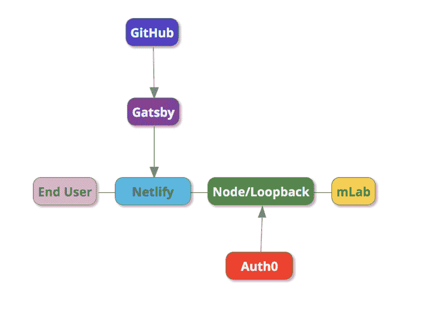
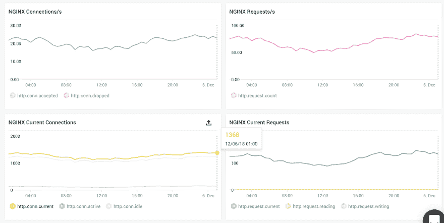

# freeCodeCamp.org 如何使用 JAMstack +单个 API 服务器来帮助每月数百万人学习编码

> 原文：<https://dev.to/ossia/how-freecodecamporg-uses-the-jamstack--a-single-api-server-to-help-millions-of-people-learn-to-code-every-month-4d5g>

嘿 dev.to peeps -长期潜伏者，第一次海报。

freeCodeCamp.org 现在每个月都在帮助数百万人学习编码，我们使用单一的 API 服务器来完成这项工作。

平台的其余部分由 CDNs 和其他光荣服务处理。

这是一个新的架构，叫做 JAMstack，代表 JavaScript，API，标记。

下面是我写这篇文章时 NGINX 的截图:

尽管有 1，368 人同时使用 freeCodeCamp.org，但我们的 Node.js / Loopback 服务器几乎不费吹灰之力。

freeCodeCamp.org 是一个预算更少的小型非营利组织，所以我们希望最大限度地提高基础设施的性价比。

我们主要提供静态页面。即使我们的编码挑战——尽管它们具有交互性——也完全在客户端运行，不需要服务器调用。所以 JAMstack 对我们来说很有意义。

它可能对您的组织也有意义。

请允许我一步一步地向您介绍我们的堆栈是如何工作的。

## freeCodeCamp.org 的 JAMstack 架构

第一步:一个开源贡献者打开一个 pull 请求，改变 freeCodeCamp.org 的 6000 多个交互式编码挑战和参考文章中的一个——所有这些都存储为易于编辑的 markdown 文件。

步骤 2:我们的持续集成工具确认构建通过，Git 确认没有任何合并冲突。

第三步:开源维护者 QA 并合并 GitHub 上的 pull 请求。

第四步:Gatsby——一个静态网站构建器——把这 6000 多个 markdown 文件变成一个单页 React 应用程序。

第五步:Netlify 将新构建的应用程序推送到他们在世界各地数据中心的 CDN 端点。

第六步:一个想练习编程的人拜访了 https://www.freecodecamp.org。

第 7 步:他们的浏览器从最近的 Netlify CDN 端点下载文件，并呈现 Gatsby 应用程序。

步骤 8: Auth0 检查他们是否登录到 freeCodeCamp.org。如果是的话，它将授予他们对我们的公共 API——node . js/Loopback 服务器的读写权限。

步骤 API 服务器然后从 mLab 上托管的 MongoDB 集群中读取和写入数据。

步骤 10:浏览器现在可以获取用户完整的 freeCodeCamp 档案和进度。当他们完成编码挑战时，他们的浏览器可以将数据写回到他们的个人资料中。

## 那么为什么是 JAMstack 呢？

JAMstack 有几个好处，吸引我们远离更传统的以 web 服务器为中心的架构。

### 好处# 1:jam stack 超级便宜。

我们是一个小型非营利组织。我们希望将尽可能多的稀缺资金用于帮助人们学习编码——而不是为不必要的服务器和带宽买单。

自从我们开始将服务转移到 JAMstack 以来，我们的基础架构成本大幅下降。

### 好处二:更简单。

当你的栈很简单并且只有很少的可移动部分时，你所得到的理智是有道理的。这是更少的东西可以在半夜打破。

### 好处#3:更安全，更可靠。

我们现在依赖于一篮子专门的 API，它们只做一件事情。这意味着我们自己会搞砸的事情更少了。

Auth0 团队花了很多时间思考如何让认证更安全。Algolia 花了很多时间思考如何防范恶意查询。

我们可以专注于保护我们的单个 API，而不是把自己局限在影响以 web 服务器为中心的应用程序的所有额外安全考虑中。

## 但是为什么是 JAMstack 呢？

你说真的吗？我刚才已经告诉你了。

抱歉- [那是《超级名模》的参考文献](https://www.youtube.com/watch?v=WHrn_pHW2so)。我无法抗拒。

几周前我做了一个关于 JAMstack 的演讲。在本次演讲中，我将介绍我们在使用 JAMstack 之前使用的各种堆栈。我还分享了我们在 2019 年如何实现更大规模和性价比的雄心。

## 知道的越多

freeCodeCamp.org 是一个小小的非营利组织，帮助全世界数百万人免费学习编程。到目前为止，我们社区已经有 10，000 人获得了他们的第一份开发工作。

快乐编码。