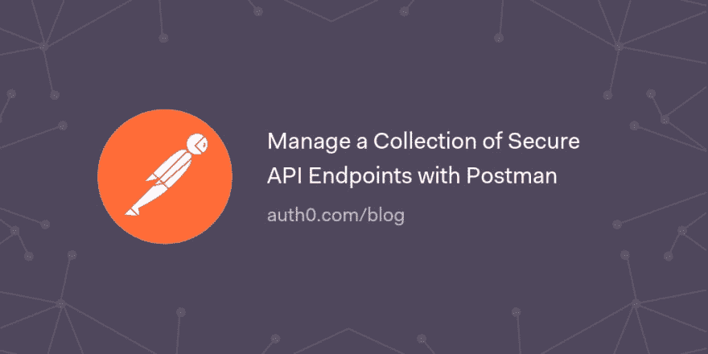

# 使用 Postman 管理安全 API 端点的集合

> 原文：<https://dev.to/auth0/manage-a-collection-of-secure-api-endpoints-with-postman-gag>

Postman 是一个 API 开发环境，可以帮助你开发你的 API。它可以用来简化开发过程，并为组织的 API 创建一个单一的真实来源，提供丰富的文档，这些文档是从您用来管理和测试 API 的工具中产生的。

在本文中，您将了解如何使用 Postman 与公共和安全 API 端点的 API 进行交互。

[读下去👨‍🚀](https://auth0.com/blog/manage-a-collection-of-secure-api-endpoints-with-postman/?utm_source=dev&utm_medium=sc&utm_campaign=postman_secure_api)

