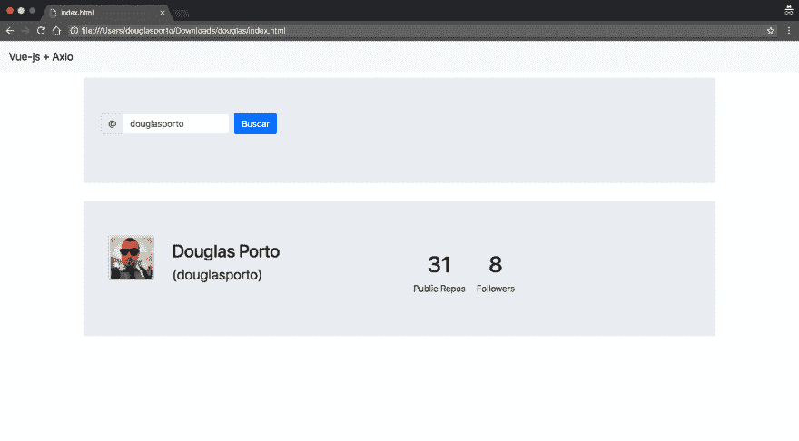

# 用 AXIOS 搜索 Github 用户

> 原文：<https://dev.to/douglasporto/searching-github-users-with-axios-4m36>

在本文中，我们将在实践中看到如何使用 [AXIOS](https://github.com/axios/axios) 。
开门见山地说，我们将创建一个页面，搜索一个 [GitHub](https://github.com/) 用户，并在屏幕上显示其存储库。

说了这么多，走吧！

首先，您将创建`index.html`并通过 **CDN** 穿上 [VUE](https://vuejs.org/v2/api/) 和 [AXIOS](https://github.com/axios/axios) 。

```
<!DOCTYPE html>
<html lang="pt-br">
<head>
  <meta charset="utf-8">
  <meta name="format-detection" content="telephone=no">
  <meta name="viewport" content="width=device-width, initial-scale=1.0, user-scalable=no">
  <link rel="shortcut icon" href="assets/img/ico/favicon.ico">  
  
</head>
<body>
  <div id="app"></div>
<script src="https://cdn.jsdelivr.net/npm/vue/dist/vue.js"></script>
<script src="https://cdnjs.cloudflare.com/ajax/libs/axios/0.18.0/axios.js"></script>
<script src="config/index.js"></script>
</body>
</html> 
```

然后，创建一个`config/index.js`文件来实例化 [VUE](https://vuejs.org/v2/api/) 。

在这一步中，我们将使用两个 VUE 变量:

*   **用户**:用于输入文本；
*   **gitHub** :用于 API 的返回。

```
var app = new Vue({
  el: '#app',
  data: {
    user: '',
    github: {}
  },
}) 
```

使用`index.html`创建你的页面布局。如果你想让它变得更复杂，你可以使用 [Bootstrap](http://getbootstrap.com/) 或者任何其他框架。看看这个例子:

```
 <nav class="nav navbar navbar-expand-lg navbar-light bg-light center">
    <a class="navbar-brand" href="#">Vue-js + Axios</a>
  </nav>
  <div class="container">
    <div class="row">      
      <div class="col-md-12 jumbotron">
        <form class="form-inline"  v-on:submit.prevent>
        <label class="sr-only" for="userGit">User</label>
        <div class="input-group mb-2 mr-sm-2">
          <div class="input-group-prepend">
            <div class="input-group-text">@</div>
          </div>
          <input type="text" class="form-control" id="userGit" v-model='user' placeholder="user">
        </div>
        <button type="submit" class="btn btn-primary mb-2" @click="searchGit" :class="{'disabled':user.trim()==''}">Search</button>
      </form>
    </div>
  </div> 
```

注意，`<form>`有一个`v-on:submit.prevent`只是为了避免调用`submit`函数。此外，我们使用一个`@click="searchGit"`标签来调用 API 信息的搜索，如果用户为空，则使用一个`v-bind` `class`来禁用`<button>`。

### Axios

应用轴是这个例子中最简单的部分。让我们来看看:

```
methods: {
  searchGit: function () {
    let api = 'https://api.github.com/users/' + this.user;
    vm = this;
    axios.get(api).then(function(response) {
      vm.github = response.data;
      console.log(vm.github);
    });
  }
} 
```

您现在可以搜索用户了。检查控制台以查看结果。你会看到 API GitHub 提供的一切。

最后一步是显示它的存储库。您可以按如下方式操作:

```
<div v-if="github.name">
  <div class="row jumbotron">
    <div class="col-md-6">
      <div class="avatar">
        
      </div>
      <div class="nickname">
        <h2>{ { github.name } }</h2>
        <h2 class="login"><small>({ { github.login } })</small></h2>
      </div>
    </div>
    <div class="col-md-6">
      <div class="pull-right well info">
        <ul>
          <li><h1>{ { github.public_repos } }</h1>Public Repos</li>
          <li><h1>{ { github.followers } }</h1>Followers</li>
        </ul>
      </div>
    </div>
  </div>
</div> 
```

[](https://res.cloudinary.com/practicaldev/image/fetch/s--0DEV8uZE--/c_limit%2Cf_auto%2Cfl_progressive%2Cq_auto%2Cw_880/http://douglasporto.com.br/assets/img/posts/screen-axios-vue.png)

就是这样！

阅读 [GitHub 文档](https://developer.github.com/v3/)以获取更多信息，让创造力尽情发挥吧！

你喜欢这个建议吗？下面评论这里，大家来聊聊。