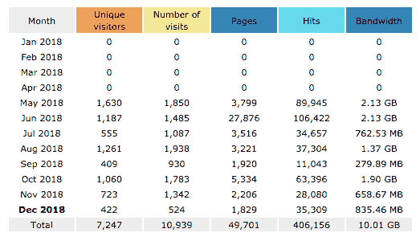
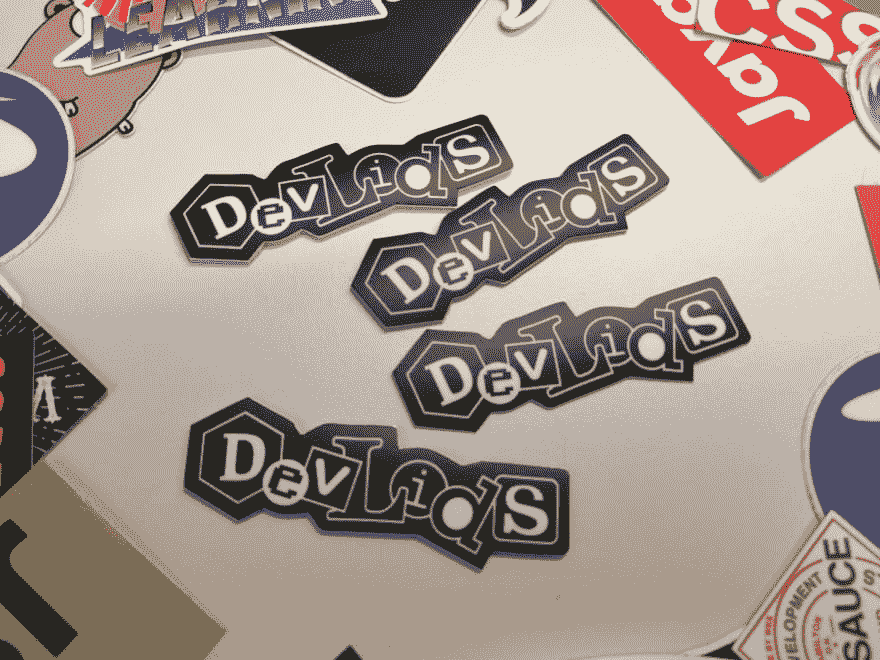
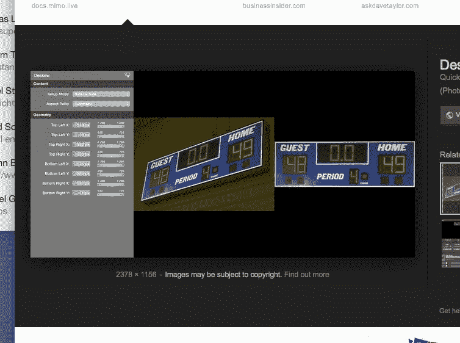

# DevLids 200-里程碑&需要帮助

> 原文：<https://dev.to/niorad/devlids-200-milestone--help-needed-3ggo>

**我需要帮助的部分见最后一段**

昨天，我的小爱好——DevLids.com 项目有了 200 名捐助者。(有一些人不止一个，所以图像总数有点高)

## 我哪来的 200 个盖子？

我从开发者到用户那里得到了很多内容(尤其是在开始的时候)，所以感谢你们所有人在你们昂贵的机器上贴纸！也感谢阿里的“大声喊出来”。

我在 Twitter 上搜索和询问得到的大多数盖子。在过去的几天里，有很多销售人员给我发微博。(他们确实有一些很酷的贴纸！我从哪里得到那些？).

上周我在柏林的反应日做了一个关于 DevLids 的简短演讲，在 git nation-开源阶段(开始于 05:08:30 左右)。从那里我也收到了一些投稿。

对我来说，更重要的是保持缓慢但稳定的运转。最有趣的事情将是五年后回头看，对着旧东西傻笑(“hihi，还记得 EDGE 吗？”或者“还记得笔记本电脑吗？”).

我在任何平台上都没有太多的关注者，所以不管怎样，我也不指望会有大量的投稿。

## dev lids 到底有多红？

虽然我很少关心受欢迎程度(我只是想要一些我睡不着时可以看看的东西)，但有时我很好奇 reach。

DevLids 没有分析，但是我的 hoster 提供了一些基本的见解，看起来每个月至少有几百个访问者，这比我以前做过的任何其他项目都多。

## lidi verse 里还发生了什么？

*   布局略有更新，有了(希望)更清晰、更大的“如何总结”部分。
*   DevLids 有一个[React-版本](http://preview.devlids.com/)，但这只是一个学习的平台，它不会取代当前版本。
*   有一个按字母顺序排列的贡献者列表。
*   我做了一些贴纸！我不能把它们发给每个人，尽管如果你真的想要一些，请在 Twitter 上给我发消息。
*   我正在想办法给盖子加上标签，让它可以通过贴纸分类。谷歌云标志检测工作正常，但我想我必须手工标记。

## 想提交你的盖子？

在 [Twitter](https://twitter.com/DevLids) 上给我发一张照片，或者就在评论里贴出来。

## 我需要帮助！

我希望能够在浏览器中编辑提交的内容。我必须能够为这个做透视裁剪，目前我只能在 Photoshop 中做。

如果有人知道如何在浏览器中进行透视裁剪，请在评论中告诉我。它可能是一个 JS 插件，一篇论文，或者一个算法，在定义了源图像中的四个点之后给我像素。任何关于寻找什么的提示都是非常感谢的。

感谢阅读！