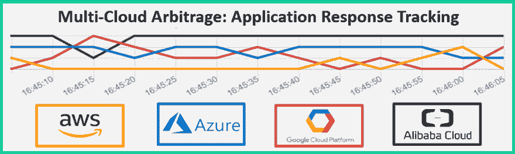
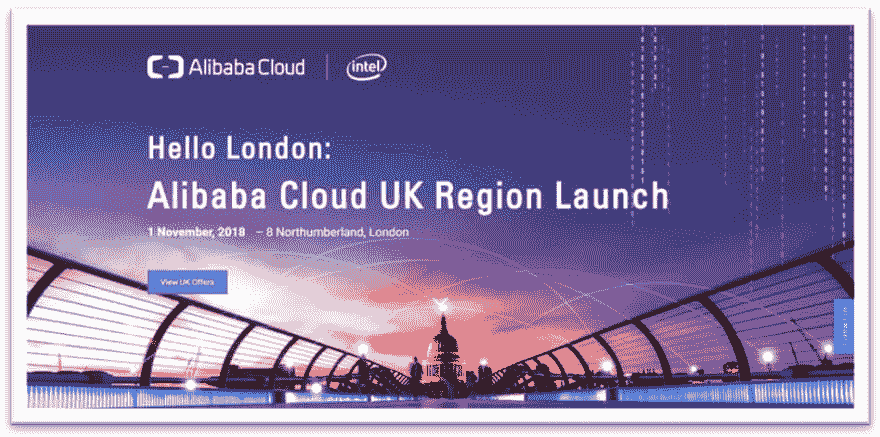
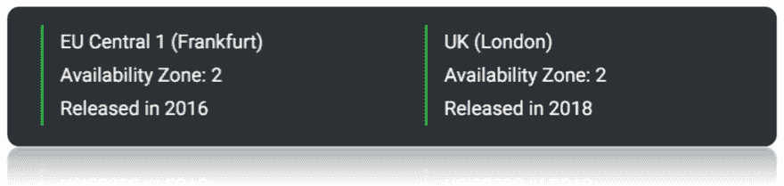
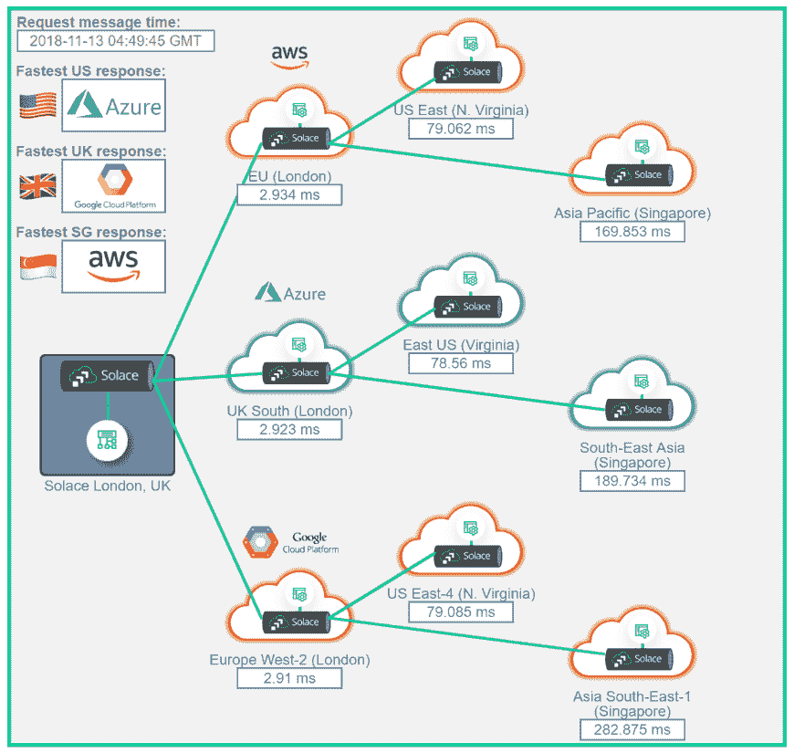
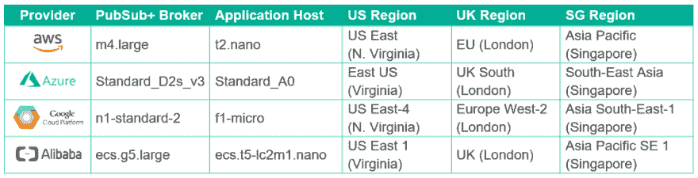
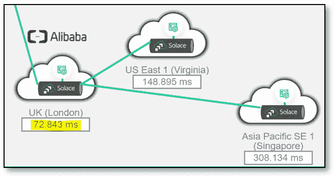
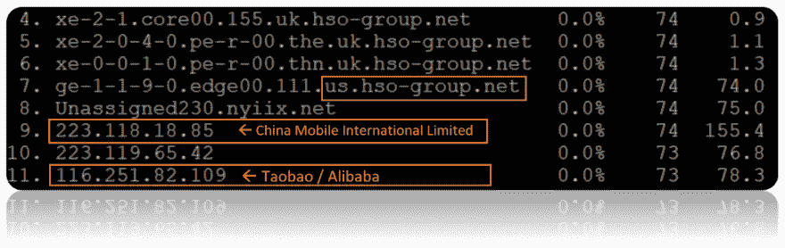
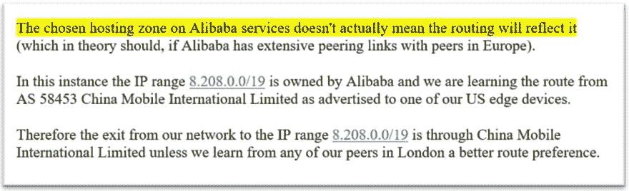
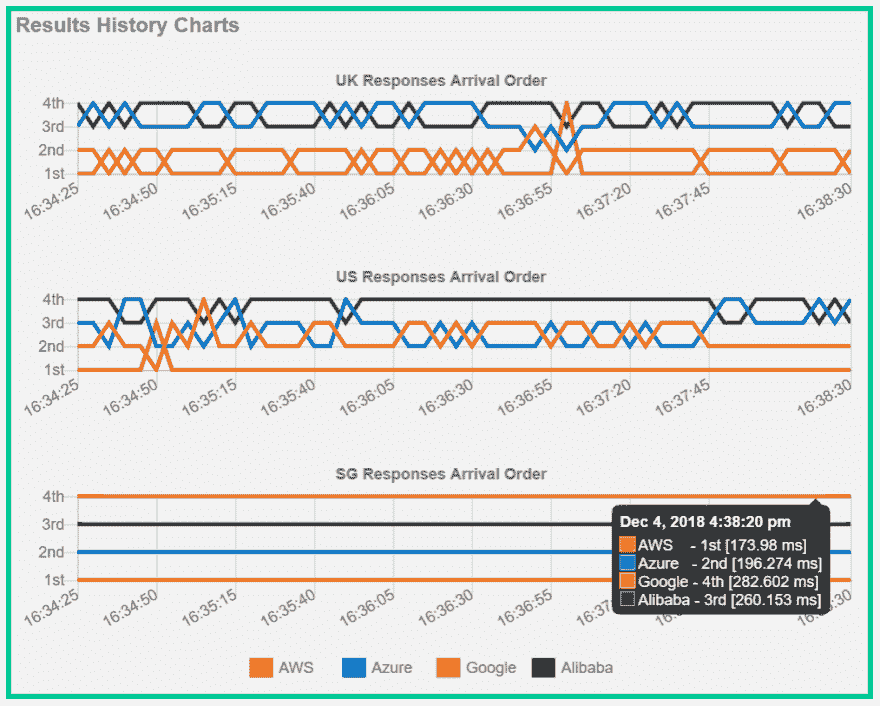
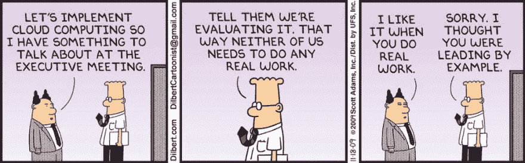

# 阿里云——数据驱动的分析

> 原文：<https://dev.to/solacedevs/alibaba-cloud-a-data-driven-analysis-41ci>

### 阿里云——数据驱动的分析

<figure> 

<figcaption>多云套利:样本响应跟踪器</figcaption>

</figure>

首先，这篇文章涉及了英国退出欧盟政治，跨越大西洋的互联网流量的特性，莫·法拉跑 5000 米赛跑，当然还有云计算。

因此，如果你的阅读兴趣落在这两个集合的交叉点上，请继续阅读，用掌声或评论让自己为人所知。

### **>阿里巴巴的炒作是怎么回事？**

我敢肯定，阿里巴巴经常出现在你的提要中。这是一个热门话题，经常出现在商业新闻和 T2 科技新闻中。

阿里巴巴是中国的网上购物巨头，经常被比作亚马逊。就像亚马逊和 AWS 有云计算业务一样，阿里巴巴也有。

虽然 AWS 是市场份额最大的老牌公司，去年的收入估计为 170 亿美元，但真正引起人们注意的是阿里巴巴在 T2 的快速增长:

> *“2016 年，这家中国电子商务巨头的云计算业务增长了 126%，达到 6.75 亿美元。增长不太可能很快放缓。”——*[*学人*](https://www.economist.com/business/2018/01/18/chinese-tech-companies-plan-to-steal-american-cloud-firms-thunder)
> 
> “阿里云发展迅速，但仍远远落后于 AWS 和其他市场领导者。”——[*Techcrunch*](https://techcrunch.com/2018/02/06/alibaba-cloud-growing-like-gangbusters-but-still-far-behind-aws-and-other-market-leaders/?guccounter=1)

所以，这都是关于阿里巴巴未来几年的发展方向，而不一定是他们现在的发展方向。

### **>阿里云推出英国伦敦地区**

上月，阿里巴巴高调地为其全球数据中心网络增加了一个英国“区域”:

<figure> 

<figcaption>阿里巴巴英国地区首发</figcaption>

</figure>

伦敦位置的推出意味着他们正在向公共和金融服务等领域的英国企业示好，在这些领域，“[数据本地化](https://www.theregister.co.uk/2018/10/22/alibaba_london_cloud/)至关重要。在当前的政治气候下，这种事件也不可避免地被增选为具有更多意义的事件:

> “这将被视为英国退出欧盟之前对英国科技产业实力的信任投票，英国科技产业一直担心在离开欧盟之前的投资水平。”——[*ZDNet*](https://www.zdnet.com/article/alibaba-cloud-adds-two-new-london-data-centers/)

#### **英国退出欧盟赞成还是反对？**

我发现有趣的是，虽然这个新地区表面上被称为“英国(伦敦)”，但实际上是这样的:

<figure> 

<figcaption>阿里巴巴欧盟和英国地区</figcaption>

</figure>

事实是，在幕后，你可以看出阿里巴巴将英国视为其在欧盟的延伸，这个新的英国地区的“ID”在许多地方被公开为**EU-西部-1** :

<figure> 

<figcaption>【英国】还是“EU-西-1”？</figcaption>

</figure>

欧盟唯一的另一个地区是法兰克福，是两年前加入的，很明显，这个新的英国地区更有可能是长期计划的延续，而不是公投后做出的新投资决定。

现在英国退出欧盟的话题已经谈得够多了…继续…

### **>如何才能公平地将阿里云与三巨头相比较？(AWS、Azure 和谷歌)**

今年早些时候，我构建了一个演示来描述为应用程序启用[多云套利](https://solace.com/blog/use-cases/first-step-enabling-cloud-arbitrage)的方法。这个想法是在一个[事件网状架构层](https://solace.com/blog/event-mesh)上构建和部署应用程序，使它们可以在不同的云提供商之间轻松移动。然后，根据各种“套利”因素，如计算成本、应用程序的实际运行性能，甚至现有调配机器上的空闲 CPU 容量，您可以动态移动应用程序，以实时利用提供商之间的差异。

避免“云锁定”和为多云做好准备是实现这种套利潜力和保持选择自由的关键。企业越来越希望实现多云就绪，这也可以解释 IBM 以 340 亿美元收购 Red Hat 的原因:

> “IBM 的问题是，我们已经存在了足够长的时间，知道这是一个多云世界。”(吉妮·罗梅蒂，IBM 首席执行官)——[*路透社*](https://uk.reuters.com/article/uk-red-hat-m-a-ibm/red-hat-jumps-ibm-shares-dip-on-cloud-mega-merger-idUKKCN1N20N5)

[现场演示](http://london.solace.com/multi-cloud/arbitrage.html)本身的工作原理是部署:

1.  [Solace PubSub+ Brokers](https://solace.com/products/software) 横跨 AWS、Azure 和 Google 的三个区域，在“任意云、任意区域” [event-mesh](https://solace.com/what-is-an-event-mesh) 架构中负责应用程序间的通信。
2.  每个云的相同区域中的“可突发”虚拟机类型上的相同 Java 应用程序。
3.  最后，一个单独的 Java 应用程序在伦敦数据中心“本地”运行。

本地应用程序发送请求消息，这些消息以相同的方式传递给在三个云中运行的所有应用程序，它们都处理请求并单独做出响应。

这种设置允许本地应用程序计算每个响应应用程序处理请求和发送响应所用的时间(即以毫秒为单位的“延迟”)。实际上，确定响应应用程序的“整体性能”,该性能可以与其在同一地区但运行在不同云提供商的对等应用程序进行比较。然后可以确定哪个应用程序(运行在 AWS、Azure 或 Google 上)最先回来。

#### **把钱拿出来。**

这种多云和多区域设置的直观结果示例如下:

<figure> 

<figcaption>多云套利演示结果示例—2018 年 11 月 13 日 04:49:45 GMT</figcaption>

</figure>

将上述应用部署到[阿里云](https://www.alibabacloud.com/)中相同的机器大小、操作系统和地理位置，以匹配我在 [AWS](https://aws.amazon.com/) 、 [Azure](https://azure.microsoft.com/) 和 [Google](https://cloud.google.com/) 中已经拥有的应用的能力，是这种比较中对成熟度和易用性的第一次测试。

其次，我可以看到 4 家云提供商的实际应用结果如何比较，以及是否有任何有趣的发现。

#### **刚刚已经部署好了！**

事实证明，将 Java 应用程序和 Solace PubSub+ Broker 部署到阿里云相当简单。跨四种云选择的等效虚拟机类型和区域可在下面查看:

<figure> 

<figcaption>等效虚拟机大小和地区选择(AWS、Azure、Google 和 Alibaba)</figcaption>

</figure>

### **>互联网也有个性……**

英国阿里巴巴的结果显示，响应返回 Solace 内部数据中心大约需要 73 毫秒。这个延迟数字非常奇怪，因为它与其他三个云中从美国地区收到的响应的延迟相当，所以我最初的想法是，我一定是在错误的地方为阿里巴巴部署了“英国”虚拟机！

<figure> 

<figcaption>新部署的阿里巴巴英国地区异常高的延迟结果</figcaption>

</figure>

为了理解这个结果，是时候拿出任何网络故障排除的必备工具了: [traceroute](https://en.wikipedia.org/wiki/Traceroute) 。

(对于那些不熟悉 traceroute 的人来说，traceroute 允许您查看构成您自己的 IP 地址和目标 IP 地址之间的网络流量的总路由的所有跳。)

#### **伦敦到伦敦，风景优美的路线。**

<figure> 

<figcaption>来自 traceroute 故障排除工具的结果。</figcaption>

</figure>

traceroute 的结果显示，我们的互联网服务提供商(ISP)确实是先将数据发送到美国，让它使用位于[纽约州](http://www.nyiix.net/members/#location2)的互联网对等交换，最终通过 ISP 到达阿里巴巴网络:[中国移动国际有限公司](https://wq.apnic.net/static/search.html?query=223.118.0.0)。

更令人困惑的是，对同一个阿里巴巴伦敦服务器使用来自伦敦的不同互联网连接进行的类似 traceroute 测试**没有显示出相同的高延迟。**

所有这些都让我们看到了互联网流量在不同 ISP 之间路由的有趣世界:

<figure>

<figcaption>Solace 使用的英国 ISP 结果说明</figcaption>

</figure>

简而言之，由于互联网实际上是网络的网络，这些不同网络之间的“对等协议”控制着数据如何从一个网络传递到另一个网络。单个 ISP 将与其他 ISP 和大型组织签订大量协议，目的是最终以最佳方式覆盖互联网的所有部分。

#### **告诉我去阿里巴巴的路。**

当 Solace 在伦敦使用的 ISP 正在试图弄清楚“我如何向这个阿里巴巴 IP 地址发送数据？”，结果是“中国移动知道如何到达那里，我在纽约与中国移动进行了密切合作，所以将在那里交给他们。”

如果你想更详细地了解这个领域，一篇好的文章是[这里](https://aws.amazon.com/blogs/architecture/internet-routing-and-traffic-engineering/)。如果你想更多地了解互联网路由有多奇特，可以看看巴基斯坦一家 ISP 为世界大部分地区关闭 YouTube 的时间[这里](https://www.wired.com/2008/02/pakistans-accid/)。

#### **紧盯里程。**

这一经历确实提出了一个重要的观点:如果**数据位置**对你来说很重要，仅仅选择在一个给定的国家使用云服务是不够的。除非你是一家从自己的数据中心向云提供商购买[专用网络线路](https://www.colt.net/product/dedicated-cloud-access/)的企业，否则请仔细检查互联网上的流量是如何为你和你的终端用户流向这些服务的。

就网络连接和用户体验而言，你认为托管在英国的服务也可能在另一个国家…

### **>那么阿里巴巴如何比较呢？**

在与阿里云支持和我们自己的 ISP 合作解决了伦敦的[对等问题后，我们终于可以在公平的基础上查看结果了。](https://www.peeringdb.com/ix/18)

最好的方法是通过三个历史图表(在演示页面上),这是一个基于每个区域的滚动窗口，显示应用程序响应到达的顺序。

如果你想象一场势均力敌的长跑比赛，比如 2012 年伦敦奥运会的男子 5000 米比赛，你会注意到，尽管莫·法拉赢得了金牌，但他在整个比赛中的位置变化很大:

<figure> 

<figcaption>追踪 2012 年奥运会 5000 米金牌得主莫法拉的位置</figcaption>

</figure>

这些图表可以被认为是在一场永无止境的比赛中，四个跑步者的连续位置跟踪器。

#### **各位，下注吧。**

在这个跨内部和多个云部署的应用程序的人为演示中，我们只对最快的响应感兴趣，您可以直观地看到，目前四家公司在英国和美国的响应方面存在激烈竞争。

在英国，来自 AWS 和谷歌的回应正在激烈争夺第一的位置。阿里巴巴和 Azure 随后展开激烈竞争，以确定第三和第四名。

<figure> 

<figcaption>申请响应到达跟踪—2018 年 12 月 4 日 16:35 GMT。</figcaption>

</figure>

对于来自美国地区的应用程序的响应，Google responses 目前主要位于第一位。然后 AWS、Azure 和阿里巴巴对剩下的位置有很多竞争。

相比之下，新加坡地区的结果看起来非常平静和安详。比赛中的位置非常固定，没有表现出太多的移动。虽然谷歌云在之前的两个地区经常处于领先地位，但它在这里已经稳坐第四把交椅。

阿里云的回应排在第三位，落后于 AWS 和 Azure。

总之，从三个地区的整体来看，没有一家云提供商是明显的赢家。同样不足为奇的是，尽管新来者阿里云在这些特定结果中尚未占据任何高位，但第二或第三名的竞争确实非常激烈。——这或许是阿里巴巴现实世界地位的恰当比喻。

### **>缔结……**

对于云计算来说，这是一场随着环境和能力的变化而不断改变位置的竞赛。

唯一真正的行动是根据截至该时间点的可用数据选择你最喜欢的跑步者。然后，随着事情不可避免地发生变化，只要准备好迅速挑选你的新宠！

这就是**多云套利**的本质。

*评价愉快！*

