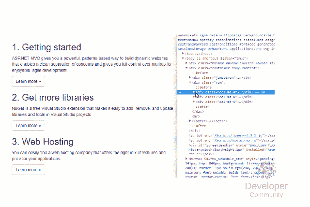
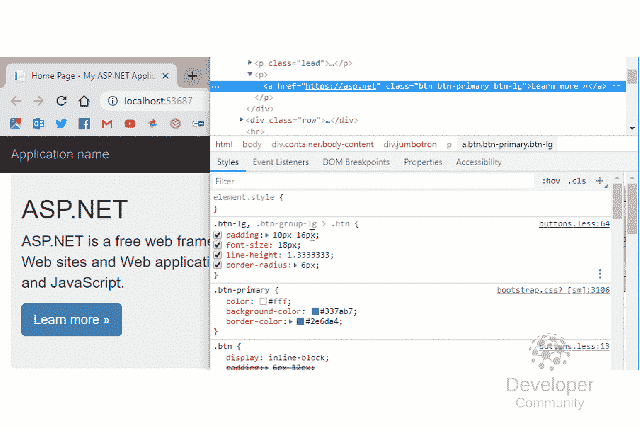

# Chrome 开发者工具——你需要知道的简单网络调试

> 原文：<https://dev.to/dirkstrauss/chrome-developer-tools--easy-web-debugging-you-need-to-know-30na>

Chrome 开发者工具——作为一名网络开发者，Chrome 开发者工具是一个非常有价值的工具。这是一套功能丰富的工具，你可以直接从你的浏览器中使用。在本文中，我将特别介绍四款 Chrome 开发工具。

## Chrome 开发者工具

创建 web 应用程序给开发人员带来了特殊的挑战。在 Visual Studio 中坚持纯 C#调试并不总是可能的，尤其是在创建响应性 UI 时。下面的项目使用编译成 [CSS](https://amzn.to/2SpB8kJ) 的 [SASS](https://amzn.to/2U9GJ0a) 。要打开 Chrome 开发者工具，你显然需要使用 Chrome 作为你的浏览器。右键单击网页上的任意位置(或元素上),并在上下文菜单中选择**检查**菜单选项。也可以按住 **Ctrl+Shift+I** 。如果你想继续的话，你可以从我的 GitHub 库下载代码。

### 找别的？请尝试以下链接:

*   [Chrome 开发工具——更高级的调试技巧](https://dirkstrauss.com/chrome-dev-tools-advanced-debugging-tips/)
*   [时髦的 CSS——这个令人敬畏的工具会让你时髦起来](https://dirkstrauss.com/sass-css-sassy-websites)
*   难以置信的强大多选功能。现在提高生产率
*   [Windows 任务管理器–解决高磁盘使用率问题](https://dirkstrauss.com/windows-task-manager/)
*   [调整 VirtualBox 磁盘大小不适用于快照](https://dirkstrauss.com/resizing-virtualbox-disks/)

## 1。拖放元素

您知道吗，您可以选择网页上的特定元素并拖动它们，以查看它们在您创建的网页上不同位置的外观？只需单击并按住该元素，然后将其拖至新位置。

如果您想稍微移动一下内容，而不必回到 Visual Studio 并在那里更改标记，这真的很棒。顺便提一下，如果您还没有看过 SASS 所提供的内容，[我鼓励您去看看](https://sass-lang.com/)。它真的改变了我的生活(我知道这听起来很怪)，现在[我无法想象没有 SASS 的工作。](https://dirkstrauss.com/sass-css-sassy-websites)

## 2。添加 CSS

另一个很好的技巧是在检查器中将 CSS 添加到元素中。Chrome Developer Tools 允许你选择你的元素并点击加号图标，让这变得非常简单。然后，可以将特定的 CSS 属性添加到元素中。

这使您能够感受到如果向元素中添加特定的 CSS 属性，元素会是什么样子。

## 3。添加类别

在我的项目中，我有一个名为 redButton 的新类。它所做的只是将背景颜色设置为红色。要查看一个元素在应用该类时是如何受到影响的，选择该元素并点击**。cls** 切换。当你输入的时候，类被找到，当你点击**回车**，类被应用。这将立即设置元素的样式。此外，您可以将鼠标悬停在添加到**样式**窗口中的类名上，按住 **Ctrl 键并单击**，然后转到包含您添加的类的文件。将鼠标悬停在标签上会显示文件在项目中的位置。

如果需要对类进行更改，可以使用此方法轻松找到包含文件。

## 4。触发状态

一件特别棘手的事情是模拟状态。Chrome 开发者工具允许你触发一个元素的状态。在这个例子中，我们触发了一个按钮的悬停状态。然后，我们可以根据需要更改 CSS，看看这些更改对悬停状态有什么影响(例如)。

您可以轻松地修改元素状态，而不必盲目地更改 CSS 并希望它被正确应用。

## 包装完毕

Chrome 开发工具为 web 开发人员提供了许多调试 UI 的选项。当您将这些工具相互结合使用时，您可以轻松地动态更改元素样式。

关于这个主题的更多信息，请查看我关于 Chrome 开发者工具的第二篇文章，这篇文章更加深入。

帖子 [Chrome 开发者工具——你需要知道的简单网络调试](https://dirkstrauss.com/chrome-developer-tools-easy-web-debugging/)首先出现在[编程和技术博客](https://dirkstrauss.com)上。