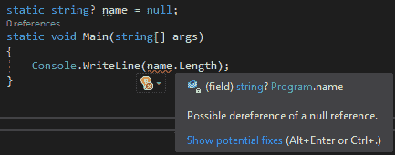

# 。NET Core 3.0 预览版 w/ C# 8.0 可空引用类型

> 原文：<https://dev.to/jeikabu/net-core-30-preview-w-c-80-nullable-reference-types-5e53>

今天早上醒来，看到了[。网芯 3.0 预览版公告](https://blogs.msdn.microsoft.com/dotnet/2018/12/04/announcing-net-core-3-preview-1-and-open-sourcing-windows-desktop-frameworks/)。

可从 [github 版本](https://github.com/dotnet/core/blob/master/release-notes/3.0/preview/3.0.0-preview1.md)下载。

## C# 8.0

运行`dotnet --list-sdks` :

```
1.1.11 [/usr/local/share/dotnet/sdk]
2.0.0 [/usr/local/share/dotnet/sdk]
2.1.4 [/usr/local/share/dotnet/sdk]
2.1.301 [/usr/local/share/dotnet/sdk]
2.1.302 [/usr/local/share/dotnet/sdk]
3.0.100-preview-009812 [/usr/local/share/dotnet/sdk] 
```

Enter fullscreen mode Exit fullscreen mode

要使用 C# 8，在项目文件中:

```
<PropertyGroup>
    <LangVersion>8.0</LangVersion>
</PropertyGroup> 
```

Enter fullscreen mode Exit fullscreen mode

`dotnet build` :

```
/usr/local/share/dotnet/sdk/3.0.100-preview-009812/Sdks/Microsoft.NET.Sdk/targets/Microsoft.PackageDependencyResolution.targets(220,5): error MSB4018: The "ResolvePackageAssets" task failed unexpectedly. [/XXX/zxy/tests/tests.csproj]
/usr/local/share/dotnet/sdk/3.0.100-preview-009812/Sdks/Microsoft.NET.Sdk/targets/Microsoft.PackageDependencyResolution.targets(220,5): error MSB4018: System.IO.InvalidDataException: Found invalid data while decoding. [/XXX/zxy/tests/tests.csproj] 
```

Enter fullscreen mode Exit fullscreen mode

`dotnet clean`接着是另一个`dotnet build`修复了这个。

到目前为止，一切似乎都很好。

## 可空引用类型

我最感兴趣的特性是[“可空引用类型”](https://blogs.msdn.microsoft.com/dotnet/2017/11/15/nullable-reference-types-in-csharp/)，这是一种编译时检查以避免在运行时解引用`null`。我一直在使用[可空引用类型预览](https://github.com/dotnet/csharplang/wiki/Nullable-Reference-Types-Preview)，想法是编译器生成警告，你可以选择忽略它们( *tsk tsk* )或者将它们变成错误:

```
<PropertyGroup>
    <MSBuildTreatWarningsAsErrors>true</MSBuildTreatWarningsAsErrors>
    <TreatWarningsAsErrors>true</TreatWarningsAsErrors>
</PropertyGroup> 
```

Enter fullscreen mode Exit fullscreen mode

在第一个预览中，警告是默认开启的，但是根据那个维基，你现在需要在每个项目中选择加入`[module: System.Runtime.CompilerServices.NonNullTypes]`。添加到项目中失败:

```
Program.cs(8,10): error CS8636: Explicit application of 'System.Runtime.CompilerServices.NonNullTypesAttribute' is not allowed. [/XXX/zxy/zxy0/zxy0.csproj] 
```

Enter fullscreen mode Exit fullscreen mode

打开那个程序集，它甚至不包含`NonNullTypesAttribute`。幸运的是，开源拯救了我们，因为[本期](https://github.com/dotnet/roslyn/issues/30583)展示了变化:

```
#nullable enable
namespace Test
{
    class Program
    {
        static void Main(string[] args)
        {
            string test = null; // line 8
            System.Console.WriteLine(test.Length);
        }
    }
} 
```

Enter fullscreen mode Exit fullscreen mode

`dotnet build` :

```
Program.cs(10,27): error CS8600: Converting null literal or possible null value to non-nullable type. [/XXX/junk/junk.csproj]
Program.cs(11,31): error CS8602: Possible dereference of a null reference. [/XXX/junk/junk.csproj] 
```

Enter fullscreen mode Exit fullscreen mode

没有将`null`赋给不应该为空的类型。很好。将第 8 行改为:

```
string? test = null; 
```

Enter fullscreen mode Exit fullscreen mode

并且仍然失败:

```
Program.cs(9,38): error CS8602: Possible dereference of a null reference. [/Users/jake/projects/junk/junk.csproj] 
```

Enter fullscreen mode Exit fullscreen mode

`string?`可能为空，但是添加一个检查，它会编译:

```
string? test = null;
if (test != null)
    System.Console.WriteLine(test.Length); 
```

Enter fullscreen mode Exit fullscreen mode

不幸的是，这是一个编译器启发式/lint，而不是 F#中的`option`、Rust 等类型系统提供的保证。编译器不会让这个失败:

```
static string test = null;
static void Main(string[] args)
{
    System.Console.WriteLine(test.Length);
} 
```

Enter fullscreen mode Exit fullscreen mode

希望他们会继续改进。

## Visual Studio

要在 VS 中尝试这一点，你需要 [Visual Studio 2019 预览版](https://docs.microsoft.com/en-us/visualstudio/releases/2019/release-notes-preview)。

右键单击一个项目并选择**属性>构建**，然后:

*   在*将警告视为错误*中，选择**全部**
*   点击**高级…** ，对于*语言版本*，选择 **C# 8.0 (beta)** 。

[](https://res.cloudinary.com/practicaldev/image/fetch/s--wsQKE9uD--/c_limit%2Cf_auto%2Cfl_progressive%2Cq_auto%2Cw_880/https://rendered-obsolete.github.io/assets/vs_csharp_null_warning.png)