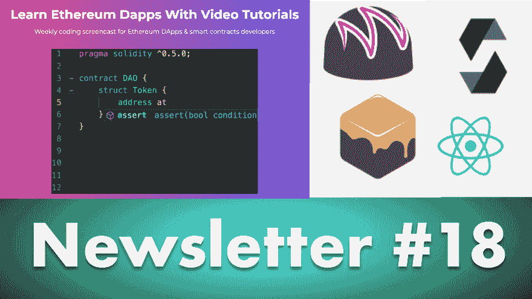

# 以太坊 Dapp 开发的新截屏——eatteblocks 新闻简报#18

> 原文：<https://dev.to/jklepatch/new-screencast-for-ethereum-dapp-development--eattheblocks-newsletter-18-24pe>

以太坊 Dapps 和智能合同的新截屏，散列时间锁定合同标准...

*   [视频](https://youtu.be/i_GHI7nN-t0)
*   [发帖](https://eattheblocks.com/eattheblocks-newsletter-18-new-screencast-for-ethereum-dapps-smart-contracts-htlc-contract-standard)

每周我都会为以太坊 Dapp 开发者发送 10 个最有趣的教程、技巧和新闻:Solidity、Truffle、Web3、以太坊协议&令牌标准。在[https://eattheblocks.com](https://eattheblocks.com)上注册时事通讯，不要错过任何一集！