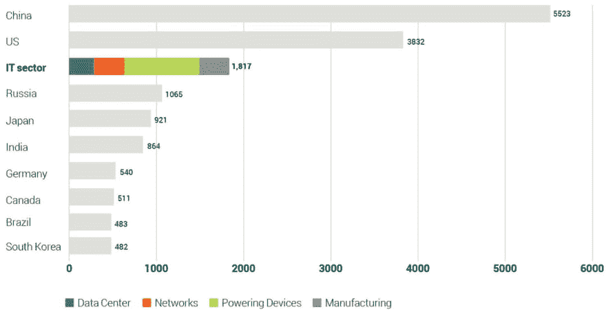
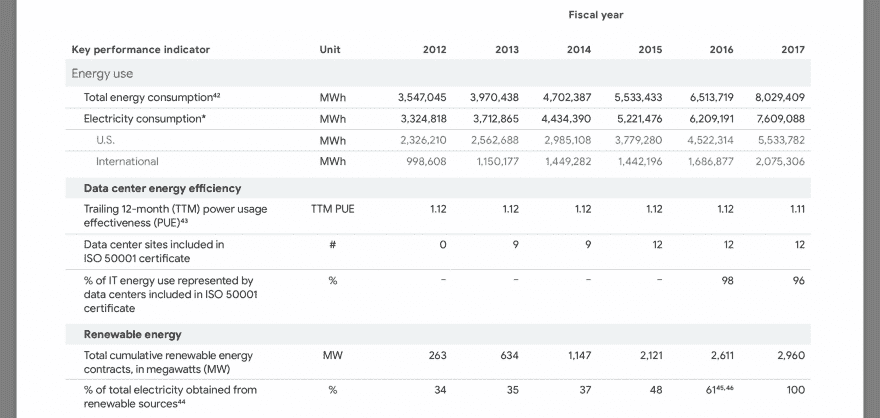
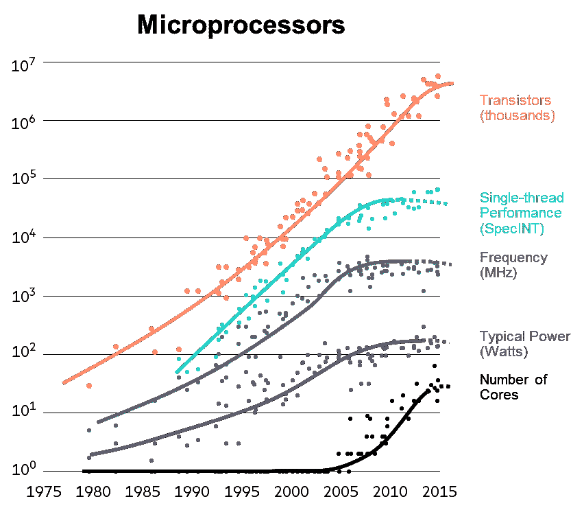
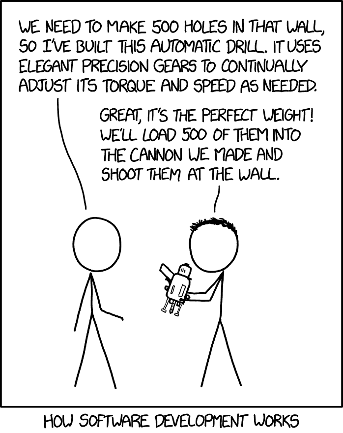

# 用更好的软件对抗气候变化

> 原文：<https://dev.to/vsaw/fight-climate-change-with-better-software-157k>

这里有谁在编程的时候会想到**被不良软件**浪费的能量？我在过去的几天里做了，以下是我的发现:

# 软件和能源

软件和能源之间的联系不容易被发现，只有少数公司如 https://www.getflyweight.com/直接瞄准它，然而它确实存在。例如:单个[谷歌搜索向大气中释放 0.2g 二氧化碳](https://googleblog.blogspot.co.uk/2009/01/powering-google-search.html)。足够给一个灯泡供电 16 秒。

如果全球信息和计算机技术是一个国家，只有美国和中国会消耗更多的能源。耶鲁甚至称他们为能源猪。

《卫报》报道称，到 2025 年，信息通信技术将使用全球 20%的电力，释放的二氧化碳将超过航运和航空。

# 改善硬件很难

为了应对这一趋势，数据中心提高了他们的[电力使用效率](https://en.wikipedia.org/wiki/Power_usage_effectiveness)。过去，PUE 从 2-3 倍下降到 1.1 倍，1.0 是可能的最佳值。

尽管如此，能源消耗仍在上升。在过去的 5 年里，谷歌的耗电量几乎翻了一番

类似地，传统的 CPU 被限制在摩尔定律的极限之内，只留下很小的改进空间

# 停止软件浪费

然而，软件从未如此浪费。正如[http://tonsky.me/blog/disenchantment/](http://tonsky.me/blog/disenchantment/)和 [XKCD](https://xkcd.com/2021/) 所指出的。

用软件节能就像确保你的代码编译正确一样简单。在一项比较重新编译 SQLite 和下载二进制文件的实验中，**能耗减少了一半**，**性能提高了 13%** 。

所以，打击软件浪费！通过节约 IT 能源来优化性能、削减成本和做好事。了解轻量级协议和库，建立代码训练营，将性能作为开发目标，并定期进行分析。如果你想了解更多，请联系我或访问 https://www.getflyweight.com/