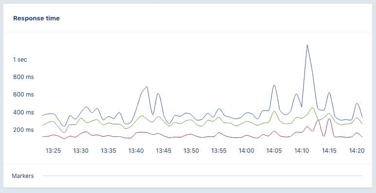

# 不要吝啬:统计平均值和百分位数 101

> 原文：<https://dev.to/appsignal/dont-be-mean-statistical-means-and-percentiles-101-1gnj>

性能监控是成功运行应用程序的重要组成部分。判断某件事的性能的最基本方法之一是测量它每次发生的持续时间，并从中提取统计数据。

## 意思是

一组值的平均值是一个很好的起点，可以用来观察事物的好坏。它的计算方法是将所有考虑的值相加，然后除以出现的次数。

在 Ruby 中，计算平均响应时间应该是这样的:

```
def mean(array)
 (array.sum.to_f / array.length).round(2)
end

durations = [1,2,3,4,5,6,7,8,9,0]
mean(durations) #=> 4.5 
```

**注意**:在这个例子中，为了在除法运算时得到更精确的结果，我们将总持续时间值转换为一个浮点数。否则，Ruby 会向下舍入到最接近的整数，返回`4`。

## 中位数

另一个有用的统计数据是中位数。虽然听起来很相似，但是一组值的平均值和中值是有区别的。

中位数是将集合的上半部分与下半部分分开的值。

对于具有奇数个值的数据集，通过首先对值进行排序，然后选择中间的数字来获得中值。对于具有偶数个值的集合，在对它们进行排序后，中位数将是两个中间数的平均值。

```
def median(array)
  sorted_array = array.sort
  length = sorted_array.length

  if length.odd? # Middle number for odd arrays
    sorted_array[length / 2]
  else # Mean of two middle numbers
    first_value = sorted_array[length / 2]
    second_value = sorted_array[length / 2 - 1]
    (first_value + second_value) / 2.to_f
  end
end

# Even array
durations = [1,2,3,4,5,6,7,8,9,0]
median(durations) #=> 4.5

# Odd array
durations = [1,1,2,3,4,5,6,7,8,9,0]
median(durations) #=> 4 
```

这个统计数据是一个很好的方法，可以看出数据中是否存在巨大的偏差或长尾。

```
durations = [1,2,3,4,5,2000]

median(durations) #=> 3.5
mean(durations) #=> 335.83 
```

由于 2000 毫秒的单个异常值，上述持续时间的平均值为`335.83`。只有`3.5`的中值表示有偏斜。

通过计算数据集的平均值和中值，您可以找出是否有大的异常值或长尾。

# 问题的意思是

虽然平均值和中值是很好的绩效指标，但它们并不能说明全部情况。如果你请求一个网页十次，平均值可能很低，但是一次或多次请求仍然需要很长时间才能完成。

下图显示了 AppSignal 中某个操作的第 99(蓝色)和第 90(绿色)百分位数以及平均值(红色)。你可以看到第 99 和第 90 个离平均值很远，有一些尖峰。这意味着，虽然普通用户有很好的体验，但偶尔也会有用户需要等待几乎两倍的时间来呈现页面。理想情况下，您会希望所有这些值尽可能接近，为所有用户创造更一致的体验。

[](https://res.cloudinary.com/practicaldev/image/fetch/s--eTKMeX_g--/c_limit%2Cf_auto%2Cfl_progressive%2Cq_auto%2Cw_880/https://blog.appsignal.cimg/blog/2018-10/statistics-graphs.png)

例如，给定以下持续时间集合，其中 10 个客户请求持续时间在 100 毫秒和 1 秒之间的页面。

```
[100,100,100,100,100,100,100,100,100,1_000] 
```

这将导致平均值仅为`190ms`，而一个用户有 1 秒响应时间的非常糟糕的体验。当只跟踪平均值时，更容易认为你的网站有很好的性能，而实际上用户偶尔会有糟糕的体验。

上面的例子只针对 10 个请求，但是想象一下，如果你每天有 1000 个请求，那就意味着其中 100 个用户有糟糕的体验。

## 百分位数

为了更好地了解值的分布，我们使用百分位数。百分位数类似于中位数-一个数字，表示数据集中的一个点，其中一半低于该数字，另一半高于该数字。百分位数在某种意义上是相似的，第 20 个百分位数意味着数据集中 20%的数字低于该数字。

给定以下(已排序)集合:

```
[100,100,200,200,300,300,400,400,500,5_000] 
```

如果我们想知道第 20 个百分位数，我们可以用下面的方法来计算:集合中有 10 个值。当我们的数组从零开始时，想要的值在位置 1 ( `20.0 / 100 * 10 - 1`)。由于这个数组包含偶数个项目，我们必须计算 index ( `2`)和 index + 1 ( `3`)之间的平均值。这将导致第 20 百分位的值为`150`。

一个非常简单的 Ruby 实现应该是这样的:

```
def percentile(array, wanted_percentile)
  sorted_array = array.sort

  index = (wanted_percentile.to_f / 100) * sorted_array.length - 1

  # Check if index is not a round number
  if index != index.to_i
    sorted_array.at(index.ceil)
  elsif sorted_array.length.even?
    first_value = sorted_array.at(index)
    second_value = sorted_array.at(index + 1)
    (first_value + second_value) / 2
  else
    sorted_array.at(index)
  end
end

# An array with an odd amount of numbers
durations = [100,200,200,300,300,400,400,500,5_000]

percentile(durations, 20) #=> 100
percentile(durations, 90) #=> 500
percentile(durations, 95) #=> 5000, index is a fraction, 9.5 the rounded index is 10

# An array with an even amount of numbers
durations = [100,100,200,200,300,300,400,400,500,5_000]

percentile(durations, 20) #=> 150, average of index 1 & 2 `(100 + 200) / 2`
percentile(durations, 90) #=> 2750, average of index 8 & 9 `(500 + 5000) / 2
percentile(durations, 95) #=> 500, index is a fraction, 8.55 the index is 9 
```

这个`percentile`函数看起来与我们的`median`计算非常相似，事实上，`median`与`50th`百分位数相同。

```
durations = [1,2,3]

percentile(durations, 50) == median(durations) #=> true 
```

[AppSignal](https://appsignal.com) 使用上面的统计数据为您的应用程序生成性能指标。我们不仅仅依靠平均值，还计算第 90 和第 95 个百分位数来显示异常值，从而更好地了解您的请求分布情况。在[我们的表演之旅页面](https://appsignal.com/tour/performance)了解更多信息。

## 怪事

由于计算百分位数和平均值的方式，有时可能会出现第 90 个百分位数低于平均值的情况，例如，给定以下数据集:

```
durations = [1,1,1,1,1,1,1,1,1,1,2000]

percentile(durations, 90) #=> 1
mean(durations) #=> 182.73 
```

这将给我们一个`182.73`的`mean`，和一个第 90 百分位的`1`。

如果您的指标收集系统只显示了第 90 个百分位数和平均值，那么如果第 90 个百分位数低于平均值，您仍然可以推断出您的数据集中存在巨大的异常值。

## 你几乎 100%完成了这篇文章

暂时就这样吧！在另一篇文章中，我们将讨论如何使用分位数有效地存储和计算所有客户请求的百分位数。如果您对统计和 APMs、错误
跟踪或性能监控有任何问题或意见，请通过 Twitter [@AppSignal](https://twitter.com/appsignal) 或通过[电子邮件](//mailto:support@appsignal.com)联系我们。