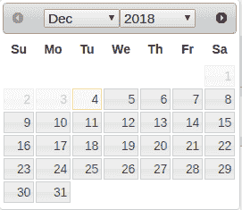

# 啊！我需要一个日期/时间部件

> 原文：<https://dev.to/pbeekums/argh-i-need-a-datetime-widget-5p6>

我最近发现需要一个使用自然语言处理的日期/时间解析器。Maleega 的日期选择器非常简单，需要更换。我保留了它的框架，因为我需要时间来弄清楚如何构建一个好的日期/时间选择器。我用过的每一个都感觉很笨重。这可能是因为日期和时间的固有挑战。

时间有很多我们没有想到的复杂性，因为我们很小的时候就已经学会谈论时间了。感觉很简单，因为谈论它对我们来说很自然。我们交换我们谈论时间的上下文，好像它什么都不是。有时我们会谈论日期，如**“3 月 23 日下午 5:45”**。有时我们会用一些关系词，比如**【上周】**或者**【下周四】**。

这在 GUI 中很难表达。大多数只是显示一个日历和一个时间选择器，它只处理一种思考时间的方式。有些人一直在尝试像“明天”这样的自然语言快捷方式，但这些快捷方式有太多的排列组合。下拉列表要么变得非常大，要么用户不太可能看到他们想要的选项。

这让我想起了我读过的一本书，书中提到了[莲花议程](https://en.wikipedia.org/wiki/Lotus_Agenda)。该软件建于 80 年代，所以大部分是基于文本的。我没有试过，因为它只能在 DOS 下运行(我没有足够的动力去尝试)，但它似乎可以使用用户输入的文本来处理日期/时间输入。

虽然我知道我对文本界面有程序员的偏见，但这似乎是处理日期/时间小部件的正确方法。允许用户输入任何文本是处理我们习惯于思考的各种时间环境的最通用的方式。诚然，自然语言处理至少是具有挑战性的，但是仍然可以提供一个 GUI 部件来显示用户系统认为他们试图传达的时间。

现在到了困难的部分:弄清楚如何将任意用户文本处理成日期和时间。

我对所有事物的第一倾向是**“我能建造它！”**

谢天谢地，实际上我在开始之前就已经考虑过这个问题了。构建这样的东西可能需要几周或几个月的时间，尤其是因为我以前从未做过 NLP 编程。虽然我想在产品中加入这个特性，但它并不是产品的核心部分。我又不是在卖日期/时间服务。这听起来也是一个很常见的问题，一定有现成的解决方案。

我发现了四种乍看起来很有希望的方法:

*   虽然它已经很多年没有更新了，但是它大量使用了 ANTLR 项目，所以我想它在构建 NLP 引擎上花费了大量的开发时间。
*   Maya -由构建请求库的同一个人编写。我喜欢请求库，所以这值得一试。
*   Sugar 已经存在了一段时间，他们有一个令人印象深刻的可以解析的日期字符串列表。尽管知道他们可能挑选了工作良好的例子，但它仍然是一个令人印象深刻的功能展示。
*   我不确定我为什么选择这个，但是我喜欢有第二个 javascript 选项的想法，这样我可以在前端运行解析。

对于我的列表，我需要测试它们的准确性。NLP 并不完全是一个已解决的问题。其他类型的编程库，如 HTTP 客户端，要么工作，要么不工作。从任意用户输入中解析日期/时间将会变得很难定义。

我制作了一个[电子表格](https://docs.google.com/spreadsheets/d/1Bx3q1yRU_kqAWhKHKqN_RUkD9VVerpNcbzai4kPclJ0/edit?usp=sharing)，其中包含了我想要查看结果的各种测试用例，然后针对这些测试用例运行每个库。结果非常有趣，因为不同的库会对同一文本提供各种各样的结果。

上下文使得 NLP 变得特别困难。比如**“4 月 25 日”**是什么意思？是上一个 4 月 25 号还是下一个 4 月 25 号？在没有指定年份的情况下，大多数库认为您总是指当前年份。Chrono 试图通过更接近的日期来变得更聪明一点(例如，我在【T11 月运行这些，因此**8 月**日期被解释为 **2018 年**，但**4 月**日期被解释为 **2019 年**)。对于 Maleega 中的提醒功能，我将总是希望未来的日期。

接下来的问题是如何处理库无法解析的文本。对于**【一周的最后一天】****【当月的最后一天】**，Chrono 和 Natty 都只理解了**【最后一天】**，就好像你昨天想要**。**

 **克罗诺将**“两周后”**解释为仅仅是**“现在”**。

**“明年第二个月”**看起来就像是刚被 3 个图书馆解读为**“明年”**。

如果图书馆希望得到完整的句子或段落，这种行为可能是有意义的。如果你传入的文本仅仅是为了日期，那就有问题了，因为这会导致很多不正确的日期。

然后是处理模糊的时间陈述，如**“明天 9 点”**。在没有限定符的情况下，Natty 和 Chrono 都假定**上午 9 点**，这很好。在 2001 年的**T5，Sugar 似乎在提供日期方面失败了。它需要一个 am/pm 时间限定符。**

纳蒂也有一些非常奇怪的行为，它能理解**“1 月 9 日上午 8:35”**，但不能理解**“8 月 21 日上午 5:45”**。它还可以理解**“4 月 25 日下午 5:45”**，因此在某些格式中，它需要在时间和 am/pm 之间留一个空格，但在其他格式中不需要。

总体而言，Maya 的错误答案最少，但它的总体答案也最少。它还需要几秒钟来处理无法生成答案的文本。这使得 Maya 对 Maleega 不可用，因为这对于用户反馈来说是太长的延迟。

Chrono 的误差最大，但它确实捕捉到了 Sugar 漏掉的一些误差。Natty 在各方面都比 Chrono 好，但 Natty 必须在服务器上运行。Natty 和 Sugar 还通过捕捉对方的错误答案来很好地互补。

虽然这些库每个都有相当大的差距，但是当它们组合在一起时会提供相当好的结果。这导致考虑一种利用所有 3 个库的方法。

Sugar 和 Chrono 都是极速，可以在前端运行。这使得对每一个文本输入都运行这两个程序变得很容易。在他们同意时间的情况下，通常是正确的。我可以把它显示给用户。

分歧是事情变得有趣的地方。我可以向一个将从 Natty 返回结果的端点发出请求，但是我该怎么做呢？有这样的情况，3 个库中有 2 个是错误的(并且有相同的错误答案)，所以简单的投票算法是行不通的。我也不能真正使用 NLP 来确定准确性，因为这样做的目的是避免自己构建 NLP 库。

我可以试着插入一些硬编码的检查，比如如果文本中有**【最后一天】**，信任 Sugar。这有创建一些非常混乱的代码的风险，因为我可能需要创建很多这样的代码。

在我的案例中，如果糖是错的，那就大错特错了(例如 2001 年的日期)。这可能会有用。在大多数情况下，我可以依赖于糖，但当糖提供超过 2 年的日期或当它不能提供日期时，使用 Natty。这将消除使用秒表计时的需要。

我还在想很多事情。显然，我可以测试更多的日期/时间格式。这可以帮助我在库之间的结果中找到更多的模式，我可以用它们来确定哪一个是正确的。我也可以尝试找到更多的库来测试。我选择这些是因为它们看起来足够受欢迎，而且安装时间不到 5 分钟(我喜欢简单安装)。如果你有任何反馈或建议，我洗耳恭听！**