# sass CSS——这个令人敬畏的扩展会让你变得很时髦

> 原文：<https://dev.to/dirkstrauss/sass-css--this-awesome-extension-will-make-you-sassy-35m0>

Sass CSS——如果你开发 web 应用程序，并且你还没有听说过 Sass ，那么今天是你的幸运日。引用 Sass 网站的一句话，它是世界上最成熟、最稳定、最强大的专业级 CSS 扩展语言。

## 萨斯 CSS

如果你曾经使用过 CSS，你会喜欢上 Sass 的。它是一种功能丰富的 CSS 扩展语言。Sass CSS 也完全兼容所有 CSS 版本。多年来，它得到了积极的支持，可以肯定地说，它已被广泛采用。Sass 将做的是使您能够使用 Sass 编写 CSS，并在保存时将其编译成 CSS。你也可以创建一个缩小的 CSS 文件。

### 找别的？请尝试以下链接:

*   [使用简单技术的酷生活技巧](https://dirkstrauss.com/cool-life-hacks-using-simple-technology/)
*   [电子邮件自动化微软流程——自动化 Outlook.com](https://dirkstrauss.com/email-automation-microsoft-flow-automate-outlook/)
*   [使用 DevOps 和 Wunderlist 实现 Trello 自动化](https://dirkstrauss.com/automate-trello-using-devops-wunderlist/)

## 添加到 Visual Studio

如果您正在 Visual Studio 中创建 web 应用程序，您需要执行以下操作来将 Sass CSS 添加到项目中。下面你会看到我有一个普通的 MVC web 应用程序。我要添加 Sass CSS 到这个项目中。

[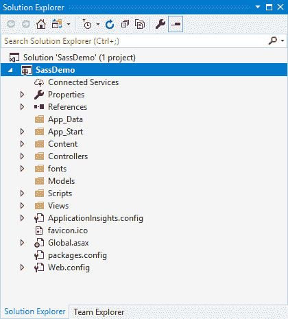](https://res.cloudinary.com/practicaldev/image/fetch/s--3bi9wtGQ--/c_limit%2Cf_auto%2Cfl_progressive%2Cq_auto%2Cw_880/https://i2.wp.com/dirkstrauss.com/wp-content/uploads/2018/12/sass-css-demo-project.png%3Fresize%3D420%252C465%26ssl%3D1)

在您的项目中创建一个名为 **scss** 的文件夹。这是您要添加所有 scss 文件的地方。

[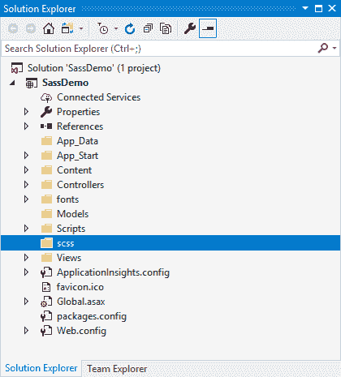](https://res.cloudinary.com/practicaldev/image/fetch/s--HenHc5yt--/c_limit%2Cf_auto%2Cfl_progressive%2Cq_auto%2Cw_880/https://i1.wp.com/dirkstrauss.com/wp-content/uploads/2018/12/sass-css-add-scss-folder.png%3Fresize%3D420%252C465%26ssl%3D1)

右键单击文件夹并添加新项目。您可能还会看到 **SCSS 样式表(SASS)** 作为上下文菜单中的一个选项。

[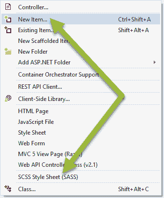](https://res.cloudinary.com/practicaldev/image/fetch/s--k4jyvJPp--/c_limit%2Cf_auto%2Cfl_progressive%2Cq_auto%2Cw_880/https://i2.wp.com/dirkstrauss.com/wp-content/uploads/2018/12/sass-css-add-scss-file.png%3Fresize%3D336%252C406%26ssl%3D1)

添加 scss 文件，并将其命名为 **custom.scss** 。您可以将它命名为您喜欢的任何名称，只是在查看本文中的示例时，一定要贯彻这一点。

[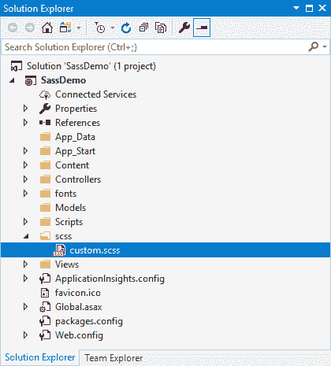](https://res.cloudinary.com/practicaldev/image/fetch/s--rl7s4S7I--/c_limit%2Cf_auto%2Cfl_progressive%2Cq_auto%2Cw_880/https://i2.wp.com/dirkstrauss.com/wp-content/uploads/2018/12/sass-css-file-added.png%3Fresize%3D420%252C465%26ssl%3D1)

## 添加 Web 编译器

我们需要能够将 Sass CSS 文件编译成 CSS 文件。为此，在 Visual Studio 的**工具**菜单中点击**扩展和更新**。搜索由 Mads Kristensen 创建的**网络编译器**并安装它。

[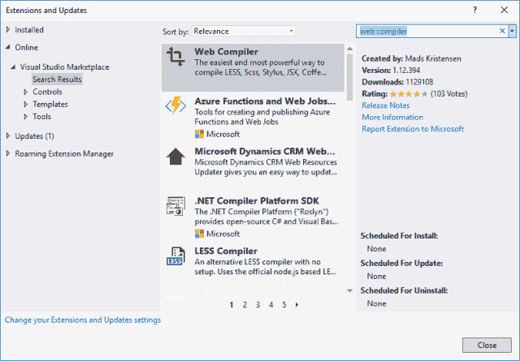](https://res.cloudinary.com/practicaldev/image/fetch/s--773UZoVs--/c_limit%2Cf_auto%2Cfl_progressive%2Cq_auto%2Cw_880/https://i1.wp.com/dirkstrauss.com/wp-content/uploads/2018/12/sass-css-add-web-compiler.png%3Fresize%3D640%252C445%26ssl%3D1)

你现在可以通过右击它并选择 **Web 编译器**然后点击**编译文件**来编译 Sass CSS 文件。

你会看到编译器创建了一个 **compilerconfig.json** 文件以及一个 **custom.css** 和 **custom.min.css** 文件。这很好，但是我不想让我的 CSS 文件输出到与我的 Sass CSS 文件相同的位置。让我们改变这种行为。

[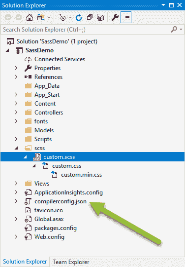](https://res.cloudinary.com/practicaldev/image/fetch/s--oy7Rv015--/c_limit%2Cf_auto%2Cfl_progressive%2Cq_auto%2Cw_880/https://i0.wp.com/dirkstrauss.com/wp-content/uploads/2018/12/sass-css-locate-compiler-config-file.png%3Fresize%3D376%252C541%26ssl%3D1)

## 改变 CSS 文件的输出位置

打开 **compilerconfig.json** 文件。您会注意到它包含了文件的输入位置和输出位置。

[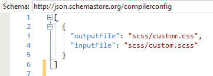](https://res.cloudinary.com/practicaldev/image/fetch/s--rQe76-MA--/c_limit%2Cf_auto%2Cfl_progressive%2Cq_auto%2Cw_880/https://i1.wp.com/dirkstrauss.com/wp-content/uploads/2018/12/sass-css-compiler-config-file-before-edit.png%3Fresize%3D361%252C129%26ssl%3D1)

修改内容文件夹的**输出文件**路径。出于本文的目的，我将坚持使用 Content 文件夹，但是您可以将路径更改为存储 web 应用程序的 CSS 文件的任何位置。您也可以随意命名您的输出 CSS 文件。我刚刚保留了我的 **custom.css** 。

当您保存您的 **compilerconfig.json** 文件时，您会注意到 Web 编译器再次进行构建，CSS 文件输出到您指定的路径。您还会注意到，Web 编译器也为您创建了缩小的 CSS 文件。现在，您可以删除先前在 Sass CSS 文件夹中创建的 CSS 文件。

[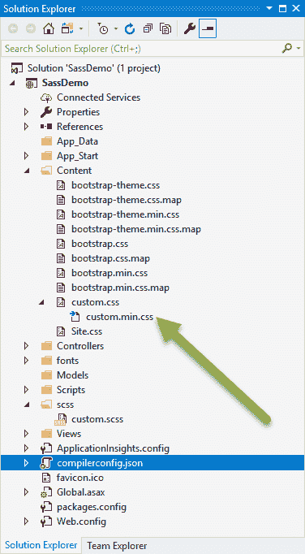](https://res.cloudinary.com/practicaldev/image/fetch/s--giRLnJmI--/c_limit%2Cf_auto%2Cfl_progressive%2Cq_auto%2Cw_880/https://i2.wp.com/dirkstrauss.com/wp-content/uploads/2018/12/sass-css-custom-css-output.png%3Fresize%3D376%252C682%26ssl%3D1)

## 使用 Sass CSS 文件

打开 **custom.scss** 文件并删除内容。添加一个名为**的新类。红色按钮**，设置背景颜色为红色。

[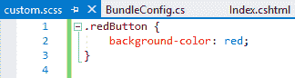](https://res.cloudinary.com/practicaldev/image/fetch/s--vw3oNeim--/c_limit%2Cf_auto%2Cfl_progressive%2Cq_auto%2Cw_880/https://i0.wp.com/dirkstrauss.com/wp-content/uploads/2018/12/sass-css-edit-custom-scss-file.png%3Fresize%3D324%252C86%26ssl%3D1)

接下来，转到您的 **Index.cshtml** 视图，并将 **redButton** 类添加到页面的一个元素中。我将该类添加到页面上的一个按钮中。

[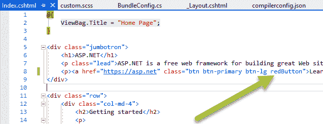](https://res.cloudinary.com/practicaldev/image/fetch/s--lZNUgqIf--/c_limit%2Cf_auto%2Cfl_progressive%2Cq_auto%2Cw_880/https://i0.wp.com/dirkstrauss.com/wp-content/uploads/2018/12/sass-css-edit-index-view.png%3Fresize%3D637%252C245%26ssl%3D1)

转回 **App_Start** 文件夹，找到 **BundleConfig.cs** 文件。将 **custom.css** 文件添加到 **StyleBundle** 类。

[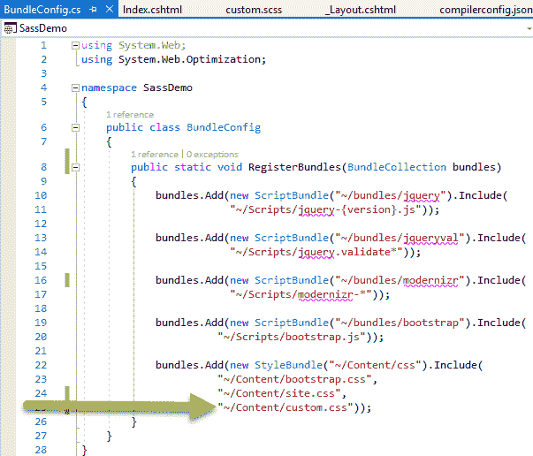](https://res.cloudinary.com/practicaldev/image/fetch/s--GNZpVjLs--/c_limit%2Cf_auto%2Cfl_progressive%2Cq_auto%2Cw_880/https://i0.wp.com/dirkstrauss.com/wp-content/uploads/2018/12/sass-css-edit-bundleconfig-file.png%3Fresize%3D603%252C516%26ssl%3D1)

构建并运行您的 Web 应用程序。你会看到熟悉的大屏幕按钮是红色的，而不是默认的蓝色。

[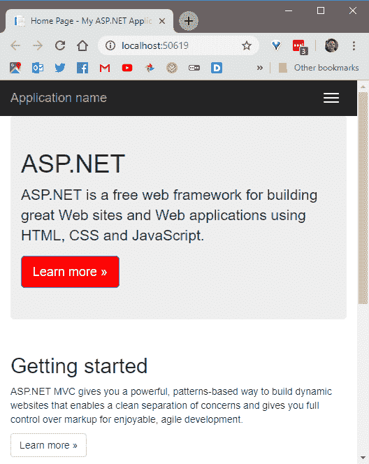](https://res.cloudinary.com/practicaldev/image/fetch/s--UIt2slbS--/c_limit%2Cf_auto%2Cfl_progressive%2Cq_auto%2Cw_880/https://i0.wp.com/dirkstrauss.com/wp-content/uploads/2018/12/sass-css-run-project.png%3Fresize%3D528%252C664%26ssl%3D1)

## 包装完毕

Sass CSS 是为您的 web 应用程序创建自定义 CSS 样式的绝佳方式。还有很多东西要给你看，所以留下来吧。未来几周将会有更多关于 Sass CSS 的文章。

帖子[Sass CSS——这个令人敬畏的扩展会让你变得无礼](https://dirkstrauss.com/sass-css-sassy-websites/)首先出现在[编程和技术博客](https://dirkstrauss.com)上。