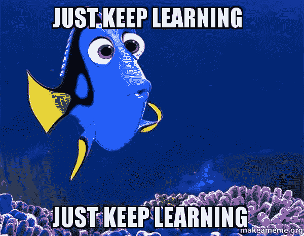
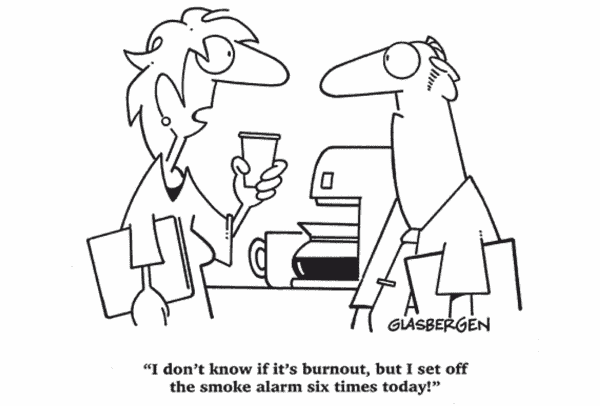

# 不断学习，该不该投入自己的时间？

> 原文：<https://dev.to/jhotterbeekx/keep-learning-should-you-invest-your-own-time-22l>

每次冲刺，我们的团队都会花一些时间一起学习，今天我们看了深受大家喜爱的“[Bob](https://sites.google.com/site/unclebobconsultingllc/)叔叔”的视频。这次我们看了一集关于生产力的节目。这是一个很好的插曲，但在他和他的狗做奇怪的事情和他描绘的许多奇怪的人物之间，有一段引起了我们所有人的注意。他谈到了学习，此刻我听到他大声说:“在你的工作之外，你应该每周花 15-20 个小时学习，这是你欠雇主的。”我注意到每个人看起来都像刚见了鬼一样。你应该怎么做？！？

鲍勃大叔的学习愿景
我已经有一段时间没看《干净的编码者》了，这个视频系列就属于它。致力于成为专业软件工程师的系列。虽然相当简短，但他对学习的立场非常明确:

*   每周花 15-20 个小时在你的事业上
*   每年至少学习一门新语言
*   你至少要把设计模式，设计原则，方法，纪律，神器背下来。
*   你应该跟上潮流和运动，同时也了解和学习过去

他有一些很好的理由这样想，我认为他书中的一句话很好地总结了这一点。

> 我们行业疯狂的变化速度意味着软件开发人员必须继续学习大量的知识才能跟上。停止编码的架构师们将会感到悲哀——他们会很快发现自己变得无关紧要。那些停止学习新语言的程序员有祸了——他们将眼睁睁地看着行业与他们擦肩而过。那些未能学习新的学科和技术的开发人员是不幸的——他们的同行会在他们衰落的时候出类拔萃。
> 
> 你会去看一个不了解最新医学杂志的医生吗？你会雇佣一个不了解最新税法和判例的税务律师吗？雇主为什么要雇佣不保持最新的开发人员？

他对职业的看法也很明确。

> 也许你不想做出这样的承诺。这很好，但你不应该认为自己是专业人士。专业人士花时间关心他们的职业。

他与律师和医生的比较
有一段时间我一直在说，我们的行业不像其他行业，认为其他工作需要这么多知识是愚蠢的。然后我看到了他的例子，医生。嗯，我确实希望我的医生能跟上潮流。如果他能使用过去几年研究的新技术来诊断我，那就太好了。但在我心里，我一直怀疑他们需要投入多少时间来学习。所以我决定去问谷歌医生。虽然不如豪斯医生有趣，但它还是给了我一些好答案。一些快速调查告诉我，根据你居住的州的不同，你需要每年挣 20-60 个继续医学教育学分(T4)来保持你的执照，从而保持专业。有各种各样的项目给你这些学分，参加会议，某些会议，阅读期刊等。而[一个积分需要一个小时的时间](https://www.cdc.gov/cecredit/calculating-ce.html)。这意味着一个普通医生每年需要花在学习上的时间与 Bob 期望一个专业开发人员在 1-3 周内花费的时间相同。现在这种比较对我来说开始变得不那么重要了。一些医生可能真的很敬业，但即使增加 10 倍，也只是专业软件工程师的一半时间。

那他的税务律师呢？和医生一样，每个州都有一定的学分要求，大约是每年 20-40 学分。和医生一样，[一个学分需要一个小时的工作](https://www.cdc.gov/cecredit/calculating-ce.html)。一些专业税务律师或会计师每年需要花费的学习时间与 Bob 预计一名专业开发人员在 1-2 周内花费的时间相同。

这是两个工作，众所周知是高维护，高责任，但也是高回报的。他们需要大量的工作时间和大量的学习时间来保持你的执照。尽管与我们刚刚读到的对专业软件工程师的期望相比，它们似乎算不了什么。

虽然我确信鲍勃大叔的观点并不像我在这篇文章中使用的那样非黑即白，但这种说法存在一些危险。他的工作在业内非常有名，我们很多人会认为他是某种形式的大师。因此，当他说这样的话时，很多人会相信他。不管你是经验丰富的开发人员，还是仍在学习编码的人。我们很多人都有某种形式的不安全感，这对于一个人来说是完全自然的，在很多很多，你可能会说太多，关于'[冒名顶替综合征](https://dev.to/search?q=Imposter%20Syndrome)'的文章中被广泛谈论。我们这些已经有点不安全的人很容易读到这样的东西，并开始认为这只是每个软件工程师都应该做的事情。

小心点
那为什么会这么危险呢？我们非常希望他在书中声明这不是真的。我知道，很困惑吧？他在书中指出:

> 也许你认为这是一个倦怠的处方。相反，这是避免倦怠的良方。大概你成为一名软件开发人员是因为你对软件充满热情，而你想成为一名专业人员的愿望就是由这种热情所激发的。在这 20 个小时里，你应该做那些增强激情的事情。那 20 个小时应该很好玩！

所以，你是说这是一个烧尽的配方？是的，它是！但问题不在于你投入了多少小时，而在于你投入的原因。如果你对代码的热情只是流过你的血管，你活着并呼吸着去写它，这对你来说可能不是什么大问题。尽管你仍然应该意识到，因为即使做那么多你喜欢的事情也会让你精疲力尽，或者让你讨厌它。当你这样做的时候，会变得更加危险，因为你认为这是对你的期望。虽然他说学习应该是有趣的，但不会一直都是，不会有很多时间，学习不可能一直都是有趣的。即使很有趣，你不认为这会影响你的工作吗？如果做这件事真的很有趣，而且你在工作了一整天后才写了 4 个小时的代码，那么你会在基本上工作了 12 个小时后的第二天开始工作。周五累积到 60 小时。你不可能像工作 40 个小时时那样运转良好。即使时间没有让你疲惫不堪，当你在家工作的半天是如此有趣，而你不得不在接下来的 8 个小时里日复一日地做一些不那么有趣的事情，这最终会让你在工作中筋疲力尽。

**实际开发者是怎么想的？**
一些德高望重的人建议你花大量时间学习。除了鲍勃叔叔，我只能找到约翰·桑梅兹的相同观点，他们都以在事业上投入时间而闻名。而像安德鲁·亨特和戴维·托马斯这样的人确实描述了该做什么，但没有说明该投资多少时间。我最注意到的事情是，幸运的是，这些人似乎是例外，大多数作家似乎都避免建议投入具体的时间。当你开始寻找其他软件工程师的意见时，那正是你会发现的。很多观点，很多观点都是不同的。虽然大部分都不像上面那些那么极端。很多人认为你不需要在工作之外做任何编码，[这个帖子](https://softwareengineering.stackexchange.com/questions/114819/are-9-to-5-programmers-looked-down-upon)给出了一个很好的观点。而其他人认为你确实需要在工作之外花一些时间在这上面，正如在[这个帖子](https://softwareengineering.stackexchange.com/questions/177651/how-do-developers-find-the-time-to-stay-on-top-of-latest-technologies)中所讨论的。在这个问题上有很多帖子，显示了我们对这个问题的不安全感，但是我找不到同意每周工作 15-20 小时的人。大多数人的观点介于只是在工作中编码、学习应该在工作中进行、以及一周在家呆几个小时是必要的之间。

**我该怎么办？**
很棒的问题，很高兴你问了！简而言之:你想要什么都行！你应该试着弄清楚你觉得生活中什么是重要的，你想在生活中达到什么，并分配你的个人时间去做那些事情和达到那些目标。对我们大多数人来说，成为其他人比编码更重要。想想成为一个伙伴，一个父母，一个朋友，享受乐趣，旅游，志愿服务，或者任何其他你认为重要的事情。你可能不希望你临终时看到的最后一个景象是工厂模式被注入到你的解耦类中，对吗？编码，或者有一个伟大的职业生涯可能在某个地方的列表上，也可能不在。你想尽你所能成为一名最好的软件工程师，并把它作为你最重要的事情，而不是投资时间吗？只要你的业余时间和你的人生目标相匹配，就没有错！

