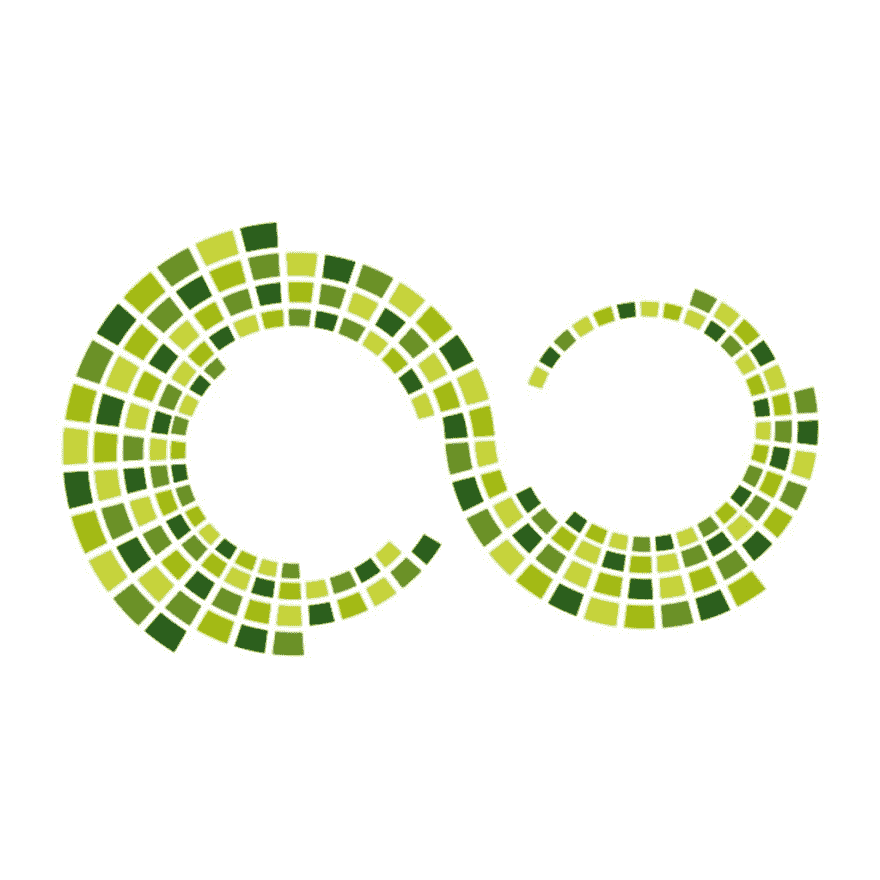

# 前端持续集成监控工具

> 原文：<https://dev.to/bnevilleoneill/tools-for-continuous-integration-monitoring-of-front-end-50n>

作为开发人员，您可以使用持续集成来极大地改进您的过程。您希望不断地发布您所做的小更改，并尽可能快地将它们提供给用户。您还需要监控每个部署，以确保一切正常。

持续集成(CI)是解决方案。有不同的工具可以让我们做到这一点，包括 Travis、Codeship、Jenkins 等等。这些工具使我们能够从头到尾管理我们的部署并监控整个流程。你所要做的就是推送到一个存储库，其他的事情就会迎刃而解。

### 为什么担心持续集成？

在过去的几年里，JavaScript 在应用程序开发方面的工作量不断增加。如果你拿起一本旧的网页设计书，你会看到类似“在表示层使用 JavaScript”的东西。目前这是完全错误的，因为 JavaScript 可以完成应用程序开发的全部 9 码。这意味着我们现在用 JavaScript 做的事情是至关重要的。

你的 CSS 也是如此。它几乎不仅仅是维护你的应用程序的外观，它还可以被积极地用于你的应用程序的工作方式(转换等等)。坏掉的 JavaScript 导致坏掉的应用。损坏的 CSS 会导致应用程序布局完全混乱。这对应用程序的性能或可用性有多大影响？用户体验呢？

记住这一点，您需要一种自动化的方式来处理应用程序新版本的发布。您希望确保您的依赖项能够工作，并且随时可用。随着应用程序的增长，手动管理变得越来越困难。我的意思是，在周二的晚上，你有多信任你疲惫的自己去验证你的网站的 100 多页工作正常，并且你的应用程序需要运行的所有软件包都已安装？

### 从构建流程开始:抛弃 npm，使用 yarn

CI 讨论的第一步，也可能是最容易被忽略的一步是构建过程。对许多人来说，这通常不是一个问题。一旦设置了应用程序，node_modules 文件夹就可以保存所有的依赖项，一切就绪。

然而，在每次构建中，很多时候您并没有摆脱旧的节点模块。您只需在新的应用程序中重用它们(您可能会侥幸成功)。

挑战在于，如果您的节点模块不是最新的，或者如果您安装了不在 package.json 中的模块，您的应用程序可能会在正常情况下应该中断的时候工作，以便您可以在项目中删除依赖项的使用。这是因为当您运行 npm install 时，它不会进行清理。它只是寻找新的东西并安装它。

纱线清理房子时，运行您的项目设置过程。Yarn 缓存所有的安装，不需要每次运行 yarn install 都下载它们。这是对 npm 的巨大胜利，它将总是重新安装一切。Yarn 检查并确认只安装了 package.json 文件中列出的依赖项。这使得每个 yarn 安装都会给你一个应用程序的副本，类似于第一次克隆你的应用程序的人会有的副本。

因此，在应用程序的构建过程中，用 yarn 替换 npm。

### 测试

如果您要使用持续集成和部署，自动化测试是很重要的。您希望确保您的应用程序在到达活动服务器之前按预期运行。您的部署过程可以设置为，如果所有测试用例都没有通过，部署将会失败。这将在生产中保护您的应用程序，并确保您不会有中断的服务。

这里有一些你可以考虑用于自动化测试的工具:

1.  摩卡
2.  玩笑
3.  柴
4.  茉莉
5.  因果报应
6.  量角器

你可以阅读[JavaScript 测试概述](https://medium.com/welldone-software/an-overview-of-javascript-testing-in-2018-f68950900bc3)了解更多

### 监控

这就是我们在这里的原因。监控您的应用程序部署非常重要，因为它使您能够发现错误并快速修复它们。它还允许您将更多的精力放在开发上，而不是跟踪您的应用程序和修复错误。此外，它可以极大地提高开发人员的生产率，同时提高整体代码质量。我们现在来看看一些可以用于持续集成和监控的工具。

[**Travis CI**](https://travis-ci.org/) 是一个托管的、分布式的持续集成服务，用于构建和测试软件项目。它非常受欢迎，被广泛使用，并且对于开源项目(超过 90 万个开源项目)是免费的。正如在 Travis CI 的文档中所看到的，Travis 通过自动构建和测试代码变更来支持您的开发过程，提供关于变更成功的即时反馈。它还可以通过管理部署和通知来自动化开发过程的其他部分。

你应该看看 Travis CI 的网站，了解更多关于他们的构建流程。

[**詹金斯**](https://jenkins.io/) 是另一个托管在服务器上的非常好的 CI/CD 工具。它自动化了应用程序的部署流程，显示了每个部署的阶段，并提供了状态，因此您可以判断部署是否成功。

Jenkins 可以连接到您的存储库，提交可以触发构建。您还可以使用 cron 或 Jenkins 仪表板设置一个预定的构建，并随时重新运行构建过程。你可以使用插件来扩展 Jenkins 的功能。

根据 [**Codeship**](https://codeship.com/) 的文档，“Codeship 使通过易于配置的 web UI 和交钥匙部署运行 CI/CD 流程变得容易和简单”。Codeship 有两种版本——基础版和专业版。从名字上，你已经对每一个的样子有了一个概念。Basic 有一个用于定制的 web 界面，它附带预配置的机器，不支持容器。Pro 支持容器并允许你为你的构建环境定义容器。它还使用代码库中指定的配置文件运行。

Codeship 是一个在云上工作的 CI/CD 工具，不像其他许多在本地托管的应用程序。它保证了您的 CI/CD 基础架构的轻松扩展，同时也让您少了一件担心的事情。它还具有可定制的 CI/CD 自动化功能，可以加快您的部署。

[**Raygun**](https://raygun.com/) 是一款应用监控工具，随时跟踪你的应用性能，实时报告错误。Raygun 监控 CI/CD 流程，并允许您通过一次点击来自动反向部署。它提供崩溃分析和详细分析，使您能够解决应用程序的问题。

[**Airbrake**](https://airbrake.io/) 是一款应用监控工具，可以检查您代码中的错误以及受影响的客户，并通知您。它增强了您的 QA 过程，并帮助您更快地找到代码中问题的根源。因为它为您提供了错误的范围和上下文，所以您可以有效地确定需要对代码进行修复的优先级。

Airbrake 可以很好地与其他工具集成，如 JIRA、Slack 甚至你的存储库，所以你可以设置它来监控你的应用程序的整个堆栈。

### 结论

在为你的项目建立 CI/CD 流程时，有很多东西需要考虑。最重要的是，您希望确保始终维护一个高质量的代码库。正确设置 CI/CD 可以帮助您实现这一目标。

值得一提的是，您可以在 CI/CD 设置中使用 [Docker](http://docker.com/) 来部署新的容器，在将代码移动到目标服务器之前，可以在这些容器中执行测试。Docker 很棒，因为它是轻量级的，有很多人将容器推到中心。

我期待听到您激动人心的 CI/CD 开发的故事。请稍后分享。

### Plug: [LogRocket](https://logrocket.com/signup/) ，一款适用于网络应用的 DVR

<figure>

<figcaption></figcaption>

</figure>

LogRocket 是一个前端日志工具，可以让你回放问题，就像它们发生在你自己的浏览器中一样。LogRocket 不需要猜测错误发生的原因，也不需要向用户询问截图和日志转储，而是让您重放会话以快速了解哪里出错了。它可以与任何应用程序完美配合，不管是什么框架，并且有插件可以记录来自 Redux、Vuex 和@ngrx/store 的额外上下文。

除了记录 Redux 操作和状态，LogRocket 还记录控制台日志、JavaScript 错误、堆栈跟踪、带有头+正文的网络请求/响应、浏览器元数据和自定义日志。它还使用 DOM 来记录页面上的 HTML 和 CSS，甚至为最复杂的单页面应用程序重新创建像素级完美视频。

免费试用。

* * *