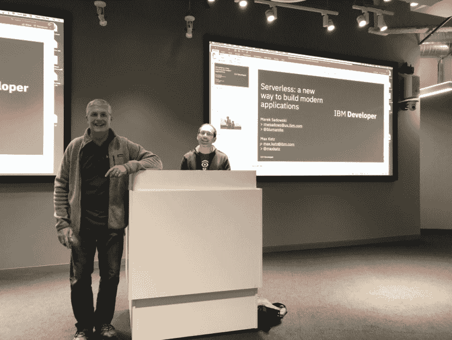
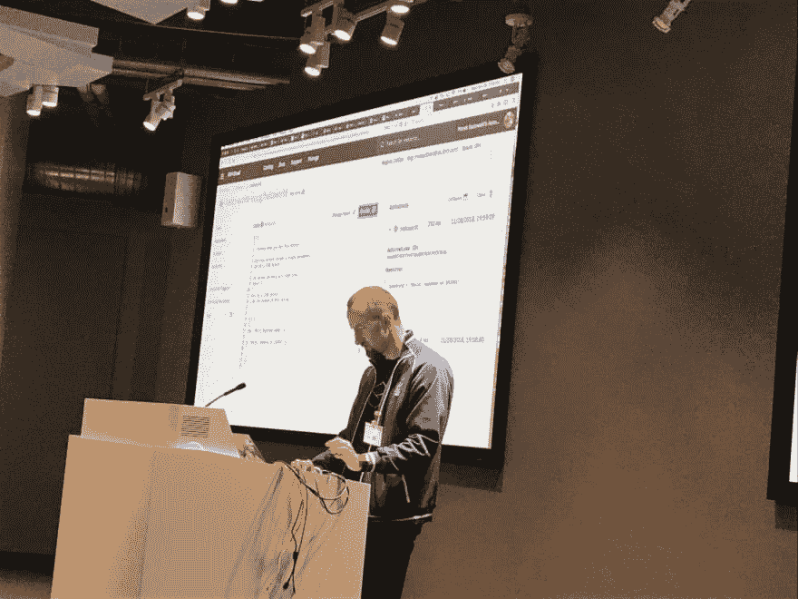

# 您应该将现有的企业 Java 应用程序迁移到无服务器架构吗？

> 原文：<https://dev.to/ibmdeveloper/should-you-migrate-an-existing-enterprise-java-application-to-serverless-architecture-1pmd>

上周，Marek Sadowski 和我在硅谷 JUG 展示了[IBM Cloud Functions 无服务器简介:构建现代应用的新方法](https://www.meetup.com/sv-jug/events/255614502/)。

观众提出的一个问题是，如何将现有的大型企业 Java 应用程序迁移到无服务器架构？

简而言之，你可能不应该这样做。

但是我们来看一下长答案。

除非有非常好的理由，否则将大型现有企业 Java 应用程序迁移到无服务器架构没有什么价值。我认为大多数情况下新应用应该考虑无服务器。现在，如果您需要向现有应用程序添加一个小的新功能，您可以考虑无服务器。

例如，如果您正在运行一个大型忠诚度应用程序(航空公司、酒店等),并且您有一个新的需求，需要每天处理一次新成员。一旦接收/上传了文件，就可以执行一个函数来处理新成员。

或者，您可以从现有的应用程序(如 cron 作业或队列进程)中迁移一小部分。但是，再一次，完全重写可能没有什么价值。