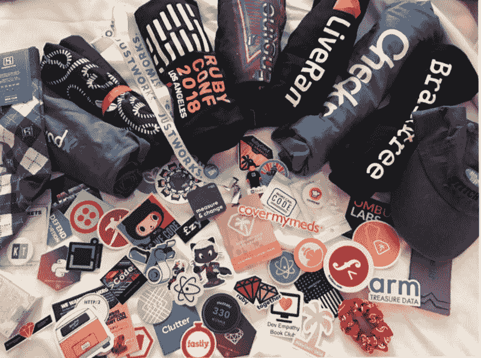
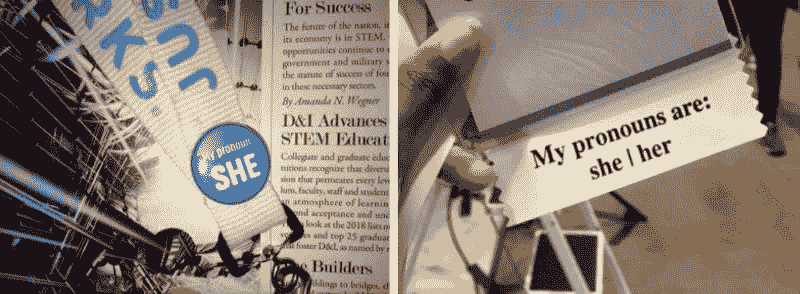
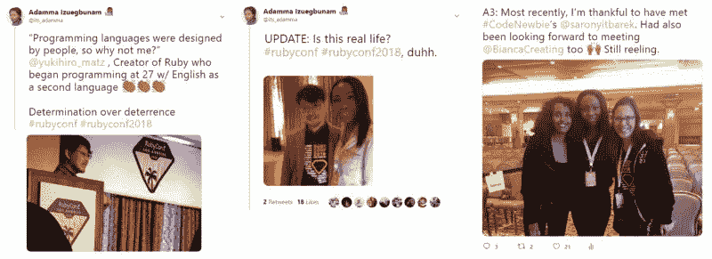
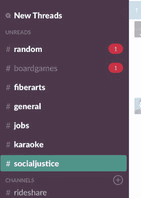
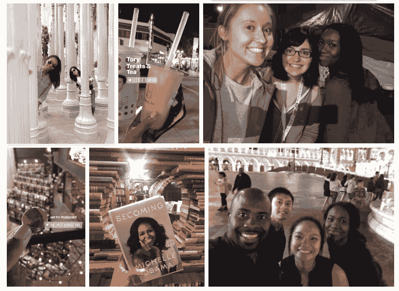
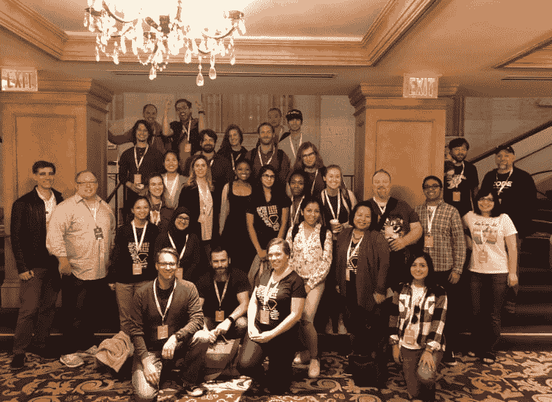

# 我第一次参加科技会议的 18 点心得

> 原文：<https://dev.to/its_adamma/18-takeaways-on-navigating-my-first-tech-conferences-1g31>

我最近以学者身份参加了我的第一次、第二次和第三次科技会议。以下是我学到的，我希望我已经知道的，以及帮助你从第一次或下一次科技会议中获得最大收益的启动。

*要点主要集中在我作为 RubyConf 2018 机会学者的经历，但也广泛适用于其他技术会议*

**发布会前**

释放任何先入为主的观念💡也许这只是我的看法，但 HBO 的硅谷 a̶n̶d̶̶t̶h̶e̶̶c̶r̶o̶o̶k̶e̶d̶̶m̶e̶d̶i̶a̶̶l̶o̶l̶⠀nearly 让我相信，程序员在社交方面是无能的，他们编写代码是为了避免需要与其他人交谈的职业。如果说今年我学到了什么，那就是与他人一起构建、解释你写的代码以及为什么要写代码需要很强的沟通技巧。我有通信背景的那一面松了一口气，因为我有一套可转移的技能。在这些会议中，我笑了。很多。从演讲者到随意的聊天，我几乎不好意思承认我曾经有过不同的想法。

制定一个游戏计划🗺️
参加你的第一次科技会议可能是如此令人兴奋，你眨眼之间就结束了。提前写下切实的目标，例如，见一个演讲者，与来自另一个国家的人联系，尝试新事物。提前回顾演讲者阵容有助于提高兴奋度，减少现场过多选择带来的麻痹感。制定一个游戏计划，但是要给重构和自发性留有余地。

储蓄中的意外收获🙏🏾
按时预订住宿可以降低酒店会议价格。找到一个参加同一个会议的室友可以进一步降低成本。幸运的是，我和我的一拍即合！我们在会议前联系在一起，一起参观了这座城市，并且在一周内仍然有足够多的单独经历，以探索不同的兴趣并在后来交流故事。另外，事实证明，她目前正在完成我打算参加的开发项目。与某人面对面交流并获得第一手信息是无与伦比的。

**会议期间**

**加入在线对话📢**
利用事件标签，在想法新鲜的时候参与进来。听起来可能很傻，一个标签把我引向了奖学金、免费赠品和聚会。几位与会者提到，在我正式介绍自己之前，他们从活动的标签中认出了我。发微博去吧！

**不给糖就捣蛋科技版😎**
你通常会有机会拜访供应商来升级你的贴纸游戏、抢零食和赢取奖品。更重要的是，这些额外津贴是一个令人兴奋的机会，可以建立关系网，了解你可能会与之共事的团队。如果把自己介绍给一个潜在的理想雇主的想法让你紧张，那就考虑事先和其他几个组织聊一聊来热身。问一些深思熟虑的问题，如果你有关系，在继续前进之前要准备一张名片。

*Results of collecting entirely too much free swag (also pronounced networking)*

如果你想轻装旅行，把睡衣留在家里。你可能会买几件(或七件)超柔软的 t 恤度日。
**挂绳包含重要信息📛**

直到 RubyConf 的最后一天，当一个主题演讲明确强调这一点时，我才明白，与会者徽章上的彩色编码贴纸是在向其他人发出信号，表明一名与会者不想被拍照(h/t [@saronyitbarek](https://dev.to/saronyitbarek) )。一位科技领域的领导意识到，如果她的照片被拍摄和分享，她的施虐者可能会找到她，因此几个月来参加活动都感到不安全。我知道亲密伴侣间的暴力行为并不少见，但在工作人员和参与者可以相互保护的简单方式上存在盲点。

为与会者提供一种分享代词的方式是为跨性别和非二进制人群营造一个更加安全和包容的环境的又一简单步骤。R-E-S-P-E-C-T

*Gender pronouns on my RubyConf and PyCon US badges.*

笔记本电脑不是必须的💻
除非你在远程工作或者真的喜欢用笔记本电脑记笔记，否则把它留在身边会很舒服。试试口袋大小的笔记本。如果你想在你最期待的几次演讲开始时，在智能手机的语音备忘录应用程序上播放绝对最多(我总是)的热门唱片。每当演讲者提出你想重温的想法时，记下记录时间(例如:18:07-ML 2014 案例研究)。我可以很容易地指出混淆点，正确地引用较长的引文，并引用幻灯片上没有列出的一系列资源。这有助于抑制这种想法，即一旦它最终发布到网上，我可能会记得在整个演讲中搜索几个词。

在网上给你灵感的人会出现💃🏾:
图片或者没有发生过。我与 Ruby‘Matz’的创建者、Code Newbie 的创始人 Saron Yitbarek 以及前 Github 社会影响负责人 Bianca Escalante 进行了交谈，他们在 D & I 上谈到了行业关注不方便的问题而不是社会问题的趋势。狂野。在开发者和他们的消费者之间，各种形式的多样性都有很大的差异，所以对我来说，这是一个令人兴奋的开始，可以见到那些用自己的权利铺平道路的实干家。评估形势，用介绍来射击你的射击！

*Things_I_Was_Not_Emotionally_Prepared_For.jpeg meeting @yukihiro_matz, [@saronyitbarek](https://dev.to/saronyitbarek) , and @biancacreating*

**工程会议**

根据你的兴趣安排公开讨论😻
你的会议可能还包括一个带有索引卡和相应时间段的公告板。这可供与会者挑选主题，以便以后与其他程序员讨论，他们可能通常没有机会见到这些程序员。我发现根据社区的不同，这些讨论有不同的名称。RubyConf 称这些走廊谈话为“一丘之貉”，而 PyCon 则为他们所谓的“开放空间”保留房间。我见过专门讨论技术和健康技术的空间，也见过像吃巧克力一样放松的空间。没看到感兴趣的话题？你，你自己，有权力写下任何* *合适的* *话题，并为公开讨论创造空间。起初，我对参加一个可以和专家一起集思广益的空间感到紧张。现在，我只希望我能早点找到这些地方。

如果你对会见演讲者或参与问答环节不感兴趣，那就稍后在网上捕捉这个对话，挑战自己，参加一个与那些和你一样对同样事情充满好奇的人的公开讨论。当你一天的谈话累坏了，想要更多的互动时，这是一个很好的转换方式。保持警惕。通过大量的演讲时间表和其他吸引你注意力的标志，这很容易被忽略。

**闪电式演讲 talk⚡**
闪电式演讲在编程社区中很常见，与会者可以就任何批准的主题分享一个快速的 5 分钟演示。有时候，这能让你清楚地了解是什么激发了你对科技的兴趣。一个例子包括托里，她将自己对钩针编织的热爱与她作为开发者的经历进行了类比。不过，要准备好快速推销或注册。他们很受欢迎！

**闪电谈话比赛。(婴儿学步)🎤一位学者告诉我，他们太紧张了，不敢发表演讲。把自己介绍给另一个人的想法已经够让人伤脑筋的了。在满座之前，她的导师把她带到讲台上，让她向 700 个空座位介绍自己。这是真正的第一步。他让她知道，如果她决定做一个简短的介绍，她会抓住机会立刻向整个社区介绍自己，然后他们会向她介绍自己。你为这个摇滚，约翰( [@johnksawers](johnksawers) )。**

有些闪电谈话是即兴的，有些是提前准备好的。做一次演讲，重复一遍，联系某人，让它变得更强大。有什么更好的方式向社区介绍你自己？这是我希望能认真考虑的一件事。

**聚会和四处走动**

**#SlackSavesLives💬**
这是标签吗？一些科技会议使用 Slack——一款邀请用户加入讨论和合作渠道的应用。对于会议而言，与会者可以提出问题，创建会议，并在任何单一事件之外继续对话。这尤其有助于我最大限度地减少停机时间，甚至通过协调往返机场的拼车来省钱。毫无疑问，如果没有活动工作人员，包括这个参与者的出口，我就不会遇到一些我联系最多的人。

*Slack screen capture from my time at #ReactConf*

**离开物理会议空间👟**
如果你觉得安全，并且你有办法这么做，找时间离开大楼，在周围散步。较大的会议场所通常与酒店相连，这很方便，但也很容易让人怀疑，在一次旅行结束时，你是如何打包离开的，而你对该地区的了解仍然没有你刚到达时多。RubyConf 为学者提供了一个令人惊叹的内置支持系统，这使得我有可能与我的同学建立联系，并走到最后一家书店。

*Outings and sponsored events from sharpest to blurriest camera quality: LACMA, Little Tokyo, Koreatown Karaoke, The Last Bookstore, Vegas Strip*

参加社交活动(即使最初的动机是食物)🎉
忙碌了一天后，很容易就要打烊了。挑战自己，参加会议赞助的活动。我决定，只要我感到安全，答案总是“是”参加——即使只有几分钟。在 React Conf 的第一天，我快速浏览了一下接待处，大概两分钟后，我回到了自己的房间。我很紧张，并确信自己“只是累了”，直到我收到一条消息，来自一位当天早些时候与我共乘一辆车的与会者，他问我在哪里。请参阅#slacksaveslives。

到第三天，我踢了害羞的虫子。在 50 分钟的休息时间里，我找到了一个朋友在现场划板，那天早上早些时候，我和另一个朋友一起做了早上 6 点的瑜伽。自由自在。这些郊游的有机对话开启了通往科技的非传统道路的故事，展开了关于心理健康的讨论，并给了我一个来自新西兰的新笔友(@whoispriscilla)。无价的。

**会议结束前**

乘风破浪🌊
会议的最后一天到了，你可能很累，但仍在灵感和信息的漩涡中嗡嗡作响。就像一个破旧的硬盘，你已经接近了存储空间的极限，也许你已经注意到很难阅读你前一天草草记下的一些笔记。乘着浪潮，但不要让它消退，重温参加会议前设定的目标。为部署该列表给自己很大的荣誉，并在回家后承诺一组新的项目，例如，在 x 日期前跟进新的联系人，为可访问性的开源做出贡献。

感谢别人，就像它会过时一样🎁
感谢所有为会议顺利进行所付出的努力，并花些时间当面感谢他人。穿着制服衬衫和在登记处的工作人员通常很容易被认出来。分享这次经历对你的意义(h/t Jennifer Tu @jtu，她建议在她关于同理心和团队关系的演讲结束时撒点感激之情)。

**冒名顶替综合症是真实的；找到您的社区🌱**
当我获得参加 RubyConf 的机会时，我欣喜若狂……大约有五秒钟，然后冒名顶替综合症就开始了。这是要去的会议。当然，我偷了某人的位置，他更应该得到它。我觉得我的故事和其他人的相比可能不值一提。新朋友很快就打消了这些想法，是学习和充电的巨大能量来源。在网上亲自找到你的朋友。找借口重新联系。提升彼此，培养自己的兴趣，排除任何你不属于的想法。

*Group photo with #RubyConf mentors, scholars, and guides at Millennium Biltmore Hotel Los Angeles*

**进一步鸣谢✨**
衷心感谢 RubyConf LA 的工作人员为最脆弱的与会者提供了 100 个口罩，并重新分配了筹集的资金，为加州意外的野火提供救援。

RubyConf LA Committee，感谢你策划了一个精彩的阵容——特别是伦理轨道，其中包括关于人工智能和逆向工程如何带来自动化不平等的风险的演讲。彻底的极客。主题演讲期间的小组活动和前排学者座位带来了无与伦比的体验。感谢@samphippen、@mghaught、@a_matsuda、@evanphx、 [@valeriecodes](https://dev.to/valeriecodes) 、[、@sarahmei](https://dev.to/sarahmei) 、@erniemiller、[、@jameybash](https://dev.to/jameybash) 和@megantiu(他也是我的优秀导师，但没有提到奥巴马总统在推特 nbd 上关注她)。

**寻找您的下一次会议**

你也属于这里！💪🏾
你可能会想“这听起来很棒，但我没有 400 美元坐在这里买一张会议票，也没有几百美元用于旅行和住宿。未得到充分代表的群体可以获得全部或部分财政援助，否则他们可能无法参加。我申请了许多会议，收到了五个会议的回复，并接受了一半符合我日程安排的邀请。申请。申请。申请。

搜索关键词:机会学者/财政援助/多样性学者/奖学金/补助金+你感兴趣的语言+“会议”也可以通过你喜欢的搜索引擎和 Twitter。摆弄这个公式。Codeland 是纽约的一个会议，专门面向新手，并努力确保为那些刚刚起步的人提供一个包容的空间。JSConf for JavaScript 提供了许多全球性的机会，当然 RubyConf for Ruby 也很棒！申请后跟踪你的进展。按日期组织你的清单有助于记住什么时候申请，如果事情发生在几个月之后。访问不同的门票开始。

唷，这就是我收集的一些并不总是显而易见，但希望值得了解的技巧。即使你做了这些事情的一半，感觉筋疲力尽也没关系。几天的介绍和一个接一个的演讲者会让你不知所措。不要。感受一下。不好。因为漏了一拍。还是那句话，大部分讲座都是在网上发布的，所以不要犹豫，根据需要给自己留点时间。起初，我给自己施加的参加每场演讲的压力已经消失了。大型会议往往会安排在酒店，所以要利用这种便利，休息一下，但也许不要太舒服，睡过头了。

我鼓励那些对探索个人爱好或新职业稍感好奇的人走出他们的舒适区，积极寻求成长的机会。如果这有所帮助，请把这篇文章传给那些希望从下一次科技会议中获得更多经验的人。

为你加油！

我的天

### 向导

ML:机器学习
D&I:多样性和包容性
H/t:帽舌，给予某人荣誉
Dev:开发者
Nbd:没什么大不了的
IRL:在现实生活中

### 额外资源

[准备闪电谈话的 16 种方法](https://www.semrush.com/blog/16-ways-to-prepare-for-a-lightning-talk/)
[吸引女性参加会议的另一种方法:摄影政策](https://adainitiative.org/2013/07/04/another-way-to-attract-women-to-conferences-photography-policies/)
[组织者指南代名词按钮](https://dev.to/sublimemarch/an-organizers-guide-to-pronoun-buttons-afb) [根据专家的说法，如何应对冒名顶替综合症](https://www.vice.com/en_us/article/59vdjx/how-to-deal-with-imposter-syndrome-according-to-experts)
[如何帮助受加州野火影响的受害者](https://abcnews.go.com/US/victims-affected-california-wildfires/story?id=59290306)

*本文最初发布在 Medium 上，并在技术和开发领域的 POC 上交叉发布。在 Twitter 上关注我的最新消息，时间是 [@its_adamma](https://twitter.com/its_adamma)*