# iOS 版 XCode 简介

> 原文：<https://dev.to/robertchen/introduction-to-xcode-for-ios-3dki>

### 循序渐进教程

<figure> 

<figcaption>照片由[尤拉鲜](https://unsplash.com/photos/n31x0hhnzOs?utm_source=unsplash&utm_medium=referral&utm_content=creditCopyText)上 [Unsplash](https://unsplash.com/search/photos/ios?utm_source=unsplash&utm_medium=referral&utm_content=creditCopyText)</figcaption>

</figure>

一直想做个 app？不知道怎么做？我也是，直到我上了一些网络课程，发现这并不是很难(建立一个简单的应用程序)。您也可以按照这个指南来熟悉 XCode。

[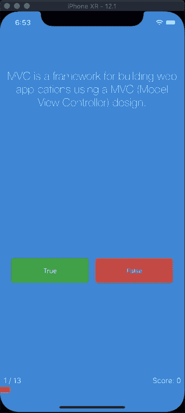](https://res.cloudinary.com/practicaldev/image/fetch/s--3rU6fl4D--/c_limit%2Cf_auto%2Cfl_progressive%2Cq_auto%2Cw_880/https://cdn-images-1.medium.com/max/372/0%2AI2pq9MZHbb9T51Xb)

我目前是熨斗学校的学生，参加他们的沉浸式 Web 开发项目，并在周日通过 Udemy 学习 Swift 和 App Brewery，所以我非常清楚学习如何开发可能是令人生畏的。在这个帖子里，不会有任何编码。我们将重点让您设置并熟悉众多的 XCode 面板。

### **让我们把你安顿好！**

1.  在这里 [安装最新版本的 XCode](https://itunes.apple.com/us/app/xcode/id497799835?mt=12.) [。](https://itunes.apple.com/us/app/xcode/id497799835?mt=12)
2.  要使用最新版本的 XCode，您至少需要 macOS 的第二到最新版本。如有必要，在此更新您的 Mac [。](https://www.apple.com/macos/how-to-upgrade/)

### **避免混淆**

下面的步骤是用运行在 macOS Mojave 上的 XCode 10 演示的。根据你的未来有多远，界面可能看起来完全一样，也可能不一样。

### **规则**

*   绿色圆圈表示点击。

*   两个绿色圆圈表示双击。

*   绿色箭头表示单击并拖动。

*   任何用黄色圈起来的东西都意味着看一看。

*   描述文本总是指上面的图像。

### **创建新项目**

[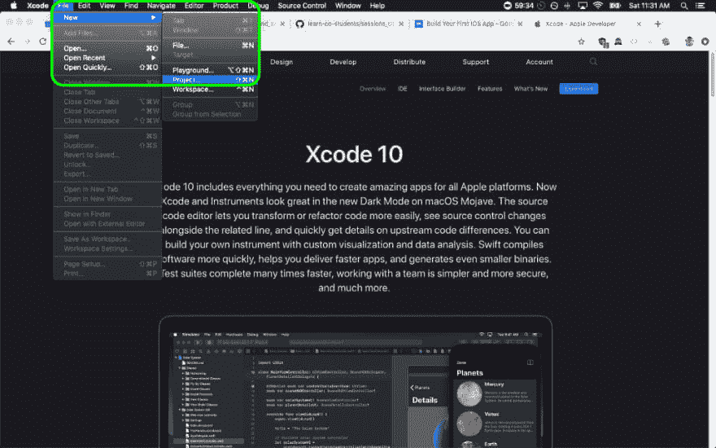](https://res.cloudinary.com/practicaldev/image/fetch/s--ZZwiG8Em--/c_limit%2Cf_auto%2Cfl_progressive%2Cq_auto%2Cw_880/https://cdn-images-1.medium.com/max/1024/0%2A1MAu9_jKVnTaHvcE)

[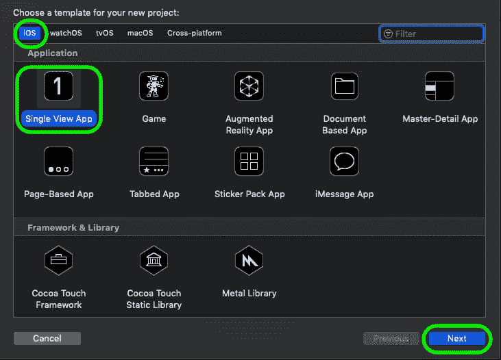](https://res.cloudinary.com/practicaldev/image/fetch/s--Nh0NJ7IE--/c_limit%2Cf_auto%2Cfl_progressive%2Cq_auto%2Cw_880/https://cdn-images-1.medium.com/max/731/0%2Adaz2umoRDynag73F)

[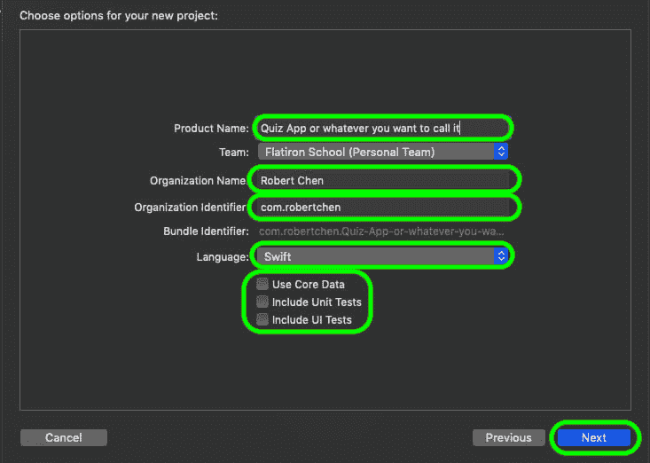](https://res.cloudinary.com/practicaldev/image/fetch/s--brabEzhy--/c_limit%2Cf_auto%2Cfl_progressive%2Cq_auto%2Cw_880/https://cdn-images-1.medium.com/max/733/0%2Afqpl0oljAfOH3PQI)

对于“组织名称”,您只需填写您的姓名。

对于“组织标识符”,苹果想要一个反向域名标识符。那就是拥有“com”在前面，而不是像我们习惯看到的那样在最后。

你想选择 Swift 是因为 C++在 iOS 开发中逐渐被淘汰。

我们没有为此应用程序做任何测试，因此取消选中所有复选框。

[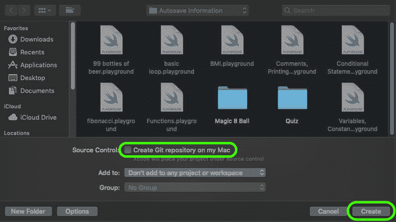](https://res.cloudinary.com/practicaldev/image/fetch/s--PzYnSGhx--/c_limit%2Cf_auto%2Cfl_progressive%2Cq_auto%2Cw_880/https://cdn-images-1.medium.com/max/799/0%2A1VLhYR7x5ANUuywz)

### **停顿。让我们来看看一些东西。**

[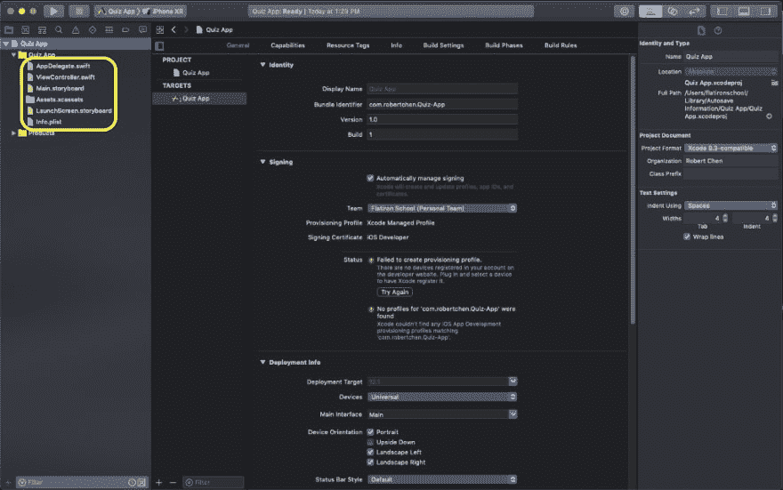](https://res.cloudinary.com/practicaldev/image/fetch/s--kE1dmtML--/c_limit%2Cf_auto%2Cfl_progressive%2Cq_auto%2Cw_880/https://cdn-images-1.medium.com/max/1024/0%2ATbSLBpwV_xSS37-Z)

以'结尾的文件。“swift”是你的代码文件。

以'结尾的文件。“故事板”是你的设计文件。

“Assets.xcassets”文件夹包含您的所有媒体文件。

[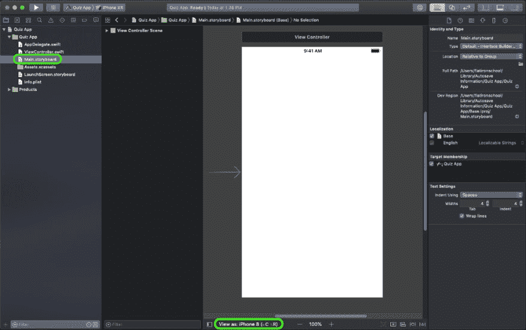](https://res.cloudinary.com/practicaldev/image/fetch/s--XHXjDb32--/c_limit%2Cf_auto%2Cfl_progressive%2Cq_auto%2Cw_880/https://cdn-images-1.medium.com/max/1024/0%2A0IxcnY_kYGHC2p8f)

[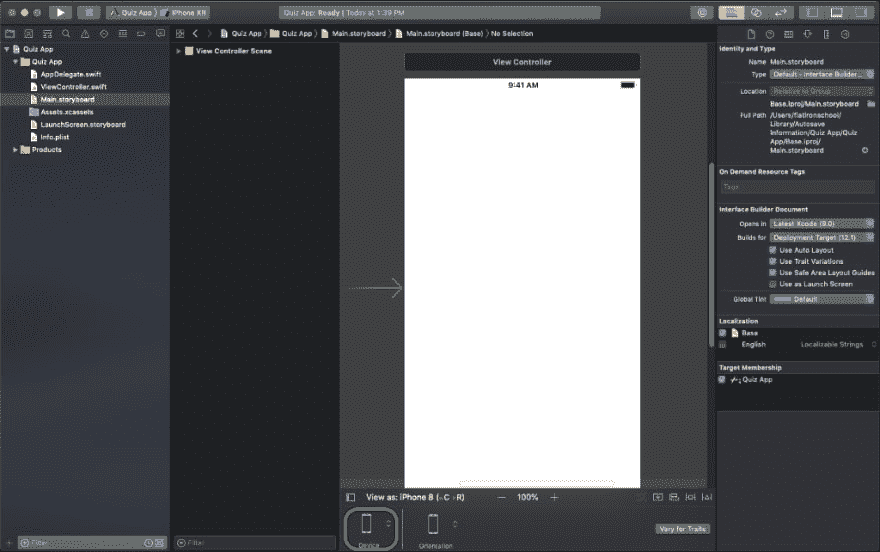](https://res.cloudinary.com/practicaldev/image/fetch/s--dgKWTXxG--/c_limit%2Cf_auto%2Cfl_progressive%2Cq_auto%2Cw_880/https://cdn-images-1.medium.com/max/1024/0%2Aku57AP5IsubIKj6t)

[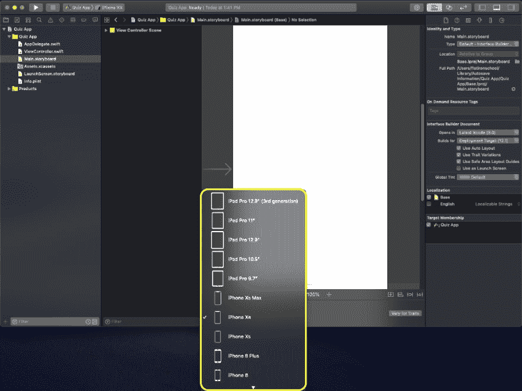](https://res.cloudinary.com/practicaldev/image/fetch/s--0VLvFiK7--/c_limit%2Cf_auto%2Cfl_progressive%2Cq_auto%2Cw_880/https://cdn-images-1.medium.com/max/1024/0%2AMgZSdMk-iUvZnyCJ)

您可以更改预览中显示的设备，这将直接影响您构建的应用程序的尺寸。我把它从 iPhone 8 换成了 iPhone XR，但你可以选择任何设备，并且仍然能够很好地跟随。

[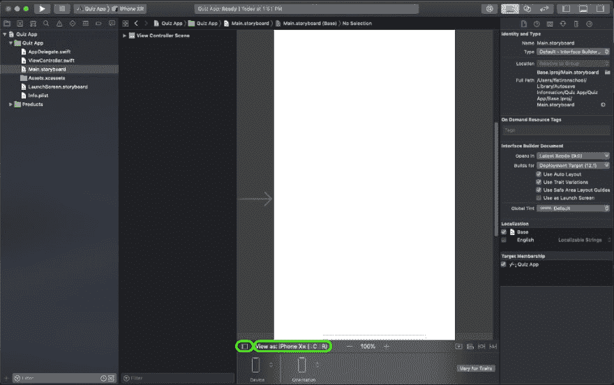](https://res.cloudinary.com/practicaldev/image/fetch/s--2j3n1Nwt--/c_limit%2Cf_auto%2Cfl_progressive%2Cq_auto%2Cw_880/https://cdn-images-1.medium.com/max/1024/0%2AVojJsTuvIElR-QCN)

让我们关闭视图面板，因为您想要给您自己尽可能多的工作空间。

### **我们现在就开始设计你的应用！**

[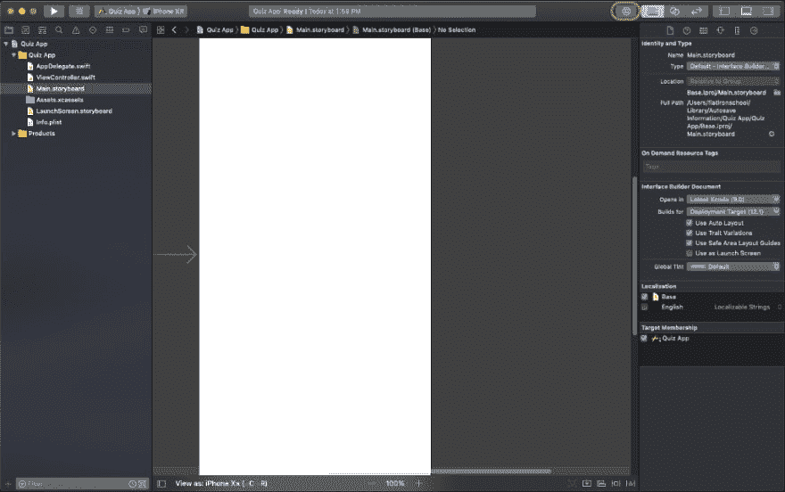](https://res.cloudinary.com/practicaldev/image/fetch/s--_1qw0b8U--/c_limit%2Cf_auto%2Cfl_progressive%2Cq_auto%2Cw_880/https://cdn-images-1.medium.com/max/1024/0%2AOAfqm2YHq0irv4ok)

[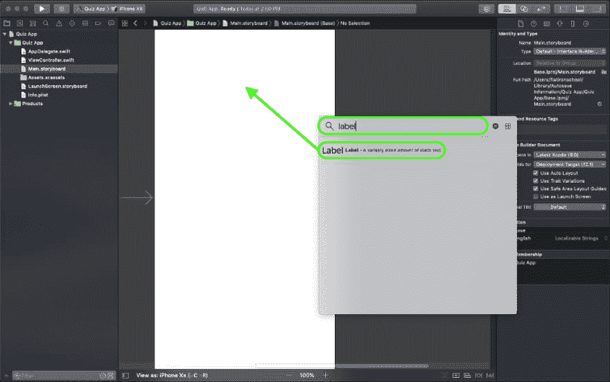](https://res.cloudinary.com/practicaldev/image/fetch/s--bRiiQSef--/c_limit%2Cf_auto%2Cfl_progressive%2Cq_auto%2Cw_880/https://cdn-images-1.medium.com/max/1024/0%2AcXvccaZZFvkTGPKz)

[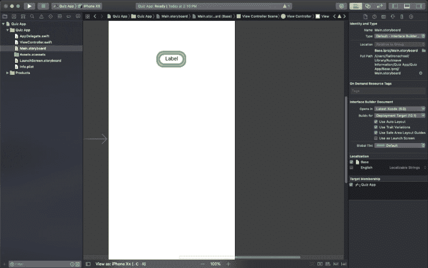](https://res.cloudinary.com/practicaldev/image/fetch/s--JJHJjMvg--/c_limit%2Cf_auto%2Cfl_progressive%2Cq_auto%2Cw_880/https://cdn-images-1.medium.com/max/1024/0%2A2VADSWxWx5Y0hEb0)

[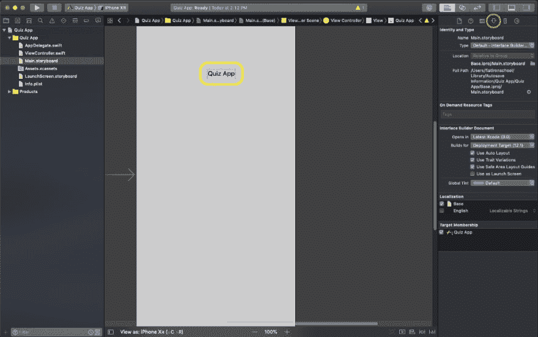](https://res.cloudinary.com/practicaldev/image/fetch/s--tr_eO-N4--/c_limit%2Cf_auto%2Cfl_progressive%2Cq_auto%2Cw_880/https://cdn-images-1.medium.com/max/1024/0%2A4ul8lriR8AgJsnaM)

[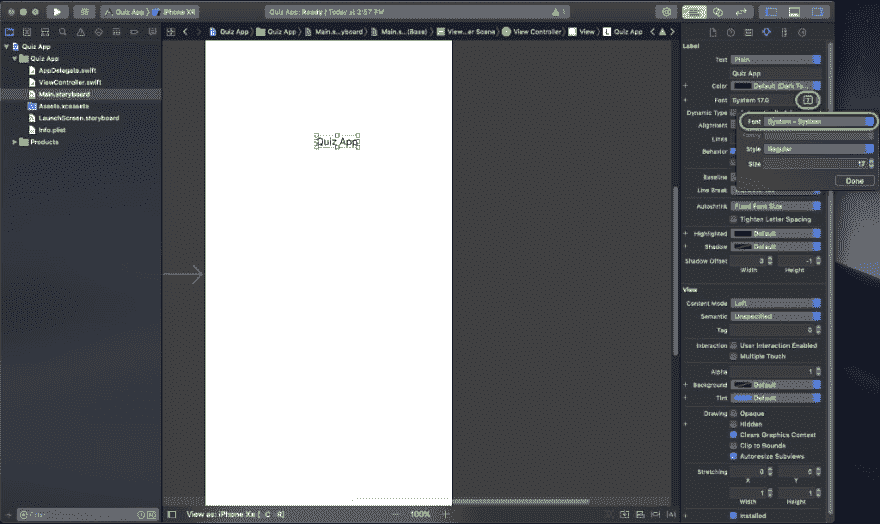](https://res.cloudinary.com/practicaldev/image/fetch/s--S75fivAb--/c_limit%2Cf_auto%2Cfl_progressive%2Cq_auto%2Cw_880/https://cdn-images-1.medium.com/max/1024/0%2AX4unHevz9VXtIDUT)

[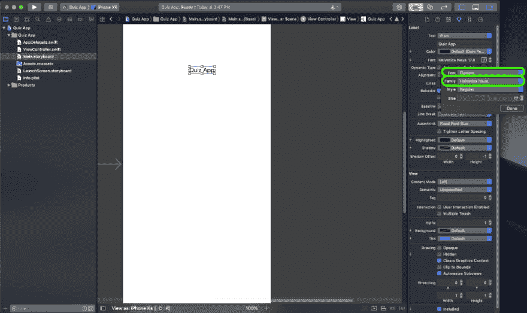](https://res.cloudinary.com/practicaldev/image/fetch/s--jkYhn6NQ--/c_limit%2Cf_auto%2Cfl_progressive%2Cq_auto%2Cw_880/https://cdn-images-1.medium.com/max/1024/0%2ArPdlWdxFcoz4Po8M)

[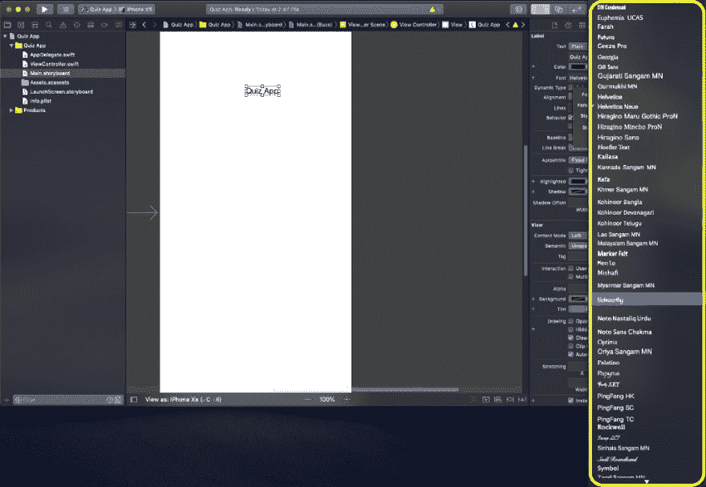](https://res.cloudinary.com/practicaldev/image/fetch/s--NNfC_Xxs--/c_limit%2Cf_auto%2Cfl_progressive%2Cq_auto%2Cw_880/https://cdn-images-1.medium.com/max/1024/0%2AObO_G6cKCjsD0b61)

选择最吸引你的字体。

[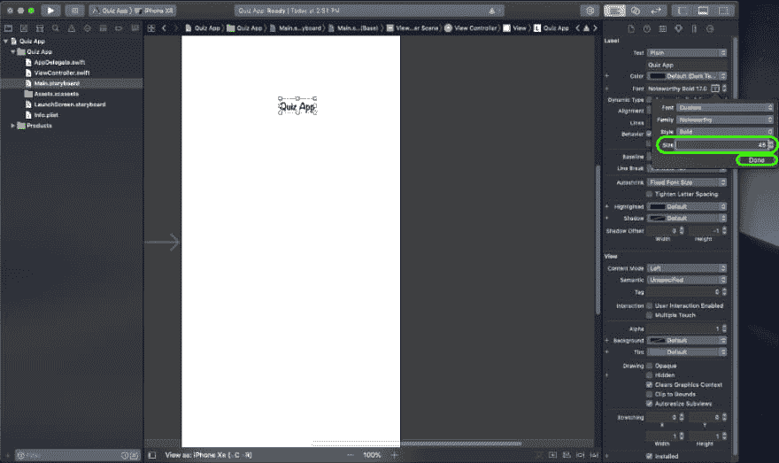](https://res.cloudinary.com/practicaldev/image/fetch/s--sEE9VmNx--/c_limit%2Cf_auto%2Cfl_progressive%2Cq_auto%2Cw_880/https://cdn-images-1.medium.com/max/1024/0%2A722-ly-Mfdkbnlla)

[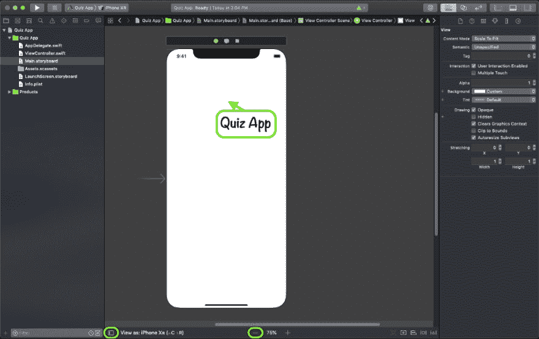](https://res.cloudinary.com/practicaldev/image/fetch/s--wMzzjaKa--/c_limit%2Cf_auto%2Cfl_progressive%2Cq_auto%2Cw_880/https://cdn-images-1.medium.com/max/1024/0%2AzU0INKBgSSy37uSs)

如果看不到整个设备，请缩小一点。

重新定位你的标签。

重新打开视图面板。

[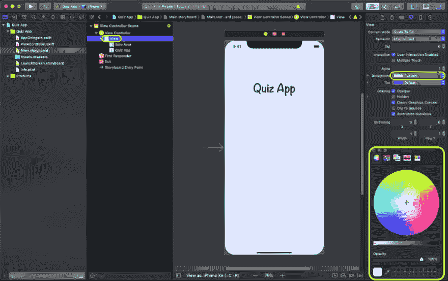](https://res.cloudinary.com/practicaldev/image/fetch/s--y898WyTi--/c_limit%2Cf_auto%2Cfl_progressive%2Cq_auto%2Cw_880/https://cdn-images-1.medium.com/max/1024/0%2AvbqZlBE2HNl5GLQC)

选择你的背景颜色。我使用了 Apple 预先制作的颜色选择的彩色铅笔选项，但你可以通过任何方法选择任何颜色。花一分钟四处点击，玩玩颜色面板。

### **我们来添加一张图片**

[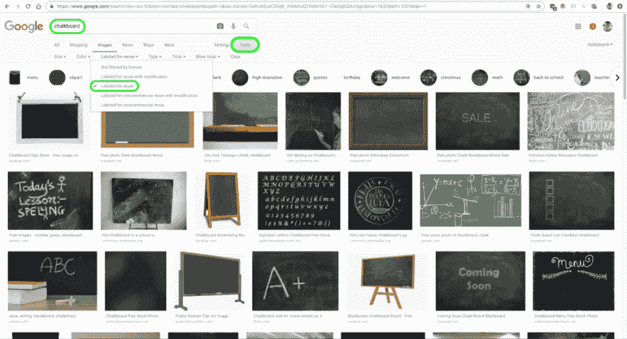](https://res.cloudinary.com/practicaldev/image/fetch/s--kBOD-TtY--/c_limit%2Cf_auto%2Cfl_progressive%2Cq_auto%2Cw_880/https://cdn-images-1.medium.com/max/1024/0%2A8ZcepcWJtX3Ykx1c)

[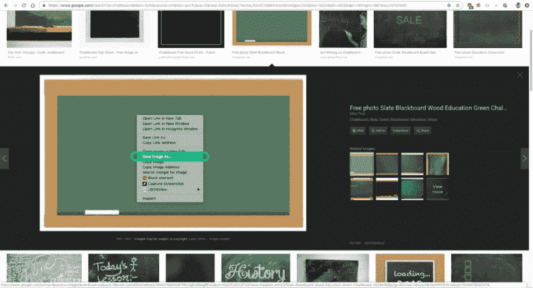](https://res.cloudinary.com/practicaldev/image/fetch/s--mPuJYg-F--/c_limit%2Cf_auto%2Cfl_progressive%2Cq_auto%2Cw_880/https://cdn-images-1.medium.com/max/1024/0%2AH85mrH1MSPIDCGQU)

不同的设备需要不同尺寸的同一张图片，但是有一个叫做[appicon.co](https://appicon.co/)的网站可以帮你调整图片尺寸。

[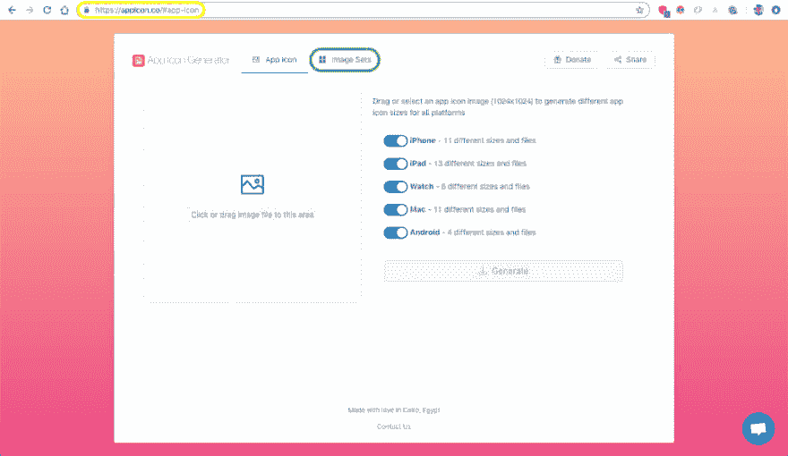](https://res.cloudinary.com/practicaldev/image/fetch/s--GiZkiJLV--/c_limit%2Cf_auto%2Cfl_progressive%2Cq_auto%2Cw_880/https://cdn-images-1.medium.com/max/1024/0%2AJJnlaoqmBhyA3gxj)

[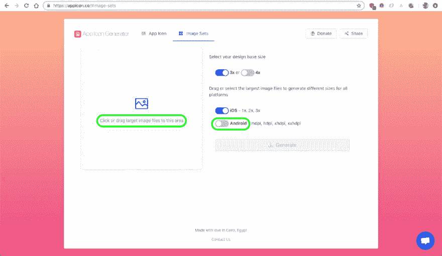](https://res.cloudinary.com/practicaldev/image/fetch/s--1yOVPn9t--/c_limit%2Cf_auto%2Cfl_progressive%2Cq_auto%2Cw_880/https://cdn-images-1.medium.com/max/1024/0%2AR5-5oM27HboUtxeT)

[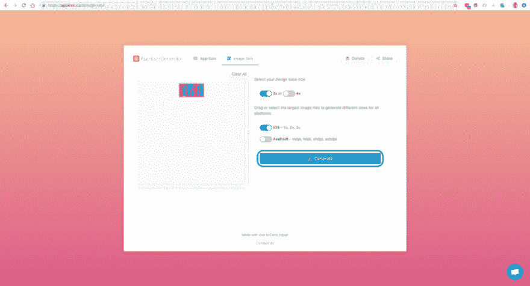](https://res.cloudinary.com/practicaldev/image/fetch/s--Vk-qlo78--/c_limit%2Cf_auto%2Cfl_progressive%2Cq_auto%2Cw_880/https://cdn-images-1.medium.com/max/1024/0%2ADIWuEbeGXaf45hRV)

[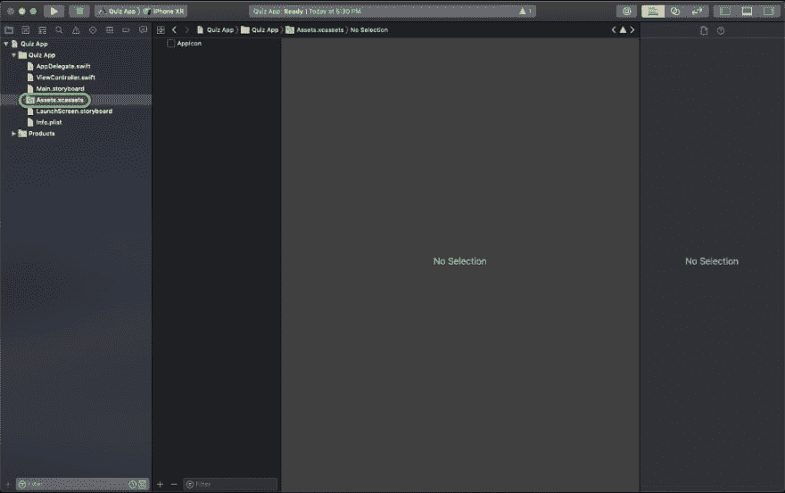](https://res.cloudinary.com/practicaldev/image/fetch/s--X7_Cfghy--/c_limit%2Cf_auto%2Cfl_progressive%2Cq_auto%2Cw_880/https://cdn-images-1.medium.com/max/1024/0%2A8C-crmMEiCxjtB4e)

[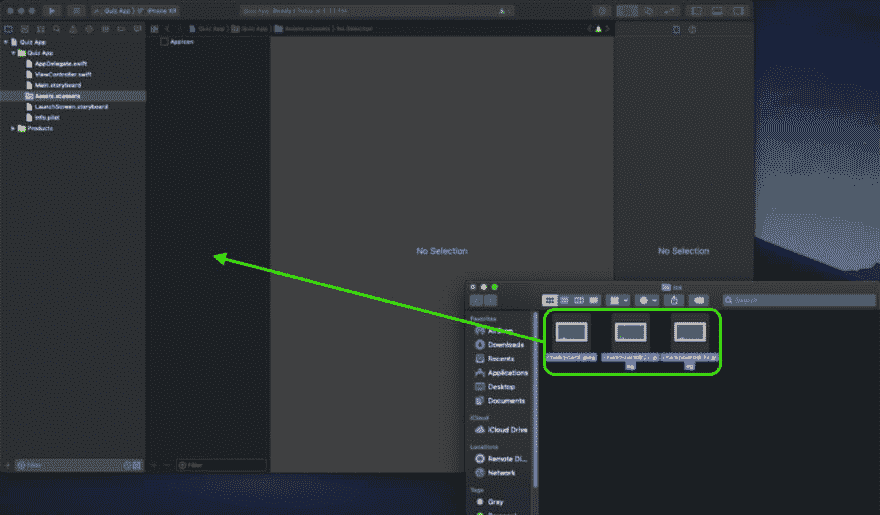](https://res.cloudinary.com/practicaldev/image/fetch/s--GvpVO6Zh--/c_limit%2Cf_auto%2Cfl_progressive%2Cq_auto%2Cw_880/https://cdn-images-1.medium.com/max/1024/0%2AhwlHUfvOa2THvebU)

[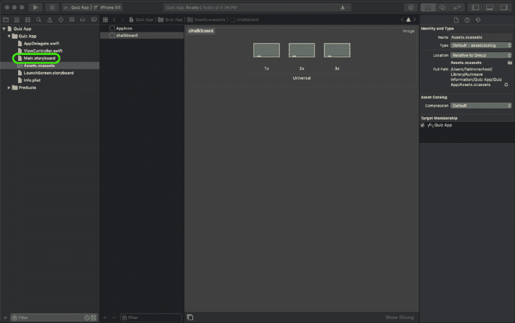](https://res.cloudinary.com/practicaldev/image/fetch/s--4wdYoXy1--/c_limit%2Cf_auto%2Cfl_progressive%2Cq_auto%2Cw_880/https://cdn-images-1.medium.com/max/1024/0%2Ak8ZUDBheToN8HuP8)

[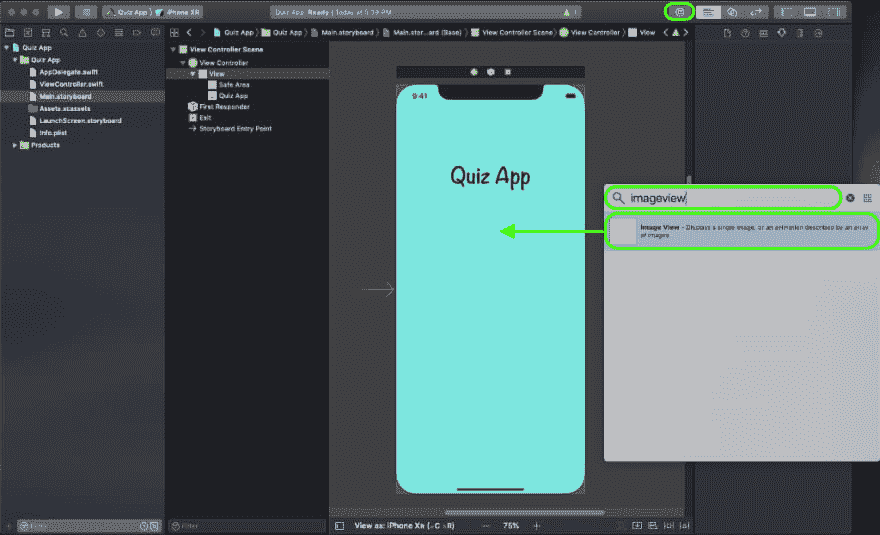](https://res.cloudinary.com/practicaldev/image/fetch/s--97DvnWq9--/c_limit%2Cf_auto%2Cfl_progressive%2Cq_auto%2Cw_880/https://cdn-images-1.medium.com/max/1024/0%2AijUIOG0qc1kx5S4I)

[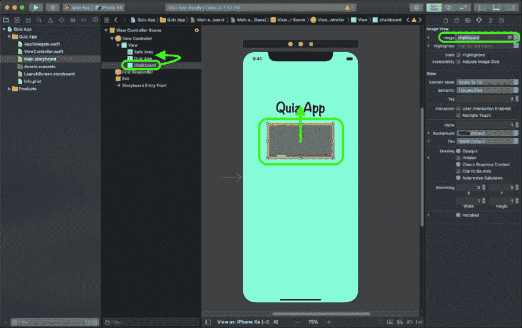](https://res.cloudinary.com/practicaldev/image/fetch/s--N7RfPO6n--/c_limit%2Cf_auto%2Cfl_progressive%2Cq_auto%2Cw_880/https://cdn-images-1.medium.com/max/1024/0%2A6zBBC9WtwVa_1mjv)

键入图像名称以定位您的图像。

在“视图”面板中，将图像拖到标签上方，使其位于标签后面。

在预览屏幕中，将图像拖到标签所在的位置。

[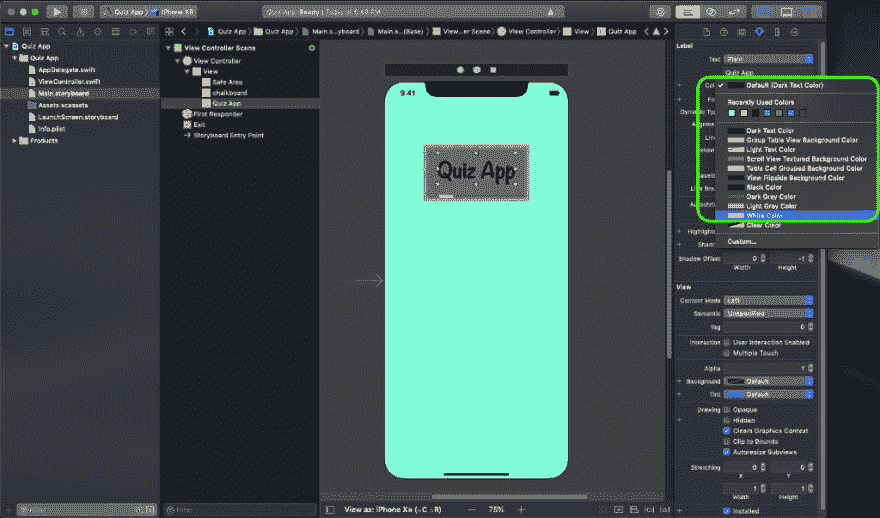](https://res.cloudinary.com/practicaldev/image/fetch/s--eSDyoUBA--/c_limit%2Cf_auto%2Cfl_progressive%2Cq_auto%2Cw_880/https://cdn-images-1.medium.com/max/1024/0%2AYHY6LaEExmD2nNMg)

现在我们在你的文本后面有一个黑板，让我们把文本颜色改为白色。

[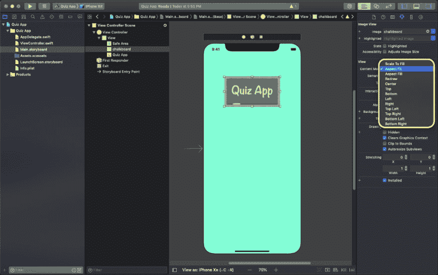](https://res.cloudinary.com/practicaldev/image/fetch/s--9TARkGpo--/c_limit%2Cf_auto%2Cfl_progressive%2Cq_auto%2Cw_880/https://cdn-images-1.medium.com/max/1024/0%2AUltHQQu4sLduHEoi)

有时你的图像会被默认扭曲(不是在这种情况下)，你可以通过“内容模式”属性改变你的图像的行为。

[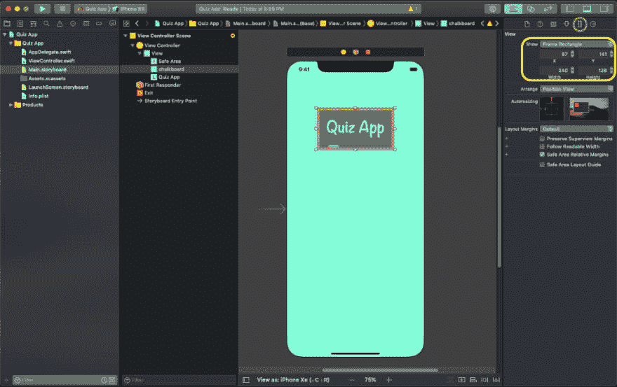](https://res.cloudinary.com/practicaldev/image/fetch/s--1wrcDcfE--/c_limit%2Cf_auto%2Cfl_progressive%2Cq_auto%2Cw_880/https://cdn-images-1.medium.com/max/1024/0%2A-SybAXn7ea8S8QjX)

当您需要图像或标签的非常具体的位置(由客户或设计团队提供)时，您可以使用标尺面板输入所需的位置。

### **时间到了。**

我知道你想从 0 到 100，但这是这篇文章的主题。花点时间熟悉一下我们讨论过的所有面板。有很多面板需要查看和记忆，但是…

恭喜你迈出了成为 iOS 开发者的第一步！