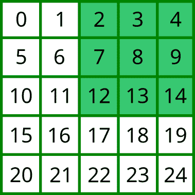

# 代码 2018 的来临-第 3 天

> 原文：<https://dev.to/ballpointcarrot/advent-of-code-2018---day-3-3f0f>

解决这些问题比我最初想象的要困难得多——这些不是 FizzBuzz 级别的问题；他们要求多一点(尤其是后半部分)。我在第三天有一点领先，因为我比问题发布晚了三个小时，这意味着我在睡觉前有一些时间来思考它们。事实证明这很糟糕，因为我躺在床上想着解决问题(这让我几乎无法入睡，:D)。

在这个特殊的夜晚/日子，我在工作中遇到了一些问题(当时我正在为我的团队待命)，所以我有第二次机会在清晨(当地时间凌晨 3 点左右)查看它们。但是，一旦我起来了，我就起来了，所以一旦工作问题平息了，我就试着去解决剩下的问题。

这是我第一次在事后写这些文章，所以请让我知道与前几天相比，这里的报道是否有任何问题。

### 第 3 天，第 1 部分

在我们从上一个问题中拯救了布料之后，现在就看精灵们如何找到最佳的裁剪方法了。问题陈述首先断言织物是 1000x1000 平方英寸的正方形。这被证明对我解决问题的方法很有用，你将在下面看到。

每个精灵在布料上做一个声明，指定一个他们想要切割的矩形。索赔的格式如下:

`#12 @ 3,4: 5x6`

其将被解释为“权利要求号`12`，顶角位置`(x,y) = (3,4)`，宽度`5`，高度`6`

为了理解这一点，我使用了一个[正则表达式](https://www.regular-expressions.info/quickstart.html)来隔离各种数字术语(虽然 [regex 是一个超级功能](https://xkcd.com/208/)，但它也有点像兔子洞，我不会在这里介绍它的一般概念)。不幸的是，虽然 Java 7+支持一个名为[的 regex 特性，名为 capture groups](https://docs.oracle.com/javase/7/docs/api/java/util/regex/Matcher.html#group%28java.lang.String%29) ，但 Clojure 并没有现成的支持。然而，带有命名组的正则表达式仍然起作用，但是我只能得到位置参数。我构建了一个接受输入声明的函数，并构建了一组相当有趣的响应:

```
(defrecord  Claim  [claim-number  squares])  (defn  convert-to-grid  "Converts a claim into a sequence of 'taken' squares."  [claim  grid-width]  ;; Named groups would be great here, but Clojure doesn't support this natively.  (let  [matcher  #"#(?<claim>\d+)\s@\s(?<x>\d+),(?<y>\d+):\s(?<width>\d+)x(?<height>\d+)$"  matches  (re-find  matcher  claim)  [_  claim  horiz  vert  width  height]  matches  x  (Integer.  horiz)  y  (Integer.  vert)  w  (Integer.  width)  h  (Integer.  height)  rows  (take  h  (iterate  inc  y))]  (->>  (map  #(range  (+  x  (*  grid-width  %))  (+  (+  x  w)  (*  grid-width  %)))  rows)  (flatten)  (set)  (Claim.  (Integer.  claim)  )))) 
```

Enter fullscreen mode Exit fullscreen mode

让我们浏览一下这个例子。

我们首先看到的是 clojure [记录](https://clojure.github.io/clojure/clojure.core-api.html#clojure.core/defrecord)的定义(类似于 struct)。因为 Clojure 存在于 JVM 上，所以它有效地构建了一个 Java 类，并允许您实例化该类型的对象。上面的问题可以用一个简单的地图来解决，但是我想给代码库的读者一个更简单的方法来获得转换后的声明的心理模型。此外，这有助于我们跟踪索赔号，这在第 1 部分中并不重要，但在第 2 部分中会再次出现。

因为我们知道我们将要使用的字段的宽度单位，所以我选择构建一个“矩形”,通过标识矩形组成的单元格来表示索赔。例如，在一个 5x5 的网格中，声明为`#1 @ 2,0: 3x3`:

[](https://res.cloudinary.com/practicaldev/image/fetch/s--TCcayfsT--/c_limit%2Cf_auto%2Cfl_progressive%2Cq_auto%2Cw_880/https://www.ballpointcarrot.net/posts/advent-of-code-2018-3/grid-set-example.png)

这给我们留下了一组方块:`#{2 3 4 7 8 9 12 13 14}`。这里的实际结果是，我们现在可以使用集合逻辑(差、交、并)来操作矩形并计算重叠的细节。而这正是我所做的:

```
(defn  get-overlap  "returns the amount of overlap based on calculated inputs.
   Answer provided in square units matching the units entered
   (for the case of the problem, square inches)."  [claims]  ;; Perform intersection to find any matches, then union to combine; repeat through the list.  (loop  [mapped-area  (map  #(convert-to-grid  %  1000)  claims)  shared-fabric  #{}  intersections  #{}]  (if  (empty?  mapped-area)  intersections  (let  [intersect  (set/intersection  shared-fabric  (:squares  (first  mapped-area)))  union  (set/union  shared-fabric  (:squares  (first  mapped-area)))]  (recur  (rest  mapped-area)  union  (set/union  intersections  intersect)))))) 
```

Enter fullscreen mode Exit fullscreen mode

我们再次看到第二天的朋友`loop`和`recur`。这一节重点介绍了 Clojure 中我最喜欢的一点——批量操作数据。我们传递给它一个声明字符串的向量，在它上面的函数中进行解析。然而，仅仅通过一次`map`调用，我们就能够将这些字符串中的每一个转换成一个 1000x1000 宽的网格区域。一旦我们有了可以轻松计算的对象，我们就开始计算。:)

对于这些例子来说，`set/intersection`符号是新的，因为`clojure.set`在 Clojure 的“核心”名称空间之外——到目前为止，我们一直使用打包在`clojure.core`中的函数，默认情况下，Clojure 运行时会加载这些函数。因为`clojure.set`不是，我们必须将它导入到名称空间中(在我们的例子中，为它提供一个好的简称，以便在调用时使用):

```
(ns  aoc.aoc3  (:require  [clojure.set  :as  set])) 
```

Enter fullscreen mode Exit fullscreen mode

这允许我们通过使用`set/fn-name`来调用`clojure.set` 中的[函数。对于循环的每次迭代，我们做三件事:](http://clojuredocs.org/clojure.set)

1.  我们对照“共享结构”进行检查。这是通过在当前矩形(由`(first mapped-area)`定义)和之前的所有矩形之间设置交集来实现的。
2.  我们通过将当前矩形添加到已经由集合并集添加的矩形来定义“共享结构”。
3.  当我们切回到下一次迭代时，我们得到在以前的迭代中找到的所有交叉点的并集，以及我们在这次运行中找到的交叉点。**这个**片段是我们最终的总重叠，因为我们不断积累更多的重叠；因为它是一个集合，但是，我们没有重新计算相同的值，我们只是把它们作为“重叠的”包含在内。

一旦这样做了，我就能很快解决第 1 部分。

### 第三天，第二部分(运动队:0)

现在我们已经找到了重叠区域，我们的挑战是找到在声明列表中*和*没有重叠区域的矩形。这就是保存索赔号的方便之处。

我*希望*想出一个聪明的方法，使用上面使用的集合符号来创建一个闪电般快速的函数来处理矩形列表，以找到一个没有重叠的矩形，但是什么也没想到。(如果有人找到了，告诉我，我就欠你一杯咖啡。)相反，我使用了一种更暴力的方法:将每个网格与网格列表进行比较，当您发现没有集合交集时，就进行裁剪。这需要更多的计算量(`O(n^2)`)，但是考虑到样本输入中的计数限制，在笔记本电脑敲打它的时候坐几秒钟也不算太糟糕。

当我把这些放在一起的时候，我遇到了一个小问题——我如何管理声明列表，这样我就不会和自己有交集了？这将导致甚至“无重叠”矩形匹配(因为它匹配自己)。我最后做的是分解处理重叠计算的函数，在顶部有一个检查，说“如果你是索赔号相同的矩形，那么返回`nil`”——这允许你传递完整的列表，而不用担心匹配自己。

```
(defn  overlapping-claim  [c1  c2]  (cond  (=  (:claim-number  c1)  (:claim-number  c2))  nil  (not-empty  (set/intersection  (:squares  c1)  (:squares  c2)))  c2))  (defn  find-no-overlap  "given a set of input claims, find the claim that has no overlap
  with any other claims."  [claims]  (let  [grid-claims  (map  #(convert-to-grid  %  1000)  claims)]  (loop  [idx  0  ignores  #{}]  (if-not  (contains?  (:claim-id  (nth  grid-claims  idx))  ignores)  (if-let  [overlap  (some  #(overlapping-claim  (nth  grid-claims  idx)  %)  grid-claims)]  (recur  (inc  idx)  (conj  ignores  (:claim-number  overlap)))  (:claim-number  (nth  grid-claims  idx)))  (recur  (inc  idx)  ignores))))) 
```

Enter fullscreen mode Exit fullscreen mode

这里要指出一些很酷的事情:

1.  `cond`。把 [`cond`](http://clojuredocs.org/clojure.core/cond) 想象成一个服用了类固醇的`if/else`。它允许您传递一对项:测试表达式和成功表达式。如果测试表达式通过(即返回`true`)，那么成功表达式将被计算并返回(立即返回——它不会落入其他条件对)。这意味着我不必嵌套`if`调用，这使得它更容易阅读(IMO)。
2.  `if-let`。这基本上是一个条件绑定(想想变量)赋值:如果绑定值不是`nil`，那么把绑定值赋给`if-let`的作用域。它将您从太常见的模式中解救出来:

```
# ruby
my_var = doThingPossibly()
if my_var
  # do other things
end 
```

Enter fullscreen mode Exit fullscreen mode

或者

```
# python if doExpensiveThing():
    repeatItForVariable = doExpensiveThing()
    # do other things 
```

Enter fullscreen mode Exit fullscreen mode

同样，我的代码可以在 Github Gist 中找到。直到明天！