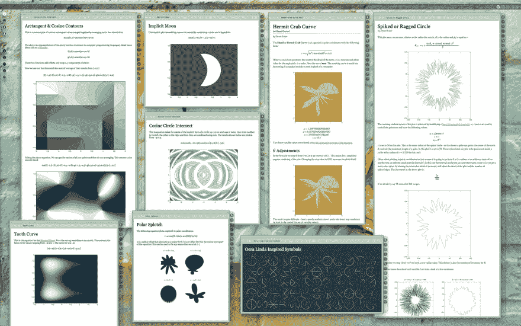
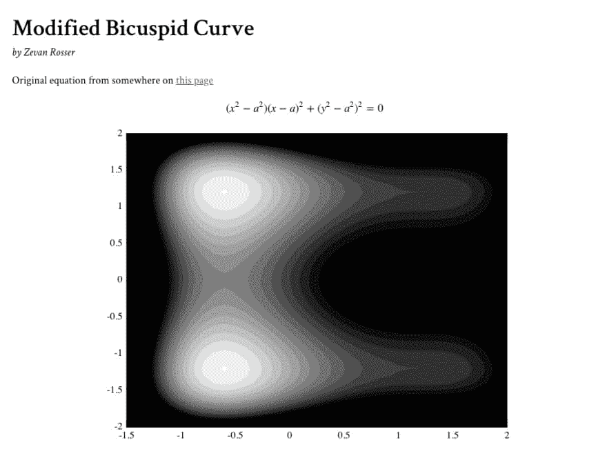

# ArcType -简易数学文档

> 原文：<https://dev.to/zevanrosser/arctype---easy-math-documents-2e2k>

2015 年，我写了很多简短的娱乐性数学文档。为了帮助我自己创建这些，我建造了 [ArcType](http://zevanrosser.com/arctype-editor/) 。

[](https://res.cloudinary.com/practicaldev/image/fetch/s--G1SAUhs8--/c_limit%2Cf_auto%2Cfl_progressive%2Cq_auto%2Cw_880/https://thepracticaldev.s3.amazonaws.com/i/an23xc5z7q09qyrzqe7e.jpg)

ArcType 是一个极简主义的编辑器，它将 LaTeX、Markdown、HTML/CSS、gnuplot 和 Octave 都集成在一个地方。几个月前，我带着 [ArcType](http://zevanrosser.com/arctype-editor/) 完成了它，以便其他人可以使用它。它是免费的，你可以下载你的作品。欢迎屏幕和帮助文件涵盖了您可以使用的大多数功能。[看看这里…](http://zevanrosser.com/arctype-editor/)

[这是我创建的一些文档的链接…](http://zevanrosser.com/shapevent.php)

[](https://res.cloudinary.com/practicaldev/image/fetch/s--RakefrxD--/c_limit%2Cf_auto%2Cfl_progressive%2Cq_auto%2Cw_880/https://thepracticaldev.s3.amazonaws.com/i/6tkhfhkt63e9dq762vmo.jpg)

这是不言自明的——计划很快做一个关于它的教程。与此同时，如果您想了解更多内容，而不仅仅是欢迎/关于演示，请尝试一下这段代码。

```
# Modified Bicuspid Curve
*by Zevan Rosser*

Original equation from somewhere on [this page](https://en.wikipedia.org/wiki/Quartic_plane_curve)

@@
(x^2 - a^2)(x - a)^2 + (y^2 - a^2)^2 = 0
@@

@@@@
%-> width: 70%; min-width: 300px;
a = 1.21;
lx = -2:0.1:2;
ly = -2:0.1:2;
[x,y] = meshgrid(lx, ly);
z = (x.^2 - a^2) .* (x - a).^2 + (y.^2 - a^2).^2;

contourf(x, y, z, -3.9:0.3:1, 'LineWidth', 0);
colormap(1 - gray);
axis([-1.5, 2, -2, 2]); 
@@@@ 
```

Enter fullscreen mode Exit fullscreen mode

*以上将呈现本*
[](https://res.cloudinary.com/practicaldev/image/fetch/s--aTuIYa2J--/c_limit%2Cf_auto%2Cfl_progressive%2Cq_auto%2Cw_880/https://thepracticaldev.s3.amazonaws.com/i/z3fzf1nkvda02ywvtfzf.jpg)

我只注意到一个已知的问题——本地存储的 5mb 限制...我敢肯定还有其他的 bugs 所以如果你决定用它做点真实的东西——请经常保存你的工作；)

如果你有问题——请随意发表在这里，我会尽力回复。如果你用它做了很酷的东西-我很想看看。

享受:D