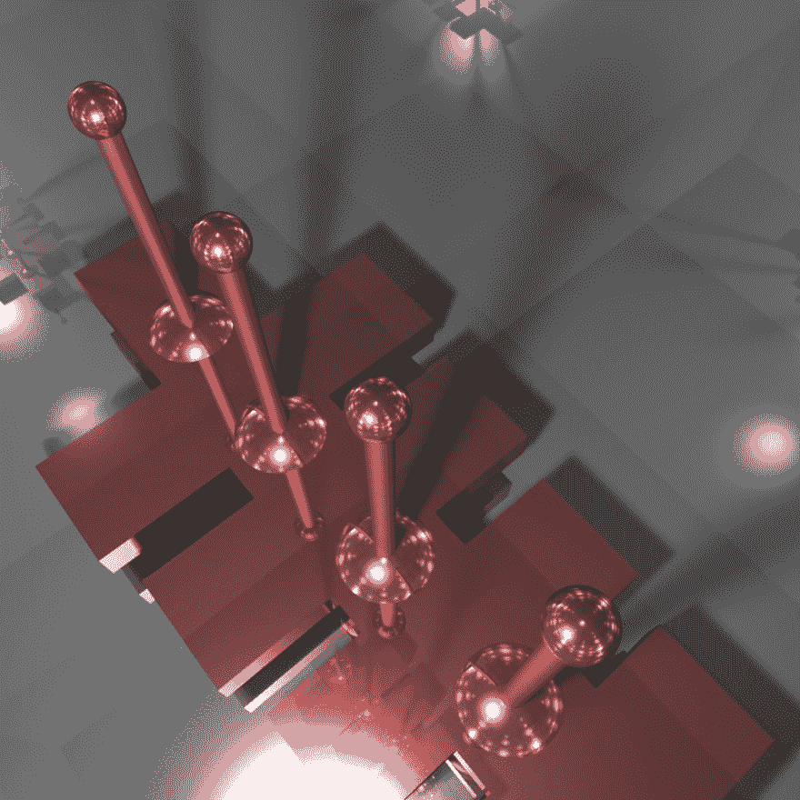
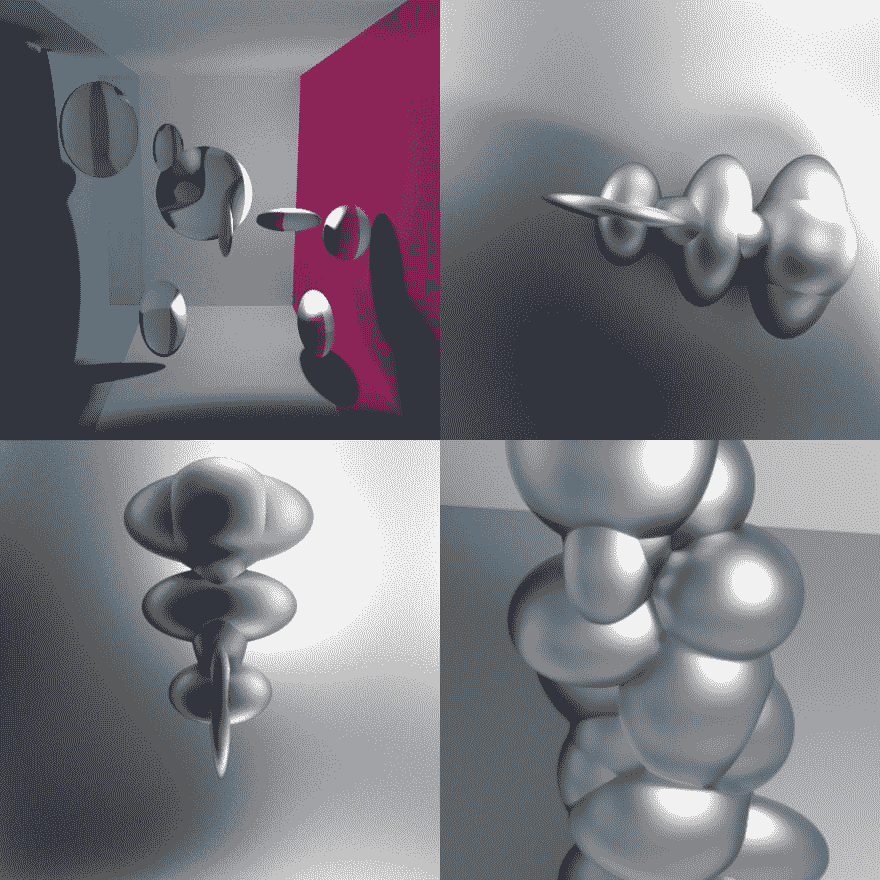

# 实时路径跟踪研究

> 原文：<https://dev.to/zevanrosser/realtime-pathtracer-research-icc>

> “路径跟踪是一种计算机图形蒙特卡罗方法，用于渲染三维场景的图像，以使全局照明忠实于现实。”
> *来自维基百科*

很长一段时间以来，我一直想了解更多关于路径跟踪者的知识。几个月前，我终于开始着手做这件事，我的调查结果是一个带有一些新功能和形状的 [Evan Wallace 的 Pathtracer](http://madebyevan.com/webgl-path-tracing/) 的分支——其中一些是我从 [Erich Loftis 的 Three.js PathTracing 渲染器](https://github.com/erichlof/THREE.js-PathTracing-Renderer)那里学到的

[演示...](http://mtcanvas.com/hack/pathtracer/demo-3-512/index.html)
[T5】](https://res.cloudinary.com/practicaldev/image/fetch/s--gBbvCENM--/c_limit%2Cf_auto%2Cfl_progressive%2Cq_auto%2Cw_880/https://thepracticaldev.s3.amazonaws.com/i/98epv7sq5p3sx2apggqf.jpg)

[另一个演示...](http://mtcanvas.com/hack/pathtracer/demo-1-512/index.html)
[T5】](https://res.cloudinary.com/practicaldev/image/fetch/s--Z5-QPjFu--/c_limit%2Cf_auto%2Cfl_progressive%2Cq_auto%2Cw_880/https://thepracticaldev.s3.amazonaws.com/i/c6ig4f6xkuv2ojsclp6v.jpg)

我一直想回到这个问题上，做优化和布尔形状，但是到目前为止，我还没有找到时间。

这里有更多不同排列和实验的截图...

做这些东西让我想起了等待 KPT·布莱斯渲染 3D 景观的 15 个小时...

*在我的 2018 款 macbook pro 上仍然有副本运行；)*
[T5】](https://res.cloudinary.com/practicaldev/image/fetch/s--wSUz02k6--/c_limit%2Cf_auto%2Cfl_progressive%2Cq_auto%2Cw_880/https://thepracticaldev.s3.amazonaws.com/i/e5mo2zft789345ek01wn.png)