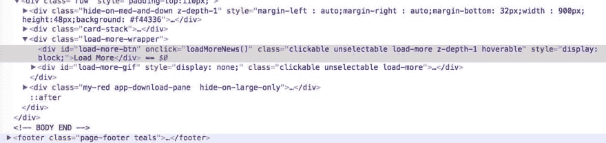
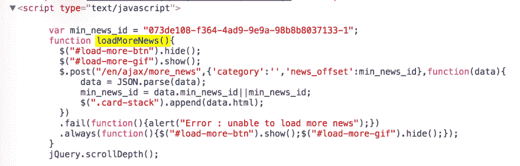

# 网页抓取处理 Ajax 网站

> 原文：<https://dev.to/scrapingbee/web-scraping-handling-ajax-website-1ip8>

今天，越来越多的网站使用 Ajax 来获得奇特的用户体验、动态网页和更多的好理由。爬行 Ajax 重型网站可能是棘手和痛苦的，我们将看到一些技巧，使它更容易。

## 先决条件

在开始之前，请先阅读我之前写的文章，了解如何设置你的 Java 环境，对 HtmlUnit [用 Java 进行网页抓取的入门](https://ksah.in/introduction-to-web-scraping-with-java/)和[处理认证](https://ksah.in/how-to-log-in-to-almost-any-websites/)有一个基本的了解。
读完这篇文章后，你应该对网络抓取更熟悉了。

## 设置

我们将要看到的用 Java 抓取 Ajax 网站的第一种方法是使用带有 Selenium 和 GhostDriver 的 [PhantomJS](http://phantomjs.org/) 。

PhantomJS 是一个基于 WebKit 的无头 web 浏览器(用于 Chrome 和 Safari)。它非常快，并且像普通的 web 浏览器一样很好地呈现了 Dom。

*   首先你需要[下载](http://phantomjs.org/download.html)幻像
*   然后将其添加到 pom.xml 中:

```
<dependency>
    <groupId>com.github.detro</groupId>
    <artifactId>phantomjsdriver</artifactId>
    <version>1.2.0</version>
</dependency> 
```

还有这个:

```
<dependency>
   <groupId>org.seleniumhq.selenium</groupId>
    <artifactId>selenium-java</artifactId>
    <version>2.53.1</version>
</dependency> 
```

## 幻象与硒

现在我们将使用 Selenium 和 GhostDriver 来“引导”幻像。

我们将要看到的例子是新闻网站上的一个简单的“查看更多”按钮，它执行 ajax 调用来加载更多的新闻。所以你可能认为打开幻想曲去点击一个简单的按钮是浪费时间和矫枉过正？当然是啦！

新闻网站是:[简称](https://www.inshorts.com/en/read)

[](https://res.cloudinary.com/practicaldev/image/fetch/s--srJLjLtm--/c_limit%2Cf_auto%2Cfl_progressive%2Cq_auto%2Cw_880/https://www.scrapingbee.cimg/post/java-ajax/buttonLoadMore.jpg)

像往常一样，我们必须打开 Chrome 开发工具或你最喜欢的检查器，看看如何选择“加载更多”按钮，然后点击它。

[](https://res.cloudinary.com/practicaldev/image/fetch/s--0suqT7N---/c_limit%2Cf_auto%2Cfl_progressive%2Cq_auto%2Cw_880/https://www.scrapingbee.cimg/post/java-ajax/domLoadMore.jpg)

现在我们来看一些代码:

```
private static String USER_AGENT = "Mozilla/5.0 (Macintosh; Intel Mac OS X 10_11_5) AppleWebKit/537.36 (KHTML, like Gecko) Chrome/52.0.2743.116 Safari/537.36";
    private static DesiredCapabilities desiredCaps ;
    private static WebDriver driver ;

    public static void initPhantomJS(){
        desiredCaps = new DesiredCapabilities();
        desiredCaps.setJavascriptEnabled(true);
        desiredCaps.setCapability("takesScreenshot", false);
        desiredCaps.setCapability(PhantomJSDriverService.PHANTOMJS_EXECUTABLE_PATH_PROPERTY, "/usr/local/bin/phantomjs");
        desiredCaps.setCapability(PhantomJSDriverService.PHANTOMJS_PAGE_CUSTOMHEADERS_PREFIX + "User-Agent", USER_AGENT);

        ArrayList<String> cliArgsCap = new ArrayList();
        cliArgsCap.add("--web-security=false");
        cliArgsCap.add("--ssl-protocol=any");
        cliArgsCap.add("--ignore-ssl-errors=true");
        cliArgsCap.add("--webdriver-loglevel=ERROR");

        desiredCaps.setCapability(PhantomJSDriverService.PHANTOMJS_CLI_ARGS, cliArgsCap);
        driver = new PhantomJSDriver(desiredCaps);
        driver.manage().window().setSize(new Dimension(1920, 1080));
    } 
```

设置 phantomJs 和 Selenium 的代码太多了！我建议你阅读文档，看看你可以传递给幻想曲的许多参数。

注意，您必须用自己的 phantomJs 可执行路径替换`/usr/local/bin/phantomjs`

然后在一个主方法:

```
 System.setProperty("phantomjs.page.settings.userAgent", USER_AGENT);
        String baseUrl = "https://www.inshorts.com/en/read" ;
        initPhantomJS();
        driver.get(baseUrl) ;
        int nbArticlesBefore = driver.findElements(By.xpath("//div[@class='card-stack']/div")).size();
        driver.findElement(By.id("load-more-btn")).click();

        // We wait for the ajax call to fire and to load the response into the page
        Thread.sleep(800);
        int nbArticlesAfter = driver.findElements(By.xpath("//div[@class='card-stack']/div")).size();
        System.out.println(String.format("Initial articles : %s Articles after clicking : %s", nbArticlesBefore, nbArticlesAfter)); 
```

这里我们调用`initPhantomJs()`方法来设置一切，然后我们选择带有 id 的按钮并点击它。

代码的另一部分计算页面上的文章数量，并打印出来以显示我们已经加载的内容。

我们也可以用`driver.getPageSource()`打印整个 dom，并在真正的浏览器中打开它，看看点击前后的区别。

我建议你看一下 Selenium Webdriver 的文档，有很多很酷的方法来操作 DOM。

我在我的`Thread.sleep(800)`中使用了一个脏的解决方案来等待 Ajax 调用完成。
它是脏的，因为它是一个任意的数字，如果我们能等待执行 ajax 调用的时间，scraper 会运行得更快。

还有其他解决这个问题的方法:

```
public static void waitForAjax(WebDriver driver) {
    new WebDriverWait(driver, 180).until(new ExpectedCondition<Boolean>() {
        public Boolean apply(WebDriver driver) {
            JavascriptExecutor js = (JavascriptExecutor) driver;
            return (Boolean) js.executeScript("return jQuery.active == 0");
        }
    });
} 
```

如果您查看我们单击按钮时正在执行的函数，您会看到它正在使用 jQuery:

[](https://res.cloudinary.com/practicaldev/image/fetch/s--Wyl0q749--/c_limit%2Cf_auto%2Cfl_progressive%2Cq_auto%2Cw_880/https://www.scrapingbee.cimg/post/java-ajax/jqueryPng-1.png)

这段代码将一直等到变量 jQuery.active 等于 0(它似乎是 jQuery 的一个内部变量，用来计算正在进行的 ajax 调用的数量)

如果我们知道 Ajax 调用应该呈现哪些 DOM 元素，我们就可以在 WebDriverWait 条件中使用该 id/class/XPath:

```
wait.until(ExpectedConditions.elementToBeClickable(By.xpath(xpathExpression))) 
```

## 结论

所以我们已经了解了一点如何在 Java 中使用 PhantomJS。

我举的例子非常简单，模拟请求很容易。

但是有时当您有几十个 Ajax 调用，并且执行大量 Javascript 来正确呈现页面时，可能很难收集到您想要的数据，PhantomJS/Selenium 就是来拯救您的:)

下一次，我们将通过分析 AJAX 调用来了解如何做到这一点，并自己发出请求。

像往常一样，你可以在我的 [Github repo](https://github.com/ksahin/introWebScraping) 中找到所有代码

大规模渲染 JS 可能非常困难和昂贵。这正是我们构建 [ScrapingBee](https://www.scrapingbee.com) 的原因，这是一个网页抓取 API，它会为你处理这些事情。

它也将采取汽车的代理人和验证码，不要犹豫，检查出来，第一个 1000 API 调用是我们的。