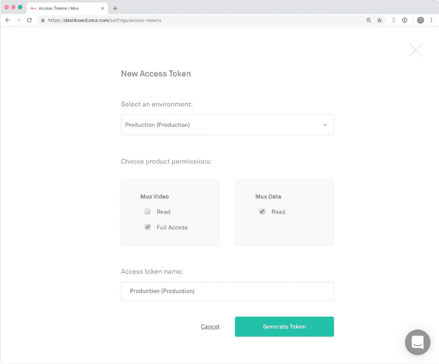
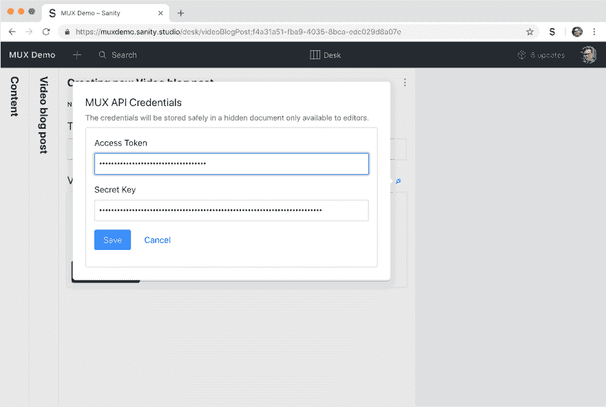

# Mux 视频插件入门

> 原文：<https://dev.to/sanity-io/get-started-with-the-mux-video-plugin-for-sanity-4k2a>

在构建 Sanity 时，我们非常重视构建一个超级灵活的图像管道，可以为您转换和重新裁剪您的图像。我们无意在视频领域做同样的事情。

当 Mux 向我们寻求与他们的视频流和分析平台集成时，我们毫不怀疑这将是一个很好的选择。

## Mux 是谁？

Mux 于 2015 年由乔恩·达尔、史蒂夫·赫弗南、马特·麦克卢尔和亚当·布朗创立。乔恩和史蒂夫是被 Brightcove 收购的 Zencoder 的联合创始人。与来自 YouTube、Twitch、Brightcove 和脸书的工程师团队一起，他们现在领导着网络上最好的基于云的视频服务之一。

Mux 是一个 API 优先的视频平台，用于流媒体和分析。让它们与众不同的是它们的自我优化编码和传输技术。该服务为您的用户提供适应设备和网络条件的高质量流。你还可以获得视频表现的透明度。多路复用器通过多路复用器数据轻松实现这一点，为您实时提供详细的视频性能指标。

Mux 的性能和功能非常出色。使用 Mux 存储您的全分辨率主文件，并请求您需要的任何格式——HLS 用于流式传输，MP4 用于下载。需要的话甚至 GIF。从你的前端、应用程序和数字服务中，你可以准确地请求你需要的格式。

## mux-video 插件入门

Mux 插件为你提供了一种简单的上传和预览视频的方式。

### 安装

在您的 Sanity 项目文件夹中运行此命令:

### 在模式中使用

要使用 Mux 视频输入，您需要创建一个字段，并使用`mux.video`表示`type`。

```
 export default {
      name: 'catVideos',
      type: 'mux.video'
    } 
```

### 添加 API 键

[注册 Mux](https://dashboard.mux.com/signup?type=video) (如果你告诉他们"`sanity"`，他们会给你价值 50 美元的✨).积分如果你还没有一个关于理智的项目- [我们也有一个特别的提议](https://www.sanity.io/mux)。

[](https://res.cloudinary.com/practicaldev/image/fetch/s--vOwWWVYA--/c_limit%2Cf_auto%2Cfl_progressive%2Cq_auto%2Cw_880/https://cdn.sanity.img/3do82whm/production/c0152715592e6ac54fe9b6724fb44d34d15fa3b6-2594x2150.png%3Fw%3D1000) 令牌需要完全权限才能上传文件

登录 Mux 后，在设置菜单中找到[“访问令牌”页面。通过对多路复用器视频的**完全访问* *和对多路复用器数据的** **和**读取* *来生成新令牌，并为下一步做好准备。](https://dashboard.mux.com/settings/access-tokens)

回到 Sanity Studio，找到显示视频字段的文档，然后单击插件图标🔌在上粘贴您的访问令牌和密钥。

[](https://res.cloudinary.com/practicaldev/image/fetch/s--rRKzhWNq--/c_limit%2Cf_auto%2Cfl_progressive%2Cq_auto%2Cw_880/https://cdn.sanity.img/3do82whm/production/5dfa94404683d70455320b3572009de0eaf2db0e-2284x1534.png%3Fw%3D2000%26h%3D2000%26fit%3Dmax) 输入你的 Mux API 凭证

### 上传视频

上传视频很简单:使用选择按钮打开系统上的文件资源管理器，将文件直接拖到输入区域，或者将 URL(就像我在视频中所做的那样)粘贴到字段中的视频。上传完成后，您可以选择想要预览的缩略图。查看 codesandbox 中的视频，了解它是如何工作的。

[https://codesandbox.io/embed/rl7q3x473p](https://codesandbox.io/embed/rl7q3x473p)

### 用 GROQ 查询

在本例中，我们添加了 Mux 视频作为富文本中的自定义块。然后，我们可以使用 GROQ 在前端生成流的 URL。在这里，我们还使用串联来获得现成的流 URL。

```
 [*_type == "post"]{
      ...,
      text[]{
        ...,
          _type == "muxVideo" => {
            ...,
            asset->{
                ...,
                "url": "https://stream.mux.com/" + playbackId
                }
            }
        }  
    } 
```

如果我们从这个查询的响应中挑选出资产数据，我们将得到类似这样的结果:

```
 {  "_key":  "121c8c30a649",  "_type":  "muxVideo",  "asset":  {  "_createdAt":  "2018-11-30T18:27:21Z",  "_id":  "066e45f9-e2e6-4537-8b40-05f8c0f334d9",  "_rev":  "0xLJdqcI4pgly0b1J2cj0o",  "_type":  "mux.videoAsset",  "_updatedAt":  "2018-11-30T18:27:27Z",  "assetId":  "KdUXsmAKryppWd1wPiAtNVhMIqc7cPmL",  "data":  {  "aspect_ratio":  "16:9",  "created_at":  "1543602441",  "duration":  28.233333,  "id":  "KdUXsmAKryppWd1wPiAtNVhMIqc7cPmL",  "master_access":  "none",  "max_stored_frame_rate":  30,  "max_stored_resolution":  "HD",  "mp4_support":  "none",  "passthrough":  "066e45f9-e2e6-4537-8b40-05f8c0f334d9",  "playback_ids":  [  {  "id":  "NZQMBbYtVa6pDebOjB8wXRNQvao3RWrv",  "policy":  "public"  }  ],  "status":  "ready",  "tracks":  [  {  "duration":  28.142585,  "id":  "Tcte02pHV5iGVYDUqGX5hiT5XqgB8pMym",  "max_channel_layout":  "stereo",  "max_channels":  2,  "type":  "audio"  },  {  "duration":  28.166,  "id":  "ocguJveQvPh95zPcnuitsLLXvLYaTAMwPfgDoqFLD01Q",  "max_frame_rate":  30,  "max_height":  1080,  "max_width":  1920,  "type":  "video"  }  ]  },  "filename":  "upload video with mux.mp4",  "playbackId":  "NZQMBbYtVa6pDebOjB8wXRNQvao3RWrv",  "status":  "ready",  "url":  "https://stream.mux.com/NZQMBbYtVa6pDebOjB8wXRNQvao3RWrv"  }  } 
```

与我们的图像管道一样，我们确保元数据随时可用。这意味着您也可以通过所有这些键轻松地查询视频资产。例如，查询`[*_type == "mux.videoAsset" && data.aspect_ratio == "16:9"]`是否会返回所有具有信箱宽高比的上传视频。

### 视频在前端播放

拼图的最后一块是把你的视频给你的终端用户。你可以将 Mux 上的视频与各种东西整合在一起，无论是网络、应用程序、电视平台，还是通过向用户提供 mp4 下载来实现离线。我们为 React 制作了一个视频播放器，它很容易集成到您的项目中。在 GitHub 或下面的 CodeSandbox 中查看。

[https://codesandbox.io/embed/rl7q3x473p](https://codesandbox.io/embed/rl7q3x473p)

### 第一类视频支持

我们非常高兴 Mux 向我们伸出援手，在视频支持方面，我们可以站在他们的肩膀上。我们正计划进一步改进集成，我们很想看看你会用它做什么。如果想更深入地了解如何在网络前端集成 Mux，请查看我们在 ZEIT 的朋友们的博客文章，[他们刚刚使用 Mux](https://zeit.co/blog/new-zeit-tv) 发布了他们的新平台 ZEIT TV。

最后，一个猫的视频。因为每个人的视频档案里都应该至少有一个猫的视频。

[https://codesandbox.io/embed/m39x831qp](https://codesandbox.io/embed/m39x831qp)

[来源](https://www.sanity.work/blog/first-class-responsive-video-support-with-the-new-mux-plugin)