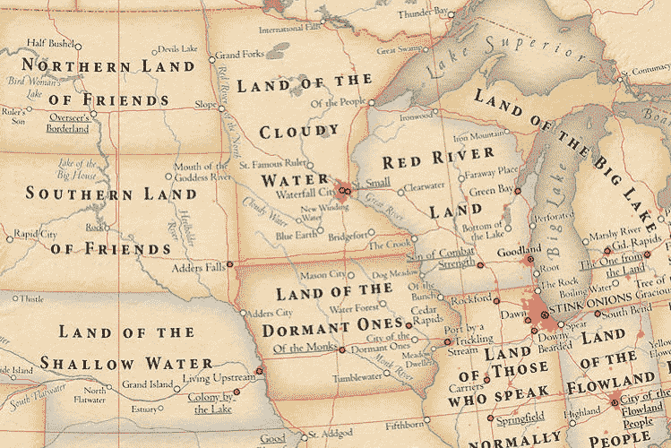

# JavaScript:数据结构(第 3 部分-映射)

> 原文：<https://dev.to/banesag/javascript-data-structures-part-3---maps-149i>

[](https://res.cloudinary.com/practicaldev/image/fetch/s--uNFHloLK--/c_limit%2Cf_auto%2Cfl_progressive%2Cq_auto%2Cw_880/https://thepracticaldev.s3.amazonaws.com/i/wr9qh71d9c1ocm58ohzw.jpg)

### 映射数据结构

这是我的数据结构系列的第三部分，也是最后一部分，这一部分与前一部分一样，[数组](https://dev.to/banesag/javascript-data-structures-part-1-4eb5)(第 1 部分)和[集合](https://dev.to/banesag/javascript-data-structures-part-2-40cc)(第 2 部分)涵盖了另一种组织数据的方法，因此可以有效地使用它，这样您的编码就可以按照预期的方式流动。

Maps 数据结构提供了一种保存键和值对列表的便捷方式。起初，地图数据结构看起来像 JavaScript 对象，但是您可以区分它们，因为:

对象使用字符串作为键值，映射可以使用任何数据类型作为键。
·对象有可调用的方法，原型用作链；另一方面，映射只关注键值对的存储和检索。
可以直接访问对象值，但是在地图中，它们限制您使用 get()方法，因此您可以检索任何值。

**创建地图**

您可以使用 new 运算符和 map()构造函数:
创建一个空的地图对象

```
const romanNumbers = new Map( ); 
```

**地图文字符号**

创建地图没有文字符号，我在研究中唯一发现的是有一些提议语法，但现在还没有正式化。

您将需要使用构造函数并传递一个 iterable(一个数组文字):

***例如:***

```
const map = new Map([[“foo”, “Foo”], [“bar”, “Bar”, …]);
const set = new Set([“Foo”, “Bar”, …]); 
```

**添加条目**

使用 set()方法可以将键和值对添加到映射中。

***例如:***

```
romanNumbers.set(1, ‘l’); // The first value is the key, and second is the value.
<< Map (1 => ‘l’) // The “hash rocket” symbol (=>) represents the map connection between the key and the value. 
```

**多个条目**

通过重复调用 set()方法，可以添加多个条目。

***例如:***

```
romanNumbers.set(2, ‘II’) .set(3, ‘III’) .set(4, ‘IV’) .set(5, ‘V’);
<< Map { 1 => ‘I’, 2 => ‘II’, 3 => ‘III’, 4 => ‘IV’, 5 => ‘V’ } 
```

***地图方法***

在 Maps 中，您可以通过使用 get()方法根据键来查找值。

***例如***

```
romanNumbers.get (4);
<< ‘IV’ 
```

使用 has()方法可以查看特定的键是否在映射中，该方法将返回一个布尔值(true 或 false)。

***例如:***

```
romanNumbers.has(5);
<< true

romanNumbers.has(10);
<< false 
```

还可以通过使用嵌套数组作为参数来添加多个值。

***例如:***

```
const heroes = new Map([ [‘Clark Kent’, ‘Superman’], [‘Bruce Wayne’, ‘Batman’] ]); 
```

您可以使用 size 属性在映射中查找键和值对的数量:

***例如:***

```
heroes.size
<< 2 
```

**删除条目**

通过使用 delete()方法，可以从映射中删除一个键及其值。

***例如:***

```
heroes.delete(‘Clark Kent’); // To delete a value you need to specify it in the parentheses 
<< true // Will return a Boolean of true if the value was return, or false if not

heroes.size;
<< 1 
```

另一方面，如果您使用 clear()方法，它将同时删除键及其值。

***例如:***

```
heroes.clear( );

heroes.size;
<< 0 
```

**将地图转换成数组**

```
[ ...romanNumbers]
<< [ [1, 'I'], [2, 'II'], [3, 'III'], [4, 'IV'], [5, 'V'] ]

Array.from(romanNumbers)
<< [ [1, 'I'], [2, 'II'], [3, 'III'], [4, 'IV'], [5, 'V'] ] 
```

**结论**

地图数据结构不是用来替换对象的，它的用途取决于你要执行什么操作或者你要处理什么数据。当你只需要一个简单的查找结构来存储数据时，映射比对象更有用。

希望这篇文章能有所帮助。