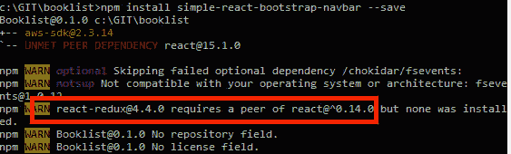

# node.js 项目中的对等依赖是什么

> 原文：<https://dev.to/btdev/what-are-those-peerdepenedencies-in-a-nodejs-project-51jo>

*PeerDependencies* ，当我在终端中收到如下 PeerDependency 警告时，这个术语至少给我带来了困惑:

[](https://res.cloudinary.com/practicaldev/image/fetch/s--mr5Ay_LK--/c_limit%2Cf_auto%2Cfl_progressive%2Cq_auto%2Cw_880/https://thepracticaldev.s3.amazonaws.com/i/3saoi2jo707mx6uzzqrg.jpg)

最近发生的关于节点包中恶意代码攻击的事件大量包含了对等依赖的主题，这最终使我对这个主题产生了好奇，并开始对对等依赖如何工作进行更深入的研究。在这篇博文中，我将写下我对 NodeJS 对等依赖的发现，这也可能有助于你更好地理解这个主题。

当然，使用谷歌搜索`"What are peer dependencies"`会返回一些结果。然而，谷歌返回的主要参考文献都没有让我满意地理解对等依赖。过了一段时间，我发现这个 [Stackoverflow 页面](https://stackoverflow.com/questions/26737819/why-use-peer-dependencies-in-npm-for-plugins/34645112#34645112)包括一个伟大的 PeerDependency 解释 [Stijn De Witt](https://stackoverflow.com/users/286685/stijn-de-witt) 。他的解释非常接近一个版本，让我理解了对等依赖的基础，并提出了一些想象的“啊哈！”瞬间(谢谢 Stijn！).但不知何故，由于我更像是一个视觉学习型的人，Stijn 的“文本驱动”Stackoverflow 解释并没有给我带来想象中的理解同伴依赖性的最后一英里的满足感。因此，我在他的解释周围画了一些代码(你可以在下面看到引用)，突然事情对我来说变得更清楚了。

## 有什么问题吗？

前期:在接下来的例子中，`JillsModule`将是流程中棘手的部分(随后是 PeerDependency)。所以我在用的时候加了虚构版追加(@1.0，@2.0)。

> 假设我们正在构建`OurCoolProject`，并且正在使用`JacksModule`和`JillsModule@2.0`。让我们假设`JacksModule`也依赖于 JillsModule，但是依赖于不同的版本，比如说`JillsModule@1.0`。只要那 2 个版本不符合，就没有问题。事实上,`JacksModule`在表面下使用`JillsModule`,这只是一个实现细节。我们正在捆绑`JillsModule`(因为代码使用了两个不同的版本，但是彼此不相关。))两次，但当我们获得开箱即用的稳定软件时，这是一个很小的代价。

在代码中，这意味着类似于

```
// OurCoolProcject.js

import JacksModule from 'jacksmodule';
import JillsModule(@2.0) from 'jillsmodule(@2.0)';

const OurCoolProcject = () => {
    // do some stuff with JacksModule
    // do some stuff with JillsModule(@2.0). stuff won't break as we have the compatible @2.0 version of JillsModule available in this scope.
}

export default OurCoolProject; 
```

Enter fullscreen mode Exit fullscreen mode

```
// jacksmodule.js (an npm module)

import JillsModule(@1.0) from 'jillsmodule(@1.0)';

const JacksModule = () => {
    // do some stuff with JillsModule(@1.0). stuff won't break as we have the compatible @1.0 version of JillsModule available in this scope.
}

export default JacksModule; 
```

Enter fullscreen mode Exit fullscreen mode

但是接下来这种依赖关系变得更加棘手。

> 现在让我们假设`JacksModule`以某种方式公开了它对`JillsModule`的依赖。例如，它接受一个`object instanceof JillsClass`...当我们使用 2.0 版本的库创建一个`new JillsClass`并将其传递给`jacksFunction`时会发生什么(我们知道 1.0 版本除外！)?一切都将失控！像`jillsObject instanceof JillsClass`这样简单的东西会突然返回`false`，因为`jillsObject`其实是另一个`JillsClass`的实例，2.0 版本。

在代码中，这意味着这样的事情:

```
// OurCoolProcject.js

import jacksFunction from 'jacksmodule';
import JillsModule(@2.0) from 'jillsmodule(@2.0)'; // node resolves to OUR dependency of JillsModule which is 2.0!

const OurCoolProcject = () => {    
    const jillsObject = new JillsModule(@2.0).JillsClass;

    // next the beginning of all evil, we'll pass a jillsObject of version 2.0
    // to jacksFunction (that would expect jillsObject of version 1.0 🤦‍♀️)
    jacksFunction(jillsObject); 
}

export default OurCoolProject; 
```

Enter fullscreen mode Exit fullscreen mode

```
// jacksmodule.js (an npm module)

import JillsModule(@1.0) from 'jillsmodule(@1.0)';

const jacksFunction = (jillsObject) => {
    // make sure jillsObject is compatible for further usage in this function
    const jillsObjectRocks = jillsObject instanceOf JillsModule(@1.0).JillsClass;
            // └─> 🔥🔥🔥 `jillsObjectRocks` will be a big, fat FALSE
            // as the JillsModule dependencies actively used in this function and
            // passed to this function differ in versions (1.0 vs. 2.0) 🤦‍♀️
    ...
}

export default jacksFunction; 
```

Enter fullscreen mode Exit fullscreen mode

你注意到这里发生了什么吗？`jacksFunction`收到一个不兼容的`jillsObject`，因为该对象是从 JillsModule(2.0)构建的，而不是从 JillsModule(1.0) `JacksModule`构建的。到目前为止，*这只显示了问题*在最坏的情况下，导致软件无法工作。

## 对等依赖如何解决这个问题

幸运的是，npm 有一些内置的智能来解决这个问题。如果 JacksModule 将 JillsModule(@1.0)声明为 PeerDependency，npm 会在安装项目的依赖项时向用户发出警告。所以 JacksModule 的`package.json`应该包含这个声明:

```
{
  "name": "JacksModule",
  ...
  "peerDependencies": {
    "JillsModule": "1.x"
  },
  ...
} 
```

Enter fullscreen mode Exit fullscreen mode

因此，npm 的 PeerDepenedency 智能基本上触发了一个控制台输出，通知我们的开发人员，并警告说:

嘿，我是杰克逊模块。让我告诉你:我需要 JillsModule 的这个特定包，但我真的需要属于我的 JacksModule 项目并在我的 package.json 文件中列出的版本。因此，请确保它已安装，并确保它不是您可能在应用程序的其他地方安装的供您自己使用的 JillsModule 的其他版本。

所以最终——进一步考虑——依赖需要对等依赖的 npm 包可能会很棘手。如果您需要一个新版本的包 X 在您的应用程序中单独使用，这可能会导致问题，如果您在应用程序中使用的另一个依赖项对包 X 的另一个版本有对等依赖关系。如果这种情况出现——在最坏的情况下也会导致您的软件出现问题——您需要自己决定使用哪个包或哪个代码可能需要重构来满足所有要求。

我希望这些解释和代码示例对您有意义，并弥合了您对对等依赖的最后一个思想鸿沟。如果你有问题或想建议一些文章优化，随时联系我或留下评论。

这个帖子是[最初贴在这里](https://manpenaloza.dev/what-are-those-peerdepenedencies-in-a-nodejs-project/)。