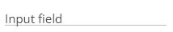
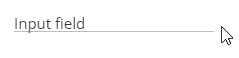
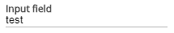
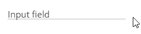
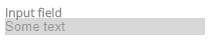
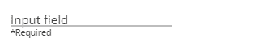

# 易访问性优先:文本输入

> 原文：<https://dev.to/link2twenty/accessibility-first-text-input-1l7l>

在我开始之前，我应该让你知道我将使用[:占位符显示的](https://developer.mozilla.org/en-US/docs/Web/CSS/:placeholder-shown)。

> 这是一项 **[实验技术](https://developer.mozilla.org/en-US/docs/MDN/Contribute/Guidelines/Conventions_definitions#Experimental)**
> 在生产中使用之前，请仔细检查[浏览器兼容性](https://developer.mozilla.org/en-US/docs/Web/CSS/:placeholder-shown#Browser_compatibility)表。

虽然它已经在 Firefox 和 Chrome 上实现，但 Edge 尚未开始开发这项技术。也就是说，如果不使用 Javascript，就没有其他方法可以做到这一点。

## 我们要创造什么？

今天我们想做一个材质设计输入框，可以处理所有的输入状态，不使用任何 Javascript。

[https://jsfiddle.net/link2twenty/ax96j04y//embedded/result//dark](https://jsfiddle.net/link2twenty/ax96j04y//embedded/result//dark)

## 标记

如果你读过这个系列的第一篇文章，你可能会开始认出我的“风格”。我喜欢有一个标签元素来包装我的输入，然后有一些跨度，我可以稍后动画。

```
<label class="md_textbox">
  <input type="text" placeholder="Input field"/>
  <span class="md_textbox__label">Input field</span>
  <span class="md_textbox__line"></span>
</label> 
```

Enter fullscreen mode Exit fullscreen mode

你会注意到这里有一些重复，从技术上来说，我们可以有`placeholder=" "`而不是整个字符串，但是为你的 CSS 失败做好准备是很好的。

[https://jsfiddle.net/link2twenty/wnLmxqb9//embedded/html,result//dark](https://jsfiddle.net/link2twenty/wnLmxqb9//embedded/html,result//dark)

## 样式

就像我上一篇文章中的切换一样，我们的风格需要支持几个状态，它们是:

*   空的
*   聚焦的
*   包含有效文本
*   包含无效文本
*   有缺陷的
*   需要
*   只读

### 空无一人(大部分的跑腿工作都在这里完成)

首先，我将导入一个材质外观的开放 San，并设置我通常的显示和边距设置。

```
@import url(http://fonts.googleapis.com/css?family=Open+Sans);
.md_textbox {
  display: inline-flex;
  position: relative;
  font-family: "Open Sans";
  align-items: center;
  margin: 1.2em 0.6em 0.9em 0.6em;
} 
```

Enter fullscreen mode Exit fullscreen mode

现在我们只希望显示我们的`.md_textbox__label`,而不是占位符文本，所以让它不可见。

```
.md_textbox [type=text]::placeholder {
  color: rgba(0, 0, 0, 0)
} 
```

Enter fullscreen mode Exit fullscreen mode

接下来，我们希望我们的标签在占位符的位置，所以我们给它一个绝对位置，并把它移到左边。当我们这样做的时候，我知道我想让这一行也在最左边，并为错误信息留出空间，所以让我们把它们捆在一起。

我知道他们都需要动画，所以我给了他们一个过渡，这是从材料设计规格。

```
.md_textbox .md_textbox__label,
.md_textbox .md_textbox__line,
.md_textbox .md_textbox__line::before {
  position: absolute;
  transition: transform 150ms cubic-bezier(0.4, 0.0, 0.2, 1);
  left: 0;
} 
```

Enter fullscreen mode Exit fullscreen mode

好了，我们还有一点内务要做，当我们将鼠标放在替换占位符上时，我们仍然应该看到文本光标，现在是时候为该文本设置颜色了。我们也知道在移动标签时需要缩放标签，但是我们想从左边开始缩放，所以我们也把它添加到代码中。

```
.md_textbox .md_textbox__label {
  transform-origin: 0 50%;
  cursor: text;
  color: #424242;
} 
```

Enter fullscreen mode Exit fullscreen mode

现在让我们为这条线做准备，我们需要把它放在底部，并给它一个颜色。对于动画，我想我们会使用一个变换，所以让我们用`scale(0, 1)`初始化元素，这样它就隐藏了。

```
.md_textbox .md_textbox__line {
  bottom: 0;
  height: 2px;
  width: 100%;
  transform: scale(0, 1);
  background: #00897B;
} 
```

Enter fullscreen mode Exit fullscreen mode

这是我们开始设计实际的文本框之前的最后一项工作，我们知道将会有一个错误消息槽，所以让我们来定位它。我们将不包括内容，所以它实际上不会呈现任何东西。

```
.md_textbox .md_textbox__line::before {
  content: '';
  margin-top: 2px;
  font-size: 0.7em;
} 
```

Enter fullscreen mode Exit fullscreen mode

最后，我们可以设计我们的文本框。我将使它更宽一点，删除默认边框，删除轮廓，我通常不喜欢这样做，但我们将以另一种方式显示焦点，使背景透明，并在我们的文本下添加一条线。

```
.md_textbox [type=text] {
  width: 200px;
  outline: none;
  border: none;
  border-bottom: 1px solid #BDBDBD;
  background: rgba(0, 0, 0, 0);
} 
```

Enter fullscreen mode Exit fullscreen mode

唷，那有很多 css，将近 50 行，我们的输入甚至还没有功能，也就是说我们现在已经把大部分的样式都处理掉了。

[](https://res.cloudinary.com/practicaldev/image/fetch/s--CBtpafps--/c_limit%2Cf_auto%2Cfl_progressive%2Cq_auto%2Cw_880/https://thepracticaldev.s3.amazonaws.com/i/x4pu6p6eq9zhpgxllyq9.png)

### 专注

当我们关注文本框时，我们希望发生两件事，一是我们希望标签移开，这样我们可以看到我们在哪里输入，二是我们希望在元素下出现一条粗线，让我们知道它被关注了。

要移动标签，我们将使用一个变换，我们也应该使它小一点，但使文本加粗和“活跃”的颜色。

```
.md_textbox [type=text]:focus~.md_textbox__label {
  transform: translateY(-1em) scale(0.8);
  font-weight: bold;
  color: #00897B;
} 
```

Enter fullscreen mode Exit fullscreen mode

为了让这条线出现，我们只需要设置比例，从之前的，回到 1，就像这样

```
.md_textbox [type=text]:focus~.md_textbox__line {
  transform: scale(1);
} 
```

Enter fullscreen mode Exit fullscreen mode

这就是我们聚焦所需要做的，简单得多。

[](https://res.cloudinary.com/practicaldev/image/fetch/s--GcXs8ESE--/c_limit%2Cf_auto%2Cfl_progressive%2Cq_66%2Cw_880/https://thepracticaldev.s3.amazonaws.com/i/khvi7o4xujwxq1xmcmu8.gif)

### 包含有效文本

这一点甚至更简单，但它是第一个使用`:placeholder-shown`的部分，所以要知道对这个特性的支持还不是很大。

我们只需要去掉标签，不需要重新着色。

```
.md_textbox [type=text]:not(:placeholder-shown)~.md_textbox__label {
  transform: translateY(-1em) scale(0.8);
  font-weight: bold;
} 
```

Enter fullscreen mode Exit fullscreen mode

[](https://res.cloudinary.com/practicaldev/image/fetch/s--za-omFGe--/c_limit%2Cf_auto%2Cfl_progressive%2Cq_auto%2Cw_880/https://thepracticaldev.s3.amazonaws.com/i/ekvnjxcne1dlf1dn51i7.png)

让我解释一下`[type=text]:not(:placeholder-shown)`实际上是做什么的。
`[type=text]`选择输入，`:not()`反转圆括号内的逻辑，`:placeholder-shown`仅在有占位符时应用样式，输入文本时占位符被隐藏，因此`:placeholder-shown`变为假。

`[type=text]:not(:placeholder-shown)`对于**文本框**如果占位符是**而不是**显示应用这些样式。

### 包含无效文本

对于无效的样式，我们希望显示一条消息，上面写着“无效输入”,并且我们希望在它上面显示一些红色来暗示一个错误。

首先，我们将显示底线，并将其设为红色。

```
.md_textbox [type=text]:invalid~.md_textbox__line {
  background: #B00020;
  transform: scale(1);
} 
```

Enter fullscreen mode Exit fullscreen mode

让我们把标签也变成红色

```
.md_textbox [type=text]:invalid~.md_textbox__label {
  color: #B00020;
} 
```

Enter fullscreen mode Exit fullscreen mode

现在让我们添加错误消息，如果你记得我们已经为它留出了空间，所以我们需要做的就是添加内容，也许是给它着色。我知道我们会让它变红。

```
.md_textbox [type=text]:invalid~.md_textbox__line::before {
  content: 'Invalid input';
  color: #B00020;
} 
```

Enter fullscreen mode Exit fullscreen mode

[](https://res.cloudinary.com/practicaldev/image/fetch/s--Y-U4Ilku--/c_limit%2Cf_auto%2Cfl_progressive%2Cq_66%2Cw_880/https://thepracticaldev.s3.amazonaws.com/i/2qzhea3dg4vq7s1u4gxk.gif)

### 禁用

当我们禁用文本框时，我们需要向用户显示他们不能点击该元素。键盘用户很幸运，因为禁用的文本框会被跳过。

为了显示它是禁用的，我决定让整个元素稍微半透明，并把实际的文本框染成浅灰色。我还会把光标改成`not-allowed`。

```
.md_textbox [type=text]:disabled {
  cursor: not-allowed;
  border: none;
  background: #BDBDBD;
  opacity: 0.6;
}

.md_textbox [type=text]:disabled~.md_textbox__label {
  cursor: not-allowed;
  opacity: 0.6;
} 
```

Enter fullscreen mode Exit fullscreen mode

[](https://res.cloudinary.com/practicaldev/image/fetch/s--994x8e9y--/c_limit%2Cf_auto%2Cfl_progressive%2Cq_auto%2Cw_880/https://thepracticaldev.s3.amazonaws.com/i/ab9g4eciti1rkbntnmxe.png)

### 必填

当一个输入为空，但具有所需的属性时，它返回无效，因此我们需要将`:required`放在 CSS 的后面，这样我们就可以覆盖由`:invalid`设置的样式。

我们希望更改文本内容和颜色，我们将颜色更改为我们一直使用的标准灰色，并将文本更改为“*Required”。

```
.md_textbox [type=text]:invalid:required~.md_textbox__line::before {
  content: '*Required';
  color: #424242;
} 
```

Enter fullscreen mode Exit fullscreen mode

线条和标签也将显示为红色，因此让我们也将它们改回其通常的颜色。

```
.md_textbox [type=text]:required:placeholder-shown:not(:focus)~.md_textbox__line {
  background: #BDBDBD;
}

.md_textbox [type=text]:required:placeholder-shown:not(:focus)~.md_textbox__label {
  color: #424242;
} 
```

Enter fullscreen mode Exit fullscreen mode

当它们被聚焦或填充时，我们不介意`:invalid`、`:focus`或`:not(:placeholder-shown)`样式接管，所以我使用`:placeholder-shown:not(:focus)`来指定这些状态不包括在内。

你会注意到我们在悬停文本上获得了一些额外的好处，这就是依赖平台的乐趣。

[](https://res.cloudinary.com/practicaldev/image/fetch/s--8GnOP89O--/c_limit%2Cf_auto%2Cfl_progressive%2Cq_66%2Cw_880/https://thepracticaldev.s3.amazonaws.com/i/qn165j3eie3t9smban6b.gif)

### 只读

只读和禁用的区别在于只读仍然在选项卡索引中。我们需要向用户展示他们不能编辑文本，但他们仍然可以选择它。

老实说，我不确定我是否做到了这一点，所以希望得到一些关于如何改进的反馈。

我所做的是删除文本框的底部边框，并确保这条线永远不会出现。

```
.md_textbox [type=text]:read-only {
  border: none;
}

.md_textbox [type=text]:read-only~.md_textbox__line {
  transform: scale(0, 1);
} 
```

Enter fullscreen mode Exit fullscreen mode

这一点我不太确定，当没有文本出现，用户关注文本框时，我决定保持动画。

```
.md_textbox [type=text]:read-only:placeholder-shown~.md_textbox__label {
  transform: translateY(0) scale(1);
} 
```

Enter fullscreen mode Exit fullscreen mode

## 整理完毕

[https://jsfiddle.net/link2twenty/ax96j04y//embedded/result,html,css//dark](https://jsfiddle.net/link2twenty/ax96j04y//embedded/result,html,css//dark)

在未来的 CSS 规范中，我们有 [`:has()`](https://drafts.csswg.org/selectors-4/#relational) ，尽管它还不被任何浏览器支持。有了它，我们就可以做类似于
的事情了

```
.md_textbox:has(> [type=text]:not(:placeholder-shown))::after {
  bottom: 0;
  height: 2px;
  width: 100%;
  transform: scale(0, 1);
  background: #00897B;
} 
```

Enter fullscreen mode Exit fullscreen mode

这意味着我们可以很容易地删除我们的跨度，但这是另一个职位。