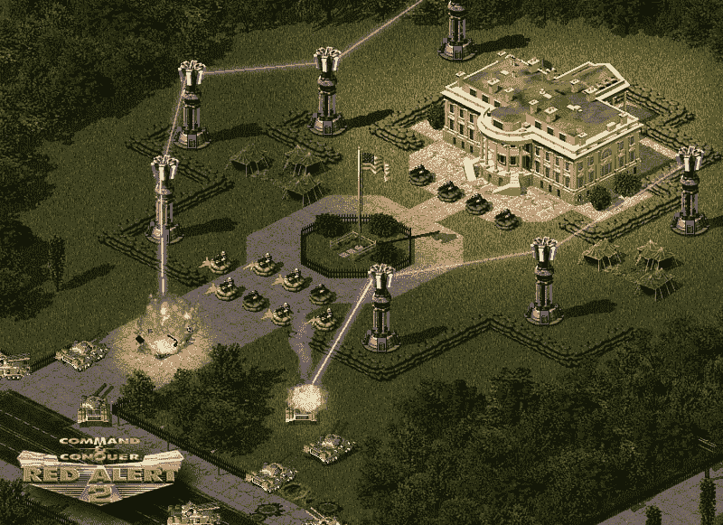
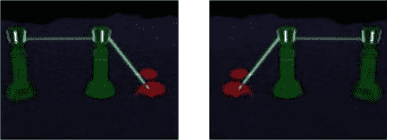

# RA2 棱镜塔阐释的范畴理论

> 原文：<https://dev.to/drbearhands/category-theory-illustrated-by-ra2-prism-towers-3301>

尽管我已经写了一篇有点正式的关于范畴理论的文章，我意识到一种更有启发性的思考范畴理论的方式是使用红色警戒 2 的棱镜塔。

<figure>

<figcaption>Prism towers defending the white house in RA2</figcaption>

</figure>

对于那些从来没有玩过 RA2 的人来说:(a)我们不能成为朋友，(b)棱镜塔会射出彩色的死亡射线，并且有能力穿透对方，所以如果一个塔在另一个塔的范围内，它也在第二个塔范围内的所有东西的范围内(见图片)。

因此，RA2 的单位和建筑是 CT 中的对象，CT 中的箭头表示“在棱镜塔的范围内”。

现在我们知道，如果棱镜塔 B 在棱镜塔 A 的范围内，苏联坦克 C 在棱镜塔 B 的范围内，棱镜塔 A 可以射击苏联坦克 C。如果我们假设棱镜塔在其自身的范围内，我们可以将一组棱镜塔(及其目标)称为一个类别，因为我们有组成和身份。

## 棱柱塔函子

棱柱塔网络也可以有函子。移动、旋转和镜像网络不会改变其连接方式。但是把网络(的一部分)压缩到一个点也不行。现在我知道把建筑物叠放在一起是作弊，但这很难被基洛夫飞艇抵制，所以我会允许。

任何不改变网络连通性的变换都是函子，即使这在某种程度上减少了塔的数量。例如，当将网络折叠成一条单点线时，您可以将变换后占据相同正方形的塔减少到 1 个。

<figure>

<figcaption>Sovjets ground forces still die when attacking form the other side!</figcaption>

</figure>

因此，如果一个函子`F`的意思是“向北移动 5 个街区”，棱镜塔`F a`就是棱镜塔`a`以北 5 个街区。

在 FP 中我们要求`map : (a -> b) -> F a -> F b`，用棱镜塔表示:如果棱镜塔`a`可以到达棱镜塔`b`，那么变换后的棱镜塔`F a`可以到达变换后的棱镜塔`F b`。*还有一些关于保持身份和组成的东西，但我现在会忽略它，主要是因为我很难想到一个*而不是*能做到这一点的转换。*

## 防空单胞菌。

单子有点棘手。它们必须是内函子，也就是说，在每个棱柱塔和它的变形对应物之间必须有联系。另外，多次应用转换应该与应用一次具有相同的结果(达到同构)。我能想到的唯一能做到这一点的空间转换是同一性，但那是欺骗。

所以假设相反，我们升级棱镜塔向上发射*(去你的基洛夫飞艇！)*。任何一个规则的棱柱塔都可以在相同的位置连接到一个 AA 棱柱塔，所以它是一个 endofunctor，将`anti_air`设置为 true 两次和做一次没有区别，这意味着它是一个单子。

所以让我们来看看单子的 FP 定义:`andThen : (a -> M b) -> M a -> M b`。
用棱镜塔表示:如果棱镜塔`a`可以到达 AA 棱镜塔`M b`，那么`a`升级 AA ( `M a`)后仍然可以到达`M b`。

PS。:我已经编辑了我的上一篇文章，所以如果之前写得太多，你可能会想再看一看。