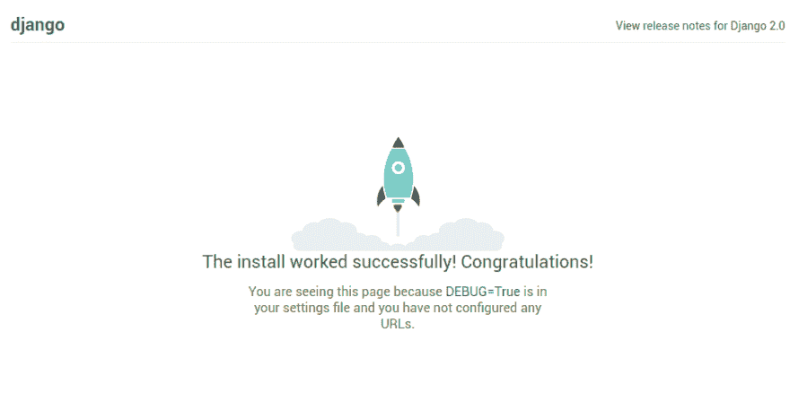

# 笑博客教程第 1 部分-项目结构

> 原文：<https://dev.to/achiengcindy/laughing-blog-tutorial-part-1-project-structure-21fi>

我的程序员之旅给了我一个宝贵的教训:要有效地学习如何编写和理解编程概念，永远不要低估构建现实生活中的应用程序的价值。我记得我熬夜试图掌握编程的概念。但是为了让这些概念得以坚持，我踏上了创建[achiengcindy.com](https://achiengcindy.com)的旅程，并与大家分享我的旅程。

这个系列教程的目的是在 Django 中创建一个功能齐全的博客。

#### 概述

我们将实施以下功能:

*   注册和认证
*   时事通讯
*   发送电子邮件
*   评论系统
*   社交媒体分享

代码可以在 [github](https://github.com/achiengcindy/laughing_blog) 上找到。

如果你坚持下去，你也可以创建自己的博客，甚至从中获利。

**先决条件**

*   基本的 Git 知识
*   github 或 bitbucket 帐户。如果你没有，在 [github](https://github.com) 或 [bitbucket](https://github.com) 上免费创建一个
*   姜戈基础。如果你是 django 的新手，可以看看我之前关于 Linux 中的 Django 环境的教程。
*   首选文本编辑器。我将使用崇高的文字。你可以在这里下载[。](https://www.sublimetext.com/3)

#### 建立笑博项目

在本教程中，你将学习如何创建 Django 项目结构，学习`git`和一些非常有用的 python 库，如`whitenoise`和`python decouple`。

我将使用`pip`和`virtualenv`来创建项目结构，但是，您可以使用 [pipenv](https://achiengcindy.com/blog/2018/04/23/pipenv-new-python-packaging-tool/)

**我们开始吧**

创建一个文件夹，并将其命名为 tutorial，我们的项目将存储在这里。

```
 mkdir tutorial && cd tutorial 
```

很好，接下来我们必须为我们的项目创建一个虚拟环境

```
 virtualenv env -p python3 
```

> 指定 python 版本。我们将使用`python3`

要使用我们的虚拟环境，我们必须**激活**它

```
 source env/bin/activate 
```

激活虚拟环境后。使用下面的命令安装 Django:

```
$ pip3 install django 
```

我们将使用下面的命令创建名为 laughing_blog 的项目:

```
 $ django-admin startproject laughing_blog 
```

如果您将目录更改为 laughing_blog，您应该有这样的结构:

```
laughing_blog
--laughing_blog
----__init__.py
----settings.py
----urls.py
----wsgi.py
--manage.py 
```

把外面的 laughing_blog 改成`src`(它只是一个容纳我们项目的容器)。
要确保 django 成功安装，请使用以下命令运行服务器

```
python manage.py runserver
```

and if all went well,you should see this page:

[](https://res.cloudinary.com/practicaldev/image/fetch/s--R2FxbfhV--/c_limit%2Cf_auto%2Cfl_progressive%2Cq_auto%2Cw_880/https://i.imgur.com/F3GEYtx.png)

现在我们都准备好开始编写代码了。不过有一些配置和库我想介绍一下。

#### Python-解耦

`Python Decouple`将帮助我们将敏感设置从项目中分离出来。在`settings.py`中存储密码和其他敏感信息比如`secret key`不是一个好主意，这就是为什么我们将使用 [python-decouple](https://pypi.python.org/pypi/python-decouple) 。使用以下命令安装它:

```
$ pip3 install python-decouple 
```

成功安装`Python-decouple`之后，在项目的根目录下创建一个. env 文本文件。

**使用 Python 解耦**
**。环境**

这是存储所有敏感信息的文件。到目前为止，我们需要存储我们的密钥和调试状态。它应该是这样的:

```
SECRET_KEY = your key

DEBUG = True
```

**settings.py**

导入`config`对象并将其放置在 `import os`下方。

```
 from decouple import config 
```

这是我的`settings.py.`的一个片段

```
import os
from decouple import config 
```

替换密钥，并使用以下内容进行调试:

```
SECRET_KEY = config('SECRET_KEY'')
DEBUG = config('DEBUG', cast=bool) 
```

#### 去吧

将您的更改推送到远程存储库是很重要的。使用以下命令初始化 git:

```
 $ git init// Initializes git 
```

接下来，我们希望 git 忽略一些带有秘密信息的文件，比如设置、数据库等。现在，创建一个 gitignore 文件并添加。env，*。pyc、db.sqlite3 和其中的任何其他文本文件。要创建 gitignore，请使用以下命令:

```
 $ touch .gitignore 
```

接下来，让我们添加所有的更改，提交和推送

```
 git add *    //adds all changes
 git commit -m "initial commit"
 git remote add origin https://github.com/<your username>/laughing_blog.git 
 git push -u origin master 
```

#### 模板

Html 用于在浏览器上显示数据，而不是 python。Django 是一个 web 框架，它提供了一种通过使用强大的内置模板标签**来动态显示 HTML 的方法**。记住 HTML 是静态的，而 python 是动态的。
Django 模板使我们能够将文档的表示与数据分离开来。
我们可以在 python 代码中嵌入 HTML，但这不是一个好主意，因为:

1.  在大型项目中，前端开发人员处理 HTML，后端开发人员处理 python 是很常见的。如果 HTML 是用 python 代码硬编码的，那么两个开发人员很难同时不受干扰地编辑同一个文件。
2.  在单个应用程序中，您可能需要编写多行 HTML 代码，如果 HTML 是在 python 代码中硬编码的，那么对代码进行故障排除可能会很麻烦。

**设置 Django 模板**

我们希望在项目的根目录中创建模板目录。我们可以通过修改设置来实现这一点。模板-DIRS 通过添加以下内容:

```
"DIRS": [os.path.join(BASE_DIR, 'templates')], 
```

`DIRS`定义了 Django 应该查找模板源文件的目录列表。

让我们创建模板目录，然后创建一个名为**base.html**的文件来包含项目的主 html 结构

```
$ mkdir templates
$ cd templates
   base.html 
```

base.html 的片段

```
 
    <!Doctype html>
    <html>
    <head>
         Laughing blog
    </head>
    <body>
       
    </body>
    </html> 
```

#### 如何在 Django 中提供静态文件

Web 应用程序将需要额外的文件，如 CSS、脚本、应用程序的图像和 `user-uploaded content`如个人资料图片。这些文件可以分为以下几类:

1.  静态文件:应用程序使用的资源，如脚本、图像
2.  媒体文件:这些是用户上传的内容，比如用户资料图片。这个我们以后再说。

**配置静态文件**

在 django 中管理静态文件可能会很复杂，尤其是如果您不熟悉 Django 的话。在`settings.py`中确保 `django.contrib.staticfiles`在`INSTALLED_APPS`中。在大多数情况下，它已经被定义。

**静态 _ 网址**

在`settings.py` 中你会发现这行代码

```
 STATIC_URL = '/static/' 
```

Django 在这里为项目中的特定应用程序提供静态文件。Django 允许你在一个项目中有几个静态文件夹。对于这个项目，我们将在根项目目录中只创建一个静态文件夹，所以让我们配置 **staticfiles-dirs**

**静安定剂 _DIRS**

假设您有一个项目，大多数应用程序共享静态资产，如样式或图像，或者除了绑定到特定应用程序的静态文件之外，您需要额外的静态资产，然后定义`STATICFILES_DIRS`。

`STATICFILES_DIRS` tuple 告诉 Django 去哪里寻找没有绑定到特定应用的静态文件。

```
 STATICFILES_DIRS = [
 os.path.join(BASE_DIR, "static"),
] 
```

在这种情况下，我们只是告诉 Django 也在我们项目的根文件夹中查找名为`static`的文件夹中的静态文件，而不仅仅是在我们的应用程序中。

然后在项目的根文件夹中创建静态目录

```
$ mkdir static 
```

#### 服务开发中的静态文件

安装 `django.contrib.staticfiles`后，运行`runserver`命令自动提供静态文件，否则通过以下方式手动提供:

项目的`urls.py`

```
from django.conf import settings
from django.conf.urls.static import static
urlpatterns = [
     ... 
 ] 
 + static(settings.STATIC_URL, document_root=settings.STATIC_ROOT) 
```

**静态 _ 根**

这是运行`collectstatic` 命令后每个静态文件的存储文件夹。它在一个地方收集所有的静态文件。
让我们告诉 django 将我们所有的静态文件收集到一个名为 **staticfiles** 的文件夹中

```
STATIC_ROOT = os.path.join(BASE_DIR, 'staticfiles') 
```

这在生产中非常重要，而且`whitenoise`处理得非常好。

#### 白化

在生产中管理静态文件甚至更复杂，至少对我来说是这样！为了管理我们的静态文件，我们将安装一个第三方库[白化](http://whitenoise.evans.io/en/stable/django.html)

要安装 whitenoise，请运行:

```
 pip3 install whitenoise 
```

在姜戈使用 whitenoise。我们通过将`settings.py`添加到 django `SecurityMiddleware`下面的`MIDDLEWARE_CLASSES`来编辑`settings.py`

```
MIDDLEWARE = [
    #'django.middleware.security.SecurityMiddleware',
    'whitenoise.middleware.WhiteNoiseMiddleware',
    ...
] 
```

要启用压缩，请添加以下内容:

```
STATICFILES_STORAGE = 'whitenoise.storage.CompressedManifestStaticFilesStorage' 
```

#### 
 [T3】
结论](#conclusion) 

我们创建了虚拟环境，安装了 Django，安装了 Python-decouple，并创建了模板和静态文件目录。我们还创建了 gitignore 文件并添加了。我们创建的 env 文本文件。下期教程再见！