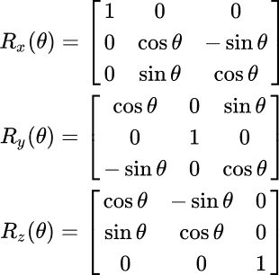

# 关于 3D 多人游戏服务器端物理的思考

> 原文：<https://dev.to/webdva/a-consideration-on-server-side-physics-for-a-3d-multiplayer-game-regarding-rotations-in-3d-space-pc3>

我正在分享我最近在尝试获得制作一个 3D 多人游戏的能力以成功完成我参与的一个项目时获得的见解。

# 实现三维旋转

我目前对三维空间中旋转现象的理解产生了这样的推测，即使用下面所示的旋转形式与单个轴的有序矩阵乘法(如这里的[所述](https://en.wikipedia.org/wiki/Rotation_matrix#Basic_rotations))可能有利于实现服务器端 3D 物理，即由于其综合性和明显的易于实现性。

由于需要管理每个物理实体的九个参数以及矩阵的频繁乘法，使用上述提出的基本旋转形式实现三维旋转可能会导致服务器端物理子系统的技术性能损失。尽管低于标准的技术性能对于这个程序来说是可以接受的，因为性能(或质量)是最灵活的程序约束，但这种技术性能会对可实现的效果数量产生限制，例如大型多人游戏产品。

## 客户端-服务器通信方面

此外，由于从 2D 多人游戏原型的开发中吸取的经验教训，可以预测，随着允许玩家瞄准三维目标的特征的存在，设计将玩家的化身的预期 3D 旋转从客户端上传到服务器的子系统将导致高的开发复杂性成本，因此将不利于该程序的成功。

# 我的决心

因此，在给定程序约束的情况下，在多个轴上实施旋转是不利的行为。

注意，这种确定仍然允许开发有效的 3D 多人游戏产品，但是仅在成功利用程序约束的情况下。