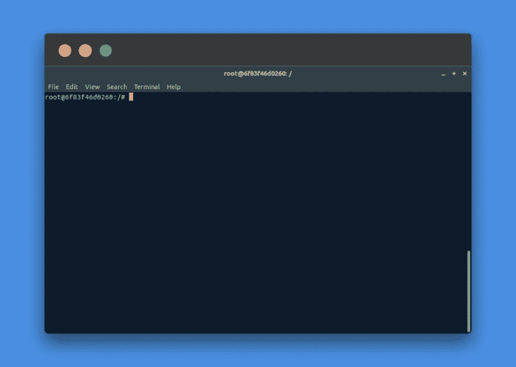
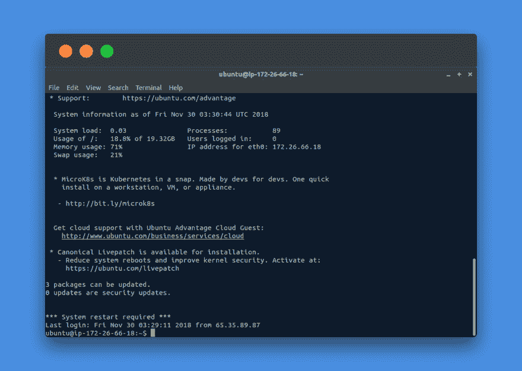
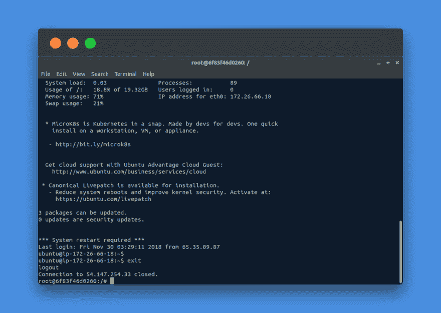
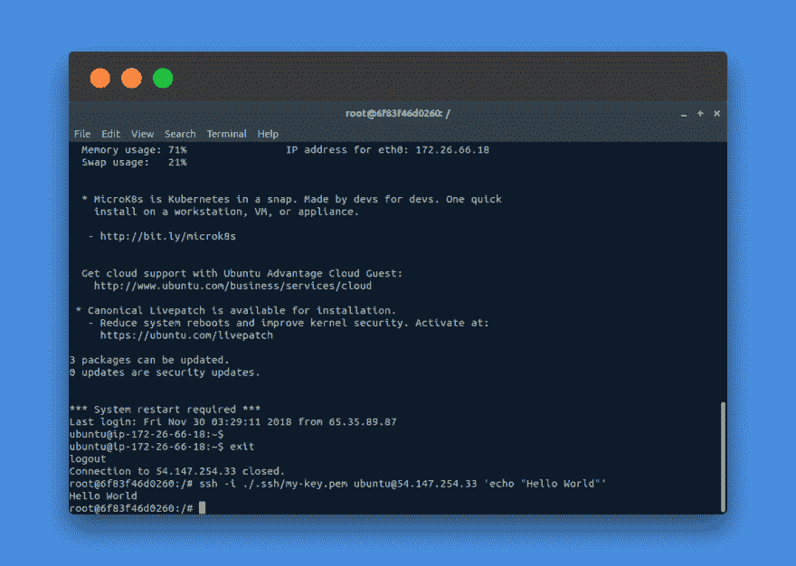
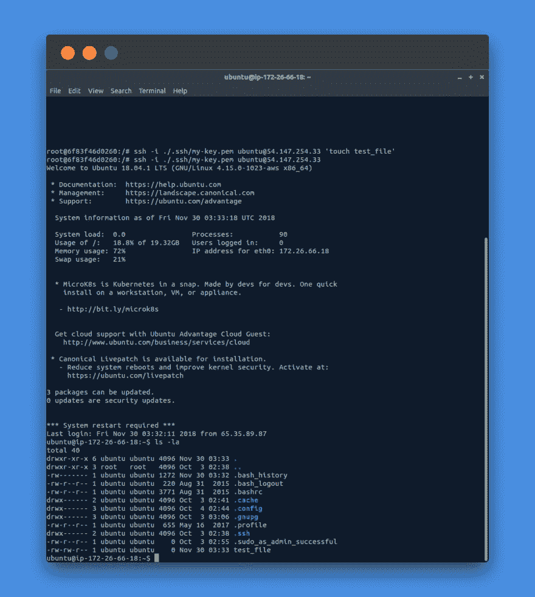

# 通过 SSH 在远程机器上运行命令

> 原文：<https://dev.to/david_j_eddy/run-commands-on-a-remote-machine-via-ssh-4d9>

[https://www.youtube.com/embed/T_-pm_ur8jg](https://www.youtube.com/embed/T_-pm_ur8jg)

## 有什么意义？

执行命令是计算的核心任务之一。有时，在一个远程机器上执行一个命令的愿望出现了。想想“嘿，远程计算机，运行更新”或“唤醒办公室计算机，我需要一个文件”。远程连接到远程机器并在其上执行命令对于计算来说是必不可少的。互联网网络活动更是如此。在本文中，我们回顾了如何通过 SSH(安全 Shell)连接到 Linux(或 Unix)远程机器并运行命令。

*   附带说明，本文并不涉及如何设置公钥/私钥对、shell 帐户创建等。重点是如何通过 SSH 将命令传递给远程机器。

## 要求

*   基本终端使用
*   Linux 本地机器(或者对 Windows 人员来说是 WSL)
*   本地机器上的 SSH 客户端，远程机器上的 SSH 服务器( [OpenSSH](https://en.wikipedia.org/wiki/OpenSSH) 是一个流行的)

## 过程

打开一个终端...

[](https://res.cloudinary.com/practicaldev/image/fetch/s--yULHBLFO--/c_limit%2Cf_auto%2Cfl_progressive%2Cq_auto%2Cw_880/https://blog.davidjeddy.com/wp-content/uploads/2018/11/remote_command_via_ssh_1.png)

键入 ssh 连接命令，确保我们可以访问

```
ssh -i ./.ssh/my-key.pem ubuntu@54.147.254.33
```

[](https://res.cloudinary.com/practicaldev/image/fetch/s--8rXLr74O--/c_limit%2Cf_auto%2Cfl_progressive%2Cq_auto%2Cw_880/https://blog.davidjeddy.com/wp-content/uploads/2018/11/remote_command_via_ssh_2.png)

好了，看来我们可以成功连接了。我们现在退出，为下一步做准备。

```
exit [PRESS ENTER]
```

[](https://res.cloudinary.com/practicaldev/image/fetch/s--EsUIhwcI--/c_limit%2Cf_auto%2Cfl_progressive%2Cq_auto%2Cw_880/https://blog.davidjeddy.com/wp-content/uploads/2018/11/remote_command_via_ssh_3.png)

现在让我们在 SSH 执行中包装一个“Hello World”echo 命令。

```
ssh -i ./.ssh/my-key.pem ubuntu@54.147.254.33 'echo "Hello World"'
```

[](https://res.cloudinary.com/practicaldev/image/fetch/s--3XGqo7Q6--/c_limit%2Cf_auto%2Cfl_progressive%2Cq_auto%2Cw_880/https://blog.davidjeddy.com/wp-content/uploads/2018/11/remote_command_via_ssh_4.png)

看那个！在远程机器上执行的命令。要证明这一点，请按键盘上的向上箭头。您会注意到最近的命令不是“echo "Hello World " '，而是刚刚执行的父 SSH 命令。为了仔细检查这一点，让我们在远程机器上创建一个文件，然后登录查看它是否确实存在。

[](https://res.cloudinary.com/practicaldev/image/fetch/s---KQXDz7P--/c_limit%2Cf_auto%2Cfl_progressive%2Cq_auto%2Cw_880/https://blog.davidjeddy.com/wp-content/uploads/2018/11/remote_command_via_ssh_5.png)

...而且是现在！很好。

## 结论

是的，就是这么简单。这么简单，而且知道能力是存在的，你能想到的一些可能的用途是什么？您知道需要在远程机器上手动完成的流程吗？如果是这样的话，这就是让耗时的过程变成一行命令的关键。

## 额外资源

*   [https://en.wikipedia.org/wiki/Secure_Shell](https://en.wikipedia.org/wiki/Secure_Shell)
*   [https://stack overflow . com/questions/18502945/how-to-execute-a-remote-command-over-ssh-with-arguments](https://stackoverflow.com/questions/18502945/how-to-execute-a-remote-command-over-ssh-with-arguments)
*   [https://askubuntu.com/questions/282319/how-to-use-sshpass](https://askubuntu.com/questions/282319/how-to-use-sshpass)
*   [https://www . cyber Citi . biz/FAQ/non interactive-shell-script-ssh-password-provider/](https://www.cyberciti.biz/faq/noninteractive-shell-script-ssh-password-provider/)
*   [https://www . cyber Citi . biz/FAQ/Linux-UNIX-OS x-BSD-ssh-run-command-on-remote-machine-server/](https://www.cyberciti.biz/faq/linux-unix-osx-bsd-ssh-run-command-on-remote-machine-server/)