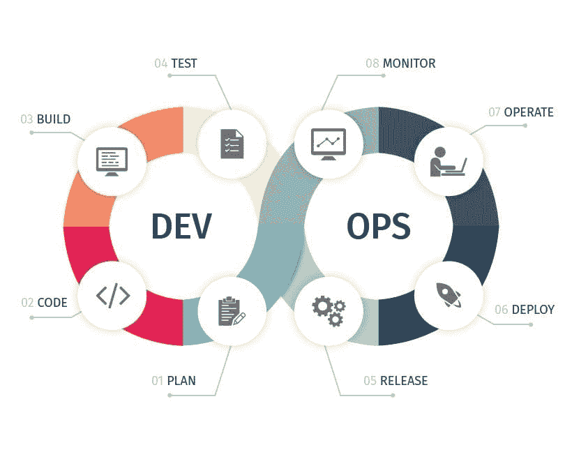

# DevOps 三句话

> 原文：<https://dev.to/ashokisaac/devops-in-3-sentences-17c4>

DevOps 现在是一个热门话题，在营销炒作和流行词汇的狂热中，很难理解它所引入的概念的本质。

DevOps 的真正核心是什么？也许我对“DevOps 心态”的三句话总结能有所帮助...

T4】

**devo PS 心态**:

> 让你的软件构建过程成为一个自动化的管道，并优化它的交付速度。
> 
> 软件管道应通过自动化基础设施和应用程序的构建和测试来确保安全性、质量和稳定性，并通过提供反馈(通过测试)来逐步证明其适用性，并在准备就绪时将其部署到最终用户。
> 
> 努力持续改进软件管道的流程(速度)和反馈

好吧，我欺骗了第二句话...更多的是段子:)

管道的关键要素是:

*   它自动化了基础设施和应用程序的构建。
*   它对基础设施和应用程序(单元、集成、性能等)应用一系列自动化测试，以证明它们满足功能性和非功能性需求。
*   当证明适合发布时，它会自动部署到最终用户。

**devo PS 的商业价值:**

*   DevOps 主要适用于构建或组装自己的软件的企业，而不是仅仅使用预构建的软件。
*   DevOps 为交付速度提供显著竞争优势的企业提供了最大的价值。

**其他见解:**

*   为了在不影响质量的情况下提高速度，限制一次通过管道的变更的大小。
*   错误应该导致管道显著地失败，有力地引起对导致破裂的变化的注意。
*   为了提高速度，消除缓慢、重复和容易出错的人工努力。将人类干预限制在决策、分析和其他创造性工作(例如探索性测试)。
*   部门筒仓(产品/开发/QA/运营)与软件管道相对立。成功地完成软件构建需要跨职能的专业知识和协作。因此，DevOps 需要在 org 中进行更改。文化和团队结构。
*   通过版本控制的代码库构建基础设施和应用程序，以实现可追溯性和可重复性。
*   通过将产品集成到管道中，将安全性构建到产品中。
*   软件架构很重要:当您可以构建、测试和部署产品的分立组件时，DevOps 是最有效的。
*   为了改进管道，让利益相关者可以看到管道的健康状况和指标。

**DevOps &更快乐的团队**

显然，这是对 DevOps 概念和原则的一个非常高层次的概述——应用它们并构建一个可靠的软件管道是一个具有挑战性但有价值的目标。

您知道吗，同行评审研究表明 DevOps 减少了发布软件的痛苦/压力，从而减少了工程师的倦怠。采用 DevOps 可以提高您的关键工程团队的生活质量。

我错过或说错了什么吗？请随时让我知道你的想法和意见。