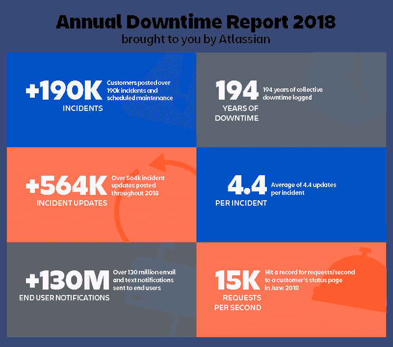
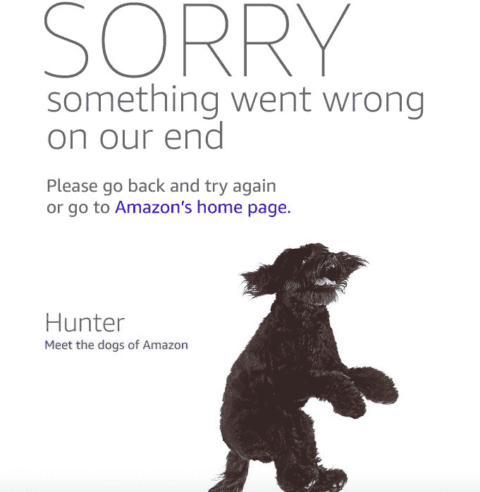
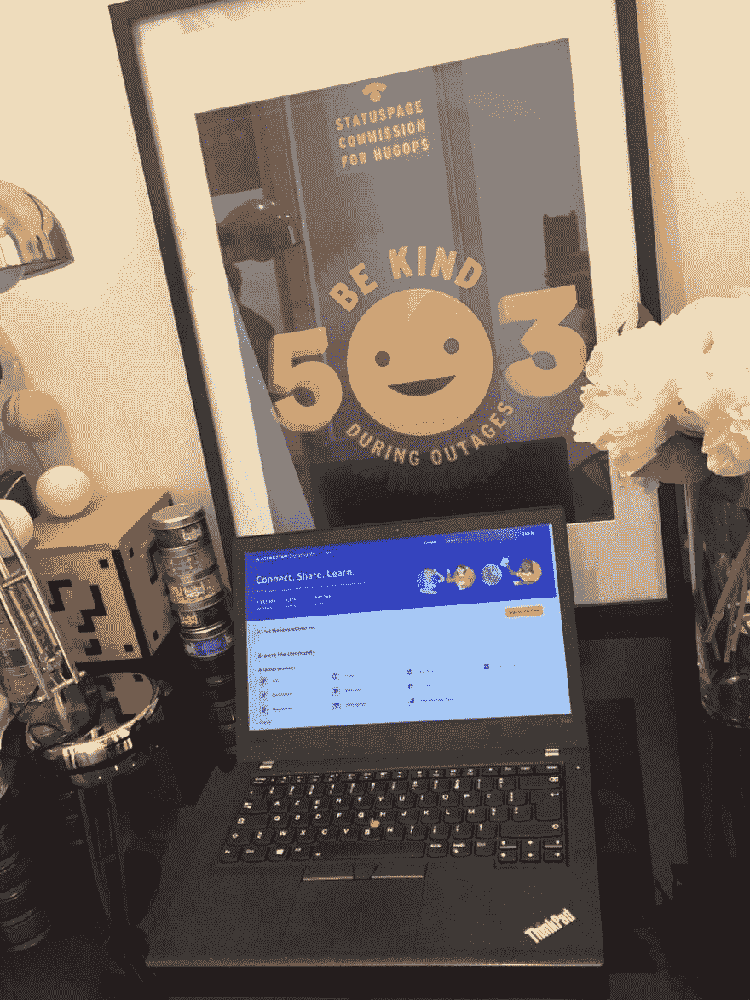

# 194 年的停机时间:回顾 2018 年以来的事件数据

> 原文：<https://dev.to/atlassian/194-years-of-downtime-looking-back-on-incident-data-from-2018-3j85>

Statuspage 客户在 2018 年记录了超过 194 年的集体事件。这比 2017 年记录的 [104 年增长了 87%，而我们甚至还没到 12 月。](https://www.atlassian.com/blog/statuspage/104-years-downtime-looking-year-statuspage-incident-data?utm_source=social&utm_medium=devto)

开放式事件沟通对公司及其客户越来越重要。这一点被今年建立公共状态页面的大牌所强调，如 [Github](https://www.githubstatus.com/) 、 [LinkedIn](https://linkedin.statuspage.io/) 和 [Yelp](https://status.developer.yelp.com/) 。随着对事故沟通越来越重视，事故管理也越来越受到重视。公司正在花费更多的时间和资源来为停机做准备，正如我们在[上从一些客户那里了解到的，他们是如何为高流量日](https://www.atlassian.com/blog/it-teams/how-to-prepare-for-cyber-monday?utm_source=social&utm_medium=devto)做准备的。

我们更深入地挖掘了 2018 年的数据，以更好地了解我们的客户今年何时以及如何就停机时间进行沟通。该数据代表所有报告的事件，从服务中的小问题到大规模中断，加上通过计划维护记录的任何计划停机时间。

## 数字是什么意思

当然，从 2017 年到 2018 年，事件记录时间的急剧增加可以部分归因于 Statuspage 客户总数的增加，但我们也认为这反映了依赖 SaaS 产品的公司越来越倾向于云优先的心态。公司选择围绕这些事件进行沟通，客户也开始期待这种类型的透明度。

> 凯尔·坎波斯@ k Campos[@福特](https://twitter.com/Ford)既然你也是一家软件公司，你需要一个 StatusPage 来让你的客户知道为什么福特帕斯会有“技术困难”。被蒙在鼓里会让这些时刻对你的顾客来说更糟糕。2018 年 7 月 14 日下午 23:1801

除了今年记录的事件数量激增之外，**我们还看到每个事件的平均更新数量几乎翻了一番。**今年平均每个事件有 4.4 次更新，我们相信公司会优先考虑与客户进行频繁、透明的沟通。

我们还惊讶地发现，近一半的客户(确切地说是 45%)通过集成警报或监控工具选择了某种形式的页面自动化。虽然我们提倡在您的事件沟通过程中始终保持[人为因素](https://help.statuspage.io/knowledge_base/topics/should-you-automate-your-status-page)，但在最重要的时候，设置某种程度的自动化无疑可以节省时间。许多客户采用这种混合的手动/自动方法来节省时间，而不会带来糟糕的客户体验。

虽然记录的事件和发布的更新不断增加，但仍然很少有事后分析——在 2018 年记录的事件中，只有 3%的事件附有事后分析。这并不令人惊讶，因为并不是每个事件都需要事后分析(有些公司会在公司博客上写事后分析)，但我们预计随着客户开始期待这种类型的跟进，这一比例在 2019 年将会上升。

> 马特·彼得曼@马特·彼得曼[@ DIRECTVNowHelp](https://twitter.com/DIRECTVNowHelp)你是否打算向客户提供一份事后分析——或者至少是一份关于这种情况为何会持续发生的陈述？每一次服务中断都会让人们对服务失去信心。你需要写一份声明，说明为防止将来发生这种情况而做出的改变。2018 年 12 月 01 日下午 18:5501

## 突出事件

有些时候，某些公司或行业更有可能出现停机。网络星期一就是一个例子——在这一天，电子商务公司的网站或应用程序的流量呈指数级增长。对**亚马逊**来说，黄金日(他们一年中最大的销售)就是那一天——甚至可以与最疯狂的黑色星期五和网络星期一交通相媲美。尽管零售巨头仍然实现了创纪录的年销售额，但购物者无法连接到 Amazon.com 超过一个小时，导致许多顾客失望，估计高达 [1 亿美元的收入损失](https://www.businessinsider.com/amazon-prime-day-website-issues-cost-it-millions-in-lost-sales-2018-7)。令人欣慰的是，Twitter 上出现了大量可爱的狗狗图片，[展示了一个错误页面的威力](https://www.atlassian.com/blog/statuspage/error-pages?utm_source=social&utm_medium=devto):

> Seth fie german@ sfiegerman坏消息:亚马逊似乎因黄金日销售需求而崩溃。好消息:亚马逊的错误页面非常惊人。2018 年 7 月 16 日下午 19:07120651

对于史诗游戏来说，他们的“黄金”流量日是玩家蜂拥而至玩他们非常受欢迎的视频游戏《堡垒之夜》的时候。他们经历了超过 300 万玩家同时玩游戏的时期，导致了一些大的服务中断。在 6 月的一次事故中，来自世界各地的玩家前往 Epic Game 的[状态页面](https://status.epicgames.com/)查看发生了什么，导致每秒约 15000 个请求*的峰值。*(我们迄今为止被贩卖次数最多的事件。)Epic Games 写了非常全面的事后分析来结束大事件的循环。

某种形式的停机是不可避免的——尤其是像堡垒之夜经历的这种极端负荷。Epic Games 向我们展示了如何处理停机时间并与客户沟通才是真正重要的。

我们也不能忘记美国国税局(IRS),他们在 2018 年纳税日度过了异常紧张的一天，他们的网站在 4 月 17 日报税截止日崩溃。这是一个很大的问题，因为[大约有 1000 万美国人等待在最后一天](https://www.accountingtoday.com/opinion/what-the-irs-2018-tax-day-website-outage-cost-in-dollars)提交他们的税款。他们最终将截止日期延至 4 月 18 日，但在此期间的沟通并不理想。最初的 IRS 错误消息报告了 2018 年 4 月 17 日至 9999 年 12 月 31 日的计划停机事件–哎呀。

停机是我们每个人都会遇到的事情，但是准确和频繁的更新会有很大的帮助。[我们给美国国税局](https://www.atlassian.com/blog/statuspage/downtime-taxes-open-letter-irs?utm_source=social&utm_medium=devto)写了一封公开信，提供了一些建议和一个免费的状态页面——有效期至 2019 年纳税日。我们还在等他们接受我们的邀请。

## # 2019 年的拥抱

虽然今年的停机时间可能会更长，但对那些公开谈论不景气时期的公司来说，也有更多的爱和赞赏(# HugOps)——事实上，超过 7000 条推文和转发提到了 HugOps。我们开始向转发我们的数字 HugOps 海报的人发送实际的 HugOps 海报，今年已经发送了 70 多张。这意味着 1%的 HugOps 推特用户现在骄傲地在他们的办公室展示一张 Statuspage HugOps 海报，如下图所示——万岁！

> 【情妇玛侬】Soubies-Camy@ manon _ sc停电时要善良🙌感谢 [@Statuspage](https://twitter.com/Statuspage) ！09:23AM-08 Sep 201803

## 事件管理的最新进展

虽然事故沟通是事故管理的一大部分，但它只是更大难题的一部分。在 Atlassian，我们在事故管理工具和[实践](https://www.atlassian.com/software/jira/ops/handbook?utm_source=social&utm_medium=devto)方面的投资翻了一番。看看我们都做了些什么:

* *事后分析** [* *吉拉运营:**](https://www.atlassian.com/software/jira/ops?utm_source=social&utm_medium=devto) 事故管理流程中最重要的部分之一就是事后分析。在这里，事件响应团队可以学习、改进和收集为解决事件而付出的时间和投资的所有回报。不幸的是，验尸过程往往被忽视，因为它太费时间，而且难以管理。JiraOps postmodisches 的一个关键的省时工具是事件时间线，它按照时间顺序收集了事件中的所有关键事件。团队可以分析发生了什么，确定根本原因，并直接从事后分析中创建吉拉软件问题，以确保采取行动来改进每个事件。[了解更多](https://www.atlassian.com/blog/announcements/announcing-postmortems-jira-ops?utm_source=social&utm_medium=devto)。

****[**ops genie:**](https://www.atlassian.com/software/opsgenie?utm_source=social&utm_medium=devto)事故响应者通常采取可预测的重复动作来响应警报。这些操作可能包括收集特定系统的更多信息、运行网络诊断、增加云资源或重新启动服务。自动化操作使您能够通过第三方平台运行自动化脚本和行动手册。Opsgenie 现在支持两种自动化集成方法:AWS 系统管理器和通用 REST 端点。团队可以与这些平台集成，直接从 Opsgenie 控制台或移动应用程序触发自动化任务。这节省了响应人员的时间，减少了他们在事件响应期间需要使用的应用程序数量，并且可以对 MTTR 产生积极影响。[了解更多。](https://www.opsgenie.com/blog/incident-response-with-aws-systems-manager)

[发布此报告，获取海报](http://twitter.com/share?text=194%20years%20of%20downtime:%20@Statuspage%20looks%20back%20on%20incident%20data%20from%202018&url=https://www.atlassian.com/blog/?p=41853)

*任何发推文的人都将收到一张免费的 HugOps 海报，以提醒你的团队在 2019 年停机时得到支持……*

这篇文章最先出现在 [Atlassian 博客](https://www.atlassian.com/blog?utm_source=social&utm_medium=devto)上。