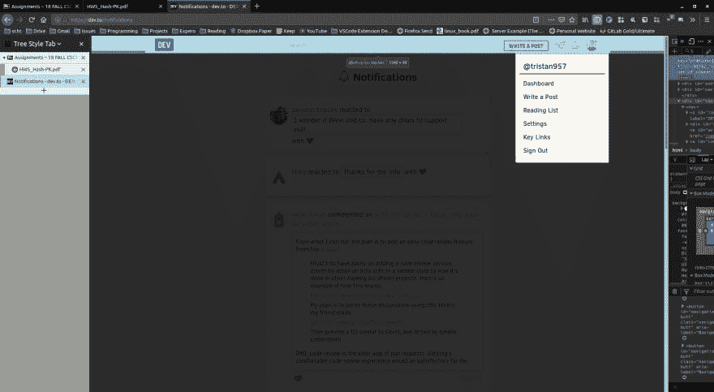
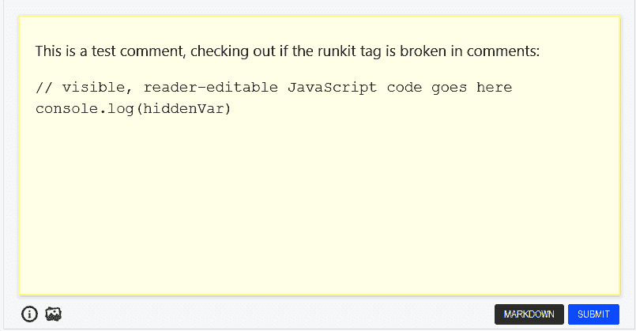
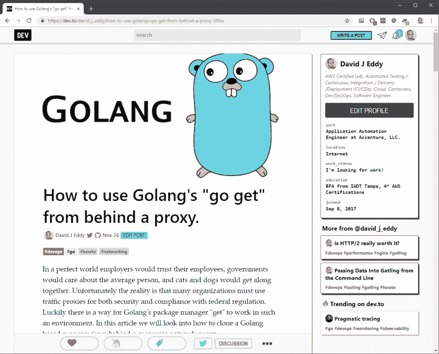
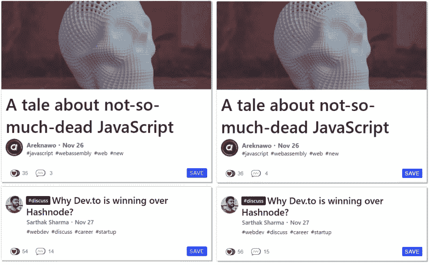

# dev.to Repo 回顾过去一周

> 原文：<https://dev.to/devteam/devto-repo-recap-of-the-past-week-21gm>

对于那些庆祝的人，希望你们上周都过了一个愉快的假期！这一期将涵盖 11 月 20 日至 11 月 27 日。

# 特性

*   添加了导出你的开发者文章的选项！它通过电子邮件以 JSON 文件的形式出现。查看更新日志，了解更多细节:

    [](/rhymes) [## 变更日志:导出帖子

    ### 押韵 11 月 21 日 182 分钟阅读

    #meta #changelog](/rhymes/changelog-export-posts-1kdm)
*   我和@glebec ， [@bennypowers](https://dev.to/bennypowers) 一起制作了这个 PR，并在帖子的标题中添加了锚链接！查看更新日志，了解更多细节:

    [](/devteam) [## 降价标题现在被锚定！

    ### 安迪赵(他/他)为开发团队 11 月 29 日 181 分钟阅读

    #meta #changelog](/devteam/markdown-headers-are-now-anchored-18bg)
*   [@philnash](https://dev.to/philnash) 在个人资料链接中添加了 HTML 属性`rel='me'`。如果你不确定这是什么，请查看 PR 以了解更多细节。谢谢菲尔。

    *   [链接到 PR](https://github.com/thepracticaldev/dev.to/pull/1183)

# Bug 修复/其他贡献

*   @moriczgergo 更新了我们的文档，介绍了如何将系列添加到您的首页。感谢@moriczgergo！

    *   [链接到 PR](https://github.com/thepracticaldev/dev.to/pull/1152)
*   [@lightalloy](https://dev.to/lightalloy) 移除了 database.yml，并将其添加到我们的. gitignore 中，如果您之前有过贡献，可能需要将新的`config/database.yml.sample`复制到新的`config/database.yml`中。谢谢安娜！

    *   [链接到 PR](https://github.com/thepracticaldev/dev.to/pull/1162)
*   @ben 在通知页面增加了一些分页功能。这个模式将让我们稍后添加真正的分页。

    *   [链接到 PR](https://github.com/thepracticaldev/dev.to/pull/1175)
*   @lightalloy 重构了我们的注释呈现方式，现在调用的 SQL 查询更少了。再次感谢你，安娜！

    *   [链接到 PR](https://github.com/thepracticaldev/dev.to/pull/1197)
*   [@jess](https://dev.to/jess) 重构了我们处理垃圾账号的一种方式。公关有一个很棒的服务对象名👌

    *   [链接到 PR](https://github.com/thepracticaldev/dev.to/pull/1168)
*   @mariocsee 更新了一些关于 API 密钥的文档。您不再需要为基础开发设置流 API 键。谢谢，马里奥！

    *   [链接到 PR](https://github.com/thepracticaldev/dev.to/pull/1199)

# 新问题/讨论

*   我们有一个小错误，导航条的左端缩短了一点。感谢 [@tristan957](https://dev.to/tristan957) ！

    # [ 点击我的个人资料图片  #1160](https://github.com/thepracticaldev/dev.to/issues/1160) 导航栏宽度变乱

    [](https://github.com/tristan957) **[tristan957](https://github.com/tristan957)** posted on [<time datetime="2018-11-20T03:21:46Z">Nov 20, 2018</time>](https://github.com/thepracticaldev/dev.to/issues/1160)

    **描述 bug** 覆盖图似乎切入了导航条。

    [](https://user-images.githubusercontent.com/11936772/48749555-1d18e400-ec41-11e8-9e49-6abdbae59832.png)

    **重现**重现行为的步骤:

    1.  点击个人资料图片

    **预期行为**导航条位于覆盖图之上。

    **桌面(请填写以下信息):**

    *   操作系统:Solus (Linux)
    *   浏览器 Firefox
    *   版本 63.0.1

    ```
    </div>
    <div class="gh-btn-container"><a class="gh-btn" href="https://github.com/thepracticaldev/dev.to/issues/1160">View on GitHub</a></div> 
    ```

    Enter fullscreen mode Exit fullscreen mode

*   Runkit 标签有一个错误，它不能在注释预览中呈现。感谢 [@antogarand](https://dev.to/antogarand) ！

    # [ 评论中的 Runkit 标签-破损 #1163](https://github.com/thepracticaldev/dev.to/issues/1163) 

    [](https://github.com/AntonyGarand) **[AntonyGarand](https://github.com/AntonyGarand)** posted on [<time datetime="2018-11-20T16:00:42Z">Nov 20, 2018</time>](https://github.com/thepracticaldev/dev.to/issues/1163)

    **描述 bug** Runkit 标签在评论中不起作用。他们只是将原始内容放入一个 code 标记中，而不是普通的标记，这种标记格式错误，无法执行。

    **复制**创建一个带有 runkit 标签预览的评论或发布它

    **实际行为**我们获得代码标签中的内容，而没有 runkit 应该提供给我们的格式或执行。

    **预期行为**我们得到了一个正确的 runkit 标签

    **截图**如果适用，添加截图来帮助解释您的问题。[T3](https://user-images.githubusercontent.com/9059487/48785588-03b08000-ecb3-11e8-9213-aff08eb6c4f3.png)T5T7[T9](https://user-images.githubusercontent.com/9059487/48785755-5b4eeb80-ecb3-11e8-92ee-94911b5d2638.png)

    **附加上下文**在此处添加关于问题的任何其他上下文或有用的链接。

    [View on GitHub](https://github.com/thepracticaldev/dev.to/issues/1163)

*   我们的服务人员展示了一个很酷的[离线页面](https://dev.to/offline.html)，但是我们可以刷新缓存页面。

    # [ 功能请求-缓存内容供离线使用 #1171](https://github.com/thepracticaldev/dev.to/issues/1171) 

    [](https://github.com/gurpritsingh) **[gurpritsingh](https://github.com/gurpritsingh)** posted on [<time datetime="2018-11-21T08:02:38Z">Nov 21, 2018</time>](https://github.com/thepracticaldev/dev.to/issues/1171)

    **您的功能请求是否与某个问题相关？请描述一下。**每当我旅行时，我都喜欢使用 dev.to，但因为我在印度，互联网连接不可靠，我最终会看到带有绘图画布的离线页面，这很酷，但没有帮助。

    **描述你想要的解决方案**有一个缓存策略，以便用户可以在离线时看到一些文章，这将是伟大的。

    **附加内容** Dev.to 是一个关于社区和知识共享的网站，我认为如果我们能够访问这些知识的一部分，即使是在离线状态下，那也是非常棒的

    [View on GitHub](https://github.com/thepracticaldev/dev.to/issues/1171)

*   有时会出现重复的帖子。也许我们可以添加一个缓冲来防止这种情况？更多细节请见本期。谢谢， [@rdumais](https://dev.to/rdumais) ！

    # [ 功能请求-重复帖子 #1170](https://github.com/thepracticaldev/dev.to/issues/1170) 

    [](https://github.com/RDumais) **[RDumais](https://github.com/RDumais)** posted on [<time datetime="2018-11-21T01:30:52Z">Nov 21, 2018</time>](https://github.com/thepracticaldev/dev.to/issues/1170)

    **您的功能请求是否与某个问题相关？请描述一下。**我见过作者不小心在多个场合双贴一个话题。我不确定问题出在哪里。

    **描述你想要的解决方案**我认为 Dev.to 团队应该实现某种缓冲，让作者在第一篇帖子(1-2 分钟)过去 x 分钟后才能发布第二个主题。

    描述你考虑过的替代方案我实在想不出任何替代方案。也许可以让主题在发布后的 x 分钟内不能有相同的名字？

    **附加背景**这是我见过的两个不同链接的例子:

    https://dev . to/jeremyksutter/ultimate-guide-to-selling-your-product-online-25me

    [](https://camo.githubusercontent.com/5b8045b78b9cd8149100ab17ba9a7218cf20f557/68747470733a2f2f692e696d6775722e636f6d2f6f3739596f71482e706e67)

    [View on GitHub](https://github.com/thepracticaldev/dev.to/issues/1170)

*   如果能有你在 dev.to 上读过的所有帖子的历史记录，那就太好了。欢迎在本期中添加讨论。谢谢， [@yafkari](https://dev.to/yafkari) ！

    # [ 添加历史阅读文章 #1173](https://github.com/thepracticaldev/dev.to/issues/1173) 

    [](https://github.com/zechtyounes) **[zechtyounes](https://github.com/zechtyounes)** posted on [<time datetime="2018-11-21T12:28:52Z">Nov 21, 2018</time>](https://github.com/thepracticaldev/dev.to/issues/1173)

    ### **你的特性请求是否与某个问题有关？请描述一下。**

    当我早上读一篇文章，晚上又找不到时，我总是很沮丧..

    ### **形容你想解决的问题**

    我认为这将是很酷的，如果有阅读文章的历史

    ### **附加语境**

    就这样

    #### PS: **为我糟糕的英语和这篇短文向**道歉！

    [View on GitHub](https://github.com/thepracticaldev/dev.to/issues/1173)

*   能够订阅一系列帖子并在该系列的新帖子发布时收到通知也是一件很酷的事情。谢谢， [@sturzl](https://dev.to/sturzl) ！

    # [ 发表/关注一系列文章 #1172](https://github.com/thepracticaldev/dev.to/issues/1172) 

    [](https://github.com/sturzl) **[sturzl](https://github.com/sturzl)** posted on [<time datetime="2018-11-21T10:19:39Z">Nov 21, 2018</time>](https://github.com/thepracticaldev/dev.to/issues/1172)

    许多作者正在发表一系列文章。我希望看到一系列文章的通知，而不必关注该作者或相关标签的所有内容。

    例如[https://dev.to/shikaan/design-patterns-in-web-development-2-memento-253j](https://dev.to/shikaan/design-patterns-in-web-development---2-memento-253j)

    [View on GitHub](https://github.com/thepracticaldev/dev.to/issues/1172)

*   我们有一点点的边缘情况，我们在帖子的侧边栏中显示文本，这可能没有多大意义。更多细节请见本期。谢谢， [@david_j_eddy](https://dev.to/david_j_eddy) ！

    # [ 替换‘更从@…’ #1202](https://github.com/thepracticaldev/dev.to/issues/1202) 

    [](https://github.com/davidjeddy) **[davidjeddy](https://github.com/davidjeddy)** posted on [<time datetime="2018-11-26T19:38:25Z">Nov 26, 2018</time>](https://github.com/thepracticaldev/dev.to/issues/1202)

    **您的功能请求是否与某个问题相关？请描述一下。**没问题，当用户是作者时，查看文章时会出现冗长的更新。

    **描述您想要的解决方案**删除“更多@…”当用户是作者或以“你的其他帖子”的形式重新表述时

    **描述您认为的替代方案**不是关键问题，更多的是可读性/一致性更新。

    **附加语境** [](https://user-images.githubusercontent.com/6232455/49037882-5f827980-f189-11e8-9fa3-35cbf85ebb15.PNG)

    谢谢大家；继续惊人的努力！

    [View on GitHub](https://github.com/thepracticaldev/dev.to/issues/1202)

*   Andrew 写了一篇关于保存按钮如何有更好的对比度的文章。下面来看看吧。感谢 [@link2twenty](https://dev.to/link2twenty/) ！

    # [ 存扣的对比 #1204](https://github.com/thepracticaldev/dev.to/issues/1204) 

    [](https://github.com/Link2Twenty) **[Link2Twenty](https://github.com/Link2Twenty)** posted on [<time datetime="2018-11-27T15:04:23Z">Nov 27, 2018</time>](https://github.com/thepracticaldev/dev.to/issues/1204)

    **描述 bug** 目前，文章`save`按钮以#4a68ff 计算，其文本为#ffffff 这导致对比度为 4.45，一般任何低于对比度 7 的东西都是不被允许的。

    这是在这里的 scss 文件中计算的[https://github . com/thepractical dev/dev . to/blob/master/app/assets/style sheets/articles . scss](https://github.com/thepracticaldev/dev.to/blob/master/app/assets/stylesheets/articles.scss)`background: darken($purple, 26%);`

    **边注:**如果你要使用变暗和变亮，通常最好避免绝对值(ff/00)，因为它们不会真正受到影响。

    **预期行为**理想情况下，如果我们能够将对比度提高到 7 以上，这将有利于可访问性。我做了一些测试，将变暗改为 38% (#0d35ff)将有 7.07 的对比度，将悬停改为 50% (#0022cf)将允许效果保持不变。

    **截图** [](https://user-images.githubusercontent.com/3534427/49090377-7bebe800-f255-11e8-892d-356326985a7a.png) 左为同变，右为无同变，置顶文章均具有悬停属性。

    **附加上下文**我本想直接提交一个拉取请求，但我认为这是一个更好的方法。此外，如果更改被接受，它将成为一个很好的第一个拉请求。

    [View on GitHub](https://github.com/thepracticaldev/dev.to/issues/1204)

本期就到这里。请随意分享您对任何问题的想法。