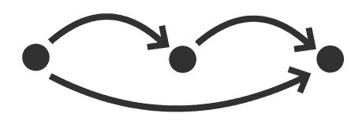
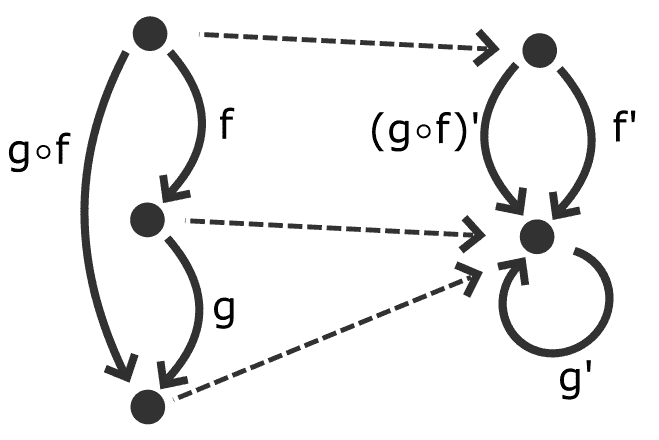

# 函子、单子和更好的函数

> 原文：<https://dev.to/drbearhands/functors-monads-and-better-functions-26f3>

这篇文章是“功能基础”系列文章的一部分。参见[简介和索引](https://dev.to/drbearhands/a-series-on-functional-fundamentals-48mb)。这也是你可以要求特定主题的地方

注意，我不是这些主题的权威人物，如果你看到你认为可能不正确或不完整的东西，请用评论指出来，让我们防止错误扩散:-)

* * *

**根据反馈**，为清晰起见，编辑了这篇文章

在阅读这篇文章时，你应该尽量不去想命令式编程语言的概念。尤其是忘记像 python 和 javascript 这样的弱类型语言。这里表达的同构适用于函数式、强类型语言。理想情况下，您已经编写了一个非常基本的 Elm 或 Haskell 程序，或者使用过它们的 REPL。

是时候对范畴理论进行浅显的探讨了。没有它，你可以试着理解函子和单子，但是那通常会很尴尬，有时甚至是错误的。范畴理论也可以帮助你做出更好的决定，比如你的函数应该有什么类型的签名。

你可能会说范畴理论是对构成的研究。这有时使它变得非常抽象，但是，我发现它非常容易理解。至少，一旦你的大脑将所有的符号解析成意义。

范畴理论处理*对象*(与 OOP 无关)和*箭头*。箭头从一个物体指向另一个物体。对象和箭头是非常抽象的概念，范畴理论根本不考虑它们是什么，只考虑箭头如何连接对象。
这使得范畴理论适用于很多领域。

范畴仅仅是“我们正在谈论的东西”。在 FP 中，“我们正在谈论的”通常是类型和函数，所以对象对应于类型，箭头对应于函数。但是在命令式编程中，你可能使用程序状态作为对象，命令作为箭头，就像在 [Hoare logic](https://en.wikipedia.org/wiki/Hoare_logic) 中一样。

我们确实需要一个类别的两个规则是*身份*和*组成*。

##### 身份

[](https://res.cloudinary.com/practicaldev/image/fetch/s--yA6mLEYn--/c_limit%2Cf_auto%2Cfl_progressive%2Cq_auto%2Cw_880/https://thepracticaldev.s3.amazonaws.com/i/c2cyb9ijpg31h437uce9.png) 
*同一性*是从一个对象到其自身的箭头，存在于一个范畴中的每一个对象。

##### 作文

[](https://res.cloudinary.com/practicaldev/image/fetch/s--eKY7rvMU--/c_limit%2Cf_auto%2Cfl_progressive%2Cq_auto%2Cw_880/https://thepracticaldev.s3.amazonaws.com/i/8i8xbux61h63qw1qh2aq.png)

如果从对象`a`到对象`b`有一个箭头`f`(记为`f :: a → b`，有一个箭头`g :: b → c`，那么必然有一个箭头`a → c`，称为`f`后`g`的*构图*，记为`g ∘ f`。

#### 与 FP 同构

在类型(和函数)的范畴中，我们通过`identity`函数来标识，通过函数复合操作符来复合(Elm 中的`<<`和 Haskell 中的`.`)。这意味着函数式编程中的类型系统确实遵循范畴理论的规则。其他语言也一样，只是方式有点奇怪。

### 函子

对象和箭头是类别的一部分。虽然箭头将一个对象连接到另一个对象，但是也可以将一个类别连接到另一个类别，方法是将一个类别中的所有对象连接到另一个类别中的对象。如果第一类中的箭头与第二类中的箭头以或多或少相同的方式连接对象，这被称为*仿函数*。

<figure>

[](https://res.cloudinary.com/practicaldev/image/fetch/s--yFU9bYzf--/c_limit%2Cf_auto%2Cfl_progressive%2Cq_auto%2Cw_880/https://thepracticaldev.s3.amazonaws.com/i/lsbcb9sq368laadqlsp7.png)

<figcaption>In this image, the dotted line represents a functor. I've left out identity arrows for clarity.</figcaption>

</figure>

但是这到底是什么意思呢？

对于从一个类别中的任意对象`x`到另一个类别中的对应对象`F x`的函子`F`，以及任意一对箭头`f :: a → b`和`g :: b → c`，以及它们的组合`g ∘ f`，都必须有对应的箭头
`f' :: F a → F b`、`g' :: F b → F c`和
`(g ∘ f)' :: F a -> F c`，这样:

*   如果`f`是身份箭头，`f'`也是身份箭头(*身份*被保留)
*   `(g ∘ f)' = g' ∘ f'` ( *成分*保存)。

这告诉我们，在一个类别中成立的结构规则，在作为其函子的类别中仍然成立。

在上图中，`F`是用虚线表示的函子，你可以看到我们可以先跟随`f`，然后`F`，然后`g'`，或者我们可以跟随`g ∘ f`，然后`F`，或者`F`后跟随`(g ∘ f)'`。结果将是相同的，因为左边的“路径”在右边有对应的“路径”。

函子不一定要在不同的范畴之间，可以从一个范畴到自身，在这种情况下我们称之为 *endofunctor* 。

这对函数式编程意味着什么？嗯，在类型系统中，我们可以创建一个类型构造函数(或者如果你喜欢的话，可以创建一个更高级的类型):`List`、`Set`、`Array`、`Iterator`、`Maybe` / `Optional`、`Cmd`等等。它们本身并不是真正的类型，但是会从另一个类型构造一个类型。

类型构造函数`F`是函子[当且仅当。](https://english.stackexchange.com/questions/62067/is-iff-considered-a-real-word-or-just-an-abbreviation)我们有一个函数`fmap`，它接受任何一个函数`a -> b`，并产生一个`F a -> F b`(保留我们上面讨论过的身份和组成)。

这个`fmap`函数抽象出了仿函数的内部结构，让我们专注于元素操作。通过这种方式，我们可以对列表、字典、流、promise 等应用操作，而无需求助于循环、递归或回调嵌套。

一些 Elm 代码示例:

*   `List.map ((+) 1) listOfInts`会将`listOfInts`中所有元素的值增加 1。
*   如果不是`Nothing`，则`Maybe.map ((+) 1) maybeInt`会将`maybeInts`加 1。
*   `Cmd.map ((+) 1) someCmd`(非常特定于 Elm)将导致传递给 Elm 中更新函数的`msg : Int`比执行`someCmd : Cmd Int`的结果高一。

在 Haskell 中，你使用 typeclasses 来编写例如`fmap ((+) 1) [...]`，但是想法是一样的。

### 单子

*单子*是一种特殊类型的*内函子*(从一个范畴到自身的函子)。~~它们的特别之处在于它们是可组合的~~ ( [不对](https://dev.to/totally_chase/comment/1hkdg))。

为了使内函子`M`成为单子，任何箭头`f :: a → M b`都必须有对应的`f' :: M a → M b`。差不多就是这样。

这很酷，因为这意味着我们可以构造返回单子的函数。

*(示例代码在 Elm 语法中)*
例如，如果我们有一个将字符串解析为浮点数的函数`parseFloat : String -> Maybe Float`和一个返回`Nothing`的除法函数，我们试图除以 0 `divide : Float -> Float -> Maybe Float`(参见[除以 0](https://dev.to/drbearhands/extra-fundamentals-dividing-by-zero-1li5) )，并且我们想用`parseFloat someString`的结果除某个数。

代码`divide 7 (parseFloat someString)`不会编译，因为`(parseFloat someString)`是一个`Maybe Float`，而`divide 7`取一个`Float`。如果没有单子，我们必须做一些事情，比如:

```
case parseFloat someString of:
  Just result -> divide 7 result
  Nothing -> Nothing 
```

Enter fullscreen mode Exit fullscreen mode

迫使我们明确地处理函子的内部结构。

对于单子(也许是单子)，我们可以使用 [`andThen`](https://package.elm-lang.org/packages/elm/core/latest/Maybe#andThen) ，它将一个`a -> M b`转换为一个`M a -> M b`，将*提升为* `divide 7 : Float -> Maybe Float`为`andThen (divide 7) : Maybe Float -> Maybe Float`。这让我们写:

```
andThen (divide 7) (parseFloat someString) 
```

Enter fullscreen mode Exit fullscreen mode

或者，利用`|>`运算符:

```
parseFloat someString
|> andThen (divide 7) 
```

Enter fullscreen mode Exit fullscreen mode

Haskell 没有一个标准的`|>`操作符，而是将`|>`与`andThen`组合成`>>=`。

```
parseFloat someString
>>= divide 7 
```

Enter fullscreen mode Exit fullscreen mode

我应该注意到 Haskell(可能还有其他语言)为单子增加了一些额外的功能。这在某种程度上是 Haskell 特有的，因为它与惰性求值和`do`块有关，所以我现在不打算深入讨论。

### 功能签名

范畴理论还告诉我们，就合成而言，什么是“更好”的函数。这是一个相当模糊的论点，基于范畴理论中对和与积的定义，但它是相当不言而喻的:

如果你有`f :: a → c`和`g :: b → c`，并且一些`h`存在 s.t. `h :: a → b`，但是没有`h`存在 s.t. `h :: b → a`，那么箭头`g`比`f`更适合构造`c`，因为我们还有`g ∘ h :: a → c`。

换句话说，当有疑问时，实现最简单的函数。这有点像 UNIX 哲学的前两个支柱的形式化:

> 这就是 Unix 的哲学:编写只做一件事的程序...].写程序一起工作。[...]

## 进一步阅读

*   看看你能否找出为什么一个[列表](https://package.elm-lang.org/packages/elm/core/latest/List)是单子。
*   试着想一个不是单子的函子。这可能需要一段时间。
*   我衷心推荐巴托什·米莱斯基的 CT 材料。他有一个[有点实际的，书面系列](https://bartoszmilewski.com/2014/10/28/category-theory-for-programmers-the-preface/)和一个[视频讲座系列](https://www.youtube.com/playlist?list=PLbgaMIhjbmEnaH_LTkxLI7FMa2HsnawM_)。我个人更喜欢后者的内容，但前者的格式，因为我觉得视频对这种材料来说有点太被动了，但更抽象的概念会有更强的基础。