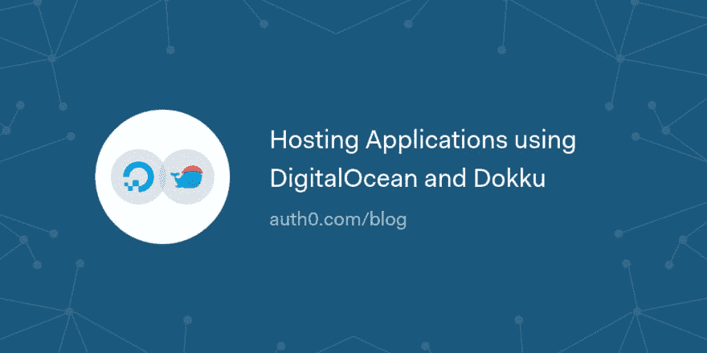

# 使用 DigitalOcean 和 Dokku 托管应用程序

> 原文：<https://dev.to/auth0/hosting-applications-using-digitalocean-and-dokku-4k6f>

在本文中，我们将创建几个非常简单的节点应用程序，并使用 Dokku(一个开源的 PaaS)将它们托管在 DigitalOcean droplet 上。我们还将了解如何使用 Docker 优化部署。

[读读☁️](https://auth0.com/blog/hosting-applications-using-digitalocean-and-dokku/?utm_source=dev&utm_medium=sc&utm_campaign=host_dg_dokku)

