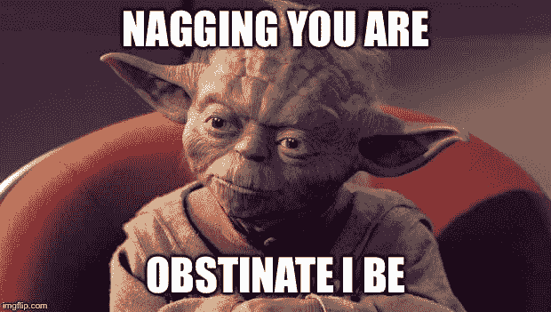
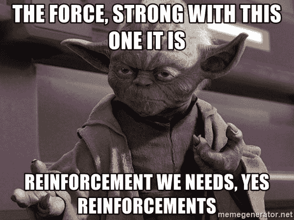

# 变化很大。我先来！

> 原文 https://dev.to/kymiddleton/change-is-great-ill-go-first-11jm

第 2 部分:变更管理的模型:ADKAR

如果你错过了这篇文章的第一部分，你可以点击这里查看。

当面临挑战时，无论大小，第一步都是制定行动计划。行动计划的一个经常被忽视的组成部分是评估五个关键因素:意识、愿望、知识、能力和强化。这些要素合在一起就是 Prosci 变更管理模型，简称 ADKAR 模型。

意识是一个很好的起点，因为意识到情况和需要做出的改变或者理解不做出改变的后果是很重要的。评估内部和外部因素也很重要。内部因素指的是一种内在的情绪状态，如环境或职业领域，具有令人振奋的积极感受或使人感到焦虑的消极感受。外部因素是指收入需求得到满足但缺乏工作满足感等情况。或者，也许收入和工作满意度是积极的，但更短的通勤时间将是一个受欢迎的变化。这些都是意识的要素。

下一步是**欲望**。根据字典，欲望指的是强烈的希望某事发生或想要拥有某事的感觉。对精确结果的强烈渴望是一种驱动因素，促使人们付出努力和精力去学习新事物或做出重大改变。最终归结为个人选择和个人动机。

有觉知和欲望似乎很简单，对吗？你被唠叨过吗？或者你有没有烦别人完成一项本可以在两分钟内完成的任务，但在采取任何行动之前，需要两天的提醒？唠叨只是提醒某人去做已经知道需要做什么的事情。换句话说，唠叨不会让一个人更加清醒。除非某人有*欲望*去做某事，否则世界上所有的觉知都不会有所不同。它基本上可以归结为动机和渴望去做完成一项任务或实现一个目标所必需的事情。

 
**知识**，这个模型的第三块，是理解一门学科所获得的信息、事实和技能。比方说，一个 web 开发人员提议他们的团队需要一个新职位。他们行动计划的一部分包括新职位的详细任务以及所需资格的列表。在与同事讨论角色后，技能差距被确定并添加到初始提案中。不管手头的职位或任务是什么，重要的是要评估成功所需的工具或系统以及必要的知识。

下一步是**能力**，这归结为获取知识或技能，并将其应用到给定的情况。一个很好的思考方式是理论和实际应用之间的区别。仅仅因为某人有脑外科医生的知识并不意味着他们实际上知道如何进行手术。知道如何利用获得的知识取决于某人将其知识转化为行动的能力。

最后一步是**加固**。正如生活中任何涉及改变的情况一样，从简单的行为改变、健康的饮食习惯、增加锻炼的决心，或者学习如何编码，如果没有强化来维持改变，都是浪费。意识到学习一项新的职业技能对职业发展非常重要。有学习新技能的愿望和上课的动力是很棒的。参加培训课程可以打下坚实的知识基础，并有能力通过完成编码挑战或构建 web 应用程序来掌握和应用知识。一旦编码课程结束，将采取什么步骤来保持这些技能的新鲜？为了让变革持续下去，它又回到了为变革提供最初动力的内部和外部因素。当要做出改变时，强化是将这些部分结合在一起的关键。

请记住，除非个人有改变的愿望，否则唠叨某人做某事不会让他们更清醒。知道某人有 JavaScript 计算机编程经验，却期望他们填补 C#的空缺，而不进行技能和能力的差距评估或提供培训计划，这是在给某人设置失败的陷阱。就像培训某人学习一门新的编程语言是一种浪费，如果没有强化新获得的技能的计划。技能就像肌肉，需要经常使用，否则就会变弱。

 
不管正在进行的变更的类型如何，继续定期评估这些组件中的每一个。每个人学习的速度不同，学习风格也不同，这没关系。每个人处理和处理变化的方式不同，这也没关系。人类抗拒改变是很自然的，但是有了行动计划，改变是可能的。