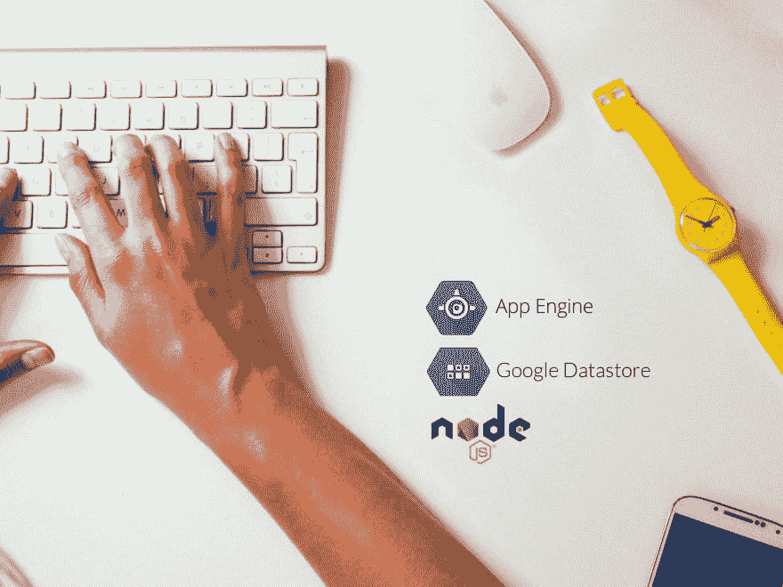

# 在 Google App Engine 上构建一个博客应用程序(第 4 部分)

> 原文：<https://dev.to/sebelga/build-a-blog-application-on-google-app-engine-part-4-kj2>

嗨 Devs！

我的教程的下一部分是如何在 Google App Engine 上构建一个博客应用程序。

希望你喜欢:[https://medium . com/@ sebelga/build-a-blog-application-on-Google-app-engine-blog post-module-part-4-b 929 e 212 c 899](https://medium.com/@sebelga/build-a-blog-application-on-google-app-engine-blogpost-module-part-4-b929e212c899)

干杯