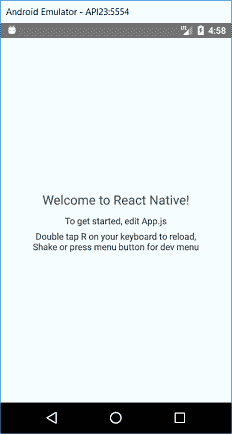
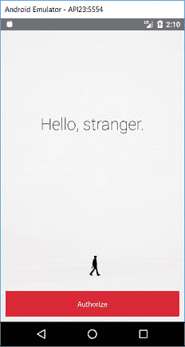
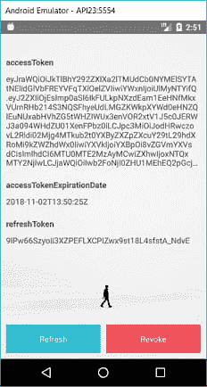
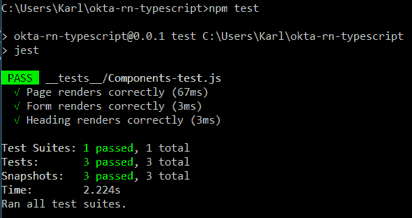

# 使用 TypeScript 和 OAuth 2.0 构建和测试 React 本机应用程序

> 原文：<https://dev.to/oktadev/build-and-test-a-react-native-app-with-typescript-and-oauth-2-0-21on>

React Native 是创建移动应用程序最流行的方式之一。基于 React 的成功，它使用一个共享的 JavaScript 代码库将 Android 和 iOS 的原生组件结合在一起。然而，JavaScript 最近受到攻击，因为它不是类型安全的，这会导致开发者失去信任。输入 TypeScript，它允许将类型注释添加到现有的 JavaScript 代码中。

许多移动应用程序的一个要求是认证(又名 authn -确认用户身份)和授权(authz -确认访问权限)。通过 OAuth 2.0 标准实现这一点允许与所有主要的第三方 authn / authz 服务集成。创建自动化测试来检查核心功能没有被破坏也是必要的。

在本教程中，您将创建一个空的 React Native 项目，使用 [React Native App Auth](https://github.com/FormidableLabs/react-native-app-auth) 添加 OAuth 功能，将项目移植到 TypeScript，最后使用 [React 测试呈现器](https://reactjs.org/docs/test-renderer.html)添加测试。

## 创建一个 React 原生项目

最新版本的[官方入门指南](https://facebook.github.io/react-native/docs/getting-started.html)推荐使用[博览会](https://expo.io/)来创建初始项目，但我发现博览会的设置有些古怪。旧的方法是使用命令行工具(CLI)。查看前面提到的指南中的**用本地代码构建项目**选项卡，以获得设置的详细信息。

一旦你安装了[节点](https://nodejs.org/en/download/)(至少 8.3 版本——我推荐使用 LTS 版本)，你应该能够安装带有`npm`的 React Native CLI。

```
npm install -g react-native-cli@2.0.1 
```

完成后，您应该有一个命令`react-native`可用于创建一个新项目。

```
react-native init ReactNativeTypeScript 
```

这将把 React Native 的最新版本([目前为 0.57.4](https://github.com/facebook/react-native/releases) )安装到`ReactNativeTypeScript`文件夹中。切换到该文件夹并运行`react-native run-android`。

```
cd ReactNativeTypeScript
react-native run-android 
```

如果您没有接通电话或运行 Android 虚拟设备(AVD ),您会看到一个错误:

```
com.android.builder.testing.api.DeviceException: No connected devices! 
```

要解决这个问题，打开 Android Studio，并创建一个新的 AVD。你可以通过导航到**工具** > **安卓** > **AVD 管理器**来实现。创建一个新的虚拟设备，然后单击播放按钮。

这将在已连接的 Android 设备或模拟器(如果已连接)上构建并安装 skeleton 应用程序。对于`react-native run-ios`也是如此。如果你被困在这里，查看我上面提到的入门指南(特别是**用本地代码构建项目**标签)。

[](https://res.cloudinary.com/practicaldev/image/fetch/s--AetKkgf4--/c_limit%2Cf_auto%2Cfl_progressive%2Cq_auto%2Cw_880/https://developer.okta.com/assets-jekyll/blog/react-native-testing/welcome-to-react-native-8f28b08a07e085a007eab5cf7b96333be1858b2feb2e2ce0ce63c434fd35f233.png)

## 在 Okta 中创建原生应用

为了简化身份验证和授权的添加，我们将在本教程中使用 Okta。你可以在这里注册一个免费的 Okta 开发者账户。完成后，登录并导航至**应用** > **添加应用**。选择**原生**，点击**下一个**。选择一个名称，选择**刷新令牌**，点击**完成**。

请注意您的**登录重定向 URI** 和**客户端 ID** ，因为您将把它们添加到您的应用程序中。

## 将 AppAuth 添加到项目中

对于身份验证，我们将使用 [react-native-app-auth](https://github.com/FormidableLabs/react-native-app-auth) 库，使用他们的示例项目作为基础。首先将存储库克隆到本地目录。

```
git clone https://github.com/FormidableLabs/react-native-app-auth 
```

然后在您的项目文件夹(`ReactNativeTypeScript`)中安装所需的额外库。

```
npm install react-native-app-auth@4.0.0
react-native link react-native-app-auth 
```

最后一个命令将本机代码链接到您的项目中。

```
npm install styled-components@4.1.1 
```

示例代码中使用了这个库。现在将您的`App.js`修改为`Example/AndroidExample/App.js`处示例代码中的内容，并将示例中的`assets`和`component`文件夹复制到您的项目中。

```
cp ../react-native-app-auth/Example/AndroidExample/App.js .
cp -r ../react-native-app-auth/Example/AndroidExample/assets .
cp -r ../react-native-app-auth/Example/AndroidExample/components . 
```

现在使用您的**重定向 URL** 的基础，例如`com.oktapreview.dev-628819`，将以下内容添加到`android/app/build.gradle`中的`android`配置的`defaultConfig`部分。

```
manifestPlaceholders = [
      appAuthRedirectScheme: '{redirectBase}'
] 
```

最后，修改您的`App.js`的`config`部分，以包含您的 Okta 应用程序信息。

```
const config = {
  issuer: 'https://{yourOktaDomain}'/oauth2/default,
  clientId: '{clientId}',
  redirectUrl: '{redirectUrl}',
  additionalParameters: {prompt: 'login'},
  scopes: ['openid', 'profile', 'email', 'offline_access']
}; 
```

如果您将`{yourOktaDomain}`视为上述发行人，您可以在 Okta 仪表盘上找到该值。如果你没有看到这个变量，那是因为这个网站足够聪明，可以为你填写。您可以从 Okta 应用程序中获得 **clientId** 和 **redirectUrl** 的值。

运行完`react-native run-android`之后，您应该会得到以下内容。

[](https://res.cloudinary.com/practicaldev/image/fetch/s--yHl4_C9y--/c_limit%2Cf_auto%2Cfl_progressive%2Cq_auto%2Cw_880/https://developer.okta.com/assets-jekyll/blog/react-native-testing/hello-stranger-e82d2b6090b052598f0028d56b83c967a526b50333a58632c8ed3240d1edd5df.png)

注意:我在控制台上发现了几个关于`unable to delete`的错误，我通过清理 android 项目修复了这些错误:

```
cd android
gradlew clean 
```

当您点击`Authorize`时，您应该会看到一个详细介绍用于身份验证的令牌的页面。

[](https://res.cloudinary.com/practicaldev/image/fetch/s--fcJ8dTAc--/c_limit%2Cf_auto%2Cfl_progressive%2Cq_auto%2Cw_880/https://developer.okta.com/assets-jekyll/blog/react-native-testing/authorize-page-4cc3046cd98a49a21b28035f33482bb82cb1a4f4b76ba87a18fab29340f39bb6.png)

**提示:**你可以使用**CTRL+M**(Mac 上的 **Command + M** )在 Android 模拟器中重新加载你的应用程序代码..

## 将你的 React 原生应用移植到 TypeScript

在 React Native 中使用 typescript 的一种常见方式是使用像[React-Native-TypeScript-transformer](https://github.com/ds300/react-native-typescript-transformer)这样的工具，但在今年 9 月，脸书发布了 React Native 0.57，其中包括支持 TypeScript 的 Babel 7，所以你可以开箱即用。你所要做的就是将你的`App.js`重命名为`App.tsx`, React Native 将获取这些更改。

```
mv App.js App.tsx 
```

您还需要修改`App.tsx`并将`State`变量改为如下:

```
type State = {
  hasLoggedInOnce: boolean,
  accessToken?: string,
  accessTokenExpirationDate?: string,
  refreshToken?: string
}; 
```

问号被移回到冒号之前。这就是 TypeScript 标识可选参数的方式(与 Flow 相反，Flow 是`react-native init`命令用来建立一个框架项目的)。

再次运行项目应该像以前一样开始和操作。

```
react-native run-android 
```

**注意:**如果出现类似`Module not registered in graph`的错误，请在重新运行`run-android`之前关闭打包程序窗口。

## 测试你的 React 原生应用

测试 React Native 的标准方式是使用 Jest 和 [React 测试渲染器](https://reactjs.org/docs/test-renderer.html)的[，这两者都包含在用`react-native init`创建的项目中。但是，您需要进行一些设置来使用 TypeScript。](https://jestjs.io/docs/en/tutorial-react-native)

首先将`.babelrc`的内容移入`babel.config.js`，然后删除`.babelrc`。

```
module.exports = {
  "presets": ["module:metro-react-native-babel-preset"]
}; 
```

接下来，将以下内容输入`jest.config.js`:

```
const { defaults: tsjPreset } = require('ts-jest/presets');

module.exports = {
  ...tsjPreset,
  preset: 'react-native',
  transform: {
    ...tsjPreset.transform,
    '\\.js$': '<rootDir>/node_modules/react-native/jest/preprocessor.js',
  },
  globals: {
    'ts-jest': {
      babelConfig: true,
    }
  },
  // This is the only part which you can keep
  // from the above linked tutorial's config:
  cacheDirectory: '.jest/cache',
}; 
```

接下来，创建一个名为`__tests__`的文件夹，并在其中创建一个名为`Component-tests.js`的文件:

```
import Page from '../components/Page';
import Form from '../components/Form';
import Heading from '../components/Heading';

import React from 'react';
import renderer from 'react-test-renderer';

test('Page renders correctly', () => {
  const tree = renderer.create(<Page />).toJSON();
  expect(tree).toMatchSnapshot();
});

test('Form renders correctly', () => {
  const tree = renderer.create(<Form />).toJSON();
  expect(tree).toMatchSnapshot();
});

test('Heading renders correctly', () => {
  const tree = renderer.create(<Heading />).toJSON();
  expect(tree).toMatchSnapshot();
}); 
```

在这里，您将引入各种组件，并检查它们是否正确呈现。现在安装`ts-jest`和`typescript`:

```
npm install -D ts-jest typescript 
```

创建一个名为`src`的文件夹，并将`App.tsx`移动到其中，修改组件导入，以便它能正确找到它

```
import { Page, Button, ButtonContainer, Form, Heading } from '../components'; 
```

此外，将根文件夹中的`index.js`更改为导入`./src/App`:

```
/** @format */

import {AppRegistry} from 'react-native';
import App from './src/App';
import {name as appName} from './app.json';

AppRegistry.registerComponent(appName, () => App); 
```

现在运行`npm test`应该检查`Page`、`Form`和`Heading`组件渲染正确。

[](https://res.cloudinary.com/practicaldev/image/fetch/s---EQQgon9--/c_limit%2Cf_auto%2Cfl_progressive%2Cq_auto%2Cw_880/https://developer.okta.com/assets-jekyll/blog/react-native-testing/console-test-12cc85214481c0267f0f1a752c8207181e4d175c98090450a1b6460e2a0022cb.png)

在这些测试中，您只是检查某些组件是否正确呈现。理想情况下，您会希望使用类似于 [Detox 端到端测试框架](https://github.com/wix/Detox)的东西来检查身份验证是否有效。然而，目前最新的安卓系统出现了一个问题[。希望这将很快得到解决。](https://github.com/wix/detox/issues/608)

## React Native+type script = Win！

恭喜你。您已经用 TypeScript 从头开始创建了一个 React Native 应用程序，它具有身份验证和授权(通过 Okta)以及自动化测试！

你可以在[https://github . com/okta developer/okta-react-native-typescript-example](https://github.com/oktadeveloper/okta-react-native-typescript-example)找到本教程的源代码。

如果您有兴趣了解更多关于 TypeScript、React Native 或使用 Okta 进行安全用户管理的信息，请查看以下资源:

*   [使用 TypeScript 构建一个带有 Express 的节点 API](/blog/2018/11/15/node-express-typescript)
*   [用 Kotlin、Typescript 和 Okta 构建一个安全的 Notes 应用程序](/blog/2017/09/19/build-a-secure-notes-application-with-kotlin-typescript-and-okta)
*   [使用 OAuth 2.0 构建 React 原生应用和认证](/blog/2018/03/16/build-react-native-authentication-oauth-2)

喜欢你今天学到的吗？在 Twitter 上关注我们[，在脸书](https://twitter.com/oktadev)上关注我们[，在 LinkedIn](https://www.facebook.com/oktadevelopers/) 上关注我们[，在 YouTube】上订阅我们的频道](https://www.linkedin.com/company/oktadev/)[。](https://www.youtube.com/channel/UC5AMiWqFVFxF1q9Ya1FuZ_Q)