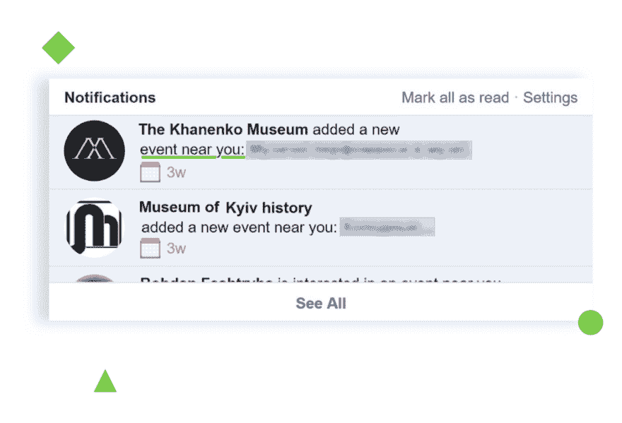
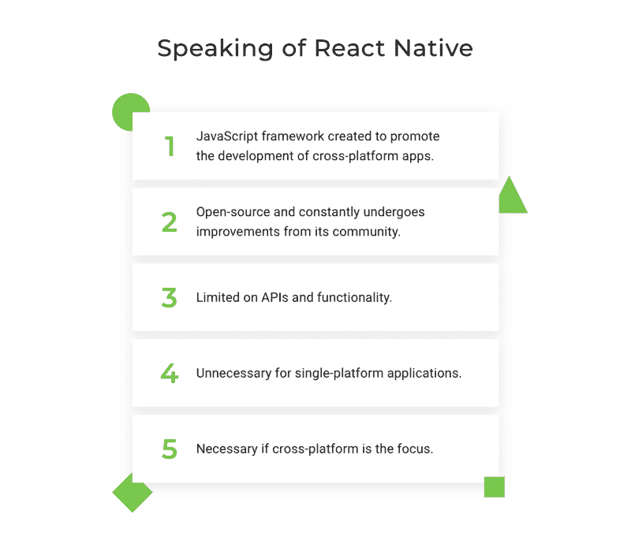
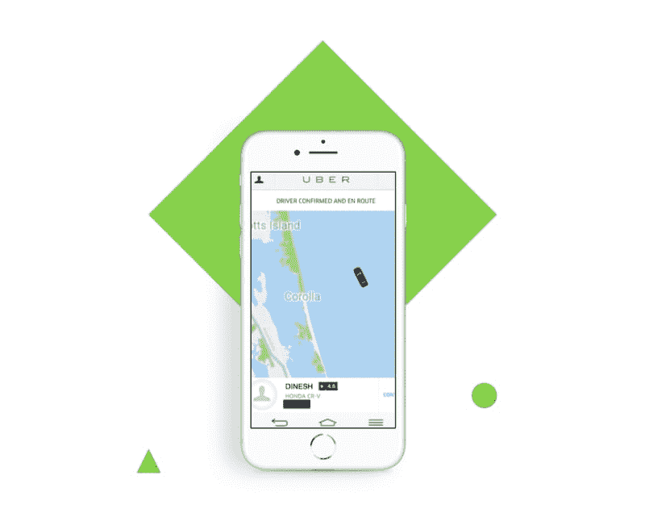

# 使用 React Native 构建基于位置的应用程序

> 原文：<https://dev.to/django_stars/building-a-location-based-app-with-react-native-8eg>

当我们在要求访问我们位置的弹出窗口上点击“允许”时，会有什么好处呢？一些应用提供了更好的体验，比如脸书推荐附近的活动。其他——不知道设备位置就无法正常工作，如优步或谷歌地图。

这些基于位置的应用程序使用设备位置来启用和控制一些功能。从送外卖到找我的 iPhone，基于位置的应用程序只要知道我们在哪里，就能帮助我们完成日常任务。

[](https://res.cloudinary.com/practicaldev/image/fetch/s--QeUQIwnI--/c_limit%2Cf_auto%2Cfl_progressive%2Cq_auto%2Cw_880/https://cdn-images-1.medium.com/max/1000/0%2AV_j918VTUfiRuy96) 
位置既可以是首要功能，就像在火绒里；或者辅助，比如在 Instagram 中:上传照片时，Instagram 会给你建议一个地方，这样你就可以标记你的位置。不管是不是主要功能，位置确实提升了用户体验。

在本文中，我将告诉您基于位置的应用程序的主要技术组件，您将了解如何使用 React Native 开发一个应用程序。首先，我简单描述一下 React Native，并将其与原生 app 开发进行比较。然后，我将分享在应用程序中收集和显示位置的方法，最后，在一篇短文中，我将描述一些设计挑战以及 React Native 如何应对这些挑战。

## 基于位置的应用开发工具:React Native

在这一部分，我将简要描述 React 原生框架，它的优缺点，以及为什么它非常适合构建基于位置的应用程序。React Native 是一个开源的 JavaScript 框架，允许开发人员使用其本机行为创建跨平台的应用程序。

这种描述中的行为是什么？让我解释一下。iOS 和 Android 是不同的——它们的界面不同，动画不同，很多东西都不同。为 iOS 和 Android 开发相同的应用程序需要开发两个独立的应用程序。这曾经是一个费力的过程，但使用 React Native，开发人员只需编写一个代码，就可以在两个平台上正常工作。

这使得企业可以向 iOS 和 Android 用户提供他们的应用程序，这意味着更大的市场份额。这就是为什么许多公司更喜欢 React Native——他们负担不起开发两个独立的应用程序，或者对他们的用户使用的是 iOS 还是 Android 充满信心。考虑到跨平台市场有可能在 2020 年增长到 800 亿美元，这对创业公司来说似乎是一个理性的选择。

现在，我将解释 React Native 在开发基于位置的应用程序方面的优缺点。

## 反应本土优势

*   **跨平台。与其为每个系统(iOS 和 Android)编写单独的代码，不如构建一个来运行它们。你也不设计不同的用户界面和 UX。**
*   **高性能。** React Native 使用原生控件和模块。代码与相应的本机 iOS 和 Android 组件进行交互，并将代码呈现给本机 API。本机 API 是重点——通过使用独立于 UI 的线程，它提高了应用程序的性能。
*   **开源。**React 原生社区每天都在增长，开源组件的数量也在增长。这允许在社区成员之间共享经验，改进框架，并找到现有缺陷的解决方案。所有这些结合起来加速了开发过程。
*   它省钱。以上三点总结成一个相当大的优势——React Native 为您省钱。这比构建两个独立的应用程序更快，因此测试和发布 MVP 花费的时间更少。然而，**有些情况下你可能不想使用 React Native。**

它们包括:

*   **不需要跨平台 app。**如果你知道你的受众更喜欢某个特定的平台，我建议你选择原生开发。首先，该应用将被定制以匹配操作系统的细节，其次，你将能够使用平台特定的功能，如 ARKit for iOS。
*   你需要比 React 本地提供更多的 API。我特别不喜欢的一点是 React Native 支持的原生 API 数量有限。尽管如此，还是有足够的东西来构建一个基于位置的应用程序。如果您需要其他代码，您可以使用本机代码桥接它们。

## 如何采集和显示用户位置

这一部分是关于收集和显示位置数据。根据你的应用程序的具体情况，你会选择一种特定的方式。

## 采集位置数据

我挑选了三种方法来收集设备位置。

*注意*:这是一个通用的概述，帮助您了解何时选择每种情况以及它们之间的差异。

## 使用 React 原生 API

有一个本地 JavaScript API 可以识别设备的位置。它很容易安装和使用，但有一个“但是”——它既不在后台工作，也不显示位置提供商(3G，Wi-Fi，GPS)。

## 反应-原生-背景-地理定位

它是一个包，可以确定设备在 0 到 1000 米(0.6 英里)范围内的位置。这需要更多的电池能量，但另一方面，这取决于您配置跟踪位置的频率。该软件包还集成了 SQLite —您可以存储记录的位置数据，并通过 HTTP 将其同步到您的数据库。

```
import { NativeModules, DeviceEventEmitter, PermissionsAndroid } from 'react-native'  
import Config from 'react-native-config'  
import get from 'lodash/get'  
const { GeoLocation } = NativeModules
class BackgroundGeoLocation {  
  constructor(token, user_id) {
    this.state = null
  }
  start(dispatch, nextState) {
    this.dispatch = dispatch
    const token = get(nextState, 'session.data.token')
    const user_id = get(nextState, 'user.data.user_id')
    const id = get(nextState, 'user.data.id')
    this.state = {
      user_id,
      token,
    }
    return PermissionsAndroid.check(PermissionsAndroid.PERMISSIONS.ACCESS_COARSE_LOCATION)
      .then(is_granted => is_granted === PermissionsAndroid.RESULTS.GRANTED
        ? is_granted
        : PermissionsAndroid.requestMultiple([
          PermissionsAndroid.PERMISSIONS.ACCESS_FINE_LOCATION,
          PermissionsAndroid.PERMISSIONS.ACCESS_COARSE_LOCATION,
        ])
      )
      .then(_ => PermissionsAndroid.check(PermissionsAndroid.PERMISSIONS.ACCESS_COARSE_LOCATION))
      .then(is_granted => is_granted === PermissionsAndroid.RESULTS.GRANTED ? true : new Error())
      .then(_ => setTimeout(() => GeoLocation.startService(token, user_id, id, `${Config.API_URL}/live/car-tracking/gps-pos/`), 300))
      .catch(e => console.log(e))
  }
  stop() {
    return GeoLocation.stopService()
      .then(_ => console.log(_))
  }
  handleLocationChange(geo) {
    console.log(geo)
  }
}
export default BackgroundGeoLocation 
```

作为一个软件包，它需要定期维护和更新，但是在 GitHub 上有一个来自软件包创建者的支持频道。

注:套餐价格:iOS —免费；安卓——一个应用 300 美元。

Combo:将本地代码桥接到 JavaScript API
第一种方法(使用本地 JavaScript API)的主要问题可以通过添加本地代码来解决，该代码将在单独的线程中启动前台服务。

```
package com.djangostars.azyan;
import android.app.Notification;  
import android.app.NotificationChannel;  
import android.app.NotificationManager;  
import android.content.Context;  
import android.content.Intent;  
import android.content.pm.PackageManager;  
import android.location.Criteria;  
import android.location.Location;  
import android.location.LocationManager;  
import android.os.Build;  
import android.support.v4.content.ContextCompat;
import com.facebook.react.bridge.Arguments;  
import com.facebook.react.bridge.Promise;  
import com.facebook.react.bridge.ReactApplicationContext;  
import com.facebook.react.bridge.ReactContextBaseJavaModule;  
import com.facebook.react.bridge.ReactMethod;  
import com.facebook.react.bridge.WritableMap;  
import com.facebook.react.bridge.WritableNativeMap;

/**
 * Created by AGulchenko on 5/7/18.
 */
public class GeoLocationModule extends ReactContextBaseJavaModule {  
    public static final String CHANNEL_ID = "ExampleService_Channel";
    public GeoLocationModule(ReactApplicationContext reactContext) {
        super(reactContext);
        if(Build.VERSION.SDK_INT >= Build.VERSION_CODES.O) {
            NotificationChannel channel = new NotificationChannel(CHANNEL_ID,"testName", NotificationManager.IMPORTANCE_DEFAULT);
            NotificationManager manager = reactContext.getSystemService(NotificationManager.class);
            manager.createNotificationChannel(channel);
        }
    }
    @Override
    public String getName() {
        return "GeoLocation";
    }
    @ReactMethod
    public void startService(String token, String user_id, String id, String url_string, Promise promise) {
        WritableMap result = Arguments.createMap();
        result.putString("ststus", "success");
        try {
            Intent serviceIntent = new Intent(getReactApplicationContext(), GeoLocationService.class);
            serviceIntent.putExtra("token", token);
            serviceIntent.putExtra("user_id", user_id);
            serviceIntent.putExtra("id", id);
            serviceIntent.putExtra("url_string", url_string);
            getReactApplicationContext().startService(serviceIntent);
            promise.resolve(result);
        } catch (Exception e) {
            e.printStackTrace();
            promise.reject("rrrrr",e);
            return;
        }
    }
    @ReactMethod
    public void stopService(Promise promise) {
        String result = "Success";
        try {
            Intent serviceIntent = new Intent(getReactApplicationContext(), GeoLocationService.class);
            getReactApplicationContext().stopService(serviceIntent);
        } catch (Exception e) {
            promise.reject(e);
            return;
        }
        promise.resolve(result);
    }
    @ReactMethod
    public void getLocation( Promise promise) {
        WritableMap res = Arguments.createMap();
        try {
            LocationManager locationManager = null;
            locationManager = (LocationManager) this.getReactApplicationContext().getSystemService(Context.LOCATION_SERVICE);
            int permissionCheck = ContextCompat.checkSelfPermission(this.getReactApplicationContext(),
                    android.Manifest.permission.ACCESS_FINE_LOCATION);
            if (permissionCheck == PackageManager.PERMISSION_GRANTED) {
                Criteria criteria = new Criteria();
                String bestProvider = locationManager.getBestProvider(criteria, false);
                Location location = locationManager.getLastKnownLocation(bestProvider);
                if(location != null) {
                    res.putDouble("latitude", location.getLatitude());
                    res.putDouble("longitude", location.getLongitude());
                    promise.resolve(res);
                }
            }
        } catch (Exception e) {
            promise.reject(e);
            return;
        }
    }
} 
```

获得访问位置数据的许可有时会带来麻烦，但这些麻烦是可以忍受的。React Native 没有太大的麻烦就解决了问题。

不同的系统在不同的阶段要求访问位置数据的权限:iOS 在你第一次打开一个应用时要求权限；安卓——下载后。如果我们使用本地代码，这可能会带来麻烦，但是 React Native 使用检查对位置数据的访问模块简化了这个过程。它允许访问位置数据而不触发许可警报。

### 显示位置

位置数据并不总是精确的。你一定见过这样的:
[](https://res.cloudinary.com/practicaldev/image/fetch/s--PqLl6MXJ--/c_limit%2Cf_auto%2Cfl_progressive%2Cq_auto%2Cw_880/https://cdn-images-1.medium.com/max/800/0%2AT3XoCiek94nwjpw-)

这是可能发生的原因:该设备从三个来源收集位置数据:Wi-Fi、手机和 GPS，后者是最不准确的。我们的设备一直在检查是否有良好的互联网连接。如果没有，设备将启用 GPS。如果从 4G 到 GPS 有一个快速的飞跃，这个设备就“丢失”了。

为了解决这个问题，我推荐 Google 的*融合位置客户端。它允许您设置位置数据更新的时间和距离:例如，每 50 米和每 10 秒更新一次数据。您将避免嘈杂的数据，因为这个 API 将所有设备位置与道路和人行道匹配。然而，如果设备离这两者都很远，它就不会有效。*

### 关于设计的几句话

在这个简短的部分中，我将告诉您构建基于位置的应用程序可能会遇到的障碍，以及如何使用 React 本地组件来解决它们。

React Native 允许以简单的方式显示地图。用于*材料设计*的 It UI 组件简化了工程师的工作。我们将使用材料设计来创建一个谷歌地图包装器，然后 React Native 将根据每个平台的特定功能来调整它们。

*无限列表*是 React 的一个原生特性，可以生成无限的搜索结果列表。在优步，如果你开始输入一个地址，你会得到从你输入的开始的所有目的地。所以试试*第三大道*，它会显示周围所有的第三大道。这样的列表并不是无止境的——它们只是在我们向下滚动时载入更多的结果。*平面列表* —另一个内置 UI 组件包括固定的页眉、页脚和搜索分隔符。如果您要从头开始创建这样的结果列表，这将比构建一个完整的 React 原生应用程序花费更多的时间。

```
<FlatList  
        data={get(props, 'order.data.items', [])}
        renderItem={listItem}
        keyExtractor={({ id }) => id}
        style={style.list}
      />
function listItem({ item: { quantity, name } }) {  
  return (
    <View style={style.main}>
      <Text style={[style.count, style.listItemText]}>{quantity}</Text>
      <Text style={[style.listItemText, style.name]}>{name}</Text>
    </View>
  )
} 
```

## 底线

如果您打算构建一个基于位置的应用程序，React Native 可能是正确的选择。如果大部分描述的优势对你来说都是真的，那就去对这项技术及其能力做更深入的研究吧。

我现在鼓励你多关注你使用的应用程序。你会惊讶地发现，他们中的大多数人要求允许访问你的位置。对于许多公司来说，了解用户位置以提供高质量和更面向用户的服务是至关重要的。你为什么不试试？

这篇关于用 react native 构建基于位置的应用的文章是由 Julia Korsun 撰写的。最初发表于 **Django Stars 博客**。