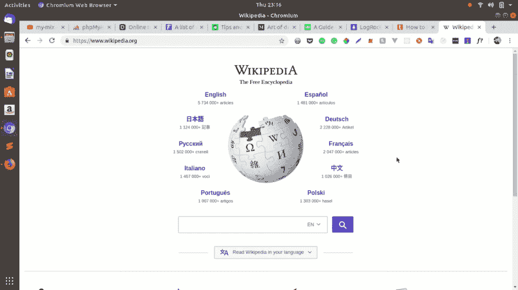
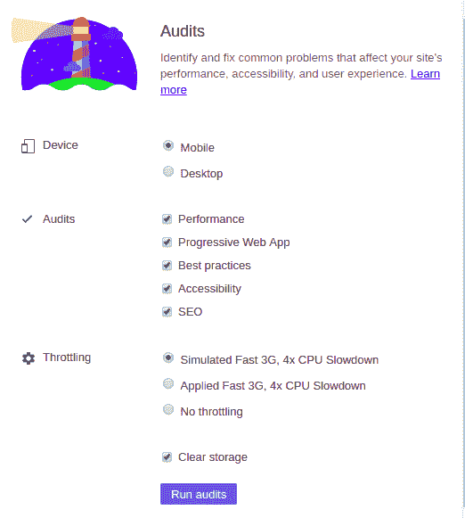
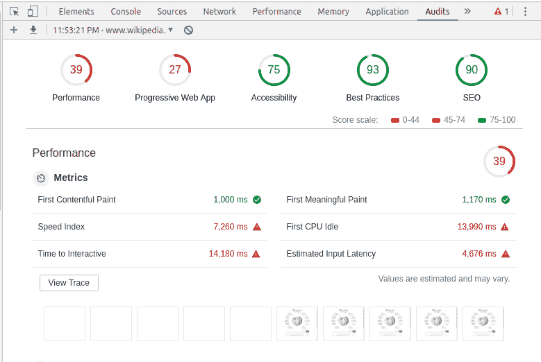
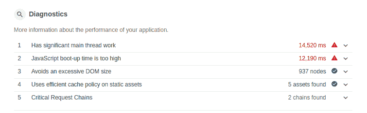
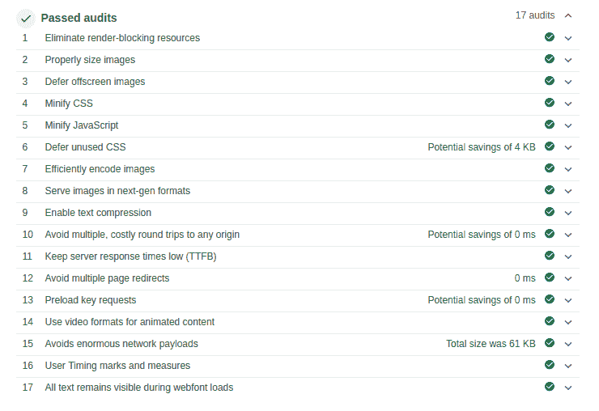
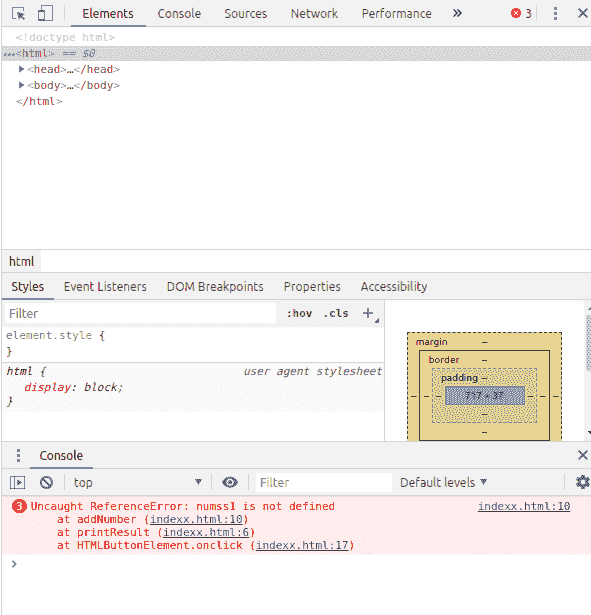
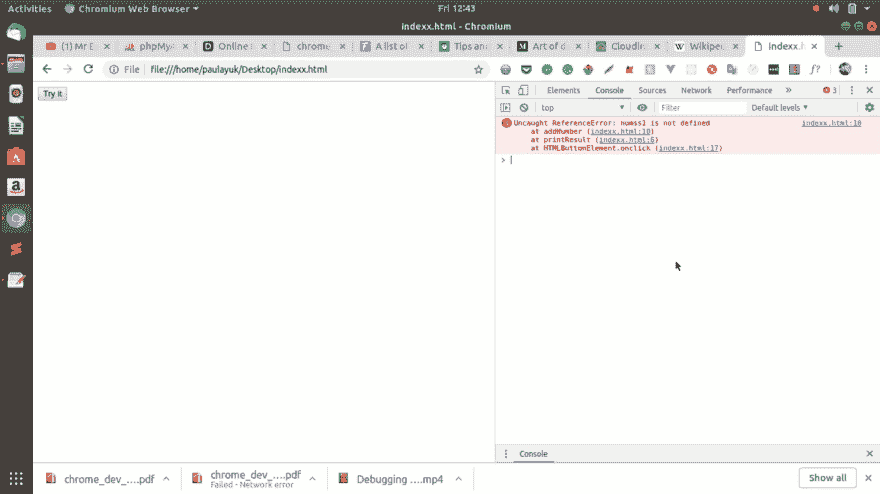
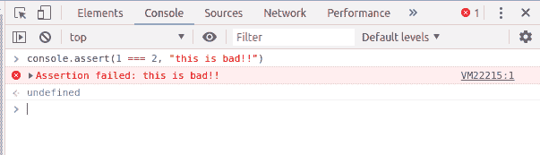
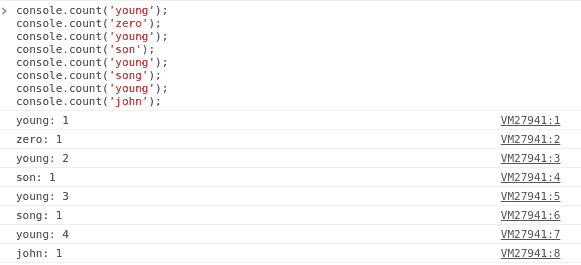
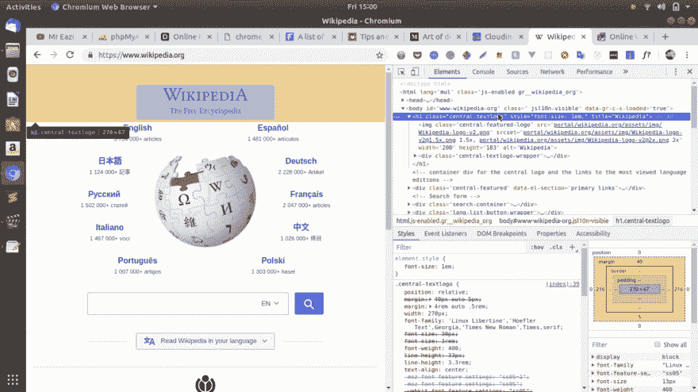

# 使用 chrome 开发者工具进行更好的开发

> 原文：<https://dev.to/bnevilleoneill/better-development-with-chrome-developer-tools-538b>

### 用 Chrome DevTools 提升加载性能和调试

[](https://res.cloudinary.com/practicaldev/image/fetch/s--uKGbZyg---/c_limit%2Cf_auto%2Cfl_progressive%2Cq_auto%2Cw_880/https://cdn-images-1.medium.com/max/512/1%2A8mHGo6pB8TFW9BLiP-MGbQ.png)

Chrome 开发者工具是一个基于浏览器的控制台，预装了谷歌 Chrome。它不仅附带了许多工具和资源，使开发人员能够构建和调试 web 应用程序，而且还可以用来加速您的 web 开发过程。

在本教程中，我们将讨论如何提高您的网站的加载性能，有效的调试，以及使用 Chrome 开发工具时的一般提示和技巧。

### 提升负载性能

当试图提高性能时，你应该做的第一件事就是**审计**你的站点。在本例中，我们将是 wikipedia.org 的**审计**、T4。

用 Chrome Dev tools 审计你的网站:首先**右击**并检查打开工具面板，或者在 Linux/Windows 上按 **ctrl + shift + I** 或者在 mac 上按 **cmd + opt + j** 。之后，点击上方窗格上的箭头，并点击**审计**。

[](https://res.cloudinary.com/practicaldev/image/fetch/s--iBll19yE--/c_limit%2Cf_auto%2Cfl_progressive%2Cq_66%2Cw_880/https://cdn-images-1.medium.com/max/1024/0%2ALjF80e6Qeii6sMKC.gif)

当审计面板打开时，您需要选择您的首选分析选项:

[](https://res.cloudinary.com/practicaldev/image/fetch/s--h6URcaIW--/c_limit%2Cf_auto%2Cfl_progressive%2Cq_auto%2Cw_880/https://cdn-images-1.medium.com/max/522/0%2AVY-wJWnrBZ2iszFx.png)

**设备:**表示您想要分析的设备。

**审计:**在这里，你选择你关心的具体审计。性能？最佳实践？我建议你不要遗漏任何东西。

**节流:**这模拟了大部分网站用户的网速。(据 [Akamai](https://www.akamai.com/us/en/multimedia/documents/state-of-the-internet/q1-2017-state-of-the-internet-connectivity-report.pdf) 称，全球平均连接速度为 7.2)。考虑到用户的位置，这个选项非常重要。

最后一个选项**清除存储**删除所有存储的数据，并模拟第一次访问您的网站。我建议你第一次想审计你的网站时检查这个。

现在，单击 Run Audits，等待几秒钟，它将生成一份包含您的网站状态的报告。这是我们测试网站的一份报告:

[](https://res.cloudinary.com/practicaldev/image/fetch/s--kdQwCU-_--/c_limit%2Cf_auto%2Cfl_progressive%2Cq_auto%2Cw_880/https://cdn-images-1.medium.com/max/779/0%2A9__ZsmzhivYKURrQ.png)

根据您选择的审核，将为您的网站生成一份报告。每个审核至少有两个部分(指标和通过的审核)。让我们讨论一下绩效审计以及如何提高绩效审计。

你看到的第一个明显的信息是性能分数。现在是 **39** 。因为它是在 **100** 之上测量的，所以你的目标应该是将它提高到至少 75%。值得庆幸的是，dev tools 让我们了解了如何改进我们的网站。将鼠标悬停在指标上以了解它，或单击了解更多以阅读它。

[](https://logrocket.com/signup/)

**第一个内容丰富的绘画:**表示用户看到你的第一个内容所需要的时间。在我们的审计中，值 s 1.000ms 对于像维基百科这样的高流量网站来说是一个积极的分数。**互动时间:**这是用户可以在你的网站上执行操作之前的时间。例如，在用户能够看到任何有用的内容之前所花费的时间，在事件监听器被加载之前所花费的时间。这里大概需要 14.180ms，不太好。

如果您将鼠标悬停在这些指标上，您会发现更多关于如何解决它们的信息。

[](https://res.cloudinary.com/practicaldev/image/fetch/s--PEFDVCLt--/c_limit%2Cf_auto%2Cfl_progressive%2Cq_auto%2Cw_880/https://cdn-images-1.medium.com/max/755/0%2A8aK01CVDzKj8w49f.png)

诊断部分显示了它发现的具体问题。绿色的复选标记表示您有一个很好的实现，而红色的停止标记表示有一个需要解决的问题。

在我们的例子中，我们有两个危险信号:**有一个重要的主线程网络，JavaScript 启动时间过长“**，让我们来看看它们:

1.  **有一个重要的主线程网络:**这是浏览器执行大部分活动的地方，比如解析 HTML/CSS 和其他功能。我们的审核分数是 **14，520 毫秒**，这意味着还有改进的空间。要了解更多关于改进的信息，你可以在 Chrome DevTools [博客](https://developers.google.com/web/updates/2018/05/lighthouse)上阅读这篇文章
2.  **Javascript 启动时间过长:**这衡量 Javascript 对页面加载性能的总体影响。JavaScript 可以通过以下方式降低页面速度:

*   推迟第一次有意义的绘画
*   减缓互动的时间

一些建议:

*   移除未使用的代码
*   在用户浏览器中缓存代码
*   缩小你的代码

通过阅读 Chrome DevTools [博客上的这篇文章，你可以了解更多关于改进 JavaScript 启动时间的信息。](https://developers.google.com/web/updates/2018/05/lighthouse)

[](https://res.cloudinary.com/practicaldev/image/fetch/s--5N55c2dL--/c_limit%2Cf_auto%2Cfl_progressive%2Cq_auto%2Cw_880/https://cdn-images-1.medium.com/max/740/0%2Aa9CrBTH7eXYEjuyc.png)

此部分显示您的网站已经通过的所有审核。你可以通过查看绿色复选标记来判断这里的一切都是好的。

### 调试

由于 Chrome 基本上是一个 JavaScript 引擎，它在调试 JavaScript 应用程序时最有效，但也可以用于调试 HTML/CSS。让我们模拟一个 JavaScript 错误进行测试。创建一个名为 index.html 的文件，并在其中添加下面几行代码:

```
<!DOCTYPE html> 
<html> 
  <head> 
    <script> 
    function printResult() { 
      document.write(addNumber(7, 8)); 
    } 
    function addNumber(num1, num2) { 
      var result = num1 + num2; 
      return result; 
    } 
    </script> 
  </head> 
  <body> 
    <button type="button" onclick="printResult()">Try it</button> </body> 
</html> 
```

这个函数将两个数相加，并将结果打印在屏幕上。然而，让我们故意放一个错误，这样我们就可以试验如何使用 Chrome DevTools 进行调试。就像这样改变一个函数:

```
function addNumber(num1, num2) { 
  var result = numss1 + num2; 
  return result; 
} 
```

现在，当我们试图点击它，我们没有得到回应，让我们看看如何开发工具可以帮助我们跟踪错误。在 Linux/Windows 上，通过右键单击或按下 **ctrl + shift + I** 打开面板；如果你在 Mac 上，则按下 **cmd + opt + j** 打开面板。

[](https://res.cloudinary.com/practicaldev/image/fetch/s--rauM3Id1--/c_limit%2Cf_auto%2Cfl_progressive%2Cq_auto%2Cw_880/https://cdn-images-1.medium.com/max/591/0%2ASjjeBZB8mdGwlkSL.png)

如果您查看控制台，您会看到错误消息。**第一行**告诉你发生错误的文件，**第二行**显示函数和出错的行，**第三行**显示触发错误的动作。

[](https://res.cloudinary.com/practicaldev/image/fetch/s--FsWjO0vX--/c_limit%2Cf_auto%2Cfl_progressive%2Cq_66%2Cw_880/https://cdn-images-1.medium.com/max/1024/0%2A5bF_KQUAQhPz2uMD.gif)

当您在控制台中单击错误文件时，它会在控制台的 sources 选项卡下打开该文件。如果您将鼠标悬停在错误上，系统会提示您确切的错误消息。现在，如果您通过更改此行 var result = num1 + num2 来修复错误，您会看到错误将会消失。用开发工具调试代码还有很多方法，比如设置断点、监听器等。

要阅读更多关于使用 **Chrome 开发工具**进行调试的信息，请看这里的[。](https://developers.google.com/web/tools/chrome-devtools/)

### 提示和窍门

有许多事情可以用开发工具来检查。我们来看几个。

**测试**

您可以通过使用 **assert** 函数来模拟一个 JavaScript 测试环境。在你的开发工具控制台中输入下面的代码:

```
console.assert(1 === 2, "this is bad!!") 
```

您应该会看到以下屏幕:

[](https://res.cloudinary.com/practicaldev/image/fetch/s--nS2r29xh--/c_limit%2Cf_auto%2Cfl_progressive%2Cq_auto%2Cw_880/https://cdn-images-1.medium.com/max/603/0%2AqxKECD0Xc5VgTcHT.png)

另外，请注意，如果您试图测试像 1 === 1 这样的真值，控制台上不会记录任何内容，因为**断言**只会记录假值。

**查看 DOM 元素**

您可以通过两种方式查看页面上的 Dom 元素，一种是:console.log('tagname') -这将只记录页面上元素的内部属性。您也可以使用:console.dir('tagname') -这将记录关于元素的每一个细节。比如样式、子节点、id、innerHtml 等等。

**计算数值或属性**

很多时候你可能想记录一个元素在你的页面上被使用的次数，你可以用 count 函数很容易的做到。console.count('tagname ')这将显示一个元素在页面上被调用的次数。为了演示起见，让我们记录人名。在您的控制台中键入:

```
console.count('young'); console.count('zero'); console.count('young'); console.count('son'); console.count('young'); console.count('song'); console.count('young'); console.count('john'); 
```

您应该会得到以下结果:

[](https://res.cloudinary.com/practicaldev/image/fetch/s--vNpOUSmt--/c_limit%2Cf_auto%2Cfl_progressive%2Cq_auto%2Cw_880/https://cdn-images-1.medium.com/max/581/0%2Atq2hEzyCCQhObAGC.png)

**隔离 DOM 元素**

如果你想知道更多关于一个元素的信息，但是因为代码太难而无法得到，你需要做的就是在元素窗格中点击标签名，一个变量($0)将被分配给它，你可以记录它。

[](https://res.cloudinary.com/practicaldev/image/fetch/s--f4V8Tgyy--/c_limit%2Cf_auto%2Cfl_progressive%2Cq_66%2Cw_880/https://cdn-images-1.medium.com/max/1024/0%2AIXT5tbMpZifia7U4.gif)

### 结论

在这篇文章中，我们看到了 Chrome DevTools 可以增强我们开发的一些方式。还有很多技巧和窍门没有在本文中介绍，我建议大家继续探索并关注 Chrome DevTools [博客。](https://developers.google.com/web/tools/chrome-devtools/)

希望这篇文章对你有帮助！

### Plug: [LogRocket](https://logrocket.com/signup/) ，一款适用于网络应用的 DVR

[](https://logrocket.com/signup/)

<figcaption>[https://logrocket.com/signup/](https://logrocket.com/signup/)</figcaption>

LogRocket 是一个前端日志工具，可以让你回放问题，就像它们发生在你自己的浏览器中一样。LogRocket 不需要猜测错误发生的原因，也不需要向用户询问截图和日志转储，而是让您重放会话以快速了解哪里出错了。它可以与任何应用程序完美配合，不管是什么框架，并且有插件可以记录来自 Redux、Vuex 和@ngrx/store 的额外上下文。

除了记录 Redux 操作和状态，LogRocket 还记录控制台日志、JavaScript 错误、堆栈跟踪、带有头+正文的网络请求/响应、浏览器元数据和自定义日志。它还使用 DOM 来记录页面上的 HTML 和 CSS，甚至为最复杂的单页面应用程序重新创建像素级完美视频。

免费试用。

* * *